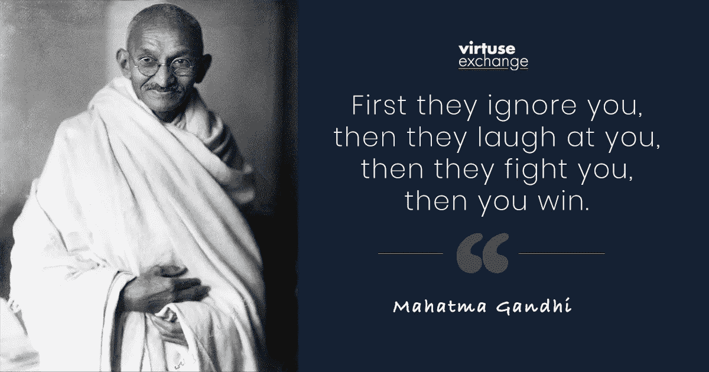

# 看好比特币的 15 家华尔街公司

> 原文：<https://medium.datadriveninvestor.com/15-wall-street-firms-that-are-bullish-on-bitcoin-97f01e7421c1?source=collection_archive---------6----------------------->

## 媒体主导的说法是，比特币只对罪犯和毒贩有用，这种说法已经发生了巨大变化。

如果三年前你是一家大型金融机构的 CEO，公开声明支持比特币无异于自杀。

*原因？*

媒体主导的说法是，比特币只对罪犯和毒贩有用。

你要明白，大多数人甚至不了解比特币。他们日复一日听到同样露骨的谎言。他们封锁了其他一切。

除了媒体的错误信息，沃伦·巴菲特宣称比特币是“老鼠药的平方”。他的搭档查理·芒格说这就像“交易死婴的大脑”美国最大的银行摩根大通的首席执行官杰米·戴蒙表示，他将解雇任何被发现交易股票的人。

**嗯，叙述已经改变**。

许多其他人也在改变他们的想法。

以下是公开看好比特币的 **15 家机构**的名单:

# 1.摩根大通

就连摩根大通也承认了。据《财富》( Fortune)报道，摩根大通上周发布了一份报告，称他们的分析师认为比特币的价格可能会翻两到三倍。

# 2.都铎 BVI 基金

第一个也是最引人注目的皈依者是亿万富翁对冲基金经理**保罗·都铎·琼斯。都铎表示，2020 年的比特币让他想起了黄金在 20 世纪 70 年代扮演的角色。他的 220 亿美元对冲基金已将其资产的 1%至 2%投资于比特币期货合约。**

# 3.社会资本

自称是沃伦·巴菲特“信徒”的 Chamath Palihapitiya 称，比特币是应对不确定的世界经济的最佳金融对冲工具。他敦促人们至少投资 1%的资产。

# 4.避难所

凯西·伍德是过去五年中最成功的投资者。她在 ARK 的团队建议配置比特币，范围从 2.55%到 6.55%。

# 5.斯通里奇

数十亿美元的机构现在给比特币分配了 9 位数的资金。价值 100 亿美元的资产管理公司 Stone Ridge 现在拥有 1 . 15 亿美元的比特币。

# 6.微观战略公司。

在第二次购买后，这家在纳斯达克上市的微策略公司将他们的比特币持有量提高到了 4 . 25 亿美元。据该公司称，该公司持有的比特币是主要的国库储备资产，几乎完全取代了美元。

# 7.方式

**Mode Global Holdings** ，**a**[伦敦证券交易所](https://www.coindesk.com/uk-listed-firm-mode-putting-10-of-cash-reserves-into-bitcoin)**-上市公司**最近宣布，他们将把 10%的现金储备**投入比特币，以保护自己免受货币贬值的影响。**

# 8.灰度等级

**灰度**是 **t** 美国最大的数字资产投资管理公司。他们看到第三季度创纪录的 10 亿美元资金流入，现在总资产接近 60 亿美元。灰度的比特币(BTC) [信托](https://grayscale.co/bitcoin-trust/)有望在 2020 年底达到 50 万 BTC。

# 9.忠诚

富达还在新的资产类别中增加了公司名称和明星影响力。他们在 2019 年成功推出了面向机构投资者的加密货币托管产品。2020 年 8 月，他们推出了第一只比特币基金，最近，他们建议投资者将比特币配置增加到 **5%或更多。**

# 10.洲际交易所(冰)

拥有纽约证券交易所和其他全球市场的贸易巨头洲际交易所成立了 Bakkt。该公司得到了微软和星巴克的支持，目标是让加密货币对你的退休基金安全，或许还可以零售。

# 11.高盛

高盛透露，他们正在考虑自己的秘密资产，很可能是一种稳定的硬币。该行表示，该行机构客户对加密技术的兴趣出现了**【上升】，并补充道“**人们对加密货币的兴趣似乎有所复苏。”****

** [## 自白——我绝对不爱比特币|数据驱动投资者

### 这是真的，我已经写了几篇关于比特币和加密货币的文章，它们可能会在明年或…

www.datadriveninvestor.com](https://www.datadriveninvestor.com/2020/09/15/confessions-i-absolutely-dont-love-bitcoin/) 

# 12.星展银行

东南亚资产规模最大的银行星展银行(DBS Bank)正准备推出一个新的数字资产交易所。这是一件大事，因为它表明**加密已经成为亚洲的主流。**

# 13.贝宝

**PayPal** 最近也加入了加密货币游戏。这家科技公司将允许用户买卖比特币和其他加密货币。PayPal 拥有超过 3 . 45 亿用户，2500 万商家，以及存款排名第 20 位的银行。

# 14.平方

长期以来，Twitter 和 Square 一直是比特币的支持者，他在 2018 年表示，他相信比特币将在未来十年内最终成为世界单一货币。多尔西个人也拥有数量不详的比特币。

# 15.中央银行

最后但同样重要的是中央银行。他们长期以来一直对华尔街施加影响，他们并没有忘记这里正在发生的事情。无论是 CFTC 主席积极谈论比特币和以太坊，欧洲央行推出数字欧元，还是中国在深圳测试中央数字货币，他们都在关注。简单的第一步是开始将比特币放入央行储备。如果这发生在一个主要国家，它将引发一场全球性的 FOMO 游戏。

> 圣雄甘地曾经说过:
> ***“先是他们无视你，然后他们嘲笑你，然后他们打击你，然后你赢了。”***

你要想象一下，每个大银行都在召开关于比特币的高管会议。也很容易想象大型家族理财室已经开始接触比特币，而没有向全世界公布。

是的，自从毒品贩子和罪犯的观点以来，我们已经走了很长的路。

**但是比特币还没赢。**

让我们不要忘记，赢得比特币并不是华尔街的另一项资产。

金融体系崩溃了，建立了一个不平等的世界。

目标是打破现状，利用科技创造一个更好、更公平的世界。

那我们都会赢。

与此同时，我怀疑我们只是继续[**【HODL】**](https://moneymorning.com/2019/06/28/cryptocurrency-terms-explained-from-pseudonymous-to-rekt/)。** 

**如果你喜欢这篇文章，请在左下角“鼓掌”50 次，这样会有更多人分享。你也可以随时 [*给我发微博*](https://twitter.com/RasVasilisin) *告诉我你的想法或者关注我*[*LinkedIn*](https://www.linkedin.com/in/rastislav-ras-vasilisin-11bb5819/)*订阅*[*Virtuse News*](https://www.virtuse.com/)*我把这些消息发给了全球 15，000 多名投资者。***

## **获得专家观点— [订阅 DDI 英特尔](https://datadriveninvestor.com/ddi-intel)**