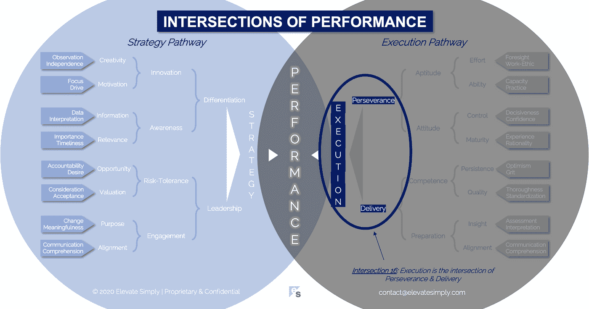

# 16.执行:毅力和交付的交叉点

> 原文：<https://medium.datadriveninvestor.com/16-execution-the-intersection-of-perseverance-delivery-73bdd004fd0?source=collection_archive---------17----------------------->

Image from 123rf.com

有多少好的想法或策略因为无法执行而被放弃？相当于宇宙中恒星的数量可能是一个很好的估计。

"让企业在竞争中保持领先的是卓越的执行力。"— *汤姆·彼得斯*

有很多关于商业执行的名言。最重要的一点是，不管你的战略有多好，没有有效的执行就不会有成功。正确的执行会带来结果。

**执行就是创造。它给生活带来了灵感。**

执行是对战略概念的行动。这是战略理论的现实。那些执行者不仅要解释什么是必须做的，还要在他们被约束的范围内决定做这件事的最佳方式。执行约束可以包括:

*   时间
*   官样文章
*   位置
*   竞争
*   政府
*   供应链
*   法律限制
*   经济力量
*   人力资源
*   财政资源
*   环境力量
*   技能/知识差距
*   技术限制

执行能力不仅仅是“设置好就忘了”的练习。它需要不断的评估和调整。最强的执行者，无论是个人、团队还是公司，都是那些流畅而灵活地优化执行策略的人。他们拥有为高效执行创造条件的能力和动力。

**什么是执行交集？**

执行力是毅力和交付的交集*(见下图交集 16)*。没有交付的毅力只是车轮旋转，白费力气。没有毅力的交付是一次性的，与结果无关的结果。但是当它们结合在一起时，就完成了有能力执行的公式。

*毅力*

在执行的背景下，坚持不懈是一种无情的，但不是粗心的，专注于目标。说到毅力，在富有成效和愚蠢之间有一条微妙的界限。假设生产力是必经之路，弹性和坚持是执行的驱动力。

根据我的经验，第一次尝试很难成功。它通常是在克服障碍和应对意外变化的多次迭代和转向之后出现的。诚然，可以对意外事件进行规划，但不可能主动识别所有意外事件。

对精神错乱的一个常见定义是一遍又一遍地做同样的事情，却期望得到不同的结果。很多时候，坚持就是快速失败，走向下一次迭代。关键是确保每一次迭代都与前一次不同(即有所改进)。它是关于做出明智的决策来指导执行工作。有时，识别什么不起作用和识别什么起作用一样重要。

交集 16:执行力=毅力+交付

Image by [Brett Simpson](https://medium.com/u/191cf90a65d7?source=post_page-----73bdd004fd0--------------------------------)

*交货*

简而言之，执行取决于“交付”的东西，无论是产品、流程、项目还是服务。交付是艰难的，但也是值得的。交付带来了成就感，这是理所应当的。但是没有完成交付就没有成功。有些人、团队、公司擅长，有些人不擅长。

有趣的是，大多数时候，那些做交付的人并不是提出战略、想法、概念或项目的人。因此，在任何与交付相关的活动发生之前，都有一个解释或翻译的练习，即预期的结果应该是什么样的。在最终交付时，将会有判断…交付的内容与最初的意图或期望有多接近？

正确完成交付需要自身的一系列技能和能力:

*   耐心
*   谦逊
*   软技能
*   创造力
*   灵活性
*   硬技能
*   领导力
*   优化
*   多重任务
*   风险容忍
*   更改容差
*   关注细节
*   过程意识

毅力和交付共同创造了执行的基础。

**领导者能做什么？**

最成功公司的领导者宣扬强有力的执行力的价值。他们在负责执行的个人和团队中建立适当的技能和经验。卓越的执行是全公司的首要任务。

领导者还知道，执行发生在许多层面和跨领域，无论是整体战略、产品开发、业务发展、客户关系管理还是沟通。

执行需要和战略一样多的关注和注意力。

**总结&下一个**

执行力是绩效等式的一半。当与策略适当搭配时，绩效更容易实现。

下次我们将检查性能的第 17 个交叉点，即**交付交叉点**。

在这一系列文章中，我们探索了性能的交叉点，共有 30 个。绩效的交叉点*框架基于*[*Brett Simpson*](https://www.linkedin.com/in/brettjsimpson/)*[*董事总经理*](https://www.linkedin.com/company/elevatesimply/) *的经验和见解，以及他作为企业家、顾问和投资者在大大小小的组织中 20 多年的领导经验。**

***绩效-文章链接的交集***

*1.[绩效:战略的交集&执行](/the-innovation/1-performance-the-intersection-of-strategy-execution-2bf06329f8d4)*

*2.[战略:领导力的交叉点&差异化](/the-innovation/2-strategy-the-intersection-of-leadership-differentiation-a568b17731ab)*

*3.[领导力:参与度的交集&风险承受度](/the-innovation/3-leadership-the-intersection-of-engagement-risk-tolerance-f8c887e6c1d3)*

*4.[差异化:创新的交叉点&意识](/@brettjsimpson/4-differentiation-the-intersection-of-innovation-awareness-a21d053ecf12)*

*5.[啮合:目的的交集&对准](/@brettjsimpson/5-engagement-the-intersection-of-purpose-alignment-953747437c26)*

*6.[风险承受能力:机会的交集&估值](/@brettjsimpson/6-risk-tolerance-the-intersection-of-opportunity-valuation-29cf4d9a0ac)*

*7.[认知:信息的交集&关联性](/@brettjsimpson/7-awareness-the-intersection-of-information-relevance-f0fd5322bcb7)*

*8.[创新:创造力的交汇点&动机](/@brettjsimpson/8-innovation-the-intersection-of-creativity-motivation-7c1a12e0d5e2)*

*9.[目的:变化的交集&意义](/@brettjsimpson/9-purpose-the-intersection-of-change-meaningfulness-9f12b0153e1)*

*10.[估价:对价的交集&验收](/@brettjsimpson/valuation-the-intersection-of-consideration-acceptance-eebe7b15e763)*

*11.[机会:欲望的交汇&责任](/the-innovation/opportunity-the-intersection-of-desire-accountability-7e81adb1e195)*

*12.相关性:重要性的交集&及时性*

*13.[信息:数据的交集&解读](/@brettjsimpson/information-the-intersection-of-data-interpretation-62acc94ba8bf)*

*14.[动机:焦点的交集&驱动](/@brettjsimpson/14-motivation-the-intersection-of-focus-drive-d9ebd3ca9951)*

*15.[创造力:观察的交集&独立性](/@brettjsimpson/15-creativity-the-intersection-of-observation-independence-57f7294acb2b)*

*16.执行:毅力和交付的交叉点*

*17.交付:准备与能力的交叉点*(即将推出！)**

*18.毅力:能力和态度的交汇*(即将推出！)**

*19.准备:洞察力和一致性的交汇点*(即将推出！)**

*20.能力:坚持与品质的交汇*(即将推出！)**

*21.态度:控制&成熟的交集*(即将推出！)**

*22.资质:努力与能力的交汇*(即将推出！)**

*23.洞察力:评估与解释的交集*(即将推出！)**

*24.质量:彻底性和标准化的交汇点*(即将推出！)**

*25.坚持:乐观与勇气的交汇*(即将推出！)**

*26.成熟:经验与理性的交集*(即将推出！)**

*27.控制:果断与自信的交集*(即将推出！)**

*28.能力:能力与实践的交集*(即将推出！)**

*29.努力:远见和职业道德的交集*(即将推出！)**

*30.对齐:传播与综合的交汇点*(即将推出！)**

*在 [**管理和企业咨询**](https://app.ddichat.com/category/management-and-corporate-consulting) **:** 中安排一次对话*

* [## 专家-管理和企业咨询- DDIChat

### DDIChat 允许个人和企业直接与主题专家交流。它使咨询变得快速…

app.ddichat.com](https://app.ddichat.com/category/management-and-corporate-consulting) 

在此申请成为 DDIChat 专家[。
与 DDI 合作:](https://app.ddichat.com/expertsignup)[https://datadriveninvestor.com/collaborate](https://datadriveninvestor.com/collaborate)
点击这里订阅 DDIntel [。](https://ddintel.datadriveninvestor.com/)*