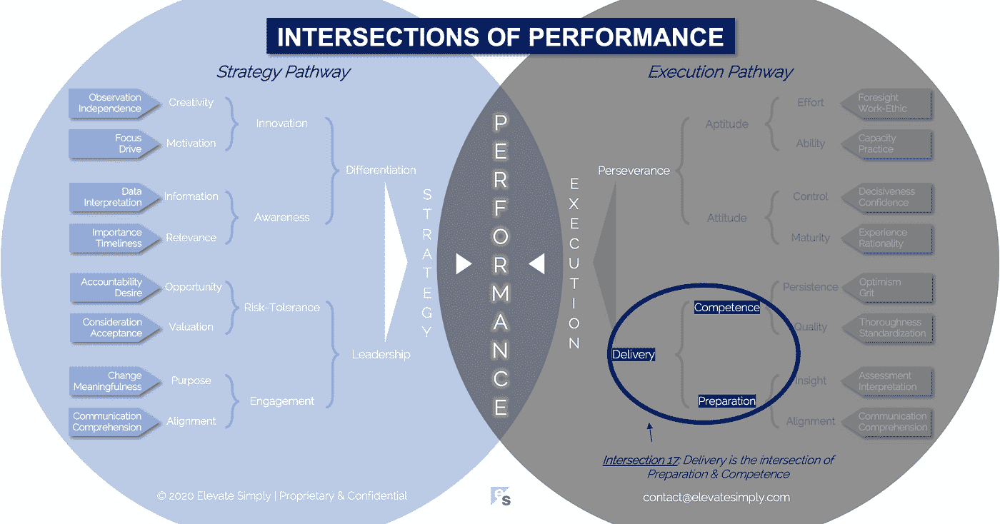

# 17.交付:准备和能力的交集

> 原文：<https://medium.datadriveninvestor.com/17-delivery-the-intersection-of-preparation-competence-556a06d33238?source=collection_archive---------24----------------------->

Image from 123rf.com

我毕业后的第一份工作是管理咨询。我负责送货，而不是销售。两者之间总是有一种健康的紧张关系，当交付团队听到销售团队卖出的东西时，这种紧张关系通常会达到顶点。交割会“指责”销售过度。销售人员会用这样的话来回应:“这不会像你想的那么难”或者“我们已经做了一百万次了”或者“你会找到办法的……你总是这样”。

虽然争论大多是友好的，但双方的烦恼都是真实的。送货，想知道他们如何可能实现超额承诺的销售。销售人员想知道他们是否真的超卖了，以及受损客户关系的潜在影响对未来销售的负面影响。作为一名初级顾问，我并不参与每一次交付-销售讨论，但我总是意识到我们与他们对抗的动态，从交付团队的角度来看，我们必须通过交付“不可能的东西”来不断挽救局面。

这个模型的天才之处，不管是有意还是无意，在于它导致了咨询公司交付资源的快速发展。一个无法实现的目标的持续前景与管理咨询奖励和认可系统的超竞争性质相结合，是一个非常成功的商业模式。具有讽刺意味的是，交付团队越是能够交付并取得成功，销售就越是推动销售的界限，导致过度承诺的似乎永无止境的循环，迫使交付增长。

从交付的角度来看，我们一直认为销售致力于:

*   范围太大，
*   在很短的时间内，
*   预算太少，
*   资源太少，
*   另外，客户提供的信息或帮助太少

我们会用项目可能不成功的所有理由来警告工作说明书，当然不是我们自己的错。

现在回想起来，我笑了，因为我真的喜欢成为那个环境的一部分(事后来看这很容易说)。它塑造并继续塑造着我今天的所作所为，我相信无数有过相同经历的人也是如此。

重要的是，它教会了我交付以及成功交付的要素，无论是一个小项目，一个大的产品发布会还是整个商业战略的执行。

**什么是交付交叉点？**

交付是准备和能力的交叉点*(见下图交叉点 17)*。没有能力的准备就是为家庭度假把车装满，但没人能开车。没有准备的能力是世界杯决赛，球员和裁判都在场上，但没有人带足球。

*准备*

准备就是规划。“给我六个小时砍树，我会用前四个小时磨利斧头。”— *亚伯拉罕·林肯*

规划是确定需要什么、何时、何地和为什么，以实现目标。“什么”可以包括:

*   人力资源
*   财政资源
*   技术资源
*   物力
*   里程碑时间表
*   内部赞助
*   领导力
*   成功的定义
*   合作伙伴/供应商
*   位置
*   沟通
*   跟踪和测量能力
*   应急计划

概述任何工作的必要先决条件并确保采购可用是准备工作的基本要求。

"我会做好准备，总有一天我的机会会到来。"— *亚伯拉罕·林肯*

交叉点 17:交付=准备+能力

Image by [Brett Simpson](https://medium.com/u/191cf90a65d7?source=post_page-----556a06d33238--------------------------------)

*能力*

就交付而言，能力是熟练执行计划的能力。不要让“熟练地”这个词变得不重要。它假设计划是好的，熟练的执行是取得成功的最低标准。

有时交付失败并不是因为缺乏执行计划的能力。更确切地说，这是不按照计划行事的无能，在不必要的时候试图超出预期。

合格的交付需要收集所需的资源，对其进行适当的分级，并在最佳时间按照交付计划所需的顺序投入使用。

当我们一起做木材项目时，我爸爸喜欢用这句话。"我剪了两次，还是太短了。"大多数时候这是开玩笑说的，但有一两次我们可能真的剪了两次，并想知道为什么还是太短了。如果你不明白，花一秒钟，让它深入了解。它代表了能力的对立面。

**领导者能做什么？**

根据我的经验，领导者犯的最大错误之一是没有分配足够的时间来制定计划，或者根本没有计划。

交付进度受到高度重视。说“我们已经开始了”的能力被赋予了太多的重要性，而不是说，“我们花在计划上的额外时间将为我们节省时间、金钱等”。没有计划地开始一件事的代价是高昂的。能力可以在一段时间内掩盖糟糕的计划，但最终，能力无法克服糟糕的准备。

领导者必须留出时间进行规划，并为规划者提供要使用的框架或方法。成功的领导者支持规划作为交付过程的一个关键部分。同时，这些领导者通过在正确的时间将正确的资源放在正确的地方来展示和培养能力。他们以身作则。

**总结&下一个**

交付需要纪律。执行计划的前端准备和后端能力的纪律。

像销售和组织中的其他职能一样，交付是一种通过特定的技能、策略和经验建立起来的能力。

下次我们来考察性能的第 18 个路口，也就是**毅力路口**。

在这一系列文章中，我们探索了性能*的交叉点，共有 30 个。*绩效的交叉点*框架是基于*[*Brett Simpson*](https://www.linkedin.com/in/brettjsimpson/)*[*的常务董事*](https://www.linkedin.com/company/elevatesimply/) *的经验和见解，他在大大小小的组织中担任了 20 多年的领导，并且是一名企业家、顾问和投资者。**

***绩效-文章链接的交集***

*1.[业绩:战略的交集&执行](https://medium.com/the-innovation/1-performance-the-intersection-of-strategy-execution-2bf06329f8d4)*

*2.[战略:领导力的交叉点&差异化](https://medium.com/the-innovation/2-strategy-the-intersection-of-leadership-differentiation-a568b17731ab)*

*3.[领导力:参与的交集&风险承受能力](https://medium.com/the-innovation/3-leadership-the-intersection-of-engagement-risk-tolerance-f8c887e6c1d3)*

*4.[差异化:创新的交叉点&意识](https://medium.com/@brettjsimpson/4-differentiation-the-intersection-of-innovation-awareness-a21d053ecf12)*

*5.[啮合:目的交点&对准](https://medium.com/@brettjsimpson/5-engagement-the-intersection-of-purpose-alignment-953747437c26)*

*6.[风险承受能力:机会的交叉点&估值](https://medium.com/@brettjsimpson/6-risk-tolerance-the-intersection-of-opportunity-valuation-29cf4d9a0ac)*

*7.[认知:信息的交集&关联性](https://medium.com/@brettjsimpson/7-awareness-the-intersection-of-information-relevance-f0fd5322bcb7)*

*8.[创新:创造力的交汇点&动机](https://medium.com/@brettjsimpson/8-innovation-the-intersection-of-creativity-motivation-7c1a12e0d5e2)*

*9.[目的:变化的交集&意义的交集](https://medium.com/@brettjsimpson/9-purpose-the-intersection-of-change-meaningfulness-9f12b0153e1)*

*10.[估价:对价的交集&验收](https://medium.com/@brettjsimpson/valuation-the-intersection-of-consideration-acceptance-eebe7b15e763)*

*11.[机会:欲望的交汇&责任](https://medium.com/the-innovation/opportunity-the-intersection-of-desire-accountability-7e81adb1e195)*

*12.[相关性:重要性的交集&及时性](https://medium.com/@brettjsimpson/relevance-the-intersection-of-importance-timeliness-56cc748eb066)*

*13.[信息:数据的交集&解读](https://medium.com/@brettjsimpson/information-the-intersection-of-data-interpretation-62acc94ba8bf)*

*14.[驱动:焦点的交点&驱动](https://medium.com/@brettjsimpson/14-motivation-the-intersection-of-focus-drive-d9ebd3ca9951)*

*15.[创造力:观察的交集&独立性](https://medium.com/@brettjsimpson/15-creativity-the-intersection-of-observation-independence-57f7294acb2b)*

*16.[执行:毅力的交叉点&交货](https://medium.com/the-innovation/16-execution-the-intersection-of-perseverance-delivery-73bdd004fd0)*

*17.[交付:准备&能力](https://medium.com/@brettjsimpson/17-delivery-the-intersection-of-preparation-competence-556a06d33238)的交集*

*18.[毅力:天资的交汇&态度](https://medium.com/@brettjsimpson/18-perseverance-the-intersection-of-aptitude-attitude-f7f9d96f01dd)*

*19.[准备:视野交汇&对准](https://medium.com/@brettjsimpson/19-preparation-the-intersection-of-insight-alignment-752fd11af553)*

*20.能力:坚持与质量的交汇点*(即将推出！)**

*21.态度:控制与成熟的交集*(即将推出！)**

*22.资质:努力与能力的交汇点*(即将推出！)**

*23.洞察力:评估与解释的交集*(即将推出！)**

*24.质量:彻底性和标准化的交汇点*(即将推出！)**

*25.坚持:乐观与勇气的交汇*(即将推出！)**

*26.成熟:经验与理性的交集*(即将推出！)**

*27.控制:果断与自信的交汇*(即将推出！)**

*28.能力:能力与实践的交集*(即将推出！)**

*29.努力:远见和职业道德的交集*(即将推出！)**

*30.对齐:传播与综合的交汇点*(即将推出！)**

*在 [**管理和企业咨询**](https://app.ddichat.com/category/management-and-corporate-consulting) **:** 中安排一个 DDIChat 会话*

* [## 专家-管理和企业咨询- DDIChat

### DDIChat 允许个人和企业直接与主题专家交流。它使咨询变得快速…

app.ddichat.com](https://app.ddichat.com/category/management-and-corporate-consulting) 

在这里申请成为 DDIChat 专家[。
与 DDI 合作:](https://app.ddichat.com/expertsignup)[https://datadriveninvestor.com/collaborate](https://datadriveninvestor.com/collaborate)
点击此处订阅 DDIntel [。](https://ddintel.datadriveninvestor.com/)*