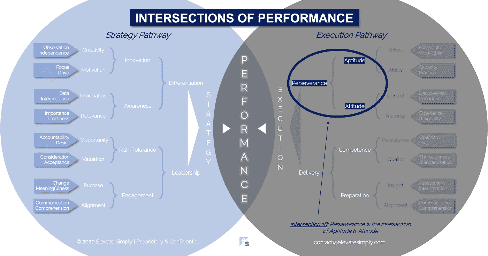

# 18.毅力:能力和态度的交汇点

> 原文：<https://medium.datadriveninvestor.com/18-perseverance-the-intersection-of-aptitude-attitude-f7f9d96f01dd?source=collection_archive---------7----------------------->

Image from 123rf.com

前几天看到一个图形，上面写着“不要退出”，挺巧妙的。我喜欢三振出局法将领先的劣势转化为优势的方式。它从"不…"这个累赘的词，变成了"做…"这个肯定的词，暗示着机会和可能性。把“不要”变成“要”是强大的。

这在商业中尤其具有影响力。如果你是一个领导者，试着把你的“不要”变成“要”。从小处着手，坚持一个小时不说“不”，理想的情况是选择一个小时，在这段时间里你有一个或多个会议。然后试着一天不说，然后一周。很难，如果不是不可能，坚持那么久不说“不”。

重点不是要把这个词从我们的公司词汇中完全删除，而是要思考一下使用它的含义。充满“不要”的工作环境看起来、感觉起来、表现起来是什么样的？这与充斥着“要做的事情”的环境相比如何？“不要”是有用和必要的，但经常被过度使用。当我的女儿们还小的时候，我们的口头禅似乎是“不要”…现在我想起来，即使她们已经上了大学，我们仍然比我们应该做的更多地使用它。

“不”建立限制，而“做”暗示自由。以我的经验来看，“不”会无意中阻碍进步，而“做”会创造并促进一个坚持不懈的环境。毅力作为商业中的一个差异化因素很少受到关注。

**什么是毅力交集？**

毅力是天资和态度的交叉点*(见下图交叉点 18)*。没有态度的才能是浪费的才能。没有天资的态度是没有执行力的意图。坚持不懈既是对失败的承认，也是对成功的信念。

*资质*

简单来说，天资就是能力。这意味着做某事所需的技能、知识和经验已经存在。资质还包括学习、迭代和创新的能力。它本身不是目的，而是达到目的的一种手段。

当我们坚持不懈时，这意味着要么我们第一次尝试没有成功，要么我们对第一次尝试的结果不满意。因此，在我们的毅力，我们再次尝试。当我们把每一次成功的尝试都变得比前一次更好时，天资就开始发挥作用了。

我发现“不要做”会扼杀天资发展，而“要做”会鼓励天资发展。

交集 18:毅力=资质+态度

Image by [Brett Simpson](https://medium.com/u/191cf90a65d7?source=post_page-----f7f9d96f01dd--------------------------------)

*态度*

态度是一种心态。在最好的情况下，它意味着对成功的积极渴望和驱动力，即使成功需要多次尝试，因此需要毅力。在最坏的情况下，态度会成为进步的杀手，把坚持变成重复的痛苦练习。当有“能行”的态度时，毅力最有效。

这又回到了“该做”和“不该做”的问题上。个人或团队积极思考的心态对所能达到的绩效水平有着重要的影响。当我们多次想到态度与成就和表现的关系时，我们想到的词是动机。

动机和毅力携手并进，动机是驱动力。要拉动的激励杠杆可以是积极的，也可以是消极的，两者都会影响个人或团队对做某事的态度(即他们坚持下去的愿望)。

我的观察是，当参与的个人或团队对取得成功持乐观态度时，毅力是一种更健康、更有效的形式。

**领导者能做什么？**

从领导行话中去掉“不”不是我的提议。更确切地说，领导者通过他们的语言和行为(即能力和态度)拥有比头衔更多的工具。坚持不懈的领导者激励他们的团队也这样做。毅力是可以学习和激励的。

**总结&下一个**

毅力是对第一次尝试没有 100%成功的回应。它拓展了可能性的极限。

下次我们将检查性能的第 19 个交叉点，也就是**准备交叉点**。

在这一系列文章中，我们探索了性能的交叉点，共有 30 个。绩效的交叉点*框架基于*[*Brett Simpson*](https://www.linkedin.com/in/brettjsimpson/)*[*董事总经理*](https://www.linkedin.com/company/elevatesimply/) *的经验和见解，以及他作为企业家、顾问和投资者在大大小小的组织中 20 多年的领导经验。**

***绩效-文章链接的交集***

*1.[绩效:策略的交集&执行](/the-innovation/1-performance-the-intersection-of-strategy-execution-2bf06329f8d4)*

*2.[战略:领导力的交叉点&分化](/the-innovation/2-strategy-the-intersection-of-leadership-differentiation-a568b17731ab)*

*3.[领导:参与的交集&风险承受能力](/the-innovation/3-leadership-the-intersection-of-engagement-risk-tolerance-f8c887e6c1d3)*

*4.[差异化:创新的交叉点&意识](/@brettjsimpson/4-differentiation-the-intersection-of-innovation-awareness-a21d053ecf12)*

*5.[订婚:目的的交集&对齐](/@brettjsimpson/5-engagement-the-intersection-of-purpose-alignment-953747437c26)*

*6.[风险承受能力:机会的交叉点&估值](/@brettjsimpson/6-risk-tolerance-the-intersection-of-opportunity-valuation-29cf4d9a0ac)*

*7.[认知:信息的交集&关联性](/@brettjsimpson/7-awareness-the-intersection-of-information-relevance-f0fd5322bcb7)*

*8.[创新:创造力的交汇点&动机](/@brettjsimpson/8-innovation-the-intersection-of-creativity-motivation-7c1a12e0d5e2)*

*9.[目的:变化的交叉点&意义](/@brettjsimpson/9-purpose-the-intersection-of-change-meaningfulness-9f12b0153e1)*

*10.[估价:对价的交集&验收](/@brettjsimpson/valuation-the-intersection-of-consideration-acceptance-eebe7b15e763)*

*11.[机会:欲望的交汇&责任](/the-innovation/opportunity-the-intersection-of-desire-accountability-7e81adb1e195)*

*12.[相关性:重要性的交集&及时性](/@brettjsimpson/relevance-the-intersection-of-importance-timeliness-56cc748eb066)*

*13.[信息:数据的交集&解读](/@brettjsimpson/information-the-intersection-of-data-interpretation-62acc94ba8bf)*

*14.[动力:十字路口的焦点&驱动](/@brettjsimpson/14-motivation-the-intersection-of-focus-drive-d9ebd3ca9951)*

*15.[创造力:观察的交集&独立性](/@brettjsimpson/15-creativity-the-intersection-of-observation-independence-57f7294acb2b)*

*16.[执行:毅力的交汇&交付](/the-innovation/16-execution-the-intersection-of-perseverance-delivery-73bdd004fd0)*

*17.[交付:准备&能力](/@brettjsimpson/17-delivery-the-intersection-of-preparation-competence-556a06d33238)的交集*

*18.[毅力:天资的交汇&态度](/@brettjsimpson/18-perseverance-the-intersection-of-aptitude-attitude-f7f9d96f01dd)*

*19.[准备:洞察力的交汇&对准](/@brettjsimpson/19-preparation-the-intersection-of-insight-alignment-752fd11af553)*

*20.能力:坚持与质量的交汇点*(即将推出！)**

*21.态度:控制&成熟的交集*(即将推出！)**

*22.资质:努力与能力的交集*(即将推出！)**

*23.洞察力:评估与解释的交集*(即将推出！)**

*24.质量:彻底性和标准化的交汇点*(即将推出！)**

*25.坚持:乐观与勇气的交汇*(即将推出！)**

*26.成熟:经验与理性的交汇*(即将推出！)**

*27.控制:果断与自信的交集*(即将推出！)**

*28.能力:能力与实践的交集*(即将推出！)**

*29.努力:远见和职业道德的交集*(即将推出！)**

*30.对齐:传播与综合的交汇点*(即将推出！)**

*在 [**管理和企业咨询**](https://app.ddichat.com/category/management-and-corporate-consulting) **:** 中安排一次对话*

* [## 专家-管理和企业咨询- DDIChat

### DDIChat 允许个人和企业直接与主题专家交流。它使咨询变得快速…

app.ddichat.com](https://app.ddichat.com/category/management-and-corporate-consulting) 

在此申请成为 DDIChat 专家[。
与 DDI 合作:](https://app.ddichat.com/expertsignup)[https://datadriveninvestor.com/collaborate](https://datadriveninvestor.com/collaborate)
在此订阅 DDIntel [。](https://ddintel.datadriveninvestor.com/)*