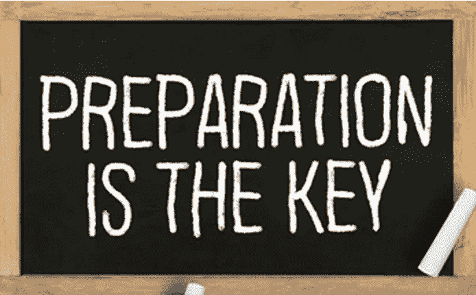

# 19.准备:洞察力和一致性的交叉点

> 原文：<https://medium.datadriveninvestor.com/19-preparation-the-intersection-of-insight-alignment-752fd11af553?source=collection_archive---------32----------------------->

Image from 123rf.com

你的公司对灾难的准备程度如何？答案大概是，“看情况。”

*   “准备好”是什么意思？
*   这是什么类型的灾难？
*   什么时候会发生？
*   会在哪里发生？
*   会持续多久？
*   它的潜在范围有多大？
*   是地方性的，全国性的，全球性的？
*   公司有多大的控制能力来减轻影响？
*   公司还要多久才能回到 BAU？
*   公司有什么 B 计划(C、D 等)？
*   领导团队知道如何在不确定的情况下领导吗？
*   领导团队是否知道如何在不确定期间进行沟通？

如果你知道灾难将会发生，并有时间做好准备，你可能会相信公司能够度过难关。如果是这样的话，这真的会被认为是一场灾难吗？我一直认为这些都是意料之外的事情，不一定是你能完全准备好的事情？不管怎样，为已知做计划比为未知做计划更容易。当然，我们希望针对已知情况的准备计划也能减轻未知情况的影响。

以我的经验来看，那些在计划商业活动准备方面做得很好的公司通常更擅长应对未知事件。无论是产品发布、领导层变动、收购还是新内部系统的实施，准备都是关键。无论之前做过多少次，这些例子中的任何一个都有无数可能出错的地方。组织的准备程度将决定成功之路的效率。

**准备交集是什么？**

准备是洞察力和校准的交叉点*(见下图交叉点 19)*。没有一致性的洞察力是无组织的智慧。没有洞察力的对齐是旅鼠效应。

*洞察*

范围、进度、预算、资源。这些是曾经构建的每个项目计划的关键组成部分。有人擅长使用这些输入来为任何类型的项目构建详细的方法。他们的专业知识得到了软件工具不断创新的支持和增强，使规划变得更加容易和快捷。

当谈到规划的话题时,“基本拦截和处理”这个术语经常被使用。就我个人而言，我认为这句话可能会给人一种错误的感觉，认为计划的过程很简单。通常，这两者都不是。不过，问题可能是“计划”这个词的用法。一个计划看起来是有限的，通常是静态的，可交付的，被认为是最终的全部，但事实上很少是这样。

我发现“准备”这个词更能真实地描述一个组织在努力工作时会发生什么。准备不仅仅意味着一个计划。重要的是，它表明了对计划背后“为什么”的洞察力，而不仅仅是如何、何时和何地。洞察力为准备工作提供经验教训、创新和更好的方法、工具或流程的知识。洞察力是将计划提升到真正准备状态的东西。

*交集 19:准备=洞察+对准*

Image by [Brett Simpson](https://medium.com/u/191cf90a65d7?source=post_page-----752fd11af553--------------------------------)

*对齐*

只有当利益相关者一致时，准备工作才算完成。这并不意味着他们在每一点上都意见一致，而是说他们理解角色和需要完成的任务。达成一致具有挑战性，这就是为什么沟通也很重要。

协调比简单地承认项目将会发生要复杂得多。理想情况下，项目方法是无所不包的和组件化的，这样就可以为每个关键领域明确地确定一致性。这包括但不限于:

*   范围、进度、预算、资源(基本构件)
*   问题/风险升级途径
*   基本构件的意外开支
*   成功因素(部分和全部)
*   B 计划
*   高管赞助和问责制
*   沟通、信息传递和受众管理

协调需要时间，但投资是值得的，因为不协调可能会导致意外、昂贵和/或延迟的结果。最好花额外的时间和精力提前做好调整和准备，而不是事后花更多的时间和精力处理不确定性和低效率的混乱局面。

**领导者能做什么？**

没有完成准备的神奇指标。相反，准备是一种主动规划和反应性优化的练习，目标是高效全面。

鉴于围绕企业倡议失败率的研究结果，领导人应该倡导并树立信心，投资于更好的准备工作，以防止以后更昂贵的清理工作。

**总结&下一个**

准备是彻底性、关注细节和风险管理的结合。它需要工作，并且有时可能很难证明其价值，因为它的目标是预防不利影响(本质上，您必须识别和衡量什么没有发生，即您的准备阻止了什么)。

无论你公司的项目或计划是什么，准备都是关键。

下一次我们将考察第 20 个绩效交叉点，也就是**能力交叉点**。

在这一系列文章中，我们探索了性能*的交叉点，共有 30 个。*绩效的交叉点*框架是基于*[*Brett Simpson*](https://www.linkedin.com/in/brettjsimpson/)*[*的常务董事*](https://www.linkedin.com/company/elevatesimply/) *的经验和见解，他在大大小小的组织中担任了 20 多年的领导，并且是一名企业家、顾问和投资者。**

***绩效-文章链接的交集***

*1.[业绩:战略的交集&执行](/the-innovation/1-performance-the-intersection-of-strategy-execution-2bf06329f8d4)*

*2.[战略:领导力的交叉点&差异化](/the-innovation/2-strategy-the-intersection-of-leadership-differentiation-a568b17731ab)*

*3.[领导力:参与的交集&风险承受能力](/the-innovation/3-leadership-the-intersection-of-engagement-risk-tolerance-f8c887e6c1d3)*

*4.[差异化:创新的交叉点&意识](/@brettjsimpson/4-differentiation-the-intersection-of-innovation-awareness-a21d053ecf12)*

*5.[啮合:目的交点&对准](/@brettjsimpson/5-engagement-the-intersection-of-purpose-alignment-953747437c26)*

*6.[风险承受能力:机会的交叉点&估值](/@brettjsimpson/6-risk-tolerance-the-intersection-of-opportunity-valuation-29cf4d9a0ac)*

*7.[认知:信息的交集&关联性](/@brettjsimpson/7-awareness-the-intersection-of-information-relevance-f0fd5322bcb7)*

*8.[创新:创造力的交汇点&动机](/@brettjsimpson/8-innovation-the-intersection-of-creativity-motivation-7c1a12e0d5e2)*

*9.[目的:变化的交集&意义的交集](/@brettjsimpson/9-purpose-the-intersection-of-change-meaningfulness-9f12b0153e1)*

*10.[估价:对价的交集&验收](/@brettjsimpson/valuation-the-intersection-of-consideration-acceptance-eebe7b15e763)*

*11.[机会:欲望的交汇&责任](/the-innovation/opportunity-the-intersection-of-desire-accountability-7e81adb1e195)*

*12.[相关性:重要性的交集&及时性](/@brettjsimpson/relevance-the-intersection-of-importance-timeliness-56cc748eb066)*

*13.[信息:数据的交集&解读](/@brettjsimpson/information-the-intersection-of-data-interpretation-62acc94ba8bf)*

*14.[驱动:焦点的交点&驱动](/@brettjsimpson/14-motivation-the-intersection-of-focus-drive-d9ebd3ca9951)*

*15.[创造力:观察的交集&独立性](/@brettjsimpson/15-creativity-the-intersection-of-observation-independence-57f7294acb2b)*

*16.[执行:毅力的交叉点&交货](/the-innovation/16-execution-the-intersection-of-perseverance-delivery-73bdd004fd0)*

*17.[交付:准备&能力](/@brettjsimpson/17-delivery-the-intersection-of-preparation-competence-556a06d33238)的交集*

*18.[毅力:天资的交汇&态度](/@brettjsimpson/18-perseverance-the-intersection-of-aptitude-attitude-f7f9d96f01dd)*

*19.[准备:视野交汇&对准](/@brettjsimpson/19-preparation-the-intersection-of-insight-alignment-752fd11af553)*

*20.能力:坚持与质量的交汇点*(即将推出！)**

*21.态度:控制与成熟的交集*(即将推出！)**

*22.资质:努力与能力的交汇点*(即将推出！)**

*23.洞察力:评估与解释的交集*(即将推出！)**

*24.质量:彻底性和标准化的交汇点*(即将推出！)**

*25.坚持:乐观与勇气的交汇*(即将推出！)**

*26.成熟:经验与理性的交集*(即将推出！)**

*27.控制:果断与自信的交汇*(即将推出！)**

*28.能力:能力与实践的交集*(即将推出！)**

*29.努力:远见和职业道德的交集*(即将推出！)**

*30.对齐:传播与综合的交汇点*(即将推出！)**

*在 [**管理和企业咨询**](https://app.ddichat.com/category/management-and-corporate-consulting) **:** 中安排一个 DDIChat 会话*

* [## 专家-管理和企业咨询- DDIChat

### DDIChat 允许个人和企业直接与主题专家交流。它使咨询变得快速…

app.ddichat.com](https://app.ddichat.com/category/management-and-corporate-consulting) 

在这里申请成为 DDIChat 专家[。
与 DDI 合作:](https://app.ddichat.com/expertsignup)[https://datadriveninvestor.com/collaborate](https://datadriveninvestor.com/collaborate)
点击此处订阅 DDIntel [。](https://ddintel.datadriveninvestor.com/)*