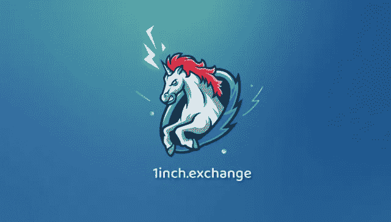

# 1inch Foundation 发布了 1inch 令牌！

> 原文：<https://medium.datadriveninvestor.com/1inch-foundation-has-released-1inch-token-64f6b984a65b?source=collection_archive---------14----------------------->

[**超级机会**](https://1inch.exchange/#/r/0xE95179dBA890B4FbF5E8496df18ba963a5A0755a)

**很高兴分享来自我们客户的好消息，因为我们看到他们努力工作，使 1inch > $UNI**

以太坊上的 1INCH 分散式交易所推出了其 token，其资本化潜力为 40 亿美元，显示出绝佳的投资机会。

[**1INCH**](https://1inch.exchange/#/r/0xE95179dBA890B4FbF5E8496df18ba963a5A0755a) 通过分发 [**$1INCH**](https://1inch.exchange/#/r/0xE95179dBA890B4FbF5E8496df18ba963a5A0755a) 代币来感谢所有使用其服务的人。这种情况反映了联合国妇女署的成功。该令牌已经在币安和 Okex 上市，这表明了加密社区的信任。这个 DeFi 项目满足了投资者和交易者的现有需求，这使它与当今其他 DeFi 项目有了质的区别！

专家们相信，由于推动需求的根本原因，1 英寸令牌的价格将会上涨。$UNI 和$SUSHI 仍然是使用最多的分散交易所排名中的第一和第二名(就成交量和流动性而言)。

挖掘 10 亿美元的能力启动，为交易所提供流动性。在这个计划中，1INCH 将使用 SushiSwap 策略，暂时人为增加奖励，以便从 UniSwap 和 SushiSwap 挖走流动性。

关于 1INCH token 的更多详情:[https://1 inch-exchange . medium . com/1 inch-token-is-released-e 69 ad 69 cf 3 ee](https://1inch-exchange.medium.com/1inch-token-is-released-e69ad69cf3ee)

[**Crynet 营销解决方案**](https://crynet.io)

 [## DeFi 中的非永久性损失-提供流动性所涉及的风险|数据驱动的投资者

### 非永久性损失也称为发散性损失，是当你在 AMM 中持有代币时…

www.datadriveninvestor.com](https://www.datadriveninvestor.com/2020/11/11/impermanent-loss-in-defi-the-risks-involved-in-providing-liquidity/) 

## 访问专家视图— [订阅 DDI 英特尔](https://datadriveninvestor.com/ddi-intel)