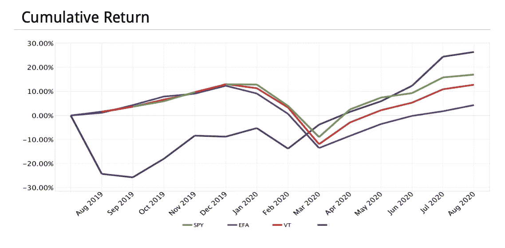
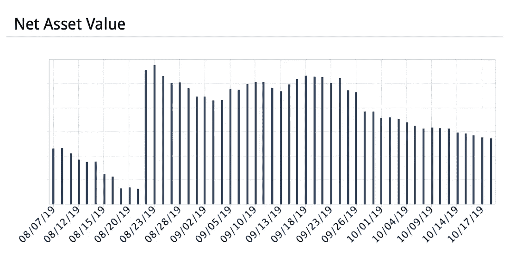
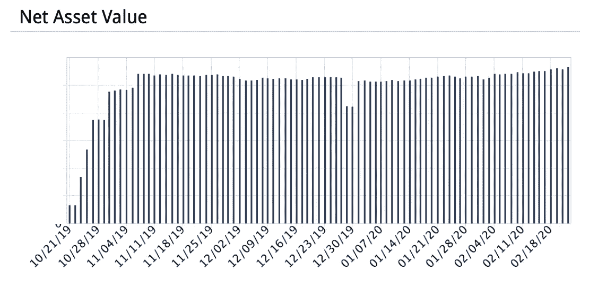
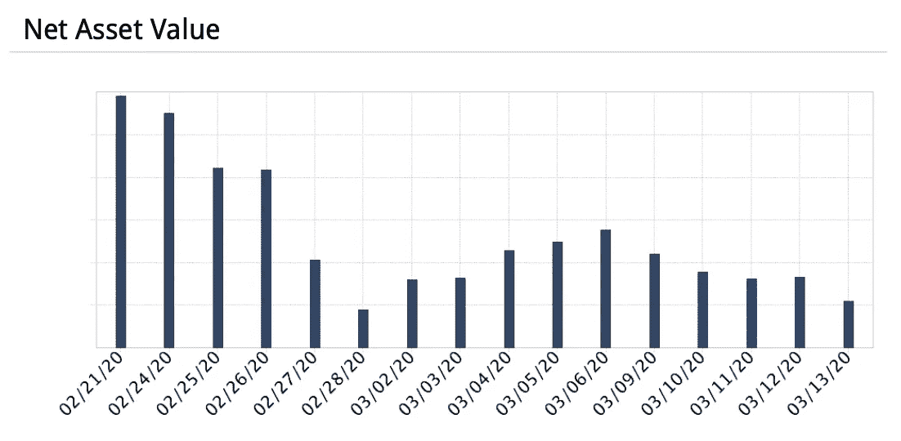
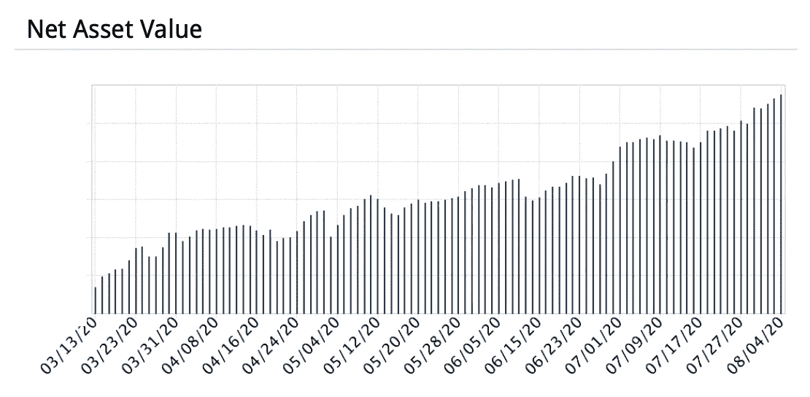

# 一个新手如何在市场崩溃时赚了 25%

> 原文：<https://medium.datadriveninvestor.com/1st-year-trader-makes-25-percent-f4ff2a5c01dd?source=collection_archive---------3----------------------->

## 诚实地看待我尝试的 6 种交易策略，以及我是如何在第一年把严重亏损变成 25%的利润的

Photo by [Ryoji Iwata](https://unsplash.com/@ryoji__iwata?utm_source=medium&utm_medium=referral) on [Unsplash](https://unsplash.com?utm_source=medium&utm_medium=referral)

我的交易账户刚刚达到 1 年的里程碑，年回报率为 25%—**,这一切都是在 2020 年 2 月新冠肺炎股市崩盘**后实现的。

这是我第一年积极交易的预演，详细描述了我的心理，使用的策略(失败的和成功的)和学到的教训。我在这里毫不掩饰地向你展示我犯的所有愚蠢的错误，以及我是如何为此付出代价的，因为这就是交易的现实。

注:这是一篇关于交易的**中级文章。关于投资和交易的基本知识，请随意阅读我写在下面的指南。**

 [## 投资和交易入门指南

### 你决定用你的钱去工作。现在怎么办？

medium.com](https://medium.com/the-post-grad-survival-guide/the-starters-guide-to-investing-and-trading-131c63a4e127) 

**我不是专家**。我很幸运地接受了本科金融教育，但我没有任何猴子用打字机和投资媒体无法达到的复杂程度。

我不是大师。我没有预测推特股票的能力，也没有预测世界末日的能力，我也不会向你兜售特斯拉股票或金币。

My equity curve in dark blue. Image by author.

我开始交易是因为我想有一天经济独立，因为我似乎对金钱有一种特殊的感觉。不可思议，我知道。尽管写作的投资回报并不诱人，但我这样做是因为:

1.  越来越多的人开始在疫情交易/投资
2.  赔钱远比赚钱容易，而且…
3.  拿我来说，我根本不知道我要进去做什么。

股票和一般投资都非常出色。在一张价格图表中，汇集了夏洛克·福尔摩斯之谜和戈洛夫金冠军争夺战的所有元素，外加实际获利的潜力。如果我让你对赚 25%感到兴奋，那很好，但我希望我也鼓励你成为一个更有思想、更可持续的交易者，而不是一夜成名。

> 如果你好奇的话:我使用交互式经纪人是因为他们的交易者工作站非常强大，尽管他们的管理能力还有很多不足之处。大多数大型经纪商都很好，但就我个人而言，我远离 Robinhood，因为我认为游戏化对活跃交易中涉及的分析和痛苦有反作用。

让我们跳进来。

I had to refill my account in late Aug and lost 33% overall between Aug and Oct. Image by author.

# 1)过度自信和彻底失败(-33%)

我过于自信地开始了我的积极交易之旅，我这样说是因为:

1.  我以为我知道的足够多，不会亏钱
2.  我立即开始实时交易(即不使用模拟的纸质账户)

> *用真钱开始其实没什么错，只要你明白你会损失一些钱。在游戏中有皮肤感觉和模拟完全不同，可能会改变你的交易行为；另外，如果你和我一样，你可以通过实践经验学得更好。

我可以解释。你知道，我是金融专业的学生，我做过股票研究，我不相信可疑的选股广告，我总是保持水分，我的无名指比食指长，等等。

我想我的自信是有道理的，但是过度自信似乎是所有业余爱好者的通病。我们都认为自己知道得够多了，但事实并非如此。差远了。在我建仓之前，我已经阅读了什么是股票，基本面分析和技术分析。希望这不是一个剧透，但**这远远不够**——让你不会失去的是一致的**优势和风险管理**，这两者都伴随着**经验**。

 [## 回购市场注入对经济有何影响——跟踪面包屑|数据驱动的投资者

### 我们发现人们倾向于忘记(包括我们自己)重要的因素、事件或定义…

www.datadriveninvestor.com](https://www.datadriveninvestor.com/2020/05/13/what-repo-market-injections-say-about-the-economy-follow-the-breadcrumbs/) 

华尔街 St 继续茁壮成长是因为**没有人解决市场**。这是一头复杂而令人困惑的野兽，驯服它的想法一直在引诱和征服对冲基金和资产经理。

我的第一个交易方法:在收益前买入股票，期待价格飙升。

我尝试过的股票包括优步、AMZN、JNJ、BRK、m。这是一个巨大的失败。交易收益是可行的，因为在收益日期前后波动性上升，增加了超额收益和亏损的可能性。但是，要成功交易收益，你需要:

*   **高概率**收益对你有利，股票表现符合预期(意味着你需要深刻理解公司收益和股票的驱动因素，以及行业的宏观环境)
*   **良好的风险/回报比**(意味着如果你是对的，你会赚得更多，如果你是错的，你会赔得更多，这通常发生在你认为公司的收益会大大偏离分析师的估计的时候)
*   或者，利用升高的 vol 到**交易技术面**。

我只是跟着感觉走，所以我损失了大约 60-70%的交易。

我的第二个方法:日内交易使用 RSI，支撑位/阻力位，Ichimoku Cloud 和 Level II。

(对我来说)这也是一次冒险。关于技术指标，我不知道但必须了解的事情:

*   每一个都是为一个非常特定的目的而设计的，并且**不是一个独立的圣杯**。例如，RSI 是一个动量指标，它根据过去 14 个周期的平均价格运动告诉你某种东西是超买还是超卖。它没有说成交量和趋势，只有在你假设股票将保持在某个价格范围内时才有帮助，并且使用任意的水平——许多股票愉快地保持超买/卖出数周。
*   **他们纯粹是代理**。他们操纵价格和交易量，试图估计趋势和势头，你很难找到一个正确率超过 50%的人。
*   由于他们的不完美，交易者**必须知道他们密切使用的指标**，特别是他们是如何计算的，他们的亏空在哪里。

我损失了大约 70%的交易。现在，最好的趋势跟踪交易者可能有相似的胜率，但是他们最小化输家，最大化赢家。

如果你想在技术交易中获得成功(你也能做到)，学习正确的风险管理，结合使用几个指标，并了解它们的一切。

## 主要要点:

1.  没有确定或简单的事情，即使在线专家希望你相信，这样你就会付钱给他们。
2.  每个进入交易的人都认为自己知道的比实际多。
3.  如果你想的话，从真钱开始，但是要知道你会损失一些。

From Oct onwards, I pivoted strategies, deposited more cash and started from scratch. Image by author.

# 2)探索和自满(+11%)

在早期的失败和急剧下降的股票曲线之后，我很不情愿地放弃了寻找一个简单、快速和有保证的交易方法。

此时，我的初始账户价值减少了三分之一，不得不忍受重新充值的羞辱。所以，我开始探索更传统和被动的方法。

**我的第三种方法:半被动、基本面选股**。

我使用了 IB Trader Workstation 不太出名的投资组合生成器，它可以根据市盈率、收益增长、市值等规则自动排名、挑选和买卖股票。我说半被动，是因为这些投资组合会定期重新平衡，所以不太像买入并持有，我会主动设计规则，在几个投资组合之间转移配置。

我没有试图去实现梦想，而是控制了预期，目标仅仅是跑赢标准普尔指数，同时分散投资。这意味着投资各种行业，并在 TLT 和 LQD 等债券 ETF 中投入一些资金。这种策略运行良好，直到今天我还在维护它，但是有些警告:

*   **基本面和价格在短期内往往是脱节的**——你的投资组合可能拥有最好的公司，但仍会亏损数周。如果你玩基本面，做多。
*   不要爱上一只股票。对一家公司敞口太大或持有时间太长会导致比它的价值更大的损失——在适当的位置设置止损点并坚持下去。
*   **债券增加了多样性，但当压力来临时，资产类别之间的相关性增加了**，无论如何都会在你的投资组合中烧一个洞。稍后会详细介绍。
*   **过去的表现不是水晶球**。IB TWS 的构建器有一个回溯测试功能——我显然只使用了回溯测试良好的系统，但是我尽量避免依赖回溯测试。构建器也是一个黑箱。你选择规则，但你看不到每个选择的确切影响，可能会陷入过度优化系统的陷阱，以至于它在现实生活中永远不会工作。

我基本上能稍微跑赢指数，我会推荐任何新的投资者/交易者用类似的方法开始。进行一些简单的研究，做一些多空选股，保持多元化，将目光放在长期投资上。

这可能有违直觉，但在市场中，随着投资时间范围的缩短，难度通常会增加。时间会淹没噪音，突出真正高质量的投资。

我的账户恢复了一些，我尝试了期权。在这里，我的金融学位帮了我一把，因为我不必重新学习期权基础知识。

**我的第四种做法:买** [**蝴蝶**](https://www.investopedia.com/terms/b/butterflyspread.asp) **。**

这是一种损失有限的策略，如果股价保持在一个范围内(如果持有到到期)，或者波动性降低(到期前)，就会获利。我开始在大型低贝塔股票上购买低风险的蝴蝶，然后逐渐加大风险(通过调整罢工)并转向更高贝塔的股票。

我取得了一定的成功，因为一般来说，在正常时期，市场没有期权所暗示的那么不稳定。我学到了一些重要的东西:

*   如果你刚刚起步，不要在动荡的市场中尝试这样做。蝴蝶是无方向性的(即股票上涨或下跌没有区别)，但波动性很短。如果你坚持到到期日，损失是有限的——在此之前，vol 峰值可能会比你想象的更快更严重地烧毁你的账户。
*   **谨防转让风险**。蝴蝶交易包括卖出一只价内股票，所以如果股票出现缺口，期权持有者就有机会行使它，你就会突然做多或做空 100 只股票。在最好的情况下，它会增加你的保证金，在最坏的情况下，当你试图平仓时，它会从你的账户中砍掉一大块。相信我，我知道。
*   当你预期波动性会下降时，最好买蝴蝶**，而不是当你认为价格会在某个范围内结束时。赢的概率更高，而且你会比等到到期更快地实现收益。**

总的来说，这是一个相当平稳的时期，但这让我有点自满。我在**结束了对高贝塔科技股**的过多投资，这在 2 月的崩盘中反噬了我。也就是说，即使没有崩盘发生，**在买入并持有策略中保持良好的多元化也是必须的**。

## 主要要点:

1.  买入并持有(明智地)比买入并持有更好
2.  参考以往表现，但不要拿出去吃饭，嫁给它
3.  只有当你准备好承受 100 倍的损失时，才交易期权

If I had cut losses earlier, I might be rich enough to retire now. Image by author.

# 3)恐慌和不确定性(-15%)

当我们迎来一个新的十年的黎明时，我几乎已经收复了所有的损失。柔和的金色太阳升起在连绵的山丘上，驱散了遥远的美中紧张关系的幽灵和“市场应该进行调整”的虚无缥缈的低语。

最棒的是，我担心 COVID 蔓延到美国，所以我在崩溃前一周买了一份关于间谍的看跌期权。市场开始下跌，我认为自己是个天才，并过早地开始对冲。

市场崩盘一周内抹去了我 15%的账户。听起来不多，但我从早年开始就投入了更多的钱，所以我损失的钱比我预期的要多得多，快得多，也少得多是因为我自己的愚蠢。如果你没有在崩盘期间投资，我敢打赌，损失 15%的感觉比你想象的还要糟糕，尤其是在你对此无能为力的情况下。

不过,“你无能为力”并不完全正确。我损失了 15%，而不是大盘的 35%，因为我立即削减了 70-80%的头寸。债券和股票已经变得正相关，因为市场卖掉了所有的东西来换回现金，而我的投资组合构建者的回溯测试从来没有涵盖过这种程度的市场动荡，所以我觉得我别无选择。

回顾过去，有两件事我想向像我这样的新手指出。

## 主要要点

1.  如果你愿意在情况变好之前看到它变得更糟，那就继续投资。据说，散户投资者是一个很好的相反指标——当我们买进或卖出某样东西时，通常已经太晚了。历史表明，我们不擅长把握市场时机，所以在崩盘的情况下，你有两个选择。**要么你有长期投资眼光，应该系好安全带，要么你应该昨天就离开**。在过去的十年里，市场中的时间比市场时机更重要。有短暂的高回报，如果你错过了，你会失去股票享受的大部分利润，所以你应该留在游戏中，而不是选择时机。虽然这种制度可能会改变(另一天的主题)，但“保持投资”仍然是业余爱好者的好建议。
2.  **对买卖什么有一个危机计划**。最优秀的资金管理者知道危机更像黑色星期五的抛售——不加选择的抛售创造了以低价获得惊人投资的机会(暗示巴菲特)。想想受益于危机的科技股，或者投资级债券。即使在平静的时候，也要为危机发生时你会低价买入的头寸做好准备，比如为你的男朋友准备一份购物清单，除非你不知道他什么时候会出现。我没有，错过了一个买入高质量长期股票的绝佳机会。你的计划还应该包括摆脱哪些现有职位，以便腾出干粉用于购物。

Got a fresh start, lived to fight another day. Image by author.

# 4)研究、重置和恢复(+35%)

崩盘后，我暂停了交易，将账户的一小部分投资于安全的股票，其余全部以现金形式持有。

在那几周，我做了一些研究，试图制定最佳策略来恢复我的账户。就在崩盘之前，我刚刚恢复了刚开始时失去的一切，却眼睁睁地看着辛苦赚来的钱(甚至更多)再次蒸发。

如果你发现自己处于同样的情况(如果你做的时间足够长，你会的)，只要记住**后见之明是 20/20** 。不要为你没做的事自责。我怎么会错过去 NFLX 和 ZM 的长途旅行和去航空公司和酒店的短途旅行呢？我怎么可能没有注意到 IG 债券的交易折扣如此之大？我怎么会错过星巴克买一送一的日子呢？

如果它来了又走了，那就算了。我错过了股市的最低点，并开始在上涨时重新建立长期头寸。与此同时，我启动了一个新策略，挽救了我的账户。

**我的第五个方法:卖出 delta 对冲看跌期权**。

我卖出了一些股票的超值看跌期权，这些股票要么我认为不会下跌太多(因此期权到期时一文不值)，要么我不介意在它们崩盘时被分配。例如，我卖出了 TSLA 150 美元的执行期权。如果股价没有跌到 150 美元，我会保留溢价。如果是这样，我就能以 150 美元的低价买到 100 股 TSLA 股票。通常情况下，这些极端期权将一文不值，但由于波动性上升，它们的溢价变得显著。前几周，我对这些头寸进行了三角对冲，这对我的利润造成了很大压力，但让我晚上睡得更香。

每一个成功的故事里都有意外收获的成分。这个策略不是我自己想出来的——我是在 SeekingAlpha 上读到的，研究了风险，并根据自己的情况进行了调整。此外，如果 3 月份之后立即出现同样具有毁灭性的第二次崩盘，我在这场游戏中会损失惨重。

在 3 月下旬之后的一个月里，我逐渐增加了这些头寸，试图将它们分散开来(TSLA、巴、、、等等。).三角洲对冲和多样化有助于减少日常波动，尽管当然仍然有粗糙的补丁。[有一次马斯克在推特上说 TSLA 的‘太高’](https://twitter.com/elonmusk/status/1256239815256797184?lang=en)让我回想起了二月份的崩溃。**如果你卖 vol，你最好知道你要被骗了**。

从那以后，我把这种策略用在了投机性的股票上，因为新闻事件造成了我认为被夸大了的波动。我不仅仅使用看跌期权，还使用了更多的蝴蝶和铁鹰期权(降低风险和利润)。最终，使用这个策略有效地让我的账户回到了+15%左右。

我的第六个方法:宏观押注和多样化。

学习宏观经济学，阅读《金融时报》和《华尔街日报》的评论，帮助我在交易中增加了另一个维度。我认为散户投资者/交易者低估了宏观经济。我个人以前避免使用它，因为我认为它太复杂了——在某种程度上这是正确的，但是对宏观的基本理解仍然非常有帮助，即使你不使用它。这就像技术交易者提倡看更高的时间框架(例如小时线)而不是你交易的时间框架(例如 15 分钟线)，因为这能让你感觉到风向。

6 月下旬，鉴于美联储的大力支持，美国相对于中国和欧洲的病毒反应疲软，欧洲联合债券发行，美元疲软和通胀预期复苏，我分别进行了中国消费者 ETF 多头交易、黄金多头交易和欧元多头交易(兑美元)。这些表达了我的宏观观点，也帮助我进一步分散投资组合，使我不那么容易受到美国市场问题的影响。长话短说，他们回报不错，增加了我的回报，让我今天的回报率达到了+25%。

## 主要要点

1.  忘记那些没拍的照片
2.  广泛阅读，并始终保持开放的态度来改进你的方法

Photo by [Alec Favale](https://unsplash.com/@alecfavale?utm_source=medium&utm_medium=referral) on [Unsplash](https://unsplash.com?utm_source=medium&utm_medium=referral)

# 最后一句话

交易是世界上最好的运动。但就像一项运动一样，业余爱好者花钱去玩，职业选手花钱去玩。问题是，做事情没有“正确的方法”，也没有教练会告诉你到底该怎么做。

赚钱远比赔钱难，谁说不是就是想让你买个课程。我交易的时间不长，几乎没有找到自己的立足点，但是如果我的经验能帮助你实现+25%，而不是像我一样损失-33%，我会很高兴。

努力学习，找到自己的方法，保持在自己的风险承受范围内。祝你旅途顺利。

**进入专家视角—** [**订阅 DDI 英特尔**](https://datadriveninvestor.com/ddi-intel)