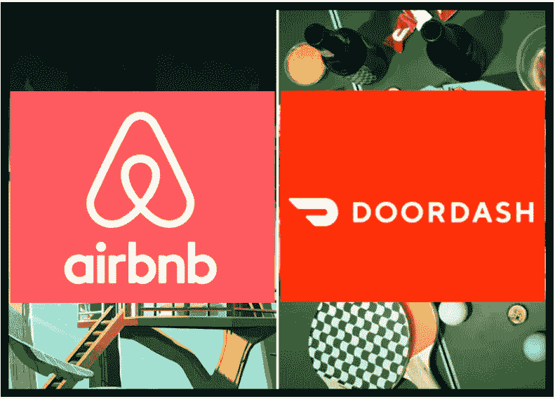
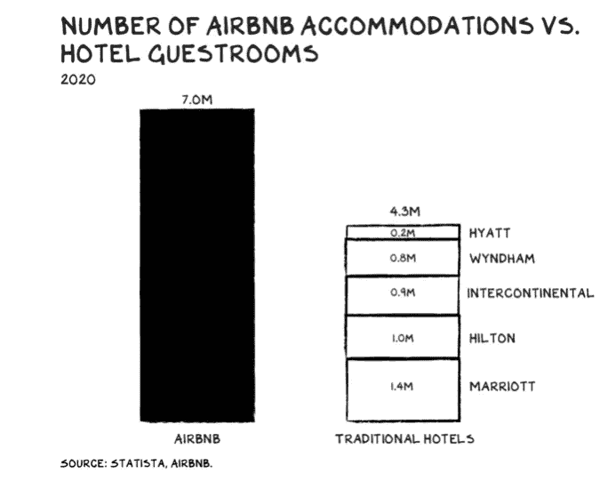

# 本周值得关注的两大 IPO

> 原文：<https://medium.datadriveninvestor.com/2-big-ipos-to-watch-this-week-d47b44c2be56?source=collection_archive---------20----------------------->

Image Source: [RTT News](https://www.rttnews.com/3149330/airbnb-doordash-reportedly-plan-higher-than-expected-ipo-valuations.aspx)

两个备受期待的 IPOs AirBnB 和 DoorDash 分别在纳斯达克和纽约证券交易所首次亮相。这两个高价值的独角兽也受到了疫情非常不同的影响。

DoorDash 计划将其股票定价在 75 美元至 85 美元之间，估值可能高达 270 亿美元。AirBnB 的股票报价分别为 56 美元和 60 美元，估值高达 420 亿美元。

这两家公司都已经报告亏损。根据 DoorDash 的 S1 报道，该公司报告亏损 1 . 49 亿美元。即使 DoorDash 因为人们拒绝外出就餐和在家订餐而获得了好年景，[door dash 的首次公开募股被认为是最荒谬的首次公开募股](https://www.marketwatch.com/story/heres-why-doordash-is-the-most-ridiculous-ipo-of-2020-11606959747)。由于疫情，人们不去旅行，AirBnB 今年很艰难。[该公司不得不裁员 25%,欠机构投资者 20 亿美元。](https://www.theguardian.com/technology/2020/dec/07/airbnb-hikes-share-pricing-to-up-to-60-before-ipo-on-thursday) [这段时间很多 AirBnB 的业主都在纠结。](https://www.theguardian.com/technology/2020/dec/07/airbnb-hikes-share-pricing-to-up-to-60-before-ipo-on-thursday)

我的看法是，我对“零工经济”公司持谨慎乐观的态度。但我确实相信这些公司是长期投资(15-20 年)。投资者将不得不等待 5 至 6 年，直到有盈利能力。但是我相信这些公司是未来。许多餐馆宁愿让上门司机送货上门，也不愿拥有自己的车队和司机(因此创造了 DaaS——外卖即服务)。我看到许多大型食品连锁店，如 PizzaHut，有自己的送货服务，越来越依赖 DoorDash 这样的送货服务。这将大大降低许多餐馆的成本，这些餐馆由于疫情已经在苦苦挣扎。但是这个领域也伴随着巨大的竞争。DoorDash 占总送货服务销售额的 50%。但仅在美国，DoorDash 就与许多其他服务竞争，如 Uber Eats(最近收购了 Postmates)和 GrubHub。在全球范围内，许多这样的公司都是高度区域化的，这使得美国公司很难进入这些全球市场。

 [## 如何通过使用 SCENARIO | Data Driven Investor 实现数字化，在新冠肺炎经济衰退中茁壮成长

### 如果数字化是避免新冠肺炎破产的解药会怎样？一百万人死亡，三十八…

www.datadriveninvestor.com](https://www.datadriveninvestor.com/2020/11/13/how-to-thrive-in-the-covid-19-recession-by-going-digital-using-scenario/) 

我也对 AirBnB 持谨慎乐观态度。AirBnB 不仅让旅行变得简单，还帮助了许多人(尤其是暑期实习生)寻找临时住所。AirBnB 还为斯里兰卡和泰国等美丽地区的独立精品酒店业主提供了宣传酒店的机会。许多人更喜欢 AirBnBs，因为与酒店房间相比，你可以以相同或更低的价格获得一套不错的公寓甚至顶层公寓。

Source: [Scott Galloway](https://marker.medium.com/get-ready-for-airbnbs-ipo-to-blow-away-expectations-b30ee41ef170).

正如你在上面看到的，住在空中旅馆的人比住在传统旅馆的人多。当想住在大城市时，更多的人也会搜索 AirBnB 而不是酒店(我强烈推荐斯科特·加洛韦(Scott Galloway)关于 AirBnB 即将上市的这篇文章)。与邮轮、航空公司、酒店以及旅游和酒店行业的其他股票类似，一旦疫情结束，一切恢复正常，AirBnB 将会大幅上涨。

随着零工经济的发展，许多与零工待遇相关的问题也随之而来。立法者应该注意这些问题。

总的来说，对我来说，这些公司是长期持有的。我目前持有优步股票，并相信这些公司将在未来的经济中发挥重要作用。

这不是投资建议。投资前请咨询专业人士。投资涉及风险。

请宣传一下纸上谈兵的银行家！！！

## 获得专家视图— [订阅 DDI 英特尔](https://datadriveninvestor.com/ddi-intel)