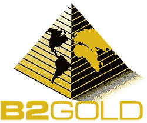

# 2 黄金股上涨势头强劲，黄色金属大放异彩

> 原文：<https://medium.datadriveninvestor.com/2-gold-stocks-gaining-momentum-as-yellow-metals-shine-59aecfa607e8?source=collection_archive---------23----------------------->

众所周知，当市场出现动荡时，投资者通常会将资金从科技等领域撤出，转而投资于更安全的资产类别。在这种时期，最稳定的资产之一是黄金。最近一段时间的市场动荡导致贵金属价格持续上涨。

由于中东的动荡，新年的反弹还在继续。在这种情况下，投资者值得探索投资黄金股票的选择。这是两只本周开始上涨的黄金股票。

# 黄金股上涨势头强劲

在这种情况下，可以被列入投资者观察名单的黄金股票之一是米歇尔()。在该公司发布一项重大声明后，该股在周二取得了令人印象深刻的涨幅。据该公司的债权人 Gazprombank 称，梅克尔已决定不回购俄罗斯远东地区的 Elgo 矿。

 [## 算法交易的机器学习|数据驱动的投资者

### 当你的一个朋友在脸书上传你的新海滩照，平台建议给你的脸加上标签，这是…

www.datadriveninvestor.com](https://www.datadriveninvestor.com/2019/01/30/machine-learning-for-stock-market-investing/) 

自 2016 年以来，俄罗斯天然气工业银行一直持有这些股份，梅克尔决定不回购这些股份，这对投资者来说是一个重大提振。该公司还表示，它还收到了与上述项目有关的替代报价。

**【阅读更多】** [黄金股 5 个看涨案例&如何在 2020 年保持领先趋势](https://webinar.goldstocks.com/signup)

消息传出后，该股涨幅高达 6.75%。此外，自新年伊始，这只黄金股的股价已经上涨了 70.6%。它还会是今年值得关注的[顶级金股之一吗？](https://goldstocks.com/featured/2020/01/22/top-gold-stocks-consideration-right-now-january-22-2020/)

# 黄金股上涨势头#2 B2Gold

本周另一只可能成为焦点的黄金股票是 B2Gold ( [BTG](https://goldstocks.com/ticker/?symbol=BTG) )。该公司公布了其与 AngloGold Ashanti 在哥伦比亚的合资企业的初步经济评估。

该合资企业名为 Gramalote。该公司透露，哥伦比亚的露天矿预计将在 13.6 年内生产多达 385 万盎司的黄金。这对 B2Gold 来说是一个重大进展，它很可能会进入投资者的视线。与此同时，B2Gold 至少在本月吸引了分析师社区的关注。

BMO Capital 将该股的目标价从 7 加元上调至 7.25 加元。Cormark Securities 紧随其后，将其目标从 6.75 加元上调至 7 加元，美国银行将 B2Gold 的目标从 5.50 美元上调至 6.30 美元。

*原载于 2020 年 1 月 22 日 https://goldstocks.com***。**