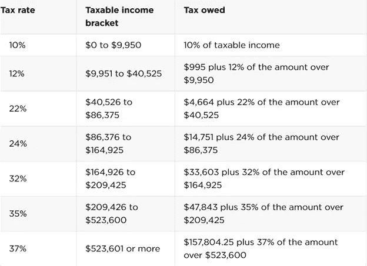
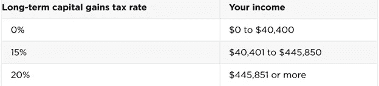

# 简化资本利得税的两个快速要点

> 原文：<https://medium.datadriveninvestor.com/2-quick-points-to-simplify-capital-gains-tax-1665c3b7bc46?source=collection_archive---------19----------------------->

## 所有投资者都应该知道的一种税

Photo by [Ryan Booth](https://unsplash.com/@boothryan_?utm_source=medium&utm_medium=referral) on [Unsplash](https://unsplash.com?utm_source=medium&utm_medium=referral)

等等，你不知道什么是资本利得税？别担心，我已经用一种快速简单的方式介绍了你。首先，让我们回顾一下资本收益。

资本收益是你从出售资产中获得的利润，比如股票、房地产或企业。资本收益是应税收入。根据你的收入、申报状态和你持有资产的时间长短，你的税率可能会有所不同。当谈到资本利得税时，特别是在联邦层面上，进一步理解它的最简单方法是将其分为两种类型，即:

1.短期资本收益税

2.长期资本收益税

*注意:我不是税务专业人士。我不知道你的纳税情况。我分享这些信息只是为了教育目的。*

**1。短期资本收益税**

短期资本利得税是对出售持有一年或一年以下的资产的利润征收的税。短期资本利得税率等于你的普通所得税税率。由 [NerdWallet](https://www.nerdwallet.com/article/taxes/federal-income-tax-brackets) 制作的下表展示了 2021 年单一申报人普通所得税等级的细分:

**2。长期资本收益税**

长期资本利得税是对出售持有超过 1 年的资产的利润征收的税。长期资本利得税低于你的普通所得税。nerd wallet[的下表显示了 2021 年单一申报人的资本利得税明细:](https://www.nerdwallet.com/article/taxes/capital-gains-tax-rates)

你可能想知道为什么我没有进入州和地方层面的资本收益税。与其在这里解释，你可以使用一个有用的工具来形象化它是 [SmartAsset 的资本收益税计算器](https://smartasset.com/investing/capital-gains-tax-calculator)。该计算器将有助于描绘一个更清晰的图像，资本收益税，你将支付联邦，州和地方税收水平。

作为投资者，了解资本利得税很重要。长期资本利得税进一步展示了长期投资的好处。是的，长期投资可能很无聊，老实说也应该如此。你会为今天所做的长期投资而感谢自己。

当然，当涉及到资本利得税时，还有额外的复杂性，比如当涉及到出售房地产时，它是如何运作的。此外，值得注意的是，资本利得税可能会在未来增加。

通过这篇文章，你可以获得更多关于资本利得税的知识。看文章固然很棒，但是深入研究和尽职调查更棒。此外，考虑咨询税务专业人士，以获得有关资本利得税的最佳帮助。

[查看 Tunji 信，保持联系](https://tunji.substack.com/)。