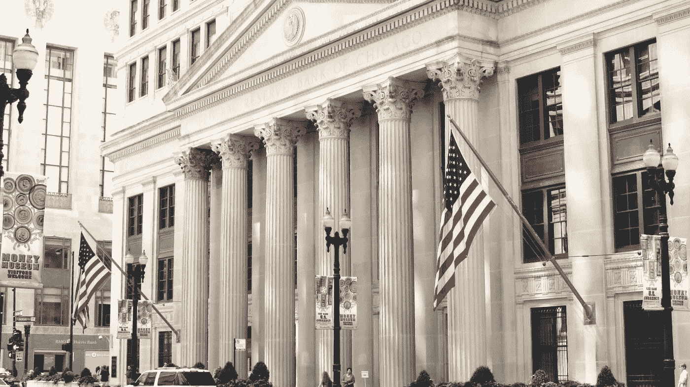

# 简化联邦基金利率的两个快速要点

> 原文：<https://medium.datadriveninvestor.com/2-quick-points-to-simplify-the-federal-funds-rate-2dac265a04e2?source=collection_archive---------28----------------------->

## 影响经济的一个重要比率

Image Credit: [Federal Reserve Bank of Chicago](https://www.chicagofed.org/)

联邦基金利率是由联邦公开市场委员会( [FOMC](https://en.wikipedia.org/wiki/Federal_Open_Market_Committee) )设定的目标利率，该委员会负责监督全国的公开市场操作。该利率决定了银行和其他存款机构之间的拆借利率，通常是隔夜拆借利率。

值得注意的是，FOMC 根据当前和预测的经济状况，每年 8 次设定联邦基金利率目标。不管人们是否意识到，联邦基金利率是一个重要的利率，可以直接或间接地影响经济。进一步简化理解联邦基金利率的两个要点如下:

1.联邦基金利率和银行间的相互借贷

2.联邦基金利率对优惠贷款利率和股票市场的影响

**1。联邦基金利率和银行同业拆借**

如前所述，联邦基金利率决定了银行和其他存款机构之间的拆借利率，通常是隔夜拆借利率。值得注意的是，存款机构必须保持相当于其在美联储银行账户存款一定比例的准备金，称为准备金要求。存款机构拥有的任何高于这一要求的资金，都可以用来借给另一家可能接近低于其准备金要求的机构。

当涉及到联邦储备利率和一家银行贷款给另一家银行，而这家银行的存款准备金率接近下降时，FOMC 不能强迫这家银行收取准确的联邦基金利率。由于联邦基金利率只是一个目标，一家银行向另一家银行收取的实际利率是通过谈判确定的。为了帮助确保收取公平的利率，FOMC 有权通过降低存款准备金率来调整货币供应量。

**2。联邦基金利率对最优惠贷款利率和股票市场的影响**

这篇文章与你我更相关的部分是联邦基金利率如何影响最优惠贷款利率和股票市场。最优惠贷款利率是银行向信誉最好的借款人收取的利率。通常，当 FOMC 降低联邦基金利率时，会导致优惠贷款利率降低。这意味着信用最好的个人的信用卡、贷款和抵押贷款利率将会降低。降低联邦基金利率的主要目的是刺激经济增长。更多的人愿意以较低的利率借款。

由于较低的联邦基金利率，更多的人也更有可能投资，这通常会导致他们储蓄账户的利率降低。随着人们被鼓励投资，而不是把钱存在表现不佳的储蓄账户中，经济可能会进入增长阶段。在量化宽松政策的帮助下，我们能够亲身经历股市从 2020 年 3 月因冠状病毒引起的疫情而创下的历史低点上涨到 2021 年 1 月底前的历史高点。

截至 2021 年 1 月 30 日，联邦基金利率为 0.25%。一年前是 1.75%。疫情对联邦基金利率的急剧下降产生了重大影响。最近，1 月 26 日至 1 月 27 日，FOMC 召开会议，表示将联邦基金目标利率维持在 0%至 0.25%的范围内。此外，还宣布量化宽松将继续，每月购买 800 亿美元的美国国债和 400 亿美元的抵押贷款支持证券。

通过进一步了解联邦基金利率及其对银行、消费者和经济的影响，你将进一步提高你的金融知识。从这篇文章中可以看出两个重要细节。首先，降低联邦基金利率通常是为了刺激经济增长。第二，提高联邦基金利率通常是为了减缓经济增长以保持平衡。

[查看屯积信保持联系](https://tunji.substack.com/)。