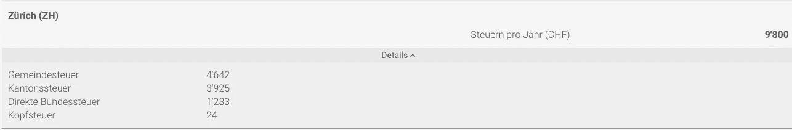
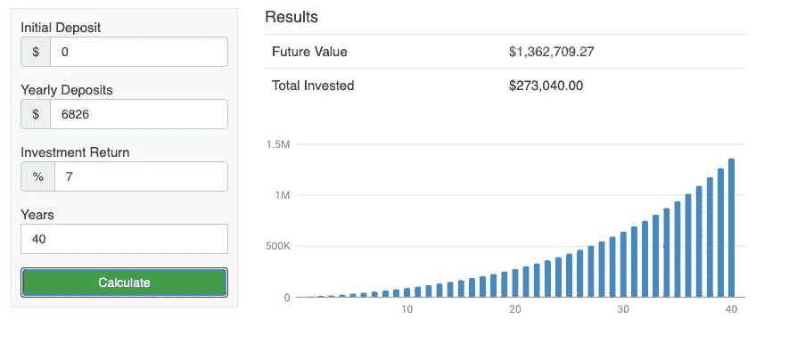
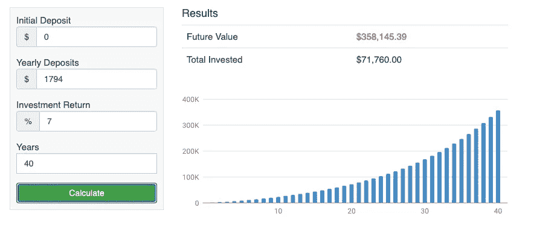

# 在您的自愿退休账户中实现 1，000，000 美元的两步指南—瑞士版

> 原文：<https://medium.datadriveninvestor.com/2-step-guide-to-achieve-1-000-000-in-your-voluntary-retirement-account-swiss-edition-a00c58ba1dff?source=collection_archive---------19----------------------->

在瑞士，有一个三支柱养老金体系。然而，只有三分之一的工作人口拥有 pillar3a。因为第三支柱是自愿的。有 3a 支柱的人退休后会有很大优势。在这篇文章中，你将学习如何在退休时在你的 3a 支柱养老基金中拥有 100 万瑞士法郎。

Photo by [Max Harlynking](https://unsplash.com/@harlynkingm?utm_source=unsplash&utm_medium=referral&utm_content=creditCopyText) on [Unsplash](https://unsplash.com/s/photos/retirement?utm_source=unsplash&utm_medium=referral&utm_content=creditCopyText)

# Pillar3a 和误解

即使 pillar3a 提供了很多好处，比如可以减税，可以用来资助公司，购买房屋，当然也可以用于你的退休。有**只有**不到三分之一的劳动人口有 pillar3a 账户！为什么？

1.  大多数人不知道 pillar3a 是什么，因此他们对它有误解。他们认为这就像支柱 1 或支柱 2 捐款，他们的资金由他们无法控制的其他组织管理。他们认为他们没有得到他们贡献的一切，这些钱是用来支付那些现在退休的人的。
2.  大多数人认为一旦他们把钱存入 pillar3a 账户，当他们需要的时候就不能取出来了。他们必须等到退休。
3.  大多数人认为 pillar3a 的供款是每年 6826 瑞士法郎，这对于他们来说太多了。

有些说法和你认为 pillar3a 是什么一样吗？大概吧。

但这不是真的。

1.  捐给 pillar3a 账户的钱是可以免税的。根据你在瑞士的居住地和收入水平，你甚至可以节省 800 到 1000 瑞士法郎甚至更多的所得税。
2.  你可以用你的钱购买房产。在瑞士，首付是房屋价值的 20%，你可以用你的 pillar2 和 pillar3a 支付部分首付。如果你自己创业或者永久移居国外，你可以用这笔钱。[如果您无法工作，您也可以提取您的存款，并领取全额病残补助金。](https://www.ch.ch/en/3rd-pillar/)即使你在退休时提取了钱，所缴纳的税也比你应该缴纳的所得税要低得多。
3.  自 2020 年起，您最多可捐助 6826 瑞士法郎。但是你不需要。您可以捐献 1000 瑞士法郎、2000 瑞士法郎或任何低于 6826 瑞士法郎的金额。你可以按月存款或一次付清。

在我的另一篇文章 [<如何用你的支柱 3a >](https://www.fasttrack.life/blog/how-to-create-wealth-with-your-pillar-3a) 创造财富中有很多关于支柱 3a 的信息。我强烈推荐你读那本书。

如果你明白 pillar3a 能为你做什么，以下是你如何将它增长到 100 万美元，直到你退休。

 [## 另类投资——它们在后疫情时代的角色|数据驱动的投资者

### 全球疫情的经济影响继续波及全球各行各业。的…

www.datadriveninvestor.com](https://www.datadriveninvestor.com/2020/10/27/alternative-investments-their-role-in-the-post-pandemic-landscape/) 

# 让你的钱翻倍增长

让我们举一个简单的例子来帮助你理解这个过程。

Peter 岁开始在瑞士工作，年收入为 86，000 瑞士法郎。假设他 65 岁前年薪不变。

他单身，没有孩子。

他向 pillar3a 贡献了最大的金额，并用这笔钱投资 ETF，这给他带来了平均每年 7%的回报，这是一个相当合理的回报。

彼得 65 岁退休。

source: comparis.ch. with pillar3a

他一年缴纳 9800 瑞士法郎的所得税。

如果他没有 pillar3a，在同样的情况下，他需要支付 11，594 瑞士法郎作为所得税。他比方案 1 多付了 1794 瑞士法郎的税。

source: comparis.ch without pillar3a

# 将 Pillar3a 增长到 100 万美元

现在，激动人心的部分来了。

与没有支柱 3a 相比，有了支柱 3a，彼得就有了两部分可投资资金。

1.  支柱 6826 瑞士法郎
2.  节省的税款—瑞士法郎 1794

第一步。他通过 pillar3a 账户向 ETF 投资 6826 瑞士法郎，年平均回报率为 7%，一直投资到 65 岁。

当他 65 岁时，他的账户里会有 1，362，709，27 美元。

source: savings.org

第二步。他通过自己的经纪账户将 1794 瑞士法郎投资于 ETF，年平均回报率为 7%，直到 65 岁。

当他 65 岁时，他的经纪账户里会有**258，145.39** 美元。

因此，由于向 pillar3a 缴款，他的投资总价值将给他**1，720，854.66 美元**

即使你不像彼得，你从 30 岁、35 岁、40 岁等等开始，你仍然可以让你的头发长得很长，直到退休。

# 了解全貌

拥有 pillar1 和 pillar2 可以在你退休时支付你的部分薪水，但这与你的薪水相差甚远。如果你想在退休时有一个舒适的生活方式，而不是降低你的生活质量，不如在你还有时间的时候开始规划你的退休生活。

Pillar3a 是一个很好的工具，可以补充您的退休收入，并为您提供一个具有多种福利的安全网。pillar3a 有多种不同的投资方式，各有利弊。找到最适合你的比一头扎进去更重要。我使用的 pillar3a 是 [VIAC](https://viac.ch/en/) ，你可以购买低成本的 ETF，与其他解决方案相比，他们收取的费用也很低。它是一种投资途径，你也可以把钱存入账户，赚取 0.5%的利率。我有 3 个可用的费用减免优惠代码:DCncgTD，ICMWMTC，UCnv0vC。

如果你想了解更多关于如何提高个人财富的信息。关注我的账户，了解更多关于个人理财的内容，帮助你[走上人生的快车道](https://www.fasttrack.life/)。

相关文章:

[<如何用你的支柱 3a >](http://How to Create Wealth with Your Pillar 3a) 创造财富

[<如何用你创造财富支柱 3b >](https://www.fasttrack.life/blog/how-to-create-wealth-with-you-pillar-3b)

## 获得专家观点— [订阅 DDI 英特尔](https://datadriveninvestor.com/ddi-intel)