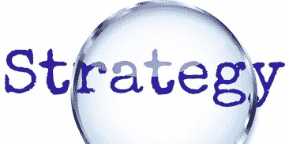
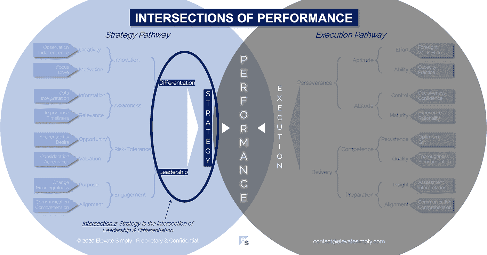

# 战略:领导力和差异化的交汇点

> 原文：<https://medium.datadriveninvestor.com/2-strategy-the-intersection-of-leadership-differentiation-a568b17731ab?source=collection_archive---------9----------------------->

Image from 123rf.com

没有战略，执行充其量是漫无目的的。战略是执行的路线图和基本原理。尽管这是首席执行官和高级领导团队的领域，有董事会或投资者的参与和监督，但每个人都想要一份战略。有个人或整个团队致力于此，从他们的头衔或名字中的“战略”一词可以看出。战略提供者并不缺乏。如果一个高管团队需要战略方面的帮助，有无数的顾问和咨询人员乐意收取高额费用来提供战略咨询服务。

战略是“什么”和“为什么”，是执行的“如何”、“何时”和“由谁”的问题。这需要远见和后知之明，想象力和现实主义。战略很难量化，但很容易分析。它是故意不完整的，因为如果它是规定性的，它注定会失败。另一方面，它是具体的，因为如果它模棱两可，就永远不会取得进展。

那些负责战略的人实际上负责创造未来(这是更高的工资和账单比率的原因)。这种责任可能是一种负担，因为没有人知道未来会发生什么。做得好，战略是任何组织的指路明灯。如果做得不好，不管执行得多好，都意味着即将失败。

**什么是战略交集？**

战略是领导力和差异化的交叉点*(见下图交叉点 2)*。

*领导*

无论是在个人、团队还是企业层面，领导者都是由战略驱动的。理想情况下，他们从战略角度思考，从战略角度计划，从战略角度行动。优秀的领导者能够将战略转化为执行语言，反过来，也能识别出什么时候执行实现了战略(什么时候没有)。作为一种能力，领导力并不能由一个人的头衔来保证。有些有领导头衔的人没有领导能力。有些有领导能力的人没有领导头衔。唉，这个世界是不公平的。

交集 2:战略=领导力+差异化

Image by [Brett Simpson](https://medium.com/u/191cf90a65d7?source=post_page-----a568b17731ab--------------------------------)

*分化*

制定战略的目的是让组织走上成功之路。企业的成功通常被认为是竞争和赢得业务的能力。赢得业务意味着客户做出了选择。大多数情况下，为了做出选择，客户会找出一个或多个令人信服的理由来选择 A 而不是 B(或者 C、D 和 E)。因此，差异化是战略交集的另一部分。

战略制定者必须能够辨别公司的差异化道路，并以一种有意义的方式进行沟通，以便能够执行。辨别差异化需要知识、洞察力、观察力和对公司未来做出可行性决策的能力。在这种情况下，战略假设可以对现状进行改善。

**分析策略**

策略通常可以从两个方面进行分析。一个内部，一个外部。在内部，分析是围绕着战略是否能实际执行。公司是否有能力，或获得能力的手段来执行战略，以实现预期的结果？

从外部来看，我们根据战略是否能产生预期的投资回报来评估战略。这可以通过以下一项或多项来衡量:获得客户、创造收入/利润、吸引投资者、创造价值等。

对成功的判断有时取决于旁观者。事实上，运气(无论好坏)在每一个策略中都是一个不可控的因素。没有保证，只有通过更好的策略降低风险的能力。

**领导者能做什么？**

制定战略的最佳方式是作为一个团队。领导力意味着认识到，虽然一个人可能非常聪明，但他们可能无法与一个有才华的高层领导团队的经验、思维能力和战略观点相匹配。

差异化作为战略交集的一个组成部分，不仅仅适用于输出，也就是战略本身。它也适用于战略制定的输入，包括相关人员。他们必须有不同的背景、理想和能力，以确保所制定的任何战略都是利用现有的最佳和最全面的信息。

**总结&下一个**

当不同的领导者为了正确的目的在正确的时间走到一起，并保持一致时，成功的战略就会“发生”。

下次我们将研究绩效的第三个交叉点，即**领导交叉点**。

在这一系列文章中，我们探索了性能*的交叉点，共有 30 个。*绩效的交叉点*框架是基于*[*Brett Simpson*](https://www.linkedin.com/in/brettjsimpson/)*[*的常务董事*](https://www.linkedin.com/company/elevatesimply/) *的经验和见解，他在大大小小的组织中担任了 20 多年的领导，并且是一名企业家、顾问和投资者。**

***绩效-文章链接的交集***

*1.[业绩:战略的交集&执行](https://medium.com/the-innovation/1-performance-the-intersection-of-strategy-execution-2bf06329f8d4)*

*2.[战略:领导力的交叉点&差异化](https://medium.com/the-innovation/2-strategy-the-intersection-of-leadership-differentiation-a568b17731ab)*

*3.[领导力:参与的交集&风险承受能力](https://medium.com/the-innovation/3-leadership-the-intersection-of-engagement-risk-tolerance-f8c887e6c1d3)*

*4.[差异化:创新的交叉点&意识](https://medium.com/@brettjsimpson/4-differentiation-the-intersection-of-innovation-awareness-a21d053ecf12)*

*5.[啮合:目的交点&对准](https://medium.com/@brettjsimpson/5-engagement-the-intersection-of-purpose-alignment-953747437c26)*

*6.[风险承受能力:机会的交叉点&估值](https://medium.com/@brettjsimpson/6-risk-tolerance-the-intersection-of-opportunity-valuation-29cf4d9a0ac)*

*7.[认知:信息的交集&关联性](https://medium.com/@brettjsimpson/7-awareness-the-intersection-of-information-relevance-f0fd5322bcb7)*

*8.[创新:创造力的交汇点&动机](https://medium.com/@brettjsimpson/8-innovation-the-intersection-of-creativity-motivation-7c1a12e0d5e2)*

*9.[目的:变化的交集&意义的交集](https://medium.com/@brettjsimpson/9-purpose-the-intersection-of-change-meaningfulness-9f12b0153e1)*

*10.[估价:对价的交集&验收](https://medium.com/@brettjsimpson/valuation-the-intersection-of-consideration-acceptance-eebe7b15e763)*

*11.[机会:欲望的交汇&责任](https://medium.com/the-innovation/opportunity-the-intersection-of-desire-accountability-7e81adb1e195)*

*12.[相关性:重要性的交集&及时性](https://medium.com/@brettjsimpson/relevance-the-intersection-of-importance-timeliness-56cc748eb066)*

*13.[信息:数据的交集&解读](https://medium.com/@brettjsimpson/information-the-intersection-of-data-interpretation-62acc94ba8bf)*

*14.[驱动:焦点的交点&驱动](https://medium.com/@brettjsimpson/14-motivation-the-intersection-of-focus-drive-d9ebd3ca9951)*

*15.[创造力:观察的交集&独立性](https://medium.com/@brettjsimpson/15-creativity-the-intersection-of-observation-independence-57f7294acb2b)*

*16.执行力:毅力与交付的交集*(即将推出！)**

*17.交付:准备与能力的交集*(即将推出！)**

*18.毅力:天资与态度的交汇*(即将推出！)**

*19.准备:洞察力和一致性的交集*(即将推出！)**

*20.能力:坚持与质量的交汇点*(即将推出！)**

*21.态度:控制与成熟的交集*(即将推出！)**

*22.资质:努力与能力的交汇点*(即将推出！)**

*23.洞察力:评估与解释的交集*(即将推出！)**

*24.质量:彻底性和标准化的交汇点*(即将推出！)**

*25.坚持:乐观与勇气的交汇*(即将推出！)**

*26.成熟:经验与理性的交集*(即将推出！)**

*27.控制:果断与自信的交汇*(即将推出！)**

*28.能力:能力与实践的交集*(即将推出！)**

*29.努力:远见和职业道德的交集*(即将推出！)**

*30.对齐:传播与综合的交汇点*(即将推出！)**