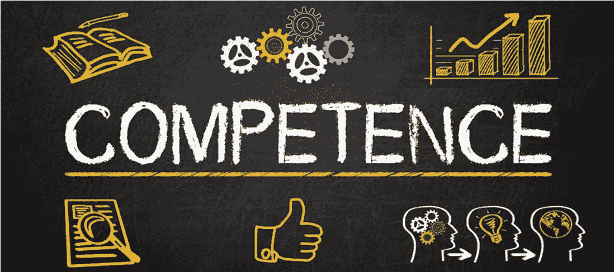
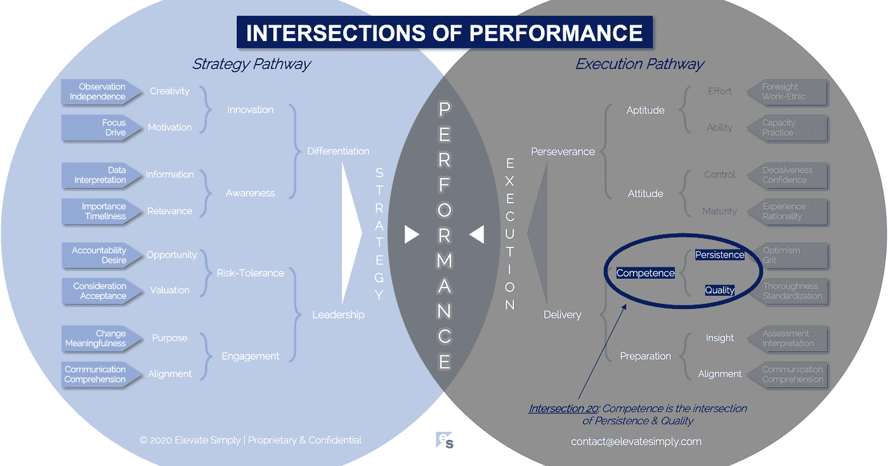

# 20.能力:坚持与质量的交汇点

> 原文：<https://medium.datadriveninvestor.com/20-competence-the-intersection-of-persistence-quality-adb8ac86600?source=collection_archive---------11----------------------->

From 123rf.com

我自己剪头发大约有 25 年了。我从大学开始，决定做一个游戏，看看我能坚持多久，1)我厌倦了，或者 2)它在某种程度上对我的生活产生了负面影响。我今天还在做这件事的事实已经远远超出了我的预期。幸运的是，从发型的角度来看，我可以忍受不完美。

迄今为止…

*   我没有因为我的自我理发能力而失去工作、工作或收入
*   我的妻子仍然说她爱我，我的女儿们被看到和我在一起也不会感到尴尬(如果她们感到尴尬，也不是因为我的发型)
*   我的朋友仍然和我交往
*   我遇到的大多数喝咖啡或吃午餐的人都愿意参加后续会议(如果他们不愿意，也不是因为我的发型)

总之，我很擅长这个，不会给自己或周围的人带来负面影响。

大约 18 个月前，我妻子说服我去她去的沙龙理发。事实上，她一直相信有人比我更擅长剪头发。我从来没有不同意，但我的理由(即固执)是，如果我能做得“足够好”，我为什么要花钱买它，还要安排一个约会，要求我开车去某个地方做一些我可以在家里随心所欲、免费做的事情？

令我惊讶的是，发廊的发型棒极了，原因有几个:

*   我的“理发师”汉娜给了我一些好的建议，关于我应该看的网飞/亚马逊黄金档节目
*   她给我洗了两次头发！…在此过程中
*   男士套装中包含肩部按摩
*   结果比我做的时候更好

在 25 年来第一次专业理发结束时，我去柜台付钱(比我希望的 10 美元要多)，他们卖给我一罐高价的“造型材料”，放在我的头发上，让它留在原处。他们对我在头发上使用护手霜的常规做法不以为然(尽管它非常好用)。假设你每天使用建议的量，我买的罐子可以用几个月。幸运的是，考虑到我修改过的使用方法，我预计罐子可以用 3 到 5 年，所以投资看起来是合理的。

我继续在沙龙剪了几个月的头发，很享受，但有一天因为工作冲突，我取消了预约，没有重新安排。我的懒惰开始发作，我决定“再来一次”重新剪自己的头发。那是一年前的事了，从那以后我再也没有去过那家沙龙。

我大概剪了 300 次头发。我不知道做某件事的具体次数等同于给定的能力水平，但在这一点上，我对结果感到满意。考虑到理发被认为是可以接受的(似乎是任何事情)，我很难被认为在自我理发方面没有能力。

不管怎样，在我的生活中还有许多其他的事情需要我更加关注能力的持续发展。以我的经验来看，我职业生涯中的能力应该比我的美容爱好受到更多的关注。

**什么是能力交集？**

能力是坚持和品质的交集*(见下图 20 路口)*。没有素质的坚持就像说“哦，但是他努力了。”没有持久性的质量只是昙花一现。能力是对动态范围内的能力和容量的时间点度量。

*坚持*

在商场上，就像理发一样，坚持不懈是成功的关键。原因很简单。第一次尝试很少会成功，即使成功了，也可能需要付出很多努力才能让尝试变成现实，所有这些都需要坚持。“尝试再尝试”是浮现在脑海中的一句话。我会把它改成“尝试，学习，再尝试”。不学无术的重复尝试似乎是疯狂的定义…多次做同样的事情，期望得到不同的结果。

在我喜欢阅读的历史传记中，无论是关于商业、政治还是社会领袖的，坚持不懈是一个共同的特质。不愿意放弃，对可能性的乐观和创新的能力，驱动着成功的人和组织。举个例子，让我们把这些方法应用到我的理发上:

*   *不愿放弃*:我剪了 25 年的头发，只是因为我可以
*   乐观的可能性:我相信我能做好这件事，现在也是
*   创新能力:我可以把自己的头发剪成任何我想要的样子，并尝试它(这很少发生，但仍然是一种选择)

有无数的商业领袖和企业家的故事，他们有意或无意地将这三种方法应用到他们组织中大大小小的项目中。想想任何成功的产品、服务或公司，你可以创建一个如上所述的要点列表，非常详细地列出与不放弃、对可能性的乐观以及创新如何发挥作用相关的细节。这就是坚持的意义所在。

*交集 20:能力=坚持+品质*

By [Brett Simpson](https://medium.com/u/191cf90a65d7?source=post_page-----adb8ac86600--------------------------------)

*质量*

质量似乎很简单。每项业务的每个部分都有它的一个方面。这是对能力的一种投入。能力要求以下方面的素质:

*   人
*   数据/信息
*   处理
*   决定
*   文化
*   技术/系统
*   产品/服务
*   合作伙伴/供应商
*   客户

这种对内部和外部质量的依赖是驱动组织内部的复杂性及其建立和保持竞争力的能力的原因。质量是一种心态。没有对它的关注，你只剩下数据处理的宝石，“废话进，废话出。”

在我的理发工作中，我需要以下品质:

*   我的剪刀，否则他们不会剪和/或持续很长时间
*   快船警卫，否则他们不会削减正确的长度
*   镜子让我相信我看到的图像是准确的，而不是“物体比看起来更近”的情况，这可能是灾难性的
*   我自己的协调性和灵巧性，所以我不会剪去比我想的要短的区域

做生意也是如此。我们需要投入的质量来产生产出的质量。

**领导者能做什么？**

能力是一种主观判断。目标、目的和任务需要不同程度的能力才能成功实现或完成。领导者必须能够确定什么时候有足够的能力，什么时候没有。他们可以在他们的团队中构建它，就像他们构建任何其他技能集一样。

认识到什么时候投资 it 以及如何投资 it 将强有力的领导者与一般的领导者区分开来。此外，当无能持续存在且必须处理时，领导者需要有一个适当的计划。决定是改正还是消除无能是一个重要的决定。

**总结&下一个**

对能力的需求渗透到组织的各个角落。能力要求和能力水平是不断变化的，这意味着它从未停止评估或调整。

下次我们将考察表现的第 21 个交叉点，也就是**态度交叉点**。

在这一系列文章中，我们探索了性能的交叉点，共有 30 个。绩效的交叉点*框架基于*[*Brett Simpson*](https://www.linkedin.com/in/brettjsimpson/)*[*董事总经理*](https://www.linkedin.com/company/elevatesimply/) *的经验和见解，以及他作为企业家、顾问和投资者在大大小小的组织中 20 多年的领导经验。**

***绩效-文章链接的交集***

*1.[绩效:策略的交集&执行](/the-innovation/1-performance-the-intersection-of-strategy-execution-2bf06329f8d4)*

*2.[战略:领导力的交叉点&分化](/the-innovation/2-strategy-the-intersection-of-leadership-differentiation-a568b17731ab)*

*3.[领导:参与的交集&风险承受能力](/the-innovation/3-leadership-the-intersection-of-engagement-risk-tolerance-f8c887e6c1d3)*

*4.[差异化:创新的交叉点&意识](/@brettjsimpson/4-differentiation-the-intersection-of-innovation-awareness-a21d053ecf12)*

*5.[订婚:目的的交集&对齐](/@brettjsimpson/5-engagement-the-intersection-of-purpose-alignment-953747437c26)*

*6.[风险承受能力:机会的交叉点&估值](/@brettjsimpson/6-risk-tolerance-the-intersection-of-opportunity-valuation-29cf4d9a0ac)*

*7.[认知:信息的交集&关联性](/@brettjsimpson/7-awareness-the-intersection-of-information-relevance-f0fd5322bcb7)*

*8.[创新:创造力的交汇点&动机](/@brettjsimpson/8-innovation-the-intersection-of-creativity-motivation-7c1a12e0d5e2)*

*9.[目的:变化的交叉点&意义](/@brettjsimpson/9-purpose-the-intersection-of-change-meaningfulness-9f12b0153e1)*

*10.[估价:对价的交集&验收](/@brettjsimpson/valuation-the-intersection-of-consideration-acceptance-eebe7b15e763)*

*11.[机会:欲望的交汇&责任](/the-innovation/opportunity-the-intersection-of-desire-accountability-7e81adb1e195)*

*12.[相关性:重要性的交集&及时性](/@brettjsimpson/relevance-the-intersection-of-importance-timeliness-56cc748eb066)*

*13.[信息:数据的交集&解读](/@brettjsimpson/information-the-intersection-of-data-interpretation-62acc94ba8bf)*

*14.[动力:十字路口的焦点&驱动](/@brettjsimpson/14-motivation-the-intersection-of-focus-drive-d9ebd3ca9951)*

*15.[创造力:观察的交集&独立性](/@brettjsimpson/15-creativity-the-intersection-of-observation-independence-57f7294acb2b)*

*16.[执行:毅力的交汇&交付](/the-innovation/16-execution-the-intersection-of-perseverance-delivery-73bdd004fd0)*

*17.[交付:准备&能力](/@brettjsimpson/17-delivery-the-intersection-of-preparation-competence-556a06d33238)的交集*

*18.[毅力:天资的交汇&态度](/@brettjsimpson/18-perseverance-the-intersection-of-aptitude-attitude-f7f9d96f01dd)*

*19.[准备:有识之士的交汇&对齐](/@brettjsimpson/19-preparation-the-intersection-of-insight-alignment-752fd11af553)*

*20.能力:坚持与质量的交汇点*

*21.态度:控制与成熟的交集*(即将推出！)**

*22.资质:努力与能力的交集*(即将推出！)**

*23.洞察力:评估与解释的交集*(即将推出！)**

*24.质量:彻底性和标准化的交汇点*(即将推出！)**

*25.坚持:乐观与勇气的交汇*(即将推出！)**

*26.成熟:经验与理性的交集*(即将推出！)**

*27.控制:果断与自信的交集*(即将推出！)**

*28.能力:能力与实践的交集*(即将推出！)**

*29.努力:远见和职业道德的交集*(即将推出！)**

*30.对齐:传播与综合的交汇点*(即将推出！)**

*在 [**管理和企业咨询**](https://app.ddichat.com/category/management-and-corporate-consulting) **:** 中安排一个 DDIChat 会话*

* [## 专家-管理和企业咨询- DDIChat

### DDIChat 允许个人和企业直接与主题专家交流。它使咨询变得快速…

app.ddichat.com](https://app.ddichat.com/category/management-and-corporate-consulting) 

在此申请成为 DDIChat 专家[。
与 DDI 合作:](https://app.ddichat.com/expertsignup)[https://datadriveninvestor.com/collaborate](https://datadriveninvestor.com/collaborate)
点击此处订阅 DDIntel [。](https://ddintel.datadriveninvestor.com/)*