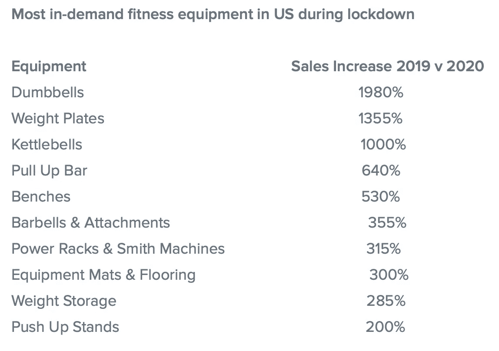

# 20 对 20

> 原文：<https://medium.datadriveninvestor.com/20-on-20-836a5d269a1?source=collection_archive---------21----------------------->

## 定义 2020 年的 20 个词

teepublic.com

在 2020 年最后一周之前，我请几个我认识的人每人给我五个单词，代表他们对 2020 年的一些记忆或引发一些思考。我在请求中明确表示，我不想让他们猜测今年最常用的单词，或者你在每年年底得到的典型的“十大”列表中找到的任何单词。我们可能都猜测“缩放”、“远程”、“疫情”或“2020 年选举”可能在这类列表的顶部。我想要更原始、更发自内心的东西——我也不想要解释——只要这个词。

我期望看到许多相同或相似的词，假设我们都必须有相似和共同的经历，但我错了。有几个重复的单词，但大多数都是独特的。因此，正如我向每个人解释的那样，当我征求他们的名单时，我没有承诺我会从每个人身上选择一个单词(尽管我这样做了)，也没有承诺我可能不会使用所有的单词(我没有)，但我从其中选择了 20 个不同的单词。

尽管这些词对我来说都不陌生，但我还是在字典里查了每个词，这样我就能从它的真正含义出发，然后能够深入了解它对我认识的人来说可能意味着什么。(为此，我使用了由牛津驱动的美国版[Lexico.com](https://www.lexico.com/en/definition)。这些词描述了 2020 年的一些普遍看法和许多事实。一旦你完成了，我会建议你跟随下划线的链接去阅读一些特定主题的附加阅读材料。有多少与你 2020 年的个人经历有关？这是按字母顺序排列的。

成就 ( *，*成功地完成一件事，通常是通过努力、勇气或技巧)

向 Pfizer-BioNTech 和 Moderna 致敬，他们在创纪录的时间内成功完成了新冠肺炎疫苗的研发、生产和批准。十一个月。之前的记录是疫苗持续保护我们免受腮腺炎感染四年。这是一个我们都必须感谢的成就，也是一个将 2020 年带向更幸福的结局的成就。

然而，与 2020 年每天发生的数百万个人勇敢行为相比，这一重大科学成就就相形见绌了。在疫情和经济危机的背景下，众多的个人成就更令人振奋。我们仍然找到了承担责任、表现宽容、表达心声和成长的方法。这些只是个人成就中的一小部分。你完成了多少？花点时间拍拍自己的背。

2 **福(因祸得福)** ( *ph* ，祸福相依)

2020 年疫情的不幸数不胜数，因为世界各地有数百万人死亡、生病、失去亲人、失去工作和失去希望。但是，对于许多其他将逆境视为机遇或认为杯子是半满的人来说，这一年有些人将从他们的项目中毕业，开始新的职业生涯，结婚或开始新的关系，生育，收养或抚养孩子——所有这些都是动荡的一年中的伟大成果，是我们应该感谢的事情。对这些人来说，2020 年可能是他们有史以来最好的一年。

3 **连接** ( *adj* ，集合或接触以便建立真实的或想象的联系)

我们现在比以往任何时候都更加紧密地联系在一起……在许多层面上。一个明显的例子是允许我们许多人继续工作的互联性。2020 年，在家工作将成为事实上的常态，许多大大小小的公司都发誓要让这种情况成为法律上的常态，即使当前的疫情限制已经取消。但从更广泛的意义上来说，2020 年的疫情以一种其他事件无法做到的方式将人们团结在一起。

Doctors Nova Scotia from [yourdoctors.ca](https://www.yourdoctors.ca/blog/general/5-ways-to-stay-connected-when-youre-apart)

从虚拟的咖啡休息时间和 zoom 俱乐部，到在停车场开车登记和蒙面会面，我们已经认识到并意识到人际关系的重要性。我们是需要彼此联系的社会动物，如果之前不明显，那么今年已经非常清楚了。

民主 ( *n* ，【1】一种由全体人民或一个国家所有合格成员组成的政府体系，通常通过选举产生的代表来实现，[2]社会平等的实践或原则)

在任何选举年，这都是一个令人回味的词，但也许永远不会超过 2020 年。从不公正到不平等，从裙带关系到专制，2020 年有一种感觉，民主本身正在受到攻击。因此，民主成为了一个战斗口号，导致了美国选举历史上 120 多年来最大的投票率。尽管存在所有的恐惧、言论和选举后的诡计，但民主似乎占了上风，尽管不完美，但它仍是让你的意见得到重视的最佳方式。

Washington Post, updated as of December 18, 2020

5 **抑郁** ( *n* ，极度沮丧和沮丧的感觉)

心理健康问题既不是新问题，也不局限于 2020 年，但随着许多司法管辖区的强制隔离，对冠状病毒疾病或死亡的恐惧，以及影响数百万人的经济冲突，不难理解为什么 2020 年美国成年人的抑郁率是之前年率的三倍。其他社会因素，如系统性的种族主义和敌意，其中一些是整个 2020 年选举周期的分裂性的结果，也导致了许多美国人经历的抑郁症。新年日历的开放不足以扭转这一可怕的趋势，但对有效疫苗的希望、社会限制的放松以及 2021 年经济的复苏可能会缓解一些担忧，并有助于降低抑郁症的新发病例率。

6 **扰乱** ( *v* ，通过引起干扰或问题来中断(一个事件、活动或过程)

这个词曾经局限于科学和技术领域，意思是迫使意想不到的变化，但在 2020 年，这个词代表了我们的经济、医疗保健系统、企业、政府和整个社会所经历的大部分事情——这要归功于新型冠状病毒。未来学家会称之为“冲击”，一个改变现在和未来之间预期(或最有可能)路径的事件。半个世纪前，阿尔文·托弗勒写了《未来的冲击》，这是一本关于颠覆及其对社会影响的最著名和研究最多的书。

> 他的错误:托夫勒预测，随着工作从办公室和工厂转移回家庭，城市将失去意义——BBC，2016 年 6 月 30 日

每隔十年，许多人都会写下托弗勒在 1970 年的预测中哪些是正确的，哪些是错误的，最近一次是在托弗勒 2016 年去世后。在出版 46 年后， [BBC 分析了这本书](https://www.bbc.com/news/world-us-canada-36675260)，注意到托弗勒有以下错误:[城市衰落](https://jmacdonald66.medium.com/remote-working-the-new-reality-4dad40ee5589)，[太空殖民地](https://www.nasa.gov/gateway)，以及[社会疏离](https://www.nbcnews.com/health/health-news/here-are-stay-home-orders-across-country-n1168736)。欢迎来到 2020 年，BBC——托弗勒愚弄了你，即使是从坟墓里。

对于普通人来说，这一年带来的生活和生活方式的改变超过了平均水平，但只有时间才能告诉我们有多少破坏会带来永久性的改变。无论疫苗是否在 2021 年普及，2020 年的事件将对我们的生活、工作和娱乐方式产生持久的影响。

教育接受或给予系统指导的过程，尤指在学校或大学里，一种启发性的经历

虚拟课堂学习在 2020 年成为世界各地许多学生的现实，并考验了我们的技术、互联网连接和耐心的极限。在一个不确定的夏天之后，孩子们在秋天回到学校的前景是不确定的。在许多司法管辖区，关于学校的决定是在众所周知的最后时刻做出的。关闭学校和虚拟教学的决定，或者让家长选择送孩子去实体学校还是进行在线学习的决定，通常会在开学前一周左右做出。

随着封锁，再封锁，在美国和世界大部分地区继续，家长和学生的挫折感继续存在。疾病控制和预防中心发布了一项关于学龄儿童和传染率的研究。它没有显示感恩节后的最新数据，但至少有一些数据。所以，如果这有助于你决定在你的孩子接受教育时保持安全的最佳方式…嗯，你的数学比我好。不过，说真的，相信科学。

Leeb RT, Price S, Sliwa S, et al. COVID-19 Trends Among School-Aged Children — United States, March 1–September 19, 2020\. US Department of Health and Human Services

8 **健康** ( *n* ，身体健康的状态)

像每年一样，在 2020 年 1 月，健身房、健身俱乐部和培训中心的新年决心会员和用户的传统高吸收量之后，大多数设施在 3 月疫情开始后不久突然关闭，或者在大多数地区下令停业时关闭。在许多地方，这些封锁仍在继续。对于那些能够重新开放或保持开放的，清洁制度，由于物理空间要求的设备较少，以及必要的预约，使得它不是一个有吸引力的选择，除非是最顽固的爱好者。许多人不信任安全协议，而其他许多人无法证明这笔费用的合理性，尤其是在经济困难时期。

> “你真的应该问问自己，这件事对我来说是否如此重要，以至于我必须这么做，”—范德比尔特大学传染病教授威廉·沙夫纳博士说

与此同时……在隔离和封锁期间，健身成了度过漫长孤独日子的一种方式……因此，购买家庭健身器材的热潮开始了。亚马逊、好市多、沃尔玛、易贝和较小的重量训练和有氧器械供应商在销售中受益匪浅，一些报告表明[家庭健身房设备市场收入将在 2025 年继续增长](https://www.globenewswire.com/news-release/2020/11/04/2119996/0/en/The-home-gym-equipment-market-by-revenue-is-expected-to-grow-at-a-CAGR-of-close-to-9-during-the-period-2019-2025.html)。

G. Nichols, ZDNet, June 9, 2020

这些数字表明有很多爱好者，但其他报告表明减肥是不正常的，[更多的人变胖了](https://www.yalemedicine.org/news/quarantine-15-weight-gain-pandemic) …他们甚至创造了一个术语来形容在疫情期间平均增加的体重:隔离期 15。无论你站在天平的哪一边，2020 年的某个时候你可能会想到健身。

挫败感(尤指因无力改变或实现某事而产生的沮丧或烦恼的感觉)

我们习惯于掌控自己的生活，自己做决定。自由是我们生活方式的标志。因此，随着越来越多的限制措施出台，人们的愤怒情绪爆发也就不足为奇了。对医疗建议的明显改变也感到沮丧，但事实上，每个人都在学习如何在飞行中应对这种冠状病毒。所以在第一天，它是“洗手[直到唱完*生日快乐*](https://www.unicef.org/coronavirus/everything-you-need-know-about-washing-your-hands-protect-against-coronavirus-covid-19) ”，不久之后“我们真的需要戴着面具”被加了进去。矛盾的建议？不，只是关于病毒传播方式的新知识。

抵制或谴责一切形式的政府干预的逆向思维者和自由意志论者能够将信息变化扭曲成疯狂的阴谋主张，并将沮丧情绪煽动成愤怒和抗议，并煽动不满情绪。有反封锁集会，反面具游行，以及反对任何和所有措施的集会。截至目前，[有超过 33 万美国人死亡](https://www.worldometers.info/coronavirus/country/us/)...其中许多是可以预防的。九个月过去了，仍然有太多的人不相信这个疫情和它的影响是真实的。对我来说，这是沮丧的来源。这个词很有可能在 2021 年再次出现在榜单上。

10 **感恩/感恩** ( *n* )，感恩的品质；乐于表达感激和回报善意。感受到或表现出对仁慈的感激；感恩)

在超过 33 万美国人和全世界 170 万人死亡的所有悲伤和痛苦中，冠状病毒疫情见证了善良和勇敢的英雄行为，对此我们都应该心存感激。疫情的“前线”工作者——卫生保健提供者、家庭护理员、杂货店店员、送货司机、学校教师和其他必须与公众接触的职业——没有选择安全地呆在室内或在家工作。

[Unitedway.org](https://www.unitedway.org/blog/8-ways-to-thank-frontline-workers) — May 4, 2020

对这些一线工人的感激之情有很多公开的展示，比如加拿大温哥华市中心的阳台上每天晚上 7 点的掌声，以及巴黎和马德里类似的支持。无论你是否参加过任何公开展示，在过去九个月的某个时候，当你蹲下来狂看《虎王》、《王冠》或《女王的策略》时，你可能会对一线工作人员产生一些同情和感激。

或者也许你想做点什么来表达你的感激之情，但是不知道该怎么做。嗯，有时候一句感谢的话足以让某人开心一天，所以如果你碰巧遇到一线工作者，或者想找一个这样的人，[从这个列表中选择一些事情对他们说](https://www.operationwarm.org/newsroom/blog.html/article/2020/05/29/25-messages-to-say-thanks-to-frontline-workers)。unitedway.org 的[为如何表达你的感激之情提供了其他的方法。虽然许多人会说 2020 年是有史以来最糟糕的一年，但我会反思我从祖母那里得到的智慧之言——总有一些事情值得感激。](https://www.unitedway.org/blog/8-ways-to-thank-frontline-workers)

11 **健康** ( *n* ，一个人的精神或身体状况)

我几乎没有包括这个词，因为它看起来太明显了。但如果我们超越冠状病毒和新冠肺炎病，我们仍然可以看到个人和集体健康是 2020 年的主要故事。

作为恐惧和孤立导致的疫情的二级效应，心理健康压力在进入疫情几个月后就达到了危机的程度。然后，你会加剧最近美国大选的心理效应，将美国几乎一分为二，导致公众领袖的信心和政府体系本身几乎完全崩溃。在 2021 年，恢复国民的精神健康将是一项重大挑战。

 [## 忘记新冠肺炎吧。这是拜登最大的挑战。

### 没有心理治疗的疫苗

medium.com](https://medium.com/datadriveninvestor/forget-covid-19-this-is-bidens-biggest-challenge-80387e4b1f6f) 

这个国家的物质条件也好不到哪里去……等等，谁在骗谁……差远了。2020 年，新冠肺炎死亡人数超过 33 万。这相当于每 10 万人中有 101.8 人死亡。你会问，这与其他死因相比如何？嗯，如果我们看看过去两年 CDC 的列表，并假设今年可能会相同或足够接近，你可以看到新冠肺炎在列表中的位置，它只是在 2020 年两个月后才开始产生影响。的确，一些新冠肺炎死亡病例将与潜在的健康状况有关，而这些健康状况最终可能会低于其他原因类别中报告的数字。再考虑一下自杀率，在这个名单上排在第十位(在加上新冠肺炎之前)，在疫情的 之前 [*就已经开始飙升了，据报道，2020 年的自杀率甚至比正常水平还要高。根据英国医学杂志*](https://www.rollcall.com/2020/08/05/pandemics-effect-on-already-rising-suicide-rates-heightens-worry/)*[的报道，虽然最初在封锁的最初几个月有所下降，但这一趋势似乎在 8 月份有所逆转，在一些地区现在比去年的平均水平高出 145%。](https://www.bmj.com/content/371/bmj.m4352)*

[cdc.gov](https://www.cdc.gov/nchs/products/databriefs/db395.htm) — **Age-adjusted death rates for the 10 leading causes of death in 2019: United States, 2018 and 2019\. COVID-19 data, added by this author, taken from US data at** [**worldometer.com**](https://www.worldometers.info/coronavirus/country/us/)

降低(某人的)尊严或重要性

2020 年，我们人类被一些我们甚至无法用自己的眼睛看到的东西所折服。冠状病毒为直径约 120 纳米的[球形。一个*纳米？那是一米的十亿分之一。强大的人类在这种微小的病毒面前变得渺小。就个人而言，病毒对我们并不一样。肺部和危重病护理专家 Hesham A. Hassaballa 博士提供了一个令人心痛的描述，讲述了该病毒如何以非常不同的方式影响同一个家庭的成员，并产生令人惊讶的结果。*](https://www.ocregister.com/2020/04/10/coronavirus-heres-how-small-the-enemy-is-and-how-it-attacks/)

 [## 新冠肺炎有什么让人如此抓狂(和谦卑)的地方

### 这是同一种病毒……但是它在每个病人身上的作用是如此不同

medium.com](https://medium.com/beingwell/whats-been-so-maddening-and-humbling-about-covid-19-8c0a5162d84e)  [## 人工智能在后电晕社会中的角色和声誉

### 万物皆通，包括电晕。但在此之前，我们要塑造未来，并加速已经存在的趋势…

www.datadriveninvestor.com](https://www.datadriveninvestor.com/2020/04/30/ais-role-and-reputation-in-post-corona-society/) 

我们人类应该从这个教训中吸取教训。我们应该……不，我们需要 T21 尊重自然世界，以免我们再次释放更多困扰我们的东西。

13 **隔离** ( *n* ，隔离或被隔离的过程或事实)

对于 2020 年，有一个讽刺可能还没有被很好地理解。美国心理协会[表示，出于好意呼吁隔离，包括强制自我隔离，以防止冠状病毒和相关医疗风险的传播，可能会导致其他短期和长期的健康影响。](https://www.apa.org/monitor/2019/05/ce-corner-isolation)

> 强有力的证据表明，社会隔离和孤独会显著增加过早死亡的风险，其风险程度超过了许多主要的健康指标——杨百翰大学心理学和神经科学教授 Julianne Holt-Lunstad 博士

在整个 2020 年，与孤独的斗争导致了对流媒体系列节目的疯狂观看、疯狂购物、饮酒量增加和体重增加，但也许隔离最有趣的影响是对宠物的巨大需求和行业的增长。与前一年相比，2020 年上半年被收养和寄养的宠物数量增长了 70%。有更多的时间呆在家里，意味着有更多的时间和宠物在一起，拥有一个毛茸茸的朋友绝对是对抗孤独寂寞的一种方式。

1414**渴望** ( *n* ，一种渴望的欲望)

似乎有一个普遍的共识，我们都希望看到 2020 年结束。一年中大部分时间的不确定性，使得渴望“回归正常”成为一个经常使用的短语。人们想要安全感，想要掌控一切，想要感觉脚下的土地是稳定的。人们不喜欢改变。

这在你的个人生活中是如此，在商业中也是如此。商界领袖渴望 2019 年的确定性。2 月份制定的解决方案在 5 月份毫无意义。公司战略被粉碎并带回(现在是虚拟的)绘图板。现在，如果我们将这种渴望的感觉发挥到极致，我们可能会开始理解为什么特朗普的信息*让美国再次伟大*会在多达一半的美国人口中产生如此大的共鸣。

事实是，特朗普无法兑现这一承诺。当 2020 年面对美国人面临的最大威胁时，他未能确保他们的安全，他未能提供必要的指导让人们掌握控制权，他反复无常的行为除了稳定之外没有提供任何东西。几乎具有讽刺意味的是，在 11 月的选举结果变得明显后，特朗普本人开始渴望他在 2016 年的成功。

无论是在政治、商业还是更广泛的生活中，渴望一年结束或回到过去的田园生活都不是解决当前问题的策略。即使预计到 2021 年中期，大范围的疫苗接种将产生群体免疫，我们也不太可能回到疫情之前的世界，因此对许多人来说，渴望 T2 美好旧时光的感觉可能会持续一段时间。

15 **失去** ( *n* ，【1】失去某物或某人的事实或过程；[2]失去有价值的人或物时悲伤的状态或感觉

2020 年带来了很多层面的失落感，很难知道从哪里开始。从微观或个人层面来看，2020 年有太多的人失去了亲人。到 12 月 31 日，将有超过 345，000 名美国人死于新冠肺炎或其并发症。此外，自 20 世纪 30 年代以来，美国人的失业率从未达到 2020 年的水平。丧失生命和失去工作，或者仅仅是对它的恐惧，特别是当它本来是可以避免的时候，会打击个人的信心。

从宏观层面的损失来看，我们可以把 2020 年视为美国现代史上的一个转折点。在过去的 100 年里，某些人因为他们所代表的损失而留在我们的集体意识中:1929 年——财富。1963 年——政治清白。1974 年——对外战争。2001 年——天定命运。2020 —信心和信任。无论是个人还是集体，美国人在 2020 年都经历了一种失落感，可能需要数年时间才能恢复。

不信任，不信任，怀疑

媒体、政客、机构、选举结果、医疗建议、世卫组织、大科技，彼此。在 2020 年，你将很难找到任何值得信赖的东西。在被告知我们读到和听到的一切都是假的，而且大部分都是假的四年(甚至更久)后，我们很难知道该相信什么。随着“深度伪造”技术变得越来越普遍，区分真实与虚幻将变得非常具有挑战性，如果不能完全摧毁我们的信任，也会进一步侵蚀我们的信任。

17 **优先事项**

如果你能够控制决策的所有杠杆，那么设置问题的优先级就是一件小事。最重要的事情首先得到处理。我们都有自己的重要问题，至少在我们心中是这样。

一旦你试图将个人的优先事项整合成一个单一的清单，你很可能会受到迈尔斯定律的影响，所以你站在哪里取决于你坐在哪里。

对许多人来说，他们在 2020 年的首要任务是击败冠状病毒，而对其他人来说，则是获得或保住自己的工作。对许多人来说是保持安全，对其他人来说是保持理智。对包括特朗普总统在内的至少数百人来说，这是当选。

在一个民主国家，相互竞争的优先事项或利益的问题是，它可能会分化群体。在最好的情况下，它会导致妥协，比如专注于创造就业，但这往往会降低效率，因为双方都放弃了一些东西。在最坏的情况下，它会导致双方陷入僵局。这就是国会的遭遇。他们忘记了他们的首要任务是为美国人民服务。

Pew Research Center — Image from Jan 2019, COVID-19 data from November 2020

因此，为了改变我们在影响美国人的问题上的立场，需要改变席位，可能是两个来自格鲁吉亚的席位。

18

2020 年出现了一些令人惊讶的关系趋势，这是由长时间呆在家里造成的。

趋势一:[婚外情上升](https://venturebeat.com/2020/09/29/ashley-madison-extramarital-affairs-soar-in-pandemic-with-technologys-help/)。据 Ashley Madison 称，9 月份他们的“结婚约会”网站每天有 21，000 名新用户，而在疫情之前每天有 17，000 名新用户。

趋势二:[婴儿胸围](https://www.usatoday.com/story/news/nation/2020/12/16/covid-19-baby-bust-coronavirus-pandemic-lead-birth-decline/6507974002/)。由于有如此多的人被困在家里，和他们的伴侣在一起，人们很早就预期新冠肺炎会出现婴儿潮。但事实正好相反，2020 年的怀孕率大幅下降。人们认为，经济问题和儿童保育问题是导致这一数字下降的两个因素。

趋势 3: [婚姻破裂下降](https://ifstudies.org/blog/divorce-is-down-during-covid)。尽管疫情早期的报告显示离婚率和分居率上升，但有迹象表明离婚率实际上在下降——尽管最终数字要到 2021 年才能知道。尚不清楚这些数字的下降是否仅仅是因为许多司法管辖区的家庭法院在一年中的大部分时间都处于关闭状态，这意味着请愿和申请数量下降，或者人们只是在被困在家里的情况下做出了更大的努力来解决婚姻问题。

如果你仔细想想，这些趋势可能是相互关联的。无论如何，这些 2020 年的趋势可以用一个令人难忘的和谐来概括，那就是驼峰、颠簸和倾倒之年。

19 **安全** ( *n* ，脱离危险或威胁的状态)

当回顾这个列表的单词时，我认为这肯定是一个错误。或许本意是“没有安全感”，但后来想了想，几个例子浮现在脑海里。2020 年的安全意味着能够呆在家里，戴着面具，让家人呆在你的泡泡里，并且被锁起来。这些决定和行动，无论是个人选择还是强加的，都给数百万人带来了安全感。

[https://blacklivesmatter.com](https://blacklivesmatter.com)

不幸的是，对于其他数百万人来说，由于错误信息、缺乏领导力、信息不一致以及没有经济确定性或安全网来度过艰难时期，不安全感要高得多。对于数百万人来说，安全这个词让人想起 Rayshard Brooks、Daniel Prude、George Floyd 和 Breonna Taylor，他们都是今年警察暴力的受害者，并成为 2020 年黑人的命也是命运动的最新灯塔，该运动是一股突出的社会政治力量。

坚韧的，顽强的，顽强的，顽强的。紧贴或紧密附着)

想到两件事:(1)冠状病毒。尽管通过锁定已知生命并尽量减少人与人之间的接触，人们做出了前所未有的努力来减少传播，但这种持续存在的病毒仍在世界各地蔓延，并感染了 8100 多万人，导致全球近 180 万人死亡。(2)唐纳德·特朗普。尽管计票、重新计票、选举团计票、法院备案、法院裁决和最高法院谴责，他仍然相信并声称他赢得了 2020 年总统大选。没有任何一个人像唐纳德·川普一样在 T2 的大选中失败如此之多。那就是坚韧。

所以你有它… 20 对 20。定义 2020 年的 20 个词。

## 获得专家观点— [订阅 DDI 英特尔](https://datadriveninvestor.com/ddi-intel)