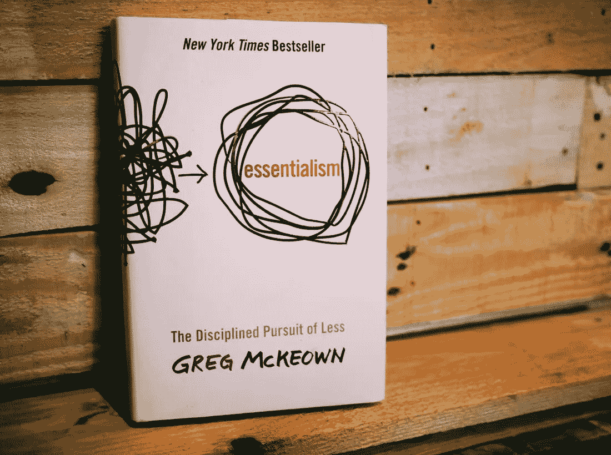

# 20 句名言鼓励你说“不”比说“是”更频繁

> 原文：<https://medium.datadriveninvestor.com/20-quotes-to-encourage-you-to-say-no-more-often-than-you-say-yes-a8f0e2cc8089?source=collection_archive---------2----------------------->

## 人们之所以有效，是因为他们说不

Photo by [Gemma Evans](https://unsplash.com/@stayandroam?utm_source=medium&utm_medium=referral) on [Unsplash](https://unsplash.com?utm_source=medium&utm_medium=referral)

我们在北美如此忙碌的原因之一是我们无法说“不”。

我们发现对我们的老板、同事、家人、朋友，甚至陌生人说“不”很有挑战性。

我们总是说“是”,因为…

我们觉得有必要帮忙。

我们通过接受更多的东西而感到高产。

我们认为说“不”是软弱的表现。

我们不想冒犯。

我们希望被人喜欢。

说“不”会让我们感到内疚。

结果，我们没有边界来保护我们的时间。我们没有限制，也没有规则来指导我们能做什么和不能做什么。

 [## 初创公司和对大型投资者说不|数据驱动的投资者

### 热门创业公司通常被认为是这样的，因为谁参与其中，想法有多大胆。他们得到了…

www.datadriveninvestor.com](https://www.datadriveninvestor.com/2019/08/19/startups-and-saying-no-to-a-large-investor/) 

今天，我们生活在一个界限已经消失的社会。这些天来，对于人们期望我们什么时候可以工作，似乎没有任何界限。随着工作和家庭之间的界限变得模糊，科技让情况变得更糟。

如果你想完成人生中的重要目标，你会同意极度专注是必需的。这种关注必须只针对一件事。所以，学会说“不”比说“是”更频繁是很重要的。这需要你设定界限和限制来保护你的时间。

格雷格·麦克欧文在他的书《本质主义》中写道:

> 如果你不设定界限，就不会有任何界限。或者更糟的是，会有界限，但它们是默认设置的——或者由另一个人设置的——而不是设计出来的。

Image Credit: [https://thefocuscourse.com/](https://thefocuscourse.com/)

在设定界限时，他继续区分了非本质主义者和本质主义者:

> 非本质主义者倾向于认为界限是约束或限制，是阻碍他们高效生活的东西。对一个非本质主义者来说，设定界限是软弱的证据。如果他们足够强大，他们认为，他们不需要界限。他们可以应付这一切。他们什么都能做。但是如果没有限制，它们最终会变得如此分散，以至于几乎不可能完成任何事情。
> 
> 另一方面，本质主义者将界限视为授权。他们认识到，界限可以保护他们的时间不被劫持，并经常让他们摆脱不得不拒绝那些促进他人目标而不是自己目标的事情的负担。他们知道，清晰的界限让他们能够主动消除来自他人的需求和阻碍，这些需求和阻碍会分散他们对真正本质的注意力。

当你学会说“不”的次数比说“是”的次数多的时候，这里有 20 句名言鼓励你:

**引用# 1**

> “不”是一个完整的句子——安妮·拉莫特

**引用# 2**

> “我们生活在一个‘是’的文化中，在这里，人们期望将获得成功的人是对他们遇到的每件事都说是的积极进取者。”——达拉·布莱恩(纽约时报)

**引用# 3**

> “生活中一半的麻烦都可以追溯到说‘是’太快和说‘不’不够快。”—乔希·比林斯

**引用# 4**

> “几百年后，当我们这个时代的历史将从长远角度书写时，历史学家看到的最重要的事件很可能不是技术，不是互联网，也不是电子商务。这是人类状况前所未有的变化。第一次——真的——越来越多的人有了选择。他们将首次不得不管理自己。而社会对此完全没有准备。”—彼得·德鲁克

**引用# 5**

> "你不能高估几乎所有事情的重要性."—约翰·麦克斯韦

**引用# 6**

> “这并不意味着你必须对人们冷嘲热讽。我不是说人们不应该被信任。我只是说，每个人都在出售一些东西——一个想法、一个观点、一个观点——来换取你的时间。仅仅是知道有什么东西在卖，就能让我们更慎重地决定是否要买。”—格雷格·麦克欧文

**引用# 7**

> "一个人的富有与他能负担得起的东西的数量成正比."——亨利·大卫·梭罗

**引用# 8**

> “人们认为专注意味着对你必须专注的事情说是。但完全不是这个意思。这意味着对其他上百个好主意说不。你必须仔细挑选。实际上，我为我们没有做过的事情和我做过的事情一样感到自豪。创新就是对 1000 件事情说‘不’。”—史蒂夫·乔布斯

**引用 9 号**

> “我们需要学会慢速的‘是’和快速的‘不’”――汤姆·弗列尔

**报价# 10**

> “世界最近变化很快。我们曾经生活在一个不需要内心否定的世界，因为否定无处不在。现在我们生活在一个被设计来给我们想要的东西的世界里。现在“是”就在我们周围。外在的肯定需要内在的否定。”——威廉·利斯(《卫报》)

**引用# 11**

> “不，是一个决定。是的是一种责任。”—詹姆斯·克利尔

**引用# 12**

> “当企业家在正确的时间以正确的方式对正确的项目说‘是’时，他们就成功了。要做到这一点，他们必须善于对所有其他想法说‘不’。”—雷德·霍夫曼

**引用# 13**

> “每次我们对一个请求说“是”,我们也在对这段时间内我们可能完成的任何其他事情说“不”—蒂姆·哈福德

**引用# 14**

> “我想在我的日程表上尽可能少地安排一些事情。我对它一丝不苟。在不影响我职业生涯的前提下，尽可能减少我的日程安排，这就是我想要的。”—瑞安·霍利迪

**引用第 15 条**

> "任何时候，当你没有对一件不重要的事情说‘不’的时候，你实际上默认了说‘是’。"—格雷格·麦克欧文

**引用# 16**

> “通常，生产率专家关注的是如何快速做事，但人们快速做的绝大多数事情根本就不应该做。”—马克·切尔诺夫

**引用# 17**

> "毫无疑问，最没用的事莫过于高效率地做根本不该做的事。"—彼得·德鲁克

**引用# 18**

> “沃伦在职业生涯早期就认为，他不可能做出数百个正确的投资决策，所以他决定只投资那些他绝对有把握的业务，然后在这些业务上下大注。他 90%的财富都归功于十项投资。”—嫁给巴菲特和大卫·克拉克(股神巴菲特之道)

**引用第 19 条**

> "生活的智慧在于消除不必要的东西."—林语堂

**引用 20 号**

> “宇宙中存在的大多数东西——我们的行为，以及所有其他力量、资源和想法——都没有什么价值，也不会产生什么结果；另一方面，有些事情非常有效，并产生了巨大的影响。”—理查德·科赫

# 最后的想法

我喜欢安妮·拉莫特的话。

> “不”是一个完整的句子

下一次，当你说不的时候，记住这是一个完整的句子。你不需要解释，不需要辩解，更重要的是，你可以毫无愧疚地说出来。

从 7 月 6 日开始的 5 天里，我将分享我所学到的个人理财知识。我将向你展示如何在这样的时刻从一个不确定的地方转移到一个对你的财务状况有信心和确定性的地方。

这将是一次不同的学习经历，因为你将有机会提出问题，努力实现你每天学到的东西，并在 5 天结束时实际获得一些很好的结果。

另外，我会送你我的新书《节税型财富》,作为对你加入的感谢。

[**在这里加入挑战**](https://www.5dayspersonalfinancechallenge.com/5dayschallenge) 获得我新书的免费电子书版本！

**访问专家视图—** [**订阅 DDI 英特尔**](https://datadriveninvestor.com/ddi-intel)