# 2020 年速写

> 原文：<https://medium.datadriveninvestor.com/2020-in-sketches-320d0c499177?source=collection_archive---------40----------------------->

## 这是一个关于循序渐进学习的重要教训。

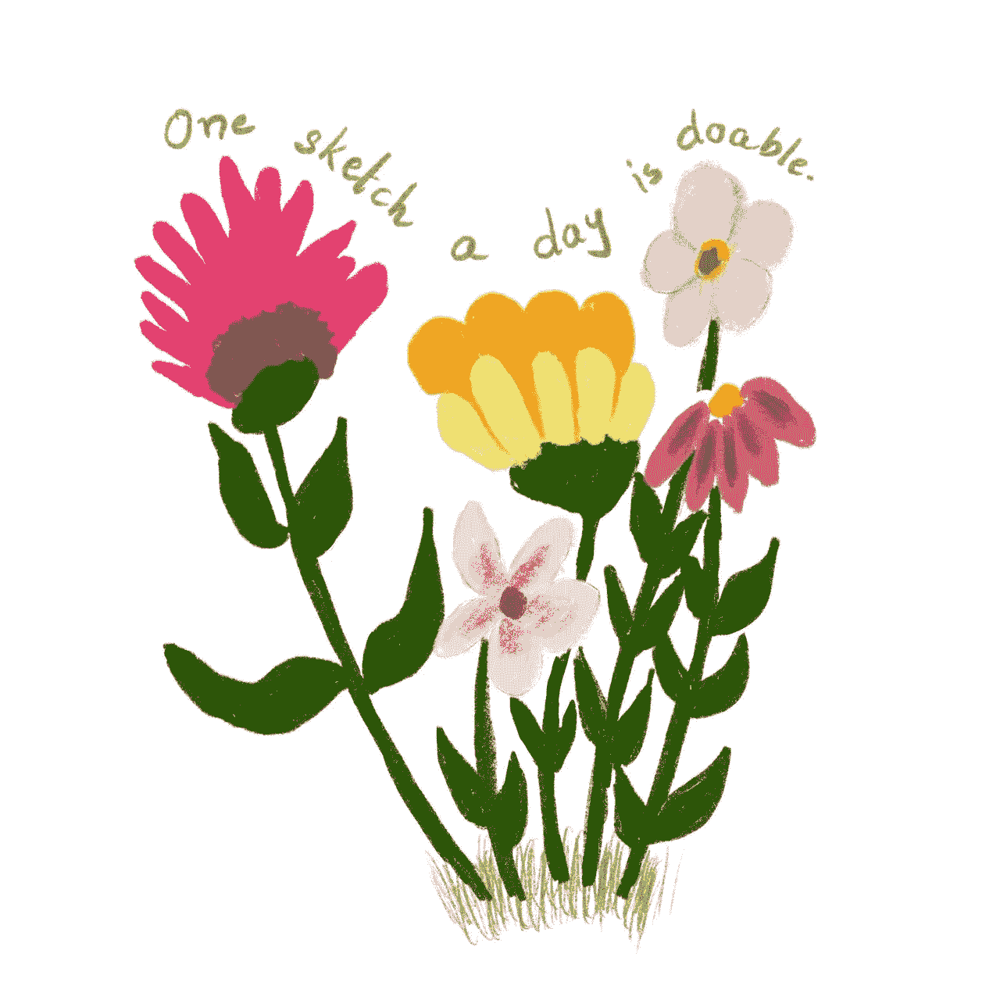

我的这篇文章发布得有点晚了，但我觉得把我所有的草图放在一个地方，然后向你展示通过少量学习可以取得的进步，是个好主意。

2019 年 7 月，我开始学习《达芬奇密码》，要求我们做两件事:1)每天花 15 分钟画画；2)每天把你的画发布到社交媒体上。

# 每天画画可以锻炼肌肉，每天发帖可以给你截止日期。

凡事都要在截止日期前做完。所以，每天结束的时候，我必须确保自己在 Instagram 上有什么东西可以发布。它也有副作用。我的同学开始在上面留下评论。这鼓励我做作业，并确保我不会错过一天。

我正在养成每天画画的习惯。

我从画圈开始，有一周的时间，我每天都画满一页圈。大圈、小圈、顺时针圈、逆时针圈、快圈、慢圈。

这是故意的。画不同的圈使用不同的肌肉，这有助于避免疲劳，并导致更好的控制。

此外，如果你学会了画圆，不是画完美的圆，而是画圆(有同心环的圆，你会一直画下去，直到画对为止)，你就能画出任何东西。

从圆圈开始，我们继续画动物——猪、河马、猫、狗、泰迪熊——它们都来自圆圈。

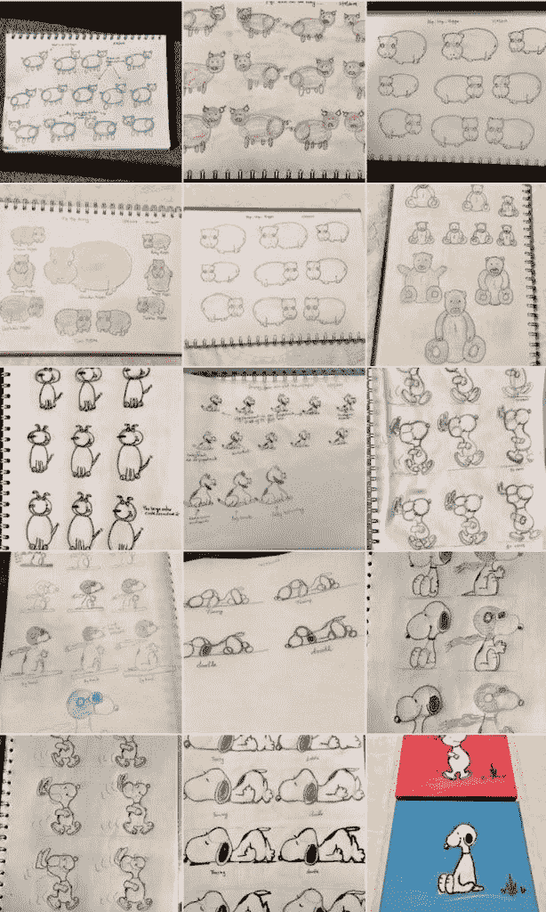

我们的下一步是学习如何绘制花生字符。史努比、查理·布朗、露西、萨莉和莱纳斯。

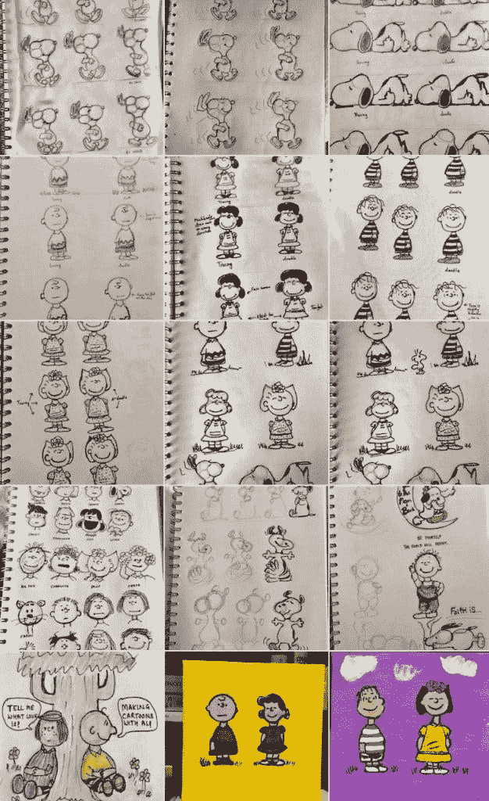

然后是《功夫熊猫》。他给了我很多麻烦。我花了很长时间才把他的表达正确。

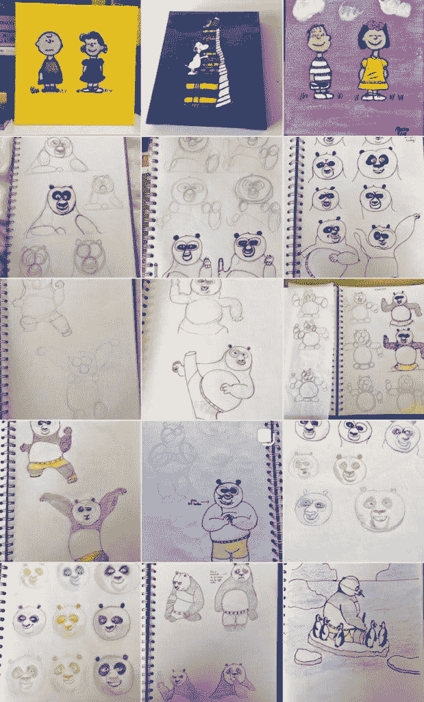

到年底，我们已经创造出了自己的特色。乔利出现的时候，她几乎已经完全成形了。我花了一点时间来学习画她的卷发，但除此之外，她在那里与她独特的个性。

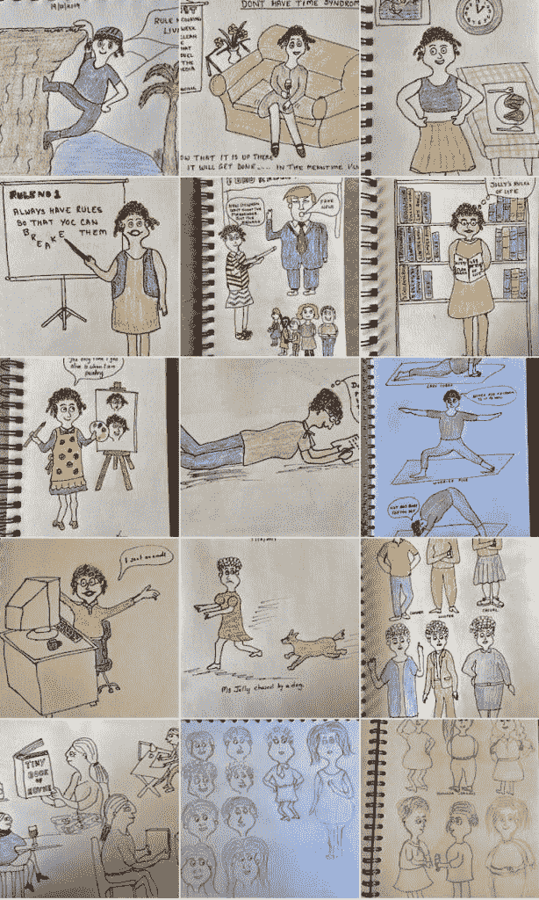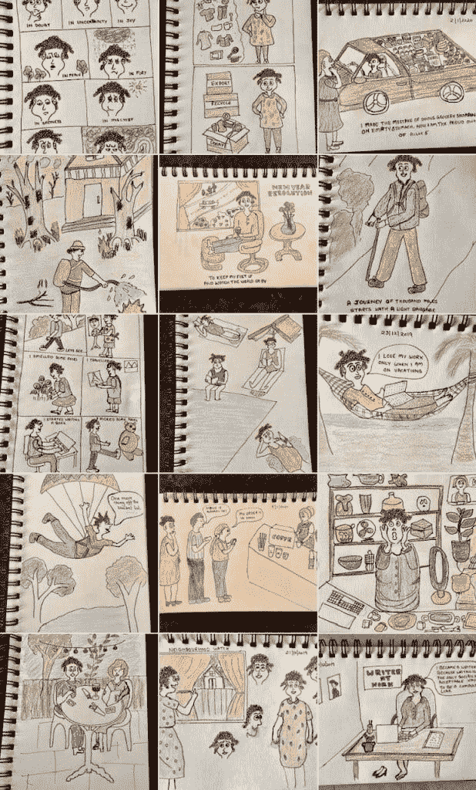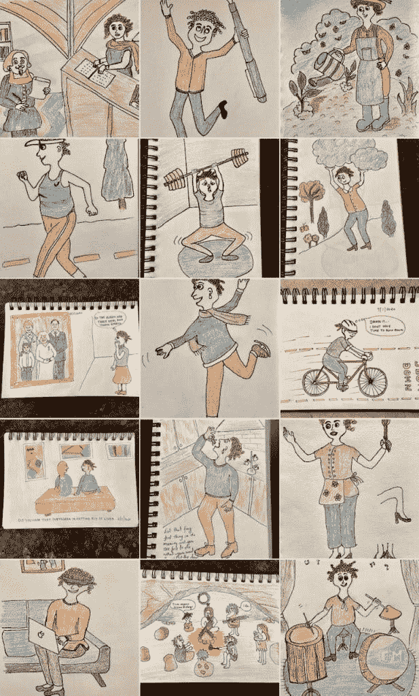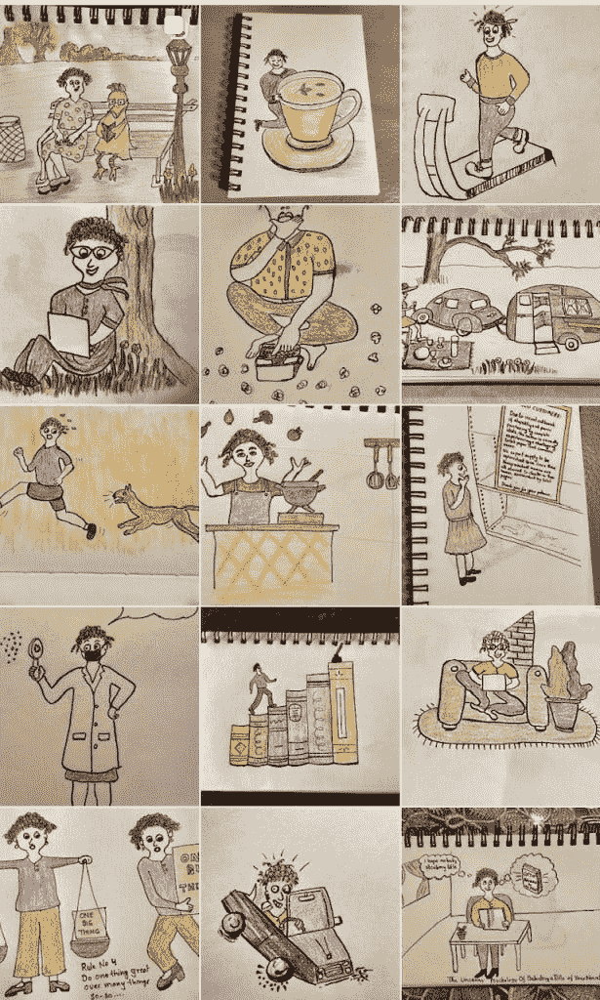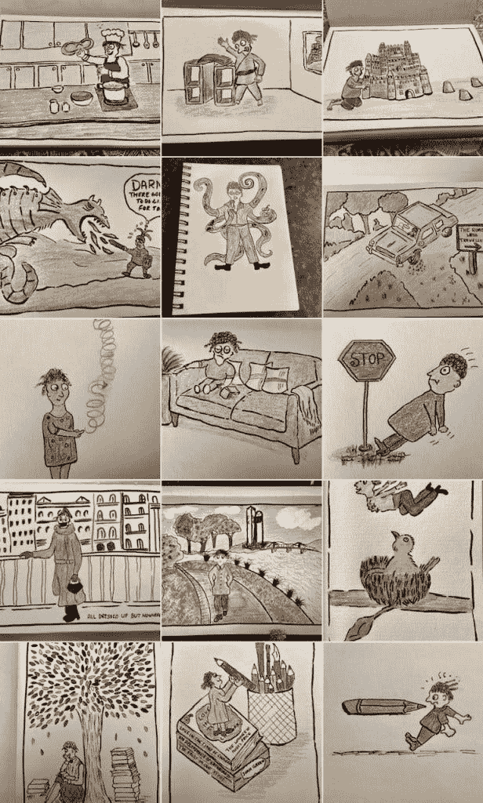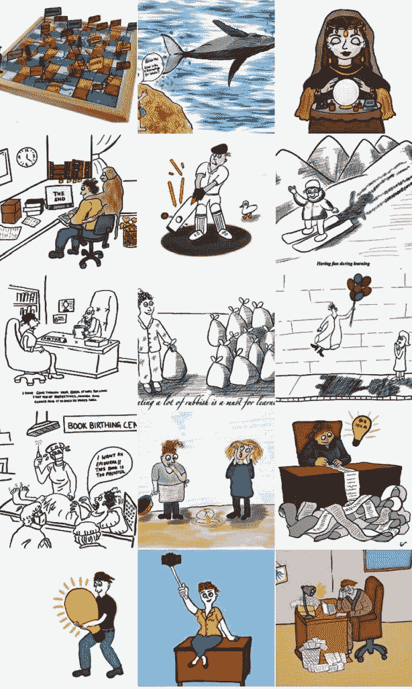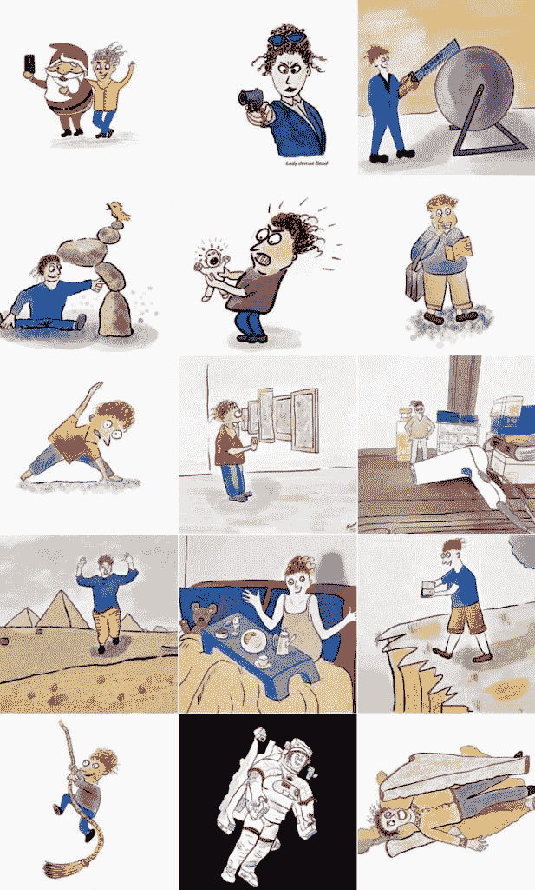

2020 年，我总共为乔利画了 250 幅素描，并把它们发布在了网上，还不包括练习素描。对于一个十二个月前不会画圆的人来说，这是个了不起的成就。为了我打算在 2021 年出版的漫画书，我已经预留了 20 幅草图。

但我最引以为豪的是我的《达·芬奇日记》，这些日记是我在课上亲手写下的。

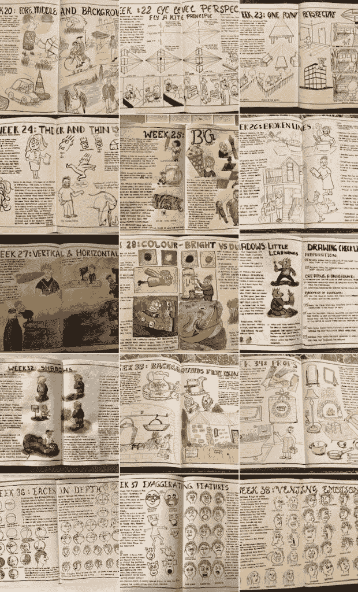

我唯一的遗憾是我在课程中途开始写日记。我打算今年完成早些时候的功课。这将是一个修正教训的好方法。

2020 年底，我开始画花卉。只需 12 天即可看到改善。

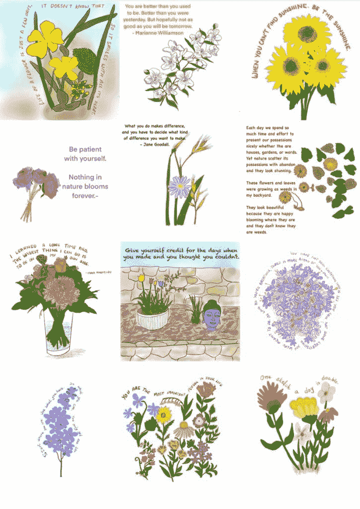

我们的绘画老师在课程的前面给我们做了一个类比——吃蛋糕有两种方法。你可以把它切成小块吃掉，也可以把它整个吞下去。我们大多数人都喜欢狼吞虎咽，无论是蛋糕还是学习。但和蛋糕一样，学习也需要从小处着手。

每天十五到三十分钟的画画证明了这一点。

— — — — — — — — — — — — — — — — — — — — — — — —

想把你的写作提升到另一个水平吗？订阅我的时事通讯《异想天开的作家》。

— — — — — — — — — — — — — — — — — — — — — — — —

**进入专家视角—** [**订阅 DDI 英特尔**](https://datadriveninvestor.com/ddi-intel)

这个故事最早出现在[www.neeramahajan.com。](http://www.neeramahajan.com./)

如果你喜欢它，你可能也会喜欢这个。

 [## 为什么小增量胜过批量学习？

### 以及为什么狼吞虎咽的学习不是一个好主意。

medium.com](https://medium.com/the-innovation/why-tiny-increments-beat-bulk-learning-30019ad0de19)  [## 总会有太多的事情要做

### 诀窍是弄清楚什么不该做。

medium.com](https://medium.com/illumination/there-will-always-be-too-much-to-do-75567f8bb8df)  [## 你是一个有趣的人吗？

### 如果没有，你愿意成为其中一员吗？

medium.com](https://medium.com/the-innovation/are-you-an-interesting-person-840e01643897)