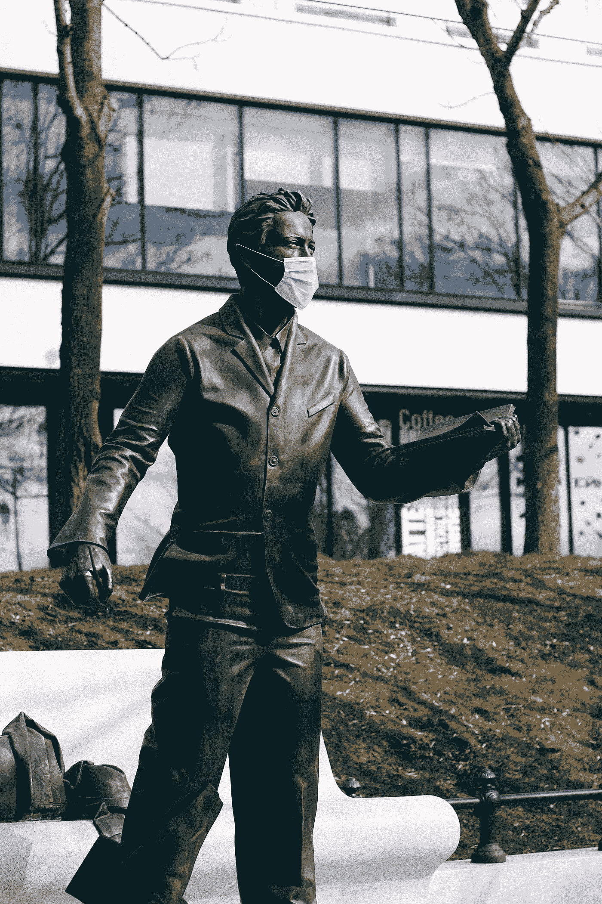

# 2020 年:得失

> 原文：<https://medium.datadriveninvestor.com/2020-losses-and-gains-4f3adae41bd5?source=collection_archive---------19----------------------->

## 不是所有人都输了，也不是所有人都赢了

Photo by [Pavel Anoshin](https://unsplash.com/@pavelanoshin?utm_source=medium&utm_medium=referral) on [Unsplash](https://unsplash.com?utm_source=medium&utm_medium=referral)

生活对每个人来说都不一样。它的变化对每个人都有不同的影响。

生活就像海洋。在那里每个人都根据自己的努力和命运而得到。

一次，海洋淹死了一个孩子，一位母亲诅咒它，因为她失去了孩子。但是同样是大海给了水手红宝石和珍珠，他们称之为慷慨。其他一些人以鱼和水的形式获得他们的食物，用于灌溉田地，并把海洋称为恩人。

你看，每个人对海洋都有不同的体验，对它有不同的看法。

一些人称它为杀手，而另一些人则崇敬它并称赞它的慷慨。

同样，每个人的生活也不尽相同。有些人过早结束生命，而另一些人则希望有 1000 年的寿命。

同样，2020 年也是生活的一部分。尽管今年是疫情飓风年，给商业带来了巨大的破坏，数百万人死于疫情。

这一可怕的经历对疫情产生了深远的影响，触及了生活的方方面面。

然而，我们仍然应该适应，活下来，活到 2020 年。

# 2020 年我们失去了什么？

几乎所有的到 2020 年已经失去了一些东西。无论是在金钱、工作、生活、自由、满足感、和谐、关系的温暖方面，还是最重要的——希望方面。

每个人都害怕得新冠肺炎热。因为那是致命的。从医学上讲，它可能没那么危险，但从心理上讲，人们已经输给了它。

每个人都很恐慌，每个人都成了焦虑和抑郁的患者。

不仅仅是被病毒侵袭，还有失业的沮丧。数百万人失去了工作。

许多公司破产了。他们无法忍受这种情况。

据《福布斯》报道，像 **24 小时健身公司、Advantage 租车公司、墨西哥航空公司、奥尔多集团、美国戒毒中心、Ascena 零售公司**等公司关闭了他们在世界各地和美国国内的许多公司和设施。

他们列举了几乎相同的原因——疫情导致的低产出和低收入。形势所迫，他们要么全部关闭，要么部分关闭。

生命的色彩消失得如此突然，我们的自由被剥夺了。封锁剥夺了我们行动的自由，让我们害怕行动。

公园、道路、旅馆、健身房，以及所有其他以娱乐或需求形式提供服务的地方和建筑都关门了。

交通堵塞，行动受到限制。人们不得不在没有亲人的情况下生活。有时长达数月。并且可能仍然分开居住，因为一些国家仍然处于困境中。

我们已经失去了我们的关系。人们和家人失散了。一切都是一团糟。

许多人已经对走出这个可怕的时代失去了希望。他们被逼到了疯狂和孤独的境地。他们失去了生命的温暖，在内心死去。

 [## 保护移动医疗应用的安全:在 COVID 时代，开发者如何保护用户数据的隐私

### 远程医疗和移动医疗空间可以采取简单、基本的步骤来更好地保护用户数据免受攻击。医疗保健…

www.datadriveninvestor.com](https://www.datadriveninvestor.com/2020/12/18/keeping-mhealth-apps-secure-what-developers-can-do-to-keep-user-data-private-in-the-age-of-covid-and-telemedicine/) 

# 2020 年我们收获了什么？

虽然创伤是深远的，但人类的心灵是有韧性和灵活性来承受这一切的。尽管我们经历了无数的损失，但我们做得很好。

但是这些损失并没有白费。他们给了我们智慧和勇气。这些损失给了我们对美好未来的希望和思考。

疫情教我们如何继续生活，即使看起来没有希望。尽管如此，隧道的另一边总有光明。

2020 年是我们人生中最黑暗的隧道。我们跌跌撞撞，跌倒又爬起来。我们一路走来，不知道接下来会发生什么。但我们确信如果发生了什么事，会永远发生。

我们已经学会了如何寻找其他方式，将传统的生活方式抛在身后。

学习转向线上。赚转网上。整个生活都在网上了。

根据对 [Upwork](https://www.upwork.com/i/freelance-forward) 的一项研究，在过去的 12 个月里，美国有 200 万人开始在网上工作。

如果我们与世界其他地方的统计数据进行比较，全球可能超过 700 万。人们不得不工作谋生。这个现代化的时代提供了许多在线工作和赚取丰厚收入的机会。

我也是 2020 年 3 月开始线上工作的。封锁迫使我寻找替代方式，我发现互联网提供了无数的工作机会。

我已经成功地在互联网上的各种网站上工作。尽管我是这个领域的新手，但我仍在学习和探索新的工作途径。

同样，许多企业和公司也利用了这一形势。在线业务进展顺利，赚了数十亿美元。

根据[的报道，亚马逊、阿里巴巴、洗手液公司、网飞等已经赚了数百万甚至数十亿美元。](https://www.forbes.com/sites/rohitarora/2020/06/30/which-companies-did-well-during-the-coronavirus-pandemic/?sh=300d50047409)

我们在绝望中获得了希望。令人沮丧的黑暗向我们展示了光明的道路和盛开的机会。

我们也知道家庭是最重要的。什么都比不上家庭。那些在艰难时期孤独生活的人知道没有家人意味着什么。

人们也和家人住在一起，因为他们不得不这样做。他们重新发展了关系，加深了相互了解。

我们也明白了工作固然重要，但花时间陪伴家人更重要。在疫情之前超越他人的快速竞争中，我们失去了与家人的联系。

该连接已恢复。

然而，对一些人来说，2020 年是一场真正的噩梦。他们一直与虐待他们的人关在一起，他们受到殴打和虐待。那真是太可怕了，令人毛骨悚然。

但是他们也学会了如何对付虐待他们的人。他们已经学会了如何开辟自己的道路，解决自己的问题。

# 最终外卖

2020 年是我们记忆中最黑暗的一年。我们不可能想到这样一个疫情。但它让世界措手不及。结果是完全封锁。

如何应对这种新常态，让人们感到震惊和敬畏。世界上的每个人都不开心，都想着逃跑。但除了承受冲击之外，什么也做不了。

我们中的一些人已经因为疫情、饥饿或虐待我们的人而失去了生命，而我们中的一些人却安然度过了这段艰难的时光。

尽管疫情关闭了机会之门，但它也打开了许多机会之门。它向我们展示了生命的价值和意义。

它向我们展示了如何更有弹性和勇气来应对任何类型的情况。

在我们共同面临的所有困难中，我们欠他们很多。

让我们带着新的活力、热情和对生活的激情进入 2021 年，让我们祈祷“**幸福、健康、繁荣”**的到来。

**访问专家视图—** [**订阅 DDI 英特尔**](https://datadriveninvestor.com/ddi-intel)