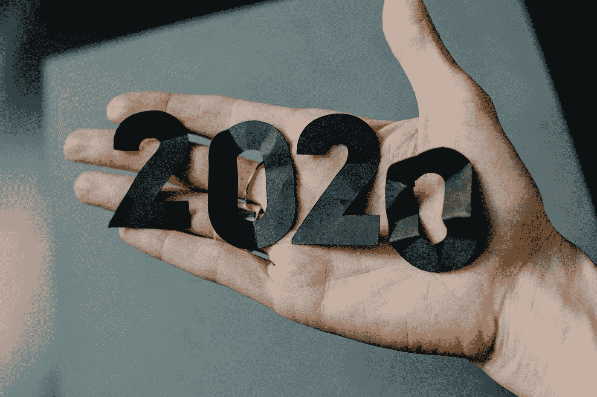
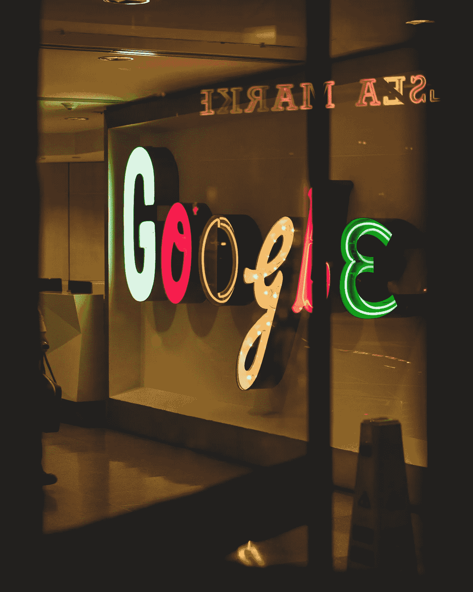

# 2020 年:迄今为止最神奇的一年！

> 原文：<https://medium.datadriveninvestor.com/2020-most-magical-year-yet-74ba3b82d174?source=collection_archive---------16----------------------->

## 2020 年是近十年来最复杂最难言的一年。它给许多行业带来了毁灭性的打击和灾难性的后果，但另一方面，它也为一些企业重获新生甚至蓬勃发展提供了肥沃的土壤

Photo by [Kelly Sikkema](https://unsplash.com/@kellysikkema?utm_source=unsplash&utm_medium=referral&utm_content=creditCopyText) on [Unsplash](https://unsplash.com/s/photos/2020?utm_source=unsplash&utm_medium=referral&utm_content=creditCopyText)

最神奇的一年！又到了一年一度回顾过去，预测未来的时候了。但是，在技术领域，预测未来似乎没有太大意义。

预测将不可避免地失败。截至 2020 年初，没有人能预测到疫情的出现。这种流行病正迫使人们以惊人的速度适应在家工作的文化，并迅速将人们的生活转向完全数字化。

但毫无疑问，技术就是一切，无论是现在还是未来。技术改变了一切。随着光纤的铺设，5G 的普及，更多的卫星群进入地球轨道，明年将迎来最大的变化:全球数百万人拥有数字权利，那些有幸拥有闪电般速度的人的数字世界更加丰富多彩。

接下来我们来回顾一下 2020 年的重大科技事件，初步看看 2021 年的科技趋势。

# **充满魔幻现实主义的 2020】**

作为一家视频会议公司 Zoom。这个词已经随着谷歌成为一个动词。随着在家办公成为新趋势，Zoom 成为最大赢家，市值飙升。该公司的创始人埃里克·袁的身价也从 40 亿美元增加到 180 亿美元。

**猜猜今年的年度流行语是什么？——“你没开麦克风！”**

然而，随着变焦的日益普及，暴露出越来越多的问题

该平台尤其存在安全问题，这引起了用户的关注和监管机构的注意。幸运的是，Zoom 迅速提高了平台安全性；除此之外，微软、思科、谷歌等等。也为用户带来更多的视频会议选择。

在国内，会议、DingTalk 等腾讯应用系统也在不断扩张。尽管如此，截至目前，Zoom 仍然是举行远程会议和在线课程的最受欢迎的平台。

11 月，[苹果](http://apple.com)，[微软](http://microsoft.com)，[亚马逊](http://amazon.com)，[字母表](http://alphabet.com)(谷歌母公司)，以及[脸书](http://facebook.com)。这五家科技巨头的总市值超过 12 万亿美元，因为投资者认为科技巨头比其他任何公司都更有能力在新的病毒危机中生存下来。

**2021 年**，这些科技巨头面临的主要风险是他们的调查，因为美国和欧洲的政治家和监管者希望抑制科技巨头的影响力。

**2020 年 10 月**，美国司法部和 11 个州的司法部长对谷歌发起诉讼，随后加州等 3 个州加入诉讼。这起诉讼是微软 20 多年前反垄断诉讼以来最重大的美国垄断诉讼，与 20 多年前的诉讼有相似之处；这也是今年针对谷歌发起的第一起反垄断诉讼。

Photo by [Arthur Osipyan](https://unsplash.com/@arty_nyc?utm_source=unsplash&utm_medium=referral&utm_content=creditCopyText) on [Unsplash](https://unsplash.com/s/photos/google-lawsuit?utm_source=unsplash&utm_medium=referral&utm_content=creditCopyText)

继司法部诉讼之后，38 名州检察长于 12 月联合起诉谷歌，以德克萨斯州为首的 10 名州检察长也于同月起诉谷歌。随后，以联邦贸易委员会和纽约州为首的各州也对脸书发起了反垄断诉讼。

除了谷歌和脸书，国会调查人员花了几个月的时间调查苹果和亚马逊这两家科技巨头。

> 未来可能会提起更多诉讼

**今年 7 月**，脸书、谷歌、亚马逊、苹果四大科技巨头的 CEO 同时亮相，参加国会举行的反垄断听证会。

这一次，四大科技巨头的反垄断听证会可能标志着美国对互联网科技巨头反垄断执法的开始。

在反垄断调查中，一大波科技公司无法承受加州的高税收环境，即将退出硅谷，包括甲骨文、HPE 甚至埃隆·马斯克都在计划搬到得克萨斯州。

 [## 硅谷面临逃离危机

### 加州是世界第五大经济体。但现在硅谷正面临前所未有的逃亡危机…

medium.com](https://medium.com/datadriveninvestor/silicon-valley-faces-an-escape-crisis-bb747e0d46af) 

**12 月 15 日**欧盟将公布一份新制定的“数字服务法案”草案，以加强对科技巨头的监管。这是继欧盟推出“通用数字保护条例”(GDPR)后的又一重磅法案。

> **当然，中国没有错过这波反垄断浪潮**

**11 月 10 日**，中国国家市场监督管理总局就《平台经济领域反垄断指引》公开征求意见。

**12 月 14 日**，市场监督管理总局发布公告，继《反垄断法》第四十八条、第四十九条之后，对阿里巴巴收购银泰百货、阅文集团收购新丽传媒、丰巢网络收购中邮速递易进行投资。

> 每起案件都被处以 50 万元的行政处罚

**12 月 24 日**，据中新网报道，中国市场监督管理总局根据举报，依法对阿里巴巴集团控股有限公司“二选一”等涉嫌垄断行为立案调查。

**12 月 29 日**《中国经济周刊》报道称，美团因支付宝频道被取消而遭到反垄断诉讼。

Photo by [Immo Wegmann](https://unsplash.com/@macroman?utm_source=unsplash&utm_medium=referral&utm_content=creditCopyText) on [Unsplash](https://unsplash.com/s/photos/2020?utm_source=unsplash&utm_medium=referral&utm_content=creditCopyText)

# **流媒体的成功与失败**

2020 年，几乎所有人都被孤立在家，只能躺在沙发上度过。借此机会，[网飞的全球用户有望在今年年底突破 2 亿。竞争对手](http://netflix.com)[迪士尼](http://disney.com)也预计到 2024 年，其 Plus 服务的规模将增加两倍，达到 2.5 亿用户。

如果网飞和迪士尼是今年流媒体大战的最大赢家，那么移动视频服务公司 Quibi 是最大的输家。[发展仅半年的 Quibi](https://quibi.com/) 于今年 10 月宣布永久关闭平台，并表示疫情期间旅行时间骤降是导致 Quibi 失败的主要因素。

连锁影院也输得很惨，包括兄弟、迪士尼在内的华纳制作公司都选择在网上发布自己的电影。今年，圣诞大片——华纳的《神奇女侠 1984》和迪士尼的《神奇女侠》之间的战场也从传统影院转移到了 HBO Max 和 Disney Plus。

**另一方面**，中国的各个视频平台也在今年使出浑身解数，想要爆发这场流媒体混战。首先，爱奇艺试图为各种电视节目和电影进行在线付费和点播，并在 11 月表示，他们将增加或计划增加会员费，以探索新的商业模式。

随后，12 月 14 日，阿里宣布投资 62 亿元入股芒果超媒。 [Bytedance](https://www.bytedance.com/) 也表示明年计划在西瓜等长视频上投资 50 亿到 60 亿。

平台 b 站也凭借《浪后》、《跨年晚会》等爆款作品出圈。但就目前来看，腾讯视频和爱奇艺短时间内仍将依靠会员和内容优势稳坐第一梯队；[优酷](http://youku.com)和芒果 TV 的联合发展可能会实现弯道超车。

以 b 站为代表的第二、第三梯队平台，会在现有的赛道上继续发光发热，以获得资本，并逐步提高预期。

# **电动车疯狂危险**

2020 年，电动汽车制造公司特斯拉打出了 2020 年最大的水花。12 月 21 日，特斯拉正式加入美国资本市场晴雨表——标准普尔 500 指数，并迎来了苹果要自己造车的消息。有报道称，苹果有意在 2024 年前发布电动汽车“iCar”，这似乎是在与特斯拉竞争。

 [## 苹果 iCar:规格和传言

### 路透社爆料称，苹果正在推进自动驾驶技术，计划在 2024 年生产一款乘用车…

medium.com](https://medium.com/datadriveninvestor/apple-icar-specs-and-rumors-299a41cfdedb)  [## 疫情期间临床试验的一线希望|数据驱动的投资者

### 没有书本而学医的人航行在未知的大海上，但是没有病人而学医的人不去…

www.datadriveninvestor.com](https://www.datadriveninvestor.com/2020/12/14/the-silver-lining-for-clinical-trials-during-the-pandemic/) 

除此之外，受疫情影响，各国央行纷纷放水后，想象空间更大、盈利格局变化更大的电动汽车成为资本追逐的热点。

特斯拉股价随即飙升，市值一度增至 6000 亿美元，几乎相当于八大传统汽车制造商市值的总和。

中国造车新势力蔚来汽车、理想汽车和肖鹏汽车的股价也翻了一番，年内分别上涨 1230.37%、254.96%和 319.14%。

然而，与疯狂的股价相比，造车新势力的销量却没有那么好的表现。虽然各种同比增速也快，但总销量还是很少。

即使是销量最多的特斯拉，今年预计也只能完成 50 万辆的销量。相比传统车企，一款车型的销量更差。

> 特斯拉首席执行官埃隆·马斯克发誓说，该公司将在 2021 年推出完全自动驾驶的汽车

然而，他可能会违背诺言。特斯拉确实在测试“自动驾驶”软件。但即使特斯拉在 2021 年发布其全自动驾驶软件。事故发生后，司机仍然承担法律责任和实际责任。

只要这个事实不变，特斯拉就不可能完全实现自动驾驶。

优步也在去年 12 月宣布，将放弃开发自动驾驶汽车的计划。但是亚马逊在 2020 年 6 月以 12 亿美元收购的 Zoox 刚刚推出了机器人出租车。Robo-taxi 没有方向盘，但可以充电一天一夜。

Photo by [Florian Olivo](https://unsplash.com/@florianolv?utm_source=unsplash&utm_medium=referral&utm_content=creditCopyText) on [Unsplash](https://unsplash.com/s/photos/gaming?utm_source=unsplash&utm_medium=referral&utm_content=creditCopyText)

# **2020 年最佳技术工具**

2020 年，游戏玩家收获颇丰，已经发布了 PlayStation 5 和 Xbox 系列 S 或 x 两款新一代游戏主机，Oculus 还将发布下一代 VR 头显 Quest 2。

任天堂 Switch 仍然是美国连续 24 个月销量最高的游戏机。根据 NPD 集团的数据，2020 年前 11 个月，美国的交换机销量达到 692 万台。

**三月**，现实世界因突如其来的疫情而陷入混乱。任天堂发布了一款新游戏——孤岛模拟游戏《集合！《动物穿越俱乐部》走进疲惫迷茫的人们心中。

任天堂表示，自 3 月 30 日发售以来，“组装！”《动物穿越之友》累计销售 2600 万台，也带动了游戏机 switch 的销量。

**智能手机方面**，苹果发布了 iPhone 12，微软发布了昂贵的双屏手机 Surface Duo，三星发布了可折叠屏手机 Galaxy Z Fold 2。

苹果公司使用配备该公司自主开发的 M1 芯片的 MacBook 为笔记本电脑的电池寿命和性能设定了新的标准。该公司还推出了 AirPods Max 耳挂式耳机。

最后，三星大胆创新传统电视，推出了可旋转的肆罗电视，试图在智能手机时代重新定义电视机。

# **科技 IPO 上行**

尽管今年充满不确定性，但 2020 年仍有 65 家科技公司上市，这不免让人想起当年的互联网泡沫。

云计算公司[雪花](https://www.snowflake.com/)，送餐 app [DoorDash](http://doordash.com) ， [Airbnb 的](http://airbnb.com)表现令人印象深刻，Airbnb 的成绩更是耀眼。

> Airbnb 的股价在 12 月交易的第一天就翻了一番

**同时**，虽然新疫情的加剧减缓了跨境商业活动。但中国企业对赴美 IPO 仍然充满热情。IPO 研究公司复兴资本(Renaissance Capital)的数据显示，截至 12 月 17 日，中资公司已在美国进行了 30 次 IPO，共筹集资金 117 亿美元。

其中，金融科技公司 Lufax 和在线房地产平台 Shell 位列今年美国十大 IPO。

今年在美国 IPO 的知名中国科技公司还包括中国即时零售分销平台达达、电动汽车初创公司肖鹏、ideal 以及在线教育平台来教育。

## **见证疫苗和人工智能突破的一年**

2020 年科学技术取得的最大技术成就是在很短的时间内开发、生产和销售安全的疫苗。

此外，技术成就和技术进步的关系越来越密切。英国人工智能公司 [DeepMind](http://Deepmind.com) 宣布可以预测蛋白质的结构。这一突破可以大大加快新药的开发。GPT-3 是一种新的语言生成模型，类似于人类智能，也在人工智能领域引起了轰动。

Image by [Gerd Altmann](https://pixabay.com/users/geralt-9301/?utm_source=link-attribution&utm_medium=referral&utm_campaign=image&utm_content=5799603) from [Pixabay](https://pixabay.com/?utm_source=link-attribution&utm_medium=referral&utm_campaign=image&utm_content=5799603)

# **2021 年既期待又不安**

据悉，英国卫星运营商 [OneWeb](https://www.oneweb.world/) 本月恢复卫星发射计划。该公司计划到 2022 年将 650 颗卫星送入地球轨道，以建立一个全球宽带网络。

[SpaceX](https://www.spacex.com/) 也在美国进行卫星网络服务测试，预计 2021 年实现全球覆盖。全光纤和 5G 覆盖范围正在迅速扩大。 [AST SpaceMobile](https://ast-science.com/spacemobile/) 正在与[沃达丰](http://vodafone.com)合作，承诺到 2023 年为赤道地区 16 亿人提供太空互联网连接服务。

这可能会改变发展中市场的商业、教育和商业模式。此外，诺基亚正在月球上部署 4G 网络。据新华社报道，中国的嫦娥五号月球探测器也于 11 月 24 日成功发射，并于 12 月 17 日成功返回。

## **作为平台的视频会议**

**2021 年**，远程视频会议的发展将不再局限于更多花哨的功能和表情符号。Zoom 已经将其视为一个平台。据报道，Zoom 正计划在该平台上整合日历和电子邮件服务。微软还在 Skype 中加入了“在一起模式”选项，打破了原有的网格视图，让每个人都能感觉到自己在同一个房间，同一个咖啡厅，等等。

## **流媒体将成为游戏的战场**

虽然视频服务一直是今年的重点，但游戏的流媒体之战可能会在 2021 年取得胜利。脸书游戏公司预计将推出一个更成熟的平台，与谷歌的 Stadia 和微软的 xCloud 竞争。还有消息称，苹果打算在 2021 年升级 Apple TV，更加专注于游戏领域，并配备新的遥控器和处理器。

## **未决半导体交易**

今年，英伟达拟收购 Arm 的 400 亿美元交易震惊了整个半导体行业，因为，收购之后，行业内关键芯片设计供应商的中立性可能会受到威胁。

目前，收购前景尚不明朗。美国可能会很快批准这笔交易，但英国、欧盟和中国可能会反对，Nvidia 的竞争对手也会大力游说，阻挠这笔交易。

## **即将上市**

2021 年，大型科技公司的 IPO 数量将会减少，但即将上市的公司仍然值得一看。首先是加密货币交易平台比特币基地已经秘密提交了招股说明书，将于 2021 年上市。

之后， [Roblox](http://roblox.com) ，电动滑板车服务 Lime，支付服务 Stripe，交易应用 [Robinhood](http://robinhood.com) 也将陆续上市。还有，据报道，中国短视频平台快手预计将于 2021 年 2 月 5 日上线。据彭博新闻报道，中国在线辅导平台教育的负责人正在考虑明年去美国上市。

## **最终:某些科技巨头将与欧盟达成和解**

据悉，美国四大科技巨头中，苹果和亚马逊在美国仍未面临新的反垄断诉讼。但在欧洲，亚马逊已经陷入诉讼。

2021 年，亚马逊或许能够与欧盟达成协议，并可能帮助该公司解决法国和德国的反垄断诉讼。亚马逊首席执行官杰夫·贝索斯在 2021 年的身价超过 2000 亿美元。

 [## 数据是新的石油

### 数据就像信息时代的石油，拥有大量数据的公司成为世界上最大的…

medium.com](https://medium.com/datadriveninvestor/data-is-the-new-oil-8baf652b9811) 

获得专家视图— [**订阅 DDI 英特尔**](https://datadriveninvestor.com/ddi-intel)