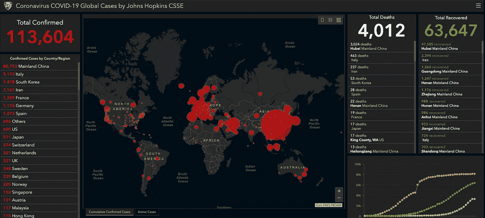

# 2020 年预测——冠状病毒、股票和比特币

> 原文：<https://medium.datadriveninvestor.com/2020-predictions-coronavirus-stocks-and-bitcoin-48fe365cd867?source=collection_archive---------2----------------------->

[Data from Johns Hopkins](https://www.arcgis.com/apps/opsdashboard/index.html#/bda7594740fd40299423467b48e9ecf6)

2020 年将会是疯狂的一年。澳大利亚着火了，一种新型致命病毒正在全球范围内迅速传播，而股票和其他资产正在贬值。

如果你不担心新冠肺炎，你可能还没有做足够的研究。我不是说你应该开始恐慌，但你确实应该了解你面对的是什么，并做好准备。

让病毒致命的有两个因素:死亡率和传播率。后者可表示为 R0(读作 R naught)，即每个感染者将感染该病毒或病原体的平均人数。

我们知道这种病毒传播非常迅速。新冠肺炎的 R0 估计在 3 左右。流感的 r0 = 1.3。

死亡率也相当高，据信在 1%到 4%之间(目前世卫组织估计为 3.4%)。流感死亡率= 0.1%。

使用病例和死亡的绝对数字，并将其与流感进行比较，并不能准确衡量这种病毒的致命程度，因为新冠肺炎的传播速度尚未达到峰值。

 [## 算法交易的机器学习|数据驱动的投资者

### 当你的一个朋友在脸书上传你的新海滩照，平台建议给你的脸加上标签，这是…

www.datadriveninvestor.com](https://www.datadriveninvestor.com/2019/01/30/machine-learning-for-stock-market-investing/) 

死亡率和 R0 的最初估计很少是精确的。随着检测试剂盒越来越普及，并且收集了足够的数据，这些数字变得更加准确，具有统计学意义。这意味着，在检测赶上传播之前，我们真的不知道这种病毒会有多糟糕。目前，轻度病例没有接受新冠肺炎病毒检测。这意味着 R0 可能高于目前的预测，而死亡率可能低于估计。美国在测试方面也远远落后于其他国家。很可能比我们想象的更多的人携带病毒。对许多人来说，症状几乎和流感或感冒一样。这些行走的病毒携带者没有被检测或隔离。

还有几个因素影响死亡率和 R0。例如，良好的医疗保健会降低死亡率。R0 也是人类接触的函数。大型集会可以加速这一过程。旅行限制可以减少它。减少传播的最好方法是经常用温肥皂水洗手，并避免触摸你的脸。我也建议放弃握手。

随着新冠肺炎病例开始增加，中国基本上封锁了整个国家。这似乎大大减缓了病毒的传播。自 2 月 14 日以来(如果我们相信这些数字的话)[中国的传播率已经下降](https://www.arcgis.com/apps/opsdashboard/index.html#/bda7594740fd40299423467b48e9ecf6)。与最初的指数增长率相比(我们现在在中国以外看到的)，中国传播率的下降可能是其严格检疫政策的结果。

美国人似乎不愿意对生活方式做出任何重大改变。旅行限制尚未设定。大型集会仍被允许。这些聚集无疑会增加病毒的传播速度。

也许资本主义在美国被高估了。没有人希望商业放缓，即使这对整个国家来说是最好的事情。大多数美国人都负债累累，没有任何存款，所以他们不会选择无薪休假。长期的低利率鼓励了个人和企业负债并尽量减少手头的现金。

所以病毒会传播，而且传播得很快。比我们的医院和医疗机构能处理的还要快。

人们会怀念工作。生产力会下降。供应链将被打乱。

白宫和国会可能会采取行动。[唐纳德·川普总统签署了一项 83 亿美元的紧急支出法案，以抗击新型冠状病毒的传播，并为这种高度传染性疾病开发疫苗](https://www.cnbc.com/2020/03/06/trump-signs-8point3-billion-emergency-coronavirus-spending-package.html)。[川普还提出了减税法案的想法。这些行动可能会有所帮助，但它们不太可能消除与全球疫情相关的所有负面社会和经济压力。](https://www.cnbc.com/2020/03/09/trump-says-hes-working-on-a-payroll-tax-cut-to-help-us-workers-amid-coronavirus-outbreak.html)

事实是，经济已经处于泡沫之中。冠状病毒是压垮骆驼的最后一根稻草。糟糕的财政政策给我们的国家造成了太大的债务负担。没有人有解决这个问题的计划。没有一个竞选总统的人承认这是个问题。债务是罗马人灭亡的原因。我们的国家债务超过 23 万亿美元，并且以历史上最快的速度增长。特朗普新提出的减税法案如果通过，很可能会增加不断增长的年度赤字。家庭和企业债务也处于创纪录水平。

**达米安的预测:**

美联储将会干预，就像它已经做的那样。到 2020 年 5 月，T2 联邦基金利率将降至零。这些举措可能会在短期内推高股市，但在现实中，货币政策无法修复一个被疾病和债务负担如此沉重的经济。

我预测标准普尔 500 到 5 月份会在 2200-2600 之间，到 12 月份会在 1800-2200 之间。

我预计 30 年期固定抵押贷款利率将在夏季降至 3%以下。如果人们因缺乏流动性(现金)而停止买房，房价可能会进一步下跌。抵押贷款利率反映了联邦基金利率和 10 年期债券，今天刚刚达到 0.318%的历史低点。目前，整个收益率曲线有史以来首次低于 1%。

甚至有可能部分收益率曲线会变成负值，就像日本、德国和欧洲大部分国家已经发生的那样。这意味着投资者实际上是在付钱给政府，让政府拿走他们的钱。有些人甚至会说，[这个世界已经疯了，这个系统已经崩溃了。](https://www.linkedin.com/pulse/world-has-gone-mad-system-broken-ray-dalio)

尽管黄金本应是一种避险资产，与股票等风险资产呈负相关，但最近却出现了相反的情况，表现出价格正相关的迹象。这主要是因为随着资产价格下跌，投资者迫切需要流动性，尤其是如果他们进行保证金交易的话。出售黄金等资产来提供流动性。

比特币最近的表现也很像黄金。许多人认为这是一种不相关的资产。然而，在最近的抛售中，它与其他资产一起下跌。可以理解。[比特币](https://medium.com/@damian.shchur/what-is-bitcoin-b914ebb292)和其他任何资产一样，是基于供求关系定价的。当流动性短缺时，所有资产的买家数量都会下降。

我认为对于比特币来说，这将是一个非常有趣的时期。主要原因是，在五月，著名的比特币减半将会发生。这时采矿块的奖励将减半，从 12.5 降到 6.25。前两次减半事件导致了巨大的价格上涨。从 2016 年减半开始的牛市持续了约 570 天，而价格从 600 美元涨到近 2 万美元，然后暴跌至 3400 美元。许多人认为，在 5 月份减半后，比特币将超过 55，000 美元。

问题仍然是，流动性紧缩会导致比特币进一步下跌，还是减半会推高价格？

当美联储降息时，它实际上是在向市场注入流动性。因为购买股票的潜在风险尚未消除，许多人将继续用新获得的流动性购买避险资产。我相信这些资产将是美国国债、黄金和 T2 比特币。

黄金和[比特币](https://medium.com/@damian.shchur/what-is-bitcoin-b914ebb292)都是对冲货币贬值的工具，货币贬值发生在中央银行印刷钞票和向市场注入流动性的时候。我的信念是，这些资产将在短期内下降，但会在年内恢复(因为美联储将印钞机开足马力)。我认为[比特币](https://medium.com/@damian.shchur/what-is-bitcoin-b914ebb292)将在 5 月开始复苏，并在 2020 年达到历史新高。然而，全球经济衰退可能会抑制和延缓比特币的增长。简而言之，它无法免受市场波动的影响。股市可能需要更长时间才能恢复，因为冠状病毒的经济余震可能会持续下去。

总统候选人之一感染冠状病毒的几率不为零。就在几天前，特朗普还在举行集会和握手。前三名总统候选人都超过 70 岁，因此如果感染病毒，风险很高。总统或总统候选人的去世可能会产生重大的政治和经济影响。

**我的推荐:**

**从经济角度来看:**

我建议减少风险资产，减少债务，储备现金。现在，我认为现金为王。从长期来看，现金是表现最差的资产类别，因为它在不断贬值。然而，在经济困难时期，那些有现金的人通常会得到千载难逢的机会，以极低的折扣率购买资产。

如果今年房价和抵押贷款利率下降，我认为这可能是购买租赁房产的最佳时机。那些手头现金充裕、信用良好的人可能会购买现金流为正的打折房产。

接下来的两个月可能会给比特币带来巨大的购买机会。由于几乎不可能确定底部的时间，最安全的做法是等待[比特币](https://medium.com/@damian.shchur/what-is-bitcoin-b914ebb292)的趋势反转。一个确定的趋势需要至少三天的价格上涨，最好是在高交易量的情况下。像[比特币基地](https://www.coinbase.com/join/shchur_h)这样的应用程序可以被设置成每当[比特币](https://medium.com/@damian.shchur/what-is-bitcoin-b914ebb292)有重大价格变动时自动向你发送通知。[点击这里了解更多关于比特币的信息](https://medium.com/@damian.shchur/what-is-bitcoin-b914ebb292)。

我个人不会卖掉我的[比特币](https://medium.com/@damian.shchur/what-is-bitcoin-b914ebb292)，但我会保留一些现金，以便在比特币回落至 4000 美元时买入更多。我已经看到[比特币](https://medium.com/@damian.shchur/what-is-bitcoin-b914ebb292)多次大幅贬值。这并没有困扰我，因为我真的相信它的长期价值。我愿意承担 50%的下跌风险，因为它有 1000%的上涨潜力。

**从健康角度:**

*   经常洗手，彻底擦洗至少 20 秒钟。
*   不要摸脸。
*   避免去旅游和人多的地方。
*   避免握手和触摸他人。
*   储备 14 天的物资，以防你需要自我隔离。
*   用氨水或漂白剂清洁经常接触的表面。这包括手机、钱包、钥匙、门把手、橱柜把手、电灯开关、方向盘等。
*   出门的时候带上洗手液。
*   这种病毒的目标人群是肺部有问题的人、免疫力低下的人和 60 岁以上的人。疾控中心建议这些人采取额外的预防措施。

关于我的安全建议，请阅读我最新的帖子。

我不想引起恐慌。我只是想帮助人们为最坏的情况做好准备，并帮助他们将风险降至最低。

如果你想要更多冠状病毒、经济和比特币相关的预测，我强烈推荐 [TwoBitIdiot](https://medium.com/u/dd6a8357807c?source=post_page-----48fe365cd867--------------------------------) (瑞安·塞尔基斯)的[这篇文章](https://medium.com/@twobitidiot/rip-moon-times-cae74db73203)。他是我在 twitter 上关注的许多真正聪明的人[之一](https://twitter.com/twobitidiot)，这些人给了我足够的信息来写这篇文章。

**免责声明:**我不是病毒学家或财务顾问。在做财务决定之前，请做好自己的研究。一如既往，永远不要投资你输不起的钱。

如果你喜欢这篇文章，请注册加入我的邮件列表。你每周只会收到一封电子邮件，内容是我最新的博客文章、播客和其他我正在做的事情。我在这里帮助你踏上自我提升的旅程。成为今天最好的自己！

[点击这里报名！](http://eepurl.com/hT4Nuf)

[**直接支持我成为中等会员**](https://damian-shchur.medium.com/membership) **。如果您使用** [**此链接**](https://damian-shchur.medium.com/membership) **注册，您的一部分付款将直接支付给我。**