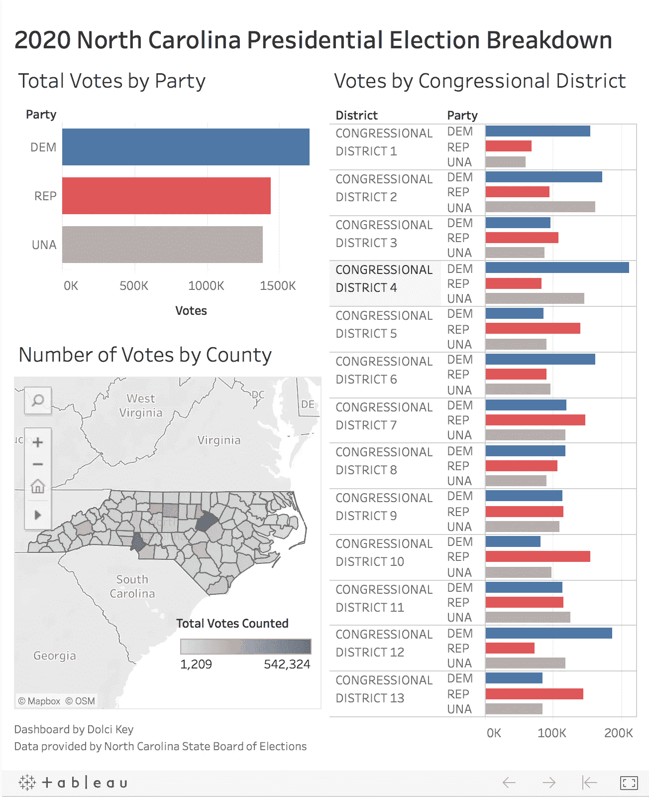

# 2020 年总统选举:看 Tableau 中的北卡罗来纳州选民数据

> 原文：<https://medium.datadriveninvestor.com/2020-presidential-election-looking-at-north-carolina-voter-data-in-tableau-bff98408aafb?source=collection_archive---------10----------------------->

为了准备明天美国的选举日，我花时间学习如何在 Tableau 中构建一个仪表板。在我之前的数据分析中只使用了 Seaborn/Matplotlib 库，我认为最好的学习方法是深入了解。

为什么是北卡罗来纳州？北卡罗莱纳州是一个摇摆州，除了总统选举外，在第 8、第 9 和第 11 个国会选区也有竞争激烈的众议院选举，在 2019 年国会选区重新划分后，曾经安全的众议院共和党人突然发现自己处于竞争激烈的竞争中。

此外，就公共选举数据而言，北卡罗来纳州是最透明的州之一，县和国会选区都有多个 CSV 文件(最难找到的数据，因为它们会随着经常包含分裂县的重划而发生变化)。

[**互动画面链接此处**](https://public.tableau.com/views/NorthCarolinaAbsenteeBallotCount/NorthCarolinaPresidentalElectionVotes?:language=en&:display_count=y&:origin=viz_share_link)

Click on the interactive Tableau link to further explore this data as medium does not currently support embedding Tableau, last updated 11/3/2020

[**互动画面链接此处**](https://public.tableau.com/views/NorthCarolinaAbsenteeBallotCount/NorthCarolinaPresidentalElectionVotes?:language=en&:display_count=y&:origin=viz_share_link)

使用北卡罗莱纳州选举委员会的数据，我使用 pandas 快速清理了近 2 GB 的文件，通过县名加入了一个美国形状文件以进行几何/位置映射，并开始讨论如何在工具提示中创建我想要设计的计算字段。(我将在本周晚些时候发布一篇关于如何做到这一点的演练！)

 [## 区块链投票和美国选举|数据驱动的投资者

### 在不到 70 天的时间里，这个世界上最古老的民主国家将以前所未有的方式面临最大的摊牌…

www.datadriveninvestor.com](https://www.datadriveninvestor.com/2020/08/26/blockchain-voting-and-the-american-elections/) 

在查看这些数据时，需要注意的是，这些数据仅仅是按**政党 ID** 分组的已计票数。重要的是不要假设所有的共和党人都会投共和党的票，或者所有的民主党人都会投民主党的票。

纽约时报/锡耶纳学院研究所的进一步民调显示，94%的民主党人可能会投票给拜登，而共和党人有 93%的可能会投票给特朗普。摇摆州的关键选民，51%的无党派/独立选民可能会投票给拜登，36%的人可能会投票给特朗普，7%的人在 2020 年 10 月 23 日至 27 日的民意调查中仍未决定。

目前，结果对乔·拜登和满怀希望的众议院民主党人来说很好，但当谈到谁会在选举日参加投票时，这仍然是任何人的游戏。

感谢阅读！选举日前夕快乐，现在去投票吧！

来源+链接:

[Tableau 仪表盘链接](https://public.tableau.com/views/NorthCarolinaAbsenteeBallotCount/NorthCarolinaPresidentalElectionVotes?:language=en&:display_count=y&:origin=viz_share_link)

[纽约时报/锡耶纳学院研究所](https://int.nyt.com/data/documenttools/nc102320-crosstabs/226c0cc3df5049e0/full.pdf)

北卡罗来纳州选举委员会

[使用的选民数据](https://dl.ncsbe.gov/?prefix=ENRS/2020_11_03/)

**更多关于生活和数据的随想，欢迎在** [**中**](http://www.medium.com/@dolcikey) **，**[**GitHub**](http://www.github.com/dolcikey)**，**[**Twitter**](http://www.twitter.com/dolcikey)**，以及**[**insta gram**](http://www.instagram.com/dolcikey)**上加我。**

## 访问专家视图— [订阅 DDI 英特尔](https://datadriveninvestor.com/ddi-intel)