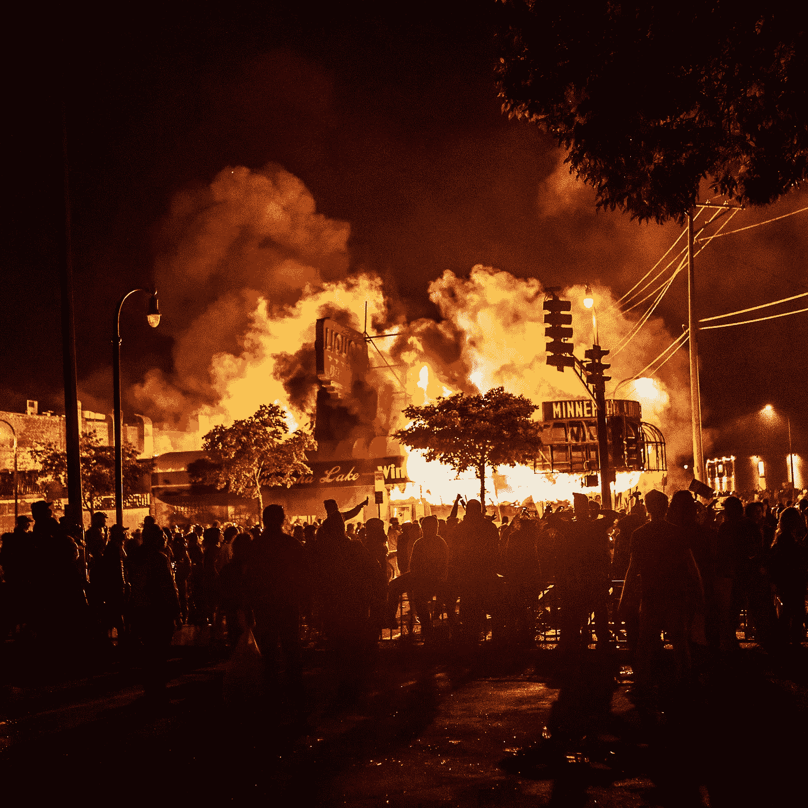

# 2020 年是经济剧变的一年

> 原文：<https://medium.datadriveninvestor.com/2020-the-year-of-economic-upheaval-ba6b18d767f0?source=collection_archive---------28----------------------->

又一个伟大的一年过去了；然后，2020 年悄然而至。没人会想到接下来几个月会出现混乱。美国和世界政治、社会和经济动荡的一年。

**Covid 19**T2 的开始和社会剧变

一月初，除了中国新闻压制的报道外，一种导致肺炎的疾病的未经证实的报道开始浮出水面。许多中国公民开始使用社交媒体作为提醒世界疫情开始的手段。结果却遭到审查、监禁和逮捕。与此同时，美国的社会动荡始于“我无法呼吸”。

乔治·弗洛伊德的被杀点燃了导火索，点燃了推动黑人的命也是命运动的火焰，因为多年来城市少数民族遭受了极大的不公正。你在新闻里看到了，又有一个人因不合理的警察暴力而无谓地死去。在混乱中，一个看不见的敌人悄悄靠近，而和平的抗议者夹在几个害群之马和警察之间。

与此同时，美国经济和世界经济由于一种新出现的病毒和世界各国的政治操纵而陷入困境。

A police station and nearby businesses were set ablaze on Thursday, the third night of protests in Minneapolis.Credit…Kerem Yucel/Agence France-Presse — Getty Images

**石油战争**

就像控制燃烧意味着减少火势的进一步蔓延。2020 年是到处爆发大火的一年。几个月前，俄罗斯和石油输出国组织的主要成员国沙特之间爆发了一场石油价格战，美国因其页岩油而成为无意中的目标。欧佩克+注意到了这一点，并开始控制石油市场，这一安排将于 2020 年 3 月失败，导致沙特阿拉伯在 8 日提供折扣，旨在向俄国施压。这对包括美国在内的世界各地的产油国都产生了连锁效应。沙特阿拉伯进一步加强了他们的战略，将产量提高了 25%，导致价格暴跌，引发供应冲击。

**新冠肺炎新疫情**

与此同时，一种新的病毒开始出现。这一次报告的不是导致肺炎的病毒，而是一种地方性新型冠状病毒，也称为新冠肺炎。它起源于武汉省，那里有集市。这种病毒开始在全球蔓延，影响了美国和世界的经济。暴风雨来临前的平静过去了，留下的是混乱，因为经济开始陷入困境，县一级的封锁，失业和企业破产，此外，金融指数在 3 月底前下跌了 30%。

数百万人开始申请失业，发现并不是每个人都得到他们的福利。人们停止旅行，因为他们害怕感染病毒。石油和天然气消费到处下降，导致需求冲击。随着信用降级席卷金融市场，油价一度跌入负值，美国页岩生产商不得不限制产量。

由于油价暴跌，所有依赖石油的国家都开始挣扎，包括美国。石油战争及其意想不到的后果是由幕后一股看不见的力量支撑的。这给我们留下了什么？随着破碎的能源市场，遭受重创的经济和痛苦的人民。

没有正常，我们永远无法回到过去。一个新的开始将会出现；公司将收缩和重组。随着罗宾汉交易员(robin hood traders)和华尔街赌博公司(wall st bet bros)的出现，散户投资者开始从洞穴中脱颖而出，成为一股新的自然力量，领先于传统的华尔街投资者和对冲基金经理。

这给我们留下了看不见的力量；新冠肺炎，肆虐经济的病毒。随着封锁的开始，希望感染率会减少。虽然没有真正的科学证明封锁有助于降低感染率，但它确实有助于进一步搞垮经济。世界各国开始立法支持经济发展。

中国等国家试图出售其持有的美国国债，作为反击特朗普政府之间贸易争端的措施；与此同时，让目前与美元挂钩的人民币贬值，以抑制他们的收益，这表明人民币将进一步升值。从本质上讲，这些国家在改善经济状况的同时试图抑制通货膨胀。

从石油战争、疫情、伤痕累累的经济和政治动荡；在如何处理国家政策和国际政策的问题上，美国已经变得两极分化严重。在特朗普政府执政期间，出现了一场贸易争端，希望在这个国家面临更多政治和社会动荡的同时，美国能够从中受益。

**新政府**

目前，美国急需团结起来修复经济。新政府来了。大笔一挥，许多行政命令被签署了；即将实施的政策将影响经济和散户投资者的日常生活。

如果在检查了许多行政命令之后有一件事是肯定的，那就是拜登总统决心用他的政策带回奥巴马时代；包括在现任政府中使用奥巴马的前工作人员。

需要警惕的一个关键点是，在拜登政府的领导下，美国已经重新加入了世卫组织。该组织此前曾表示，没有证据表明新冠肺炎病毒在人与人之间传播。世卫组织的负责人消息不灵通，没有事实信息，因为当时没有世卫组织或疾病预防控制中心的官员核实武汉地区的任何信息。世卫组织表面上接受了中国人告诉他们的，接受了错误的信息。因此，一场地方性的流行病变成了影响全球的世界性疫情。

**梯形管道**

拜登政府的另一个关键细节是取消 keystone XL 输油管道。一条连接加拿大和美国的管道将为两国带来就业机会，但由于其产生的环境问题，该管道遇到了挫折。这条管道原本可以将沥青砂输送到这里，提炼成燃料，进一步稳定由于俄国和欧佩克+之间的价格争端而遭受重创的能源部门，此外，由于疫情，航班被取消。尽管管道会对周围的社区产生负面的环境影响，但它会提供就业机会；这是我们当前的经济迫切需要的。

**乔布斯会东山再起吗？**

随着许多最近的毕业生拿着学生贷款来支付这些学位，许多工作已经失去了，更多的工作即将到来。这些贷款都由美国财政部担保。假设事情以一种正常的方式恢复，如果在大流行后的世界里工作不能恢复，会发生什么，我说正常是因为已经没有正常了。事情已经发生了变化，不管是好是坏，我们需要作为一个国家继续前进；我们需要前进。学生和研究生已经延期还款，但是随着失业，这些研究生有能力偿还贷款吗？另一个连带效应是，贷款人将把目光投向财政部，这将给不断增加的预算赤字带来更大的负担。成本从借款人到贷款人/贷款人服务，到财政部再到纳税人。

考虑到所有这些，让我们回到经济上来，特朗普政府和新拜登政府通过了所有刺激措施，经济得以维持，如果只是勉强维持的话。似乎没有人注意到不断增加的赤字支出和不断增加的债务。到目前为止，混乱的结果是赤字已经增加了大约 3 万亿，而且还会有更多。拜登政府刚刚增加了 1.9 万亿美元。总之，5 万亿美元的赤字开支已经过去了。今后几年肯定还会有更多。这些都没有在主流媒体上说，至少没有达到外行人能理解的程度。

**赤字支出增加，债务增加**

赤字支出的数额是前所未闻的，通常这种支出需要数年时间。由于疫情和破碎的能源市场，这次只花了 2 年时间。这个泡沫似乎越来越大，而经济一直停滞不前；就业增长和就业创造不断遭到破坏。这就是拜登总统禁止联邦租赁钻井的原因，等待对气候影响的评估。这项禁令虽然对气候有利，但对经济却很糟糕，因为到 2022 年，它将损失约 100 万个工作岗位。令人欣慰的是，这一禁令仅适用于新租约，而不适用于当前或以前的租约。核实一些信息是困难的，因为石油协会还没有公布多少工作将受到影响的估计。

回到新经济，就业增长放缓，经济疲软，病毒肆虐。除了恐惧之外，什么也没有，伴随着错误信息和虚假信息的结合。人们太害怕出去买食品杂货和在外面吃饭。像电影院和俱乐部这样的热门区域被关闭了。消费主义已经停止了，慢慢地扼杀了整个经济。据说，美国经济的支柱是小企业，这个支柱刚刚被打破，它只是一个看不见的小病毒。

一个真实的大卫和歌利亚的故事

这是新经济，一切都被迫进入数字时代。大多数支出都是在网上完成的，流媒体服务的增长呈爆炸式增长，一种新型投资者已经出现。散户投资者增加了，并开始通过与积极参与市场的对冲基金经理打架来改变市场趋势。与此同时，美联储保持货币压力，希望泡沫继续漂浮。
但是如果没有大量的消费支出，那么就没有真正的增长，只有名义增长。GDP 与债务的比率已经超过了可接受的水平。我们只需要看看其他国家的例子，看看他们的经济发生了什么。

资金流动速度正在下降，这意味着投资者的投资组合将开始转移，以对冲大流行后经济中的押注。但一切都还没有结束，我们只需要回顾历史，看看事情是如何扭转的。通过联盟和创业，就业增长的新刺激可以回归，随着更多人接种疫苗，企业可以在人口稠密的城市地区开始试营业，使经济从 3 月的低点回升。