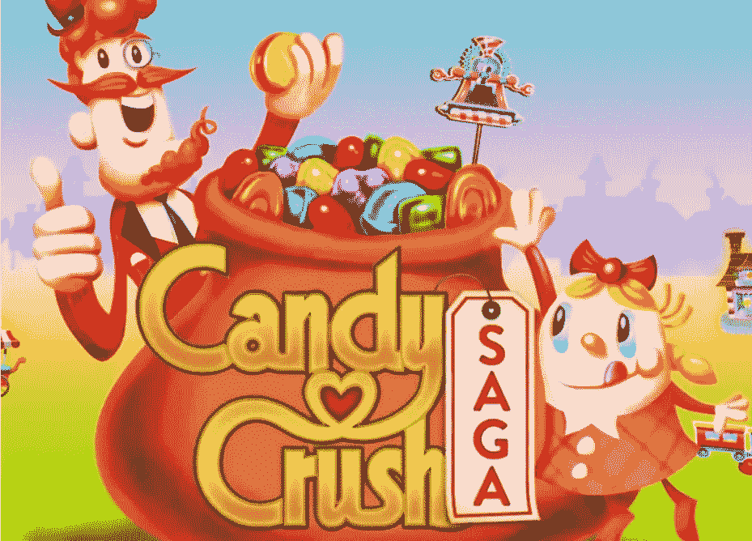

# 2020 年:股票市场变成糖果粉碎的一年

> 原文：<https://medium.datadriveninvestor.com/2020-the-year-the-market-became-candy-crush-7bd8919df92b?source=collection_archive---------17----------------------->

Image Courtesy: Panda Security

随着 2020 年即将结束，由于新冠肺炎，今年将被载入史册。2020 年也将因许多地缘政治、文化和社会重组而被铭记。这个疫情还将加速许多已经出现的技术趋势。作为一名金融、市场和技术爱好者，最大的趋势之一是涌入罗宾汉(也被称为“罗宾汉兄弟”)的千禧一代和 Z 世代交易员的崛起，以及他们如何将“stonk”市场变成 Candy Crush。

罗宾汉无疑是最具革命性的科技独角兽之一。Robinhood 也是自 PayPal 以来最改变游戏规则的金融科技公司。罗宾汉开放了投资，并使市场“民主化”。任何有几千美元的人都可以开一个 Robinhood 账户开始交易。购买股票的“零头”让投资和交易变得更加上瘾(这意味着罗宾汉可以购买苹果、谷歌和特斯拉等昂贵股票的零头)。加上没有交易佣金，你有很多早期投资者准备玩市场。1200 美元的刺激支票只是进一步普及了交易应用。[就连 Robinhood 的联合创始人兼首席执行官 Vladimir Tenev 也承认，许多年轻投资者将他们的刺激资金投入了 Robinhood。](https://www.msn.com/en-us/money/smallbusiness/robinhood-co-ceo-on-users-depositing-stimulus-checks-into-the-app-and-market-accessibility/vi-BB1ar5cm)持续不断的提醒和应用程序的设计使该平台让年轻的交易者上瘾，并诱使许多年轻人在股市中寻找乐趣，从而将交易变成了一种游戏。

罗宾汉的生意越做越大。Robinhood 的用户群已经从 2014 年的 50 万增长到了 1300 万。该公司的收入从 2015 年的 290 万美元增长到了 1.8 亿美元。[伴随着这种增长，独角兽公司的估值也大幅提升。](https://techcrunch.com/2020/08/17/robinhood-raises-200m-more-at-11-2b-valuation-as-its-revenue-scales/)截至 8 月，Robinhood 已经筹集了价值 112 亿美元的 G 轮投资。这轮融资由对冲基金 D1 合伙公司牵头。D1 合伙人由投资传奇人物、前老虎基金 Viking Global Investors 首席信息官丹尼尔·桑德海姆(Daniel Sundheim)管理。

罗宾汉已经变得如此强大，以至于它能够雇佣著名的华盛顿说客。 Robinhood 还聘请了前 SEC 主席杰伊·克莱顿(Jay Clayton)的幕僚长卢卡斯·莫斯科维茨(Lucas Moskowitz)担任该公司负责监管、诉讼和政府事务的副总法律顾问。

还有，谁能忘记罗宾的追踪！？！Robin Track 是由 23 岁的计算机程序员 Casey Primozic 创建的。Robin Track 收集了关于有多少人持有某些罗宾汉股票的公开数据，并在一个名为 Robin Track 的网站上创建了互动数据。Robin Track 每天都会对 100 只持有最多的股票进行排名。你可以搜索任何股票，找出有多少人购买了该股票。许多年轻人使用 Robin Track 和 finance 社交媒体来分析某些股票的受欢迎程度并进行交易。罗宾轨道也给了许多交易者在华尔街跑在鲨鱼前面的机会。这一点从未像柯达宣布与联邦政府合作生产有助于减轻疫情的药物材料时那样明显。柯达在 2012 年申请了第 11 章破产，当时的股价约为 2 美元，在宣布这一消息后，其股价上涨至 33 美元。我毫不怀疑许多人通过“柯达交易”大赚了一笔(对许多交易者来说，这绝对是一个伟大的柯达时刻)。这一事件标志着罗宾赛道的结束。Robinhood 使股票所有权信息不为公众所知，从而使 Casey 无法从经纪公司获取数据。Robinhood 肯定受到了来自其高频交易伙伴和华尔街大佬的压力，要求其不要公开股权数据。显然，几个罗宾汉式的交易员引发了华尔街的大佬们。罗宾汉交易员和早期比特币投资者是少数能够跑在华尔街前面的人。这些家伙应该为自己感到骄傲！

就连传奇价值投资者比尔阿克曼也看到了这些科技独角兽的力量。[比尔·阿克曼正在为特殊目的收购公司筹集资金。](https://medium.com/the-capital/big-spac-news-f2f743f7024)有传言说他的特殊目的收购公司会让 Robinhood 或者 Stripe 上市。

 [## 收盘，但没有雪茄-股票市场目标在停滞的 COVID 救济中创新高|数据驱动…

### 专家聊天程序:一个协作市场，在这里人们可以和能够解决他们问题的专家聊天。是……

www.datadriveninvestor.com](https://www.datadriveninvestor.com/2020/08/18/close-but-no-cigar-stock-market-targets-record-highs-amidst-stalled-covid-relief/) 

但是罗宾汉也有自己的问题。罗宾汉有几次停电。其中一次停电发生在 3 月份市场崩盘时，导致许多人无法低价买入。此外，许多缺乏经验的交易者喜欢冒大风险，并利用他们的交易账户亏损。许多交易者甚至没有合适的“帮助热线”或客服代表给公司打电话。情况如此糟糕，以至于交易员们不远万里来到该公司位于门洛帕克的总部寻求答案。情况太糟糕了，公司已经安装了防弹玻璃。 [一名交易员不知不觉地损失了太多钱，导致他自杀。](https://www.cnn.com/2020/06/19/business/robinhood-suicide-alex-kearns/index.html)一些罗宾汉交易员看到他们的钱凭空消失了。其他不透明的商业活动包括[经营他们的交易员](https://seekingalpha.com/article/4205379-robinhood-is-making-millions-selling-out-millennial-customers-to-high-frequency-traders)和[向高频交易员出售客户信息。许多交易者厌倦了 Robinhood，他们正离开这个平台，加入一个名为 WeBull 的新交易平台。WeBull 还被 YouTube 上的许多投资渠道推广。WeBull 由阿里巴巴校友王安全创建，总部位于中国。WeBull 也有免佣金交易。WeBull 还发布了一个名为 WeBull Crypto 的加密交易平台。颇具讽刺意味的是，前罗宾汉们正成群结队地离开这家总部位于硅谷的移动经纪公司，加入其中国竞争对手。](https://www.zerohedge.com/news/2018-09-15/robinhood-investing-app-makes-millions-selling-users-data-high-frequencstealing)

毫无疑问，罗宾汉今年很受欢迎。Stonks、SPACs、EV 和 Robinhood bros 明确定义(或打破)了市场。但是我的罗宾汉前景暗淡。Robinhood 是一款非常基础的投资 app。WeBull 有更多的功能，还可以卖空，这是你在 Robinhood 上做不到的。凭借 WeBull 的先进技术，该平台可以处理更多的压力，并且与 Robinhood 相比不太可能关闭。作为一个投资于比尔·阿克曼的《特殊目的收购公司》(PSTH)的人，我个人更喜欢比尔·阿克曼让 Stripe 上市，而不是罗宾汉。

罗宾汉需要有竞争力。它可以从改进技术开始，以减少停机，并创造更多的交易功能，如卖空。Robinhood 还需要提高其商业活动的透明度，并为其客户提供帮助热线。无论如何，Robinhood 都将作为自 PayPal 以来最具影响力和改变游戏规则的金融科技产品而载入史册。

[我一直在听很多播客](https://medium.com/datadriveninvestor/how-podcasts-are-helping-me-get-through-the-pandemic-2d0bfc2563e9)，[我强烈推荐德米特里·科菲纳斯主持的《隐藏的力量》这一集，他采访了托尼·格里尔，讨论零售兄弟的崛起](https://hiddenforces.io/podcasts/tony-greer-stonks-retail-bros-powell-money-printer/)

随着一年即将结束，我毫不怀疑你们中的许多人都有新年决心。下定决心追随纸上谈兵的银行家。如果你是投资者、科技爱好者、地缘政治迷、终身学习者，或者只是想逃离日常工作，这是你的地方。另外，请在你最喜欢的社交媒体平台上分享这篇文章。

祝大家新年快乐，愿 2021 年带给大家最好的自己！

一如既往地保重，保持安全，并取得成功！！

获得专家视图— [**订阅 DDI 英特尔**](https://datadriveninvestor.com/ddi-intel)