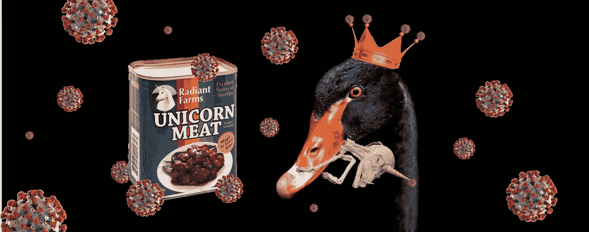
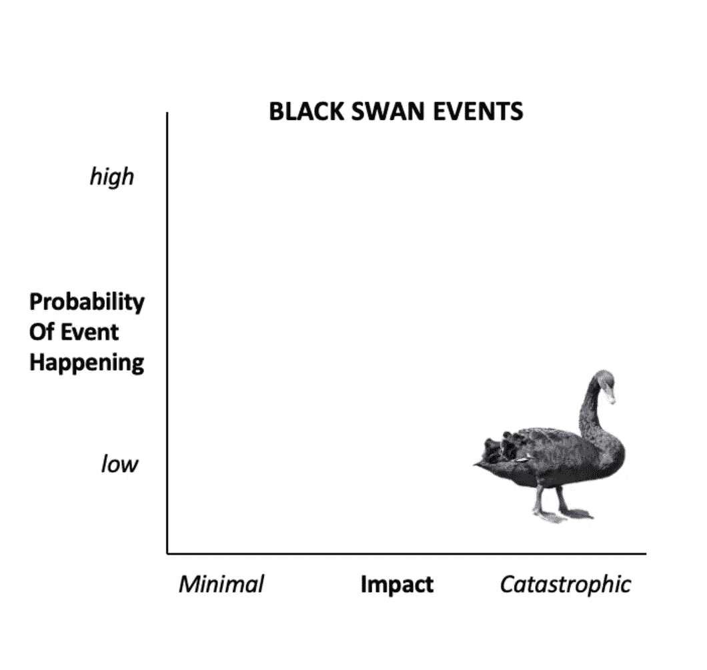
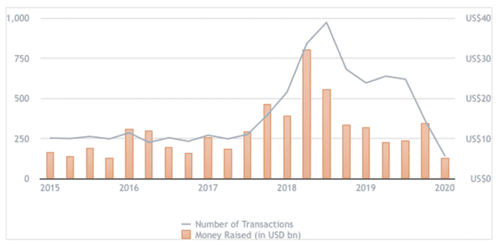
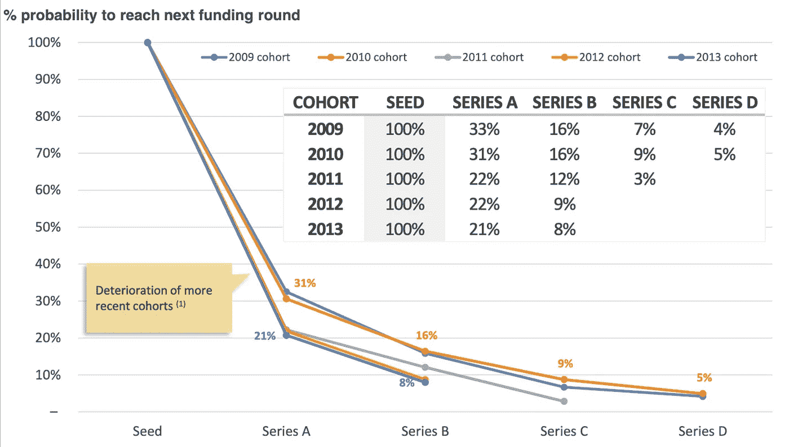
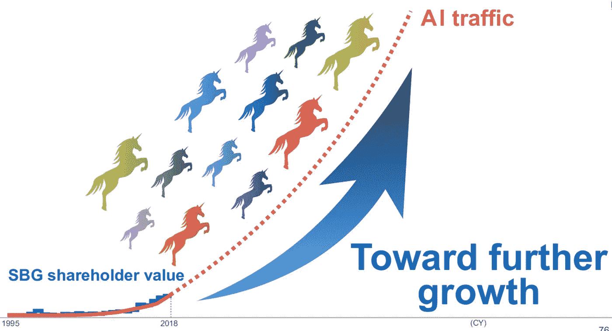
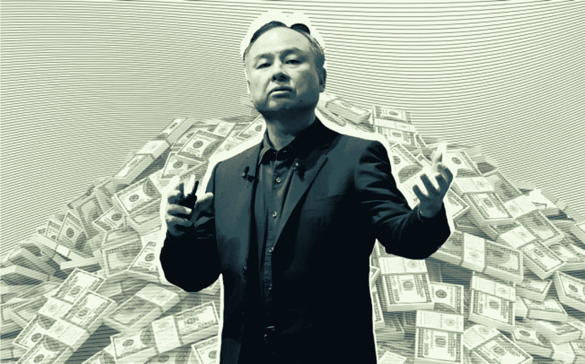
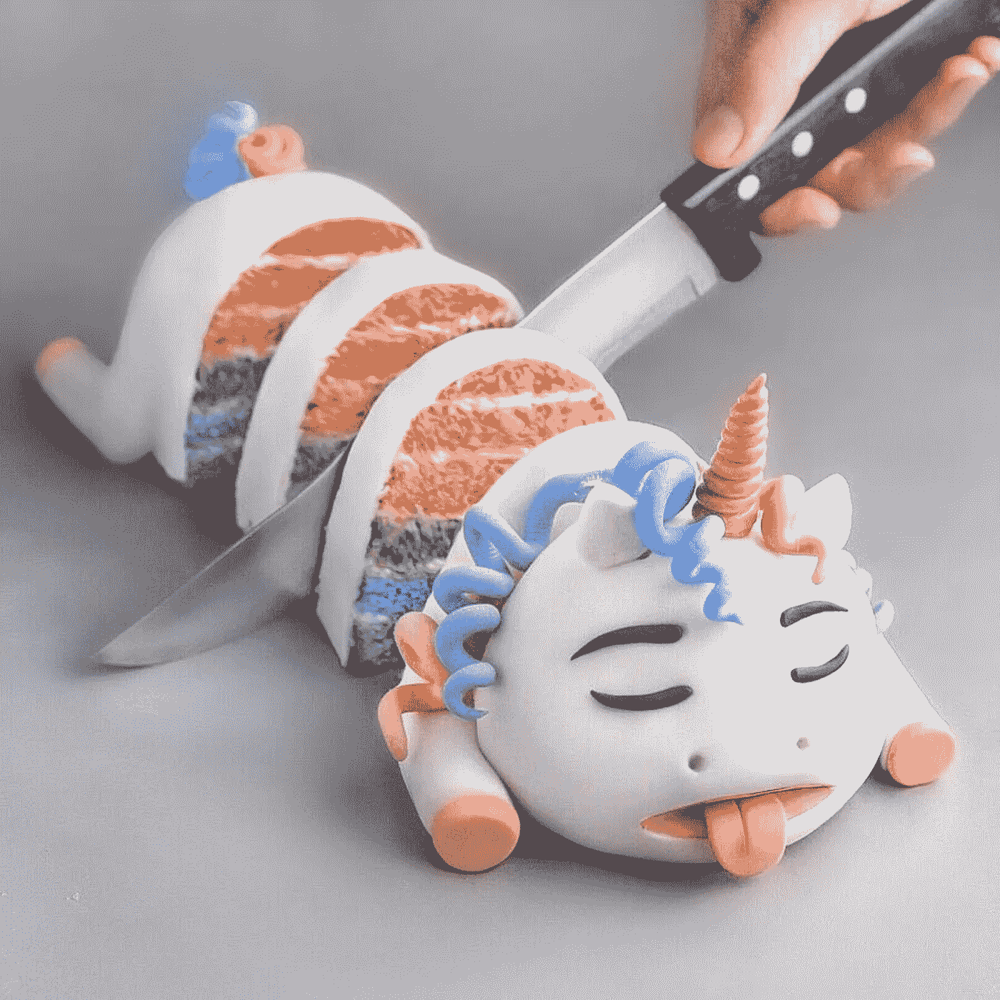
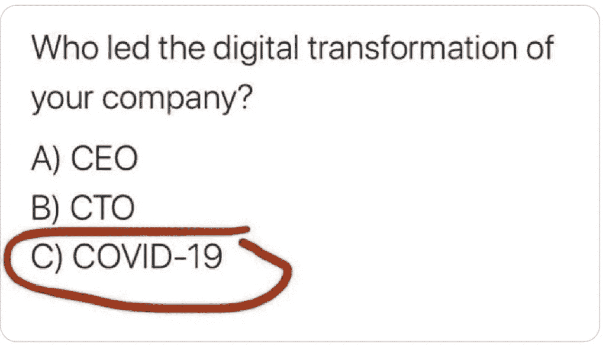

# 2020 年:是单一企业年，还是黑天鹅年？

> 原文：<https://medium.datadriveninvestor.com/2020-year-of-the-unicorpse-or-a-black-swan-with-a-silver-lining-fc4192c18bcc?source=collection_archive---------23----------------------->

Unicorn Meat- Coming soon, to a wet market near you!

**“质疑关于你的业务的每一个假设”**这是硅谷领先风险投资公司红杉资本(Sequoia Capital)在 3 月份的备忘录中向首席执行官和创始人传达的信息，[“冠状病毒:2020 年的黑天鹅”](https://medium.com/sequoia-capital/coronavirus-the-black-swan-of-2020-7c72bdeb9753)。

参考达尔文的“适者生存”理论，红杉资本断言，公司的生存将归结为“对不断变化的环境做出快速而果断的调整。”

快进几个月，世界处于封锁状态，或者像新加坡更喜欢称之为“断路器”状态。但是，不仅仅是电路被破坏了。从价值数十亿美元的企业到白手起家的初创公司，企业都在努力摆脱新冠肺炎这座经济冰山的持续影响。

旅游和酒店行业是最明显的早期输家；由于全球旅行限制，收入一夜之间蒸发。但是，同样对拯救生命至关重要的措施也不能不加剧经济暗流，这种暗流可能会更加不加选择地拖垮企业。

> 在“拉平”感染曲线的过程中，我们正在使衰退曲线变陡。

风险投资交易数量已经明显反映了对初创企业的影响。

# 风险投资就像:“我们以后再谈”

早期创业者正面临资金短缺。虽然许多风投给人的外在印象是一切照旧，尽管是通过放大或挂出。[对 Q1 在中国的风险投资交易](https://theconversation.com/chinese-start-ups-are-being-starved-of-venture-capital-with-worrying-omens-for-the-west-137104)的分析显示，与 Q1 2019 年相比，Q1 2020 年在所有融资阶段下降了 60%，种子阶段同比下降了 86%。

China seed-stage funding 2015–2020

> **“客观来看，这是 2007-09 年全球金融危机期间下降幅度的三倍。一些人估计，如果像这样的下降在全球范围内发生，大约 280 亿美元的启动资金可能会损失。”**
> 
> [(对话)](https://theconversation.com/chinese-start-ups-are-being-starved-of-venture-capital-with-worrying-omens-for-the-west-137104)

尽管风险投资关注技术和更好的做事方式，但它仍然主要基于面对面的交易。在中国和 Q1 的大部分地区，旅游限制禁止这样做。但同样真实的是，一个以预测和塑造商业未来为使命的行业，也同样被疫情打了个措手不及。

赶到现场的风险投资对投资组合中的公司进行了分类，并从“后疫情时代，这对 X 行业意味着什么”的投资角度重新评估交易。

与此同时，创业公司正在大出血，这导致…

# 估值:创业折扣财源！

投资者仍在开支票，尤其是对后期阶段的投资，因为他们试图确保其持续的商业可行性——但我很快就会谈到这一点。

冠状病毒正在放缓投资的步伐，早期创业公司正在用更少的资金凑合，自举，进入冬眠模式，休假或解雇员工，节省现金，仍然可能面临灭绝。

我们不要忘记，在相当有利的条件下，他们的胜算已经非常大了。

来自 Dealroom 的分析显示，在最好的情况下，只有 20-30%的种子基金公司继续进行首轮融资。此后，每个阶段的后续融资率约为 50%

供求法则表明，随着投资者减少兑现支票的频率，并透过全球衰退的视角来评估公司，投资条款和估值将不可避免地变得对投资者更加友好。多少钱？

时间会证明一切，但是，企业家第一公司的首席执行官马特·克利福德最近在接受[礼宾](https://www.protocol.com/matt-clifford-entrepreneur-first-interview)采访时分享了他的最佳猜测:

> “大多数种子基金打算将投资速度降低 50%左右，这样一来，2020 年的投资数量将是平时的一半。正因为如此，供求关系意味着资本估值将会下降。我预计估值将下降 30%至 40%，即使是种子公司，至少是在价值链的上游。

如果种子创业公司预计与 2019 年的估值相比会有 30%至 40%的折价，这对我们中间蓬勃发展的后期知名独角兽创业公司意味着什么？

# 看哪！一群飞驴…

一群引人注目的初创公司创始人可能很快就会后悔他们的独角兽地位。

This is a genuine SoftBank Investor Slide!

到去年年底，资本注入带来的兴奋已经开始消退。从软银愿景基金支持的优步 4 月份估值暴跌开始。追逐 1000 亿美元的股票上市首日估值，专家认为其实际价值约为[600 亿美元](https://www.cnbc.com/2019/04/15/valuation-expert-says-uber-is-worth-a-little-more-than-half-the-100b-its-seeking.html)。

然后是软银-WeWork IPO 肥皂剧。这家合作巨头的估值为 470 亿美元，但在上市前，其实际估值接近 140 亿美元，比其私人市场估值低 70%。然后软银[取消了 WeWork 的 IPO](https://www.cnbc.com/2019/09/30/wework-says-it-will-file-request-to-withdraw-its-ipo-prospectus-after-roadshow-management-turmoil.html) ，随后的离婚让 WeWork [起诉他们的投资者](https://www.ft.com/content/2bf3ee2c-8c83-4932-a9fd-e99a729ddaca)退出了一项 30 亿美元的融资交易。看起来像是无穷无尽的资源和雄心的梦幻组合，实际上是太多、太快了。

 [## 夏普比率悖论:为什么还要投资风险资本？数据驱动的投资者

### 夏普比率是一种基于风险量化回报的方法，具体来说，它是超过…

www.datadriveninvestor.com](https://www.datadriveninvestor.com/2020/03/29/the-sharpe-ratio-paradox-why-still-invest-in-venture-capital/) 

软银是世界上最大的技术投资者，拥有 1000 亿美元的基金，其方法似乎包括向独角兽公司投入大量现金，其首要口号是“不惜一切代价实现增长”。

Masayoshi Son — mo money, mo problems?

完全披露我还没有投资过一家估值 10 亿美元的公司，所以如果你愿意，你可以给我贴上嫉妒的标签，但我讨厌“独角兽”这个词以及它所代表的一切。

企业家们像傻瓜一样到处散播这个词，用他们的鱼钩引诱投资者——“下一个独角兽”是我 Linkedin 收件箱中经常出现的一个词。但是，你能责备他们吗，当它是所有的工业媒体似乎继续谈论的时候？

但问题是——这恰恰是错误的关注点:

**a)在流动性事件或退出之前，估值没有多大价值。科技公司的首次公开募股远远少于十亿美元的初创公司估值。**

**b)更高的估值经常被包装在条件中** -流动性偏好、反稀释和更严格的治理，这对创始团队的最终财务结果不利。稀释程度更低、更适中的估值可能是成功的更好标志。

今天，比历史上任何时候，拥有 10 亿美元的估值与一个企业的健康发展都没有什么关联。

> 独角兽可以是纯种马——利润丰厚，举世无双，也可以是近亲繁殖——现金饥渴，体重超标，孕育着投资者，最终还是跛脚。

斯坦福大学从 2020 年 1 月开始对美国公司的一项研究发现，独角兽的平均定价比其公允价值高出 48%。研究发现，135 家美国独角兽企业都存在价值膨胀，幅度从 5%到 188%不等。不是进入经济危机的最佳健康证明。

# 清算

A Unicorpse with Liquidators at work?

周四(4 月 30 日)，软银宣布 WeWork 的[额外亏损 66 亿美元。就在两周前，该公司公布其科技基金**亏损**167 亿美元。](https://www.telegraph.co.uk/technology/2020/04/30/softbank-books-66bn-loss-against-wework/)

这些数字几乎让人无法理解。这些不是行业损失，只是一个风险投资组合，尽管是一个巨大的异常值。

Rosenblatt Securities 对投资者的一项前冠状病毒(10 ' 19)[调查称，他们预计全球 58 家金融科技独角兽在经济衰退的情况下受影响最大，平均估值缩水约 15%。以当时 5100 亿美元的市值来看，这意味着长期低迷可能会抹去 760 亿美元的独角兽市值。](https://www.rblt.com/fintech-insights/implications-of-covid-19-and-the-market-disruption-on-private-fintech)

冠状病毒危机已经导致亚洲最大的投资者在二级市场上出售独角兽公司的股份，如 Gojek(印度尼西亚最有价值的初创公司，提供各种服务，如出租车、送餐和银行)和滴滴出行(中国最大的私营运输服务)。二级投资市场预计将在亚洲蓬勃发展，因为许多投资者在严重低迷时期缺乏投资经验。Gojek 在 3 月份筹集了超过 10 亿美元，同时[解雇了大约 100 名员工](https://agfundernews.com/one-of-southeast-asias-biggest-food-delivery-apps-raises-1-2bn-lays-off-workers-reports.html)，这是一家在疫情封锁期间具有相对强大价值主张的公司。

# 我们将何去何从？

在过去的十年里，来自主权财富基金、共同基金和对冲基金的巨额资金直接或通过风险投资涌入那些已经是独角兽的初创公司，或者投资者认为很快就会成为独角兽的公司。但是音乐停止了。

“You had me at Unicorn.”

一些风险资本家和投资银行家开始投资科技，就好像他们在玩一场高风险的夺旗游戏。对生态系统来说，一段时间的紧缩(希望是修正)是一个漫长的过程。

科技投资者赢者通吃的做法，加上过度的融资和烧钱速度，改变了风投行业吗？毫无疑问。该行业是否忽视了节约和盈利能力对于顶线增长虚荣心指标的价值？不可否认。风险投资优先考虑独角兽的潜力，而不是可持续性和实用主义？毫无疑问。

> 一些独角兽将死去，另一些将被剪掉 10 亿美元的估值，但不会像它们被授予时那样声势浩大。在大多数情况下，在会议室的门后，它将保持沉默。爱面子。

疫情对正常商业和社会的破坏给了我们一个独特的回顾和反省的机会。暂停一下，评估一下我们对行业的发展轨迹是否满意。在 VenturesOne，我们不是。我们投资于新兴技术企业，这是我们所知道的唯一可持续的方式:作为一个耐心的投资者加入进来，并建立长期合作关系。

Survey says…

这只黑天鹅中的一线希望是，自互联网繁荣以来，新冠肺炎正在推动前所未有的数字化进程。在推动医疗保健、教育和其他领域亟需的服务转型的过程中，我们将看到在复苏过程中提供更健康、更有弹性、最终更好的服务。

虽然眼前的前景很糟糕，但国际货币基金组织建议 T2“全球经济预计将在 2020 年大幅收缩-3%，比 2008-09 年金融危机期间严重得多”。他们还预测，随着经济活动的正常化，它的反弹速度将远快于 GFC——2021 年的增长率为 5.8%。

This crisis will make some exceptional Captains.

创始人可以感到欣慰的是，优步、Slack、Square、WhatsApp 和 Instagram 都是在上一次经济衰退中诞生的。将会有更多的创新公司从这个疫情诞生，而且会因此而更加强大。