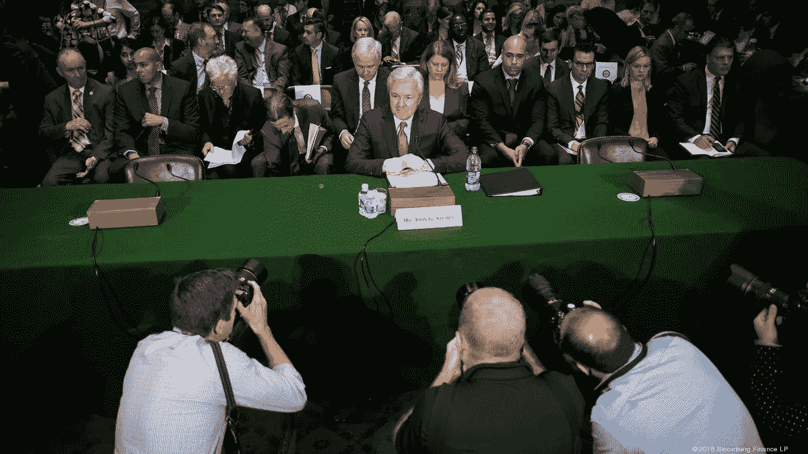
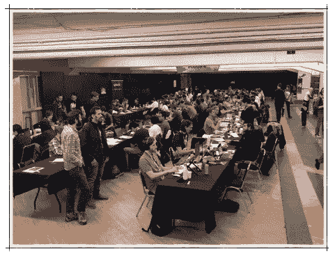
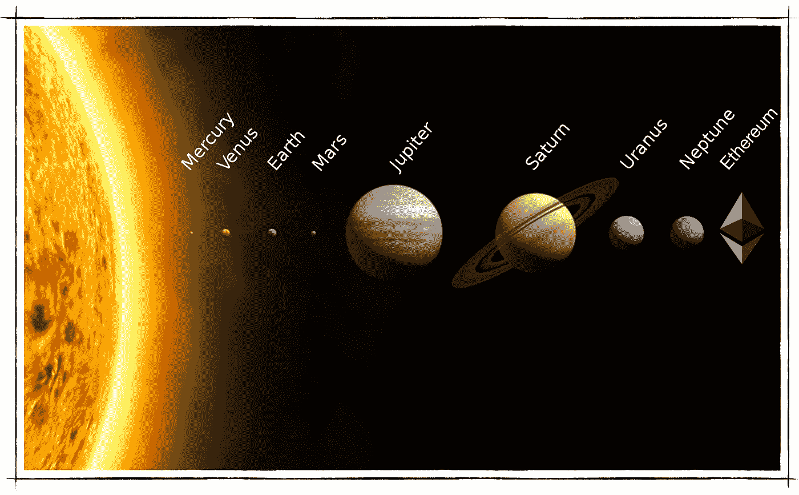
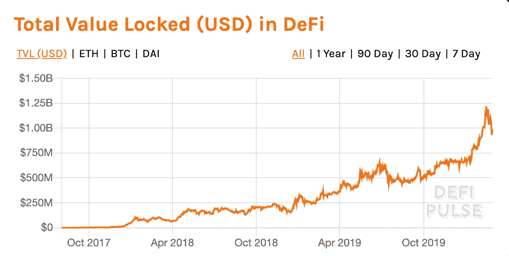

# 2020 年代:以太坊的崛起

> 原文：<https://medium.datadriveninvestor.com/2020s-the-rise-of-ethereum-a01a19f806d8?source=collection_archive---------1----------------------->

TL DR 互联网对数据做了什么，以太坊将对金融做什么。因此，乙醚将是这十年中风险调整后的最佳投资。

以太坊是第一个**免许可的全球经济**。对于那些刚接触生态系统的人来说，以太坊就是经济。以太(ETH)是货币。本质上是一个无国界的“数字国家”，代码就是治理，世界上的每个人都是“公民”。世界上任何地方的任何人都可以编写代码来提供自动化的、基于逻辑的服务，如数字银行账户、金融交易所、借贷平台等，并将其部署在以太坊上。

以太坊上的代码是可审计的，并且将始终作为编码；世界上任何一个有互联网连接的人都可以访问服务，而无需请求第三方的许可。以太坊的创建对全球金融有着巨大的影响。目前的法定货币，如美元和欧元，由于其基于许可的性质，存在系统性问题。通过提高全球贸易和结算的信任度和效率，以太坊将成为世界上最好的经济体。

 [## 数字货币、区块链和货币的未来|数据驱动的投资者

### “区块链”、“加密货币”、“令牌化”，以及现在的“央行数字货币”已经成为…

www.datadriveninvestor.com](https://www.datadriveninvestor.com/2020/02/18/digital-currencies-blockchain-and-the-future-of-money/) 

许多投资者关注加密市场，仍然记得 ICO 热潮，当时骗局盛行，除了纯粹的投机之外，没有基本面的项目存在高昂的估值。几年后，很明显，在下一个周期，以太很可能由于**基本面而不是投机**而增长。最后，我们将探讨乙醚价格背后的机制，以及为什么未来十年有可能出现预期的飙升。

# 全球“基于许可”的经济

经济是建立在信任基础上的一系列交易。全球经济是国家内部和国家之间所有交易的总和。在每个国家(如美国)，交易集合相加形成国内生产总值(GDP)。**没有双方的信任，交易将会减少，经济机器将会停止运转。**

政府发行法定货币以促进贸易，并拥有复杂的法律体系来执行规则和仲裁两方或多方之间的分歧。政府的主要职责是通过保持低失业率、设定最低工资和确保货币稳定来管理公民的福利，以便公民可以用他们的收入购买他们生活所需的商品和服务(国外或国内)。

为了实现这些目标，政府利用复杂的技术基础设施和人力资本体系来支持其法定货币。如今，政府部署的系统通常支持在线交易、信用卡支付和实物现金，对那些实施金融欺诈或试图伪造实物货币的人来说，这可能会带来监禁和暴力威胁。

政府不仅管理这些货币背后的技术，还管理其发行；他们可以也确实想印多少钱就印多少。然而，他们需要小心不要印太多的钱，否则会导致通货膨胀或对全球金融市场失去信任；导致商品和服务价格快速上涨。那些在保持低通胀方面做得很好的国家，在保持高质量工作的低失业率的同时，经济繁荣。

政府通过基于许可的系统管理其金融基础设施。政府给银行许可，银行再给科技公司(Visa、PayPal、Venmo、Plaid)访问权限，科技公司再给其他企业或用户访问其应用或 API 的许可，等等。在每一个级别，权限用于控制经济、防止洗钱和执行了解客户规则。政府从顶层监督并执行一切。

# 缺乏金融创新

基于许可的系统对民族国家政府至关重要，并确保经济中存在信任。然而，它确实有一些负面影响，因为政府有能力审查任何不遵守其规则的应用程序。

在像 Visa 这样的支付网络中，许多法定货币的汇率由更大的金融市场决定。这使得任何国家的公民旅行都更容易，并使健康的全球经济成为可能。然而，为了提供这些服务， **Visa 需要获得其网络中每个政府/国家的许可**。

因此，为了构建金融产品，公司拥有昂贵的法律账单，以确保它们符合监管要求并被允许运营。一个公司必须为他们经营所在的每个国家支付这些费用，并确保他们了解最新的法律和要求。这些高成本保护了公民免受欺诈，但也给创新带来了成本，并让金融领域的寻租者有机可乘。**寻租者通过增加他们在现有财富中的份额而不创造新财富来降低经济效率。**

如果没有大量的资金，几乎不可能创造出新的创新型创业公司来与 Visa 这样的老牌公司竞争。对于任何无法获得大量资金的人来说，从多个基于许可的政府请求批准并与之互动所需的资金数额太高。

# “可信”平台

由于进入壁垒高，很难与它们竞争，大型金融公司被允许收取垄断溢价，并一直在发财。尽管有这些优势/利润，像富国银行这样的公司正在从事非法活动，最近刚刚收到了 30 亿美元的罚款。富国银行在现有客户不知情的情况下为他们创建了数百万个新账户，导致这些客户产生了意想不到的费用。

消费者对这些“可信”机构的信任并不总是有保证的。这些公司对现状没有任何问题，但被收取高额费用的用户和能够构建更好产品的开发者不应该如此自满。

Wells Fargo fined $3BN — should we trust centralized institutions led by human actors?

不幸的是，由于基于许可的性质和高准入门槛，只有一小部分人能够在金融领域创新。你可能有一个才华横溢的开发团队，但如果你没有业绩记录，或者没有生活在一个有强大风险资本家网络的国家，或者没有上过名牌大学，你就不太可能在金融领域创新，因为**的机会与那些没有大量资本的人**的机会不太一样。

与零售业和报业不同，金融业没有经历过互联网创造带来的同等程度的破坏。我们需要的是一个人们可以信赖的平台。一个不需要大量资金来管理寻租者和过于复杂的法律体系的市场。它展示了一个由开发人员和研究人员组成的大型社区构建的无需许可的可行替代方案:**进入以太坊**。

# 以太坊:创新的平台

以太坊经济是一个不受任何第三方控制的在线国家/经济，在这里，用户可以相信**任何放入其系统的代码都将始终按照编码**执行。以太坊是开发人员用来为世界各地的人们提供新颖和创新的自主产品的工具，包括但不限于银行账户、交易所、交易所交易基金、衍生品市场、彩票系统、赌博网站、虚拟现实土地、游戏项目和数字收藏品。

以太坊相对于民族国家经济及其产品有两大优势。首先，以太坊无需许可，其次，它拥有比传统银行系统更高效的技术。而不是让人类参与解决过程；一切都是自动化的。也就是说，大多数政府和银行目前正在过渡到使用类似以太坊的区块链技术，如 JP 摩根的 Quorum，这是一种基于许可的、略有改动的以太坊版本。因此，随着民族国家使用的技术越来越有效，**正是无许可方面使得以太坊经济真正具有创新性**。

[以太坊是一个开放的金融系统](https://medium.com/@abertolino/global-debt-ethereum-and-a-new-open-financial-system-30f1085a2fd)。这是创新的一个极其强大的驱动力。没有人可以阻止或审查世界上任何有互联网连接的人在以太坊上开发服务或访问这些服务。一群聪明的开发者正致力于建立更好的金融服务。就像互联网改变了数据流动的方式一样，**以太坊将改变金钱运作的方式**。

# 早期牵引

现在，使用以太坊，你可以拥有一种稳定的货币，跟踪美元的价值，消费或交易这种货币，赚取约 8%的利息(这在今天的经济中是闻所未闻的)，使用利息参与新颖的产品，如无损失彩票或捐赠给慈善机构，而你的本金余额保持不变。你很快就能获得从股票、体育到政治结果等几乎任何东西的投资敞口，而且费用非常低。可能性不胜枚举。

我们现在是在 2020 年，以太坊还处于起步阶段。开发者正在探索网络效果，与以太坊产品交互的用户界面也在不断创新。

采用以太坊的一个主要问题是生态系统的自主权性质和私钥的管理。私钥是访问用户资金的长密码，需要专业技术才能正确存储和使用。然而，新的钱包正在使用像多方计算(MPC)这样的高级加密技术来创建，这使得日常用户的帐户恢复更加简单易用。

随着对当前以太坊 1.x 技术的改进，以太坊 2.0 即将推出，并将彻底革新这个领域，为**以太坊提供足够的吞吐量，使其成为世界经济事实上的全球结算层**；随着政府和银行转向 Quorum 和其他区块链技术，以太坊将成为中心。

# 网络效应

[以太坊有海量网络效应](https://medium.com/coinmonks/network-effects-and-friendly-developer-moats-e1c9b1c16108)；任何由一个开发者在以太坊上做出的创新都可以被所有其他开发者获得。如果一个开发者创建了一个协议，比如一个产生利息的银行账户，所有其他开发者都可以在他们的应用程序中使用它，没有人可以阻止他们。他们不需要征得他们的同意。因此**每次以太坊中出现新的创新，它都会成倍地增长生态系统**。

Photo from ETH Denver: [https://twitter.com/TrustlessState/status/1228802403819872256/photo/3](https://twitter.com/TrustlessState/status/1228802403819872256/photo/3)

除了以太坊没有其他平台有这些网络效应和开发者兴趣。许多风险投资公司将资金投入以太坊“谋杀未遂”，这是一种几乎普遍没有必要的类似平台。这些项目消失还需要一段时间，因为它们有大量的资金，[然而，它们只是空的链条。全部](https://twitter.com/RyanSAdams/status/1212429785772838912?s=20)。以太坊是迄今为止唯一真正有吸引力的平台。

# 看好以太坊

我们已经探讨了开发者在以太坊上构建的原因，以及该平台如何为大规模创新浪潮做好准备，但这将如何反映在价格上？

未来十年以太坊价格上涨有五个主要驱动因素。**每个因素都会通过减少供应或增加需求来推动价格上涨**。

# 1.立桩标界

Staking 是通过锁定令牌并将其用作抵押品来保护以太坊网络的过程，从而为用户提供良好的安全性。如果一个赌注者真诚地行动，他们会得到奖赏；否则，它们会受到一种叫做“砍”的机制的惩罚。

预计**目前约 110MM 的代币中有高达 30MM 的代币将被锁定**并因压注而退出流通供应。Staking 目前预计于 2020 年 7 月 30 日推出，但如果安全测试表明有必要进行额外的更改，则可能会推迟。

其他也提供赌注的连锁店，锁定了更多的供应；例如， [Tezos 目前占总供应量的 77.65%](https://www.stakingrewards.com/asset/tezos) ，但这一较高的比例是因为 Tezos 令牌在投机之外几乎没有用处。正如我们将很快看到的，以太坊是一个强大的生态系统，众多应用程序争夺以太作为抵押品，减少了可用于赌注的供应。

# 2.采矿结束

从系统中永久移除矿工以支持赌注将减少新的供应，并将在赌注最初实施后的一两年内发生。在一个短暂的时期内，采矿和打桩将共存。因比特币而普及的采矿确保了区块链网络的安全，但也产生了新的以太网作为对矿工的奖励。[目前，新的采矿奖励估计为每年乙醚总供应量的 3.6%](https://twitter.com/DAzaraf/status/1095671461556166661)。

矿业发行比[高得多，收购提议的结构](https://twitter.com/AmeerRosic/status/1054355243566317569)，取消它将大大减少新的供应。预计到采矿停止时，还会有一种机制来消耗[交易费，以抵消赌注奖励，并使以太坊的总发行量为负](https://twitter.com/econoar/status/1225969007494189056)，增加稀缺性。

# 3.申请材料

以太坊[上的许多创新应用需要以太锁作为抵押品才能正常运行](https://defipulse.com/)。例如，MakerDAO 是一个创造稳定的硬币 DAI 的项目，该硬币目前跟踪美元。这其中有复杂的机制，但以太是支撑戴的旁系；戴基本上是稳定的合成乙醚。乙醚的另一种形式，可用作商品和服务的可靠支付。即使作为抵押品的乙醚价格从 1428 美元暴跌至 83 美元，戴也保持稳定；令人印象深刻的强大系统。

简单地通过发展他们的业务，让更多的用户购买和锁定乙醚来创造更稳定的硬币，MakerDAO 正在减少可用乙醚的供应。有许多应用程序依赖于 ETH / DAI，并且正在争夺这一稀缺资源。随着更多项目的启动，预计对 ETH 的需求将大幅增加，同时越来越多的供应锁定在这些服务上。

defipulse.com -> value of ETH locked in applications over time

# 4.汽油费

[乙醚用于支付管网燃气](https://www.ethgasstation.info/)。2019 年，以太坊平均每天的燃气费为[95k 美元](https://twitter.com/RyanSAdams/status/1212429785772838912?s=20)。随着以太坊 2.0 的推出和吞吐量的增加，以及越来越多的开发人员在以太坊上进行开发，预计支付的总燃气费用将大幅增加，迫使用户和/或公司购买以太网以获得服务。

# 5.投机

最后但并非最不重要的是，我们有纯粹的投机，这是普遍存在于所有金融市场，尤其是高增长技术行业。正如我们之前在 2017 年看到的那样，加密的牛市可能会导致惊人的价格增长。下一次当用户有真正的产品和协议可以使用时会发生什么。他们可以体验到开放金融体系的力量，而不是投资于虚假的承诺。

关于以太坊经济学的进一步阅读:这里有几篇很好的文章，深入探讨了这个主题: [ETH 储备资产](https://bankless.substack.com/p/eth-the-reserve-asset)、[以太:货币的新模型](https://medium.com/pov-crypto/ether-a-new-model-for-money-17365b5535ba)和[ETH 的万亿美元案例](https://bankless.substack.com/p/the-trillion-dollar-case-for-eth)。

# 结论

10 年后，数百万开发者将在 21 世纪 20 年代努力工作，在以太坊上创建一个新的、开放的金融系统，取代现有的金融市场和交易所，创造出我们还无法想象的新产品，就像脸书、亚马逊和谷歌在互联网诞生之初难以理解一样。以太坊在金融领域之外也会有用例，比如创建更好的投票系统、去中心化的社交网络、去中心化的云计算等等。敬请关注。激动人心的时刻即将到来。

***不是财务或税务方面的建议。*** *本文仅具有教育意义，并非投资建议或购买或出售任何资产或做出任何财务决策的建议。本文不是税务建议。和你的会计师谈谈。自己做研究。*

# 关于作者

David Schwartz 是一名软件工程师，毕业于加州大学伯克利分校。