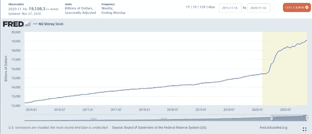
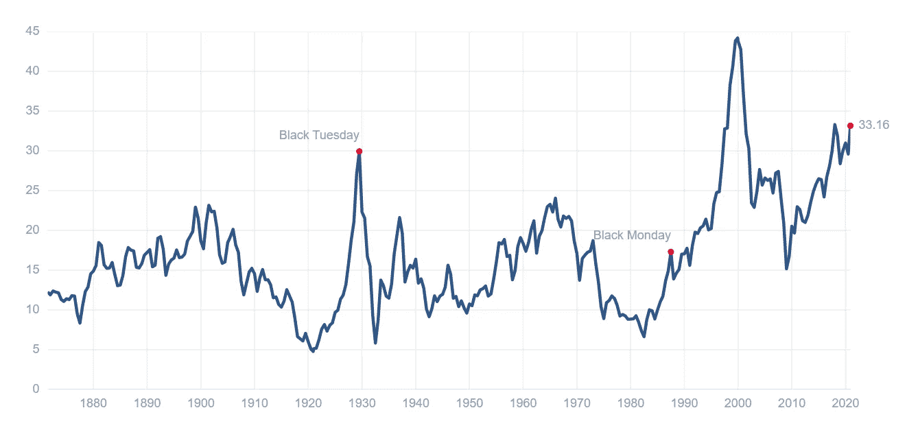
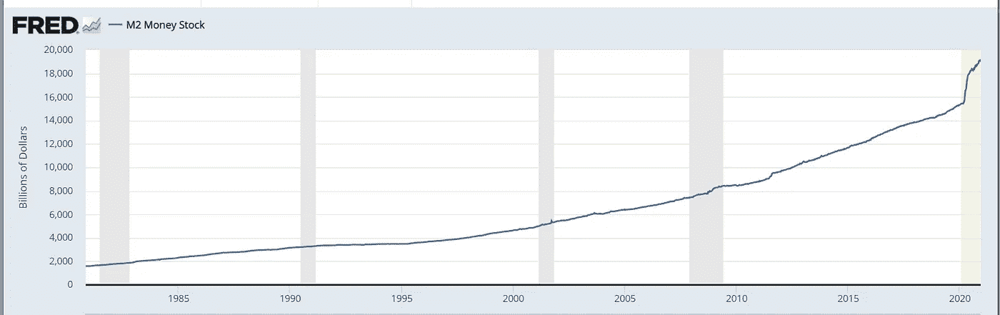

# 2021 年可能是有史以来最伟大的股市年之一

> 原文：<https://medium.datadriveninvestor.com/2021-could-be-the-one-of-the-greatest-stock-market-years-of-all-time-80b111b75b9c?source=collection_archive---------0----------------------->

## 疯狂的标题，我知道，但听我说完，我真的相信它

Photo by [ActionVance](https://unsplash.com/@actionvance?utm_source=medium&utm_medium=referral) on [Unsplash](https://unsplash.com?utm_source=medium&utm_medium=referral)

有几个指标让我相信股市即将起飞。

> “刚刚印出来的 4T 美元总得有个去处！”

尤其是这两个。

## **两大积极指标**

*   [2020 年 9 月 26 日美联储宣布，他们将维持接近零的利率直到 2023 年。](https://www.forbes.com/sites/sergeiklebnikov/2020/09/16/federal-reserve-says-it-will-keep-interest-rates-near-zero-until-2023/?sh=fd7dcdf798db)
*   [据圣路易斯联邦储备银行称，货币供应量正在飙升。自 2019 年以来增长了 26%，即 4 万亿美元。这是圣路易斯联邦储备银行网站上的 M2 货币供应图表。](https://fred.stlouisfed.org/series/M2)

M2 Money Supply via FRED.Stlouisfed.org

**货币供应量**

好，首先是货币供应量。你听说过联邦储备局今年印钞票来支撑股票市场吗？

你见过美联储的打印机吗？

我们都知道，国会在 2020 年春天通过了 CARES 法案，通过各种方式发放了 2.3 万亿美元，包括直接支付给美国人，增加失业福利，向小企业提供 PPP 贷款，向大公司提供贷款，以及向州和地方政府提供贷款。

此外，似乎还有一项 1 万亿美元的刺激法案将很快获得通过。

他们分发的钱并没有在美国财政部。我们都知道它没有钱。事实上，财政部目前有 27.4 万亿美元的债务。

2019 年底，M2 货币供应总量约为 15 万亿美元。目前它的价格约为 19 美元。

上涨了 4 万亿美元，涨幅为 26%。

M2 的货币供应量是多少？

货币供应量可以用几种方法来衡量。基本上，M1 货币供应量衡量流通中的所有货币，M2 将储蓄存款、CD 和货币市场账户计算在内。通常，M2 是经济学家在研究货币供应时关注的指标。

**这是什么意思？**

由于 2020 年的事件，美国经济中有更多的钱。我们知道这些钱没有在经济中流通，而是存在银行里。怎么会？因为通货膨胀没有上升。如果经济中流通的货币供应量增加 26%，通货膨胀就会加剧。我在这里写了更多。

 [## 民主党人和共和党人似乎都同意一件事

### 富人的社会主义

davidferrara.medium.com](https://davidferrara.medium.com/the-one-thing-democrats-and-republicans-seem-to-agree-on-b8cbcc69e341) 

因此，这意味着美元突然上涨了 26%,人们很快就会寻找家园。为什么？

**利率**

> “虽然利率和股票市场之间的关系相当间接，但两者往往朝着相反的方向发展——根据一般经验，当美联储降息时，它会导致股票市场上涨。”

然而，利率和股票市场之间没有直接关系。上述引用背后的理论是，当利率下降时，这意味着你无法通过美国国债、债券或其他固定收入金融工具获得显著的回报率。因此，每个人都投资于股票，而不是在那里投资。导致价格上涨。

这不仅仅意味着普通人将他们的 401K 重新分配到 100%的股票，而过去他们将 60/40 的股票分配到债券。

这意味着巨型机构，州和地方政府，养老基金等。如果他们不能在固定收益中获得足够的回报，那些规定了回报率的投资者不得不将他们的投资转向股票。

比如 CALPERs。加利福尼亚州的养老基金已经决定，他们必须承担更多的风险，以达到规定的回报。

> “加州庞大的公共养老基金有一个巨大的问题:其 4000 亿美元的投资组合盈利能力不足，如果不进行重大的战略调整，就不会盈利。这就是首席投资官本萌即将承担的。在加州公务员退休系统周一的会议上，孟将告诉董事会成员，该基金必须承担更大的风险，”[摘自 2020 年 6 月 15 日文章](https://www.bloomberg.com/news/articles/2020-06-15/calpers-cio-eyes-more-private-equity-leverage-to-boost-returns)

现在，公平地说，我引用的彭博的文章，是在谈论加州公务员退休基金如何把私募股权作为他们投资的地方，而不是股票市场。

我要说的是，你认为为什么今年 SPACs 会出现爆炸式增长？提示一下，所有这些 SPACs 都是由私募股权基金、风险投资基金和对冲基金发起的。

 [## 什么是特殊目的收购公司？

### 而为什么 2020 年这么多钱涌入他们？

medium.com](https://medium.com/datadriveninvestor/what-is-a-spac-5ab4ff102f3) 

## 那么，货币供应量暴涨和利率触底意味着什么？

好吧，如果你多印了 26%的钱，而美联储倾斜了游戏场地，所以股票市场是放钱的唯一地方？

我的预测是，2021 年股票市场将会爆炸式增长。

## **魔鬼代言人——估值呢？**

好吧，为了公平起见，让我们谈谈如果我不参加，你们会对我吼些什么。

如果你看看市盈率，就会发现市场目前被高估了。让我们看看诺贝尔奖得主罗伯特·席勒(Robert Shiller)对股市整体估值的方法论。

这是席勒市盈率的历史图表，它比较了总股票市值和 10 年平均收益。

[https://www.multpl.com/shiller-pe](https://www.multpl.com/shiller-pe)

很明显，从这张图表上看，我们处于高点。

 [## 收盘，但没有雪茄-股票市场目标在停滞的 COVID 救济中创新高|数据驱动…

### 专家聊天程序:一个协作市场，在这里人们可以和能够解决他们问题的专家聊天。是……

www.datadriveninvestor.com](https://www.datadriveninvestor.com/2020/08/18/close-but-no-cigar-stock-market-targets-record-highs-amidst-stalled-covid-relief/) 

但是让我们再来看看圣路易斯联邦储备银行的 M2 图表。这一次时间范围扩大到了 50 年。很明显，这是一个独特的观点，在历史上的任何时候，美元都没有这么快地凭空创造出来。

M2 Money Supply via FRED.Stlouisfed.org

我们正处于一个独特的历史时刻。利率从未如此之低(美联储也从未保证利率在 2023 年之前保持低水平三年)，货币供应量此前从未飙升 26%，随着巨额赤字和另一项 1 万亿美元的刺激法案的到来，货币供应量将很快进一步飙升。

刚刚印出来的 4T 美元必须有去处！

现在没人应该有现金！正如雷伊·达里奥所说“现金是垃圾”

我的假设是，它将进入股票市场(当然还有一些进入其他资产，如加密和房地产)，这将把我们推得比现在更高。我不认为我们会提高一点点。

## **其他几个因素向我表明，我们将看到股市飙升**

**疫苗**

因此，以上是我对为什么股市将继续飙升以及 2021 年可能是历史性的一年的主要思考过程。

但是今天世界上当然还有其他一些事情在发生。

疫苗终于来了。早期预测谈到疫苗将于 2021 年在 Q2 上市，后期预测将于第三季度上市。

我对任何预测 Q3 的人都持怀疑态度。辉瑞公司的 1 亿种疫苗正在路上，另一种[的 2 亿种 Moderna 疫苗](https://www.hhs.gov/about/news/2020/12/11/trump-administration-purchases-additional-100-million-doses-covid-19-investigational-vaccine-moderna.html)即将获得批准。我知道分销是一个巨大的挑战。但据我所知，美国有 3.28 亿人，除了这两种疫苗之外，还有其他几种疫苗即将上市。

我认为这将成为测试的一部分，在接下来的几个月里疫苗将很难找到，然后它们将会无处不在。

**收益**

2021 年每个季度，从 Q2 收益报告开始。这将是 2021 年 6 月 30 日季度末的收益报告，将于 7 月和 8 月发布。我们将在收入、收益、市盈率等方面实现大量创纪录的同比增长。

当然，所有分析师都会对这些进行鉴定，并且会有很多关于我们需要如何将这些与 2019 年进行比较的讨论，因为 2019 年是这些业务可比较的最后一年。

但它仍将成为头条新闻，在这个散户投资者和罗宾汉及威布尔重新崛起的时代，我相信这将导致炒作继续高涨。

**别忘了主街**

我的最后一点很简单。美国似乎总是会反弹。在每一次萧条、衰退、战争、恐怖袭击、腐败丑闻、坏政客等等之后。我们总是会反弹。我们总是回去工作。我们总能找到办法。

没有理由不适用于流行病。我不是这里唯一一个[预测这个](https://www.wfla.com/news/ucla-forecast-predicts-another-roaring-twenties-after-the-pandemic/)的人。毕竟，1918 年疫情之后发生了什么？喧嚣的二十年代。

主街是这场危机的最终受害者，是的，在过去几个月里，华尔街和主街之间出现了脱节。

但这并不意味着主街不会卷土重来。他们总是这样。

 [## 专注于资产增值

### 随着时间的推移，你的生活会增值。

medium.com](https://medium.com/makingofamillionaire/focus-on-appreciating-assets-f3efb3db7dd8) 

## 获得专家观点— [订阅 DDI 英特尔](https://datadriveninvestor.com/ddi-intel)