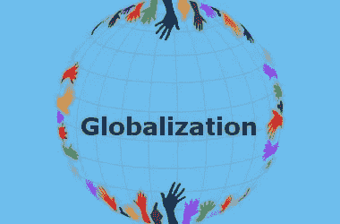

# 2021 年主题二:全球化将早餐吃掉“崛起”的民族主义

> 原文：<https://medium.datadriveninvestor.com/2021-major-theme-2-globalization-will-eat-the-rising-nationalism-for-breakfast-12ee096ad387?source=collection_archive---------33----------------------->

# …..金融化、离岸外包和自动化将享用剩下的尸体。

我们都目睹了激进形式的民族主义的上升趋势。我们已经在英国、美国、中国、南非和其他国家看到了这种情况。日益高涨的民族主义是对无情的全球化和移民趋势的回应。

全球化是指事物(公司、产品、市场、理念、供应链等)的国际化。)以及打破通常的距离和政治边界障碍的方式，使世界成为一个地球村。

民族主义是指将自己认同于自己的民族，促进自己民族的利益，以期排斥不属于自己民族的其他人的行为。民族主义本身并没有错。极端民族主义比民族主义略高一级，通常基于“我的民族优于你的民族”的观点。

大多数在美国的美国人认为，与世界上其他人相比，他们是优等生。的确，美国人比世界上大多数国家都富有。令人担忧的是，英国大多数人认为自己和英国是例外的(英国例外论)，并表达了某种类型的民族主义。令人担忧的是，许多南非人认为自己比所有其他非洲人都优越。CCP 推动的中国宣传强调中国是一个优越的民族国家。所有其他民族国家以及这些国家的公民都有同样的取向。

然而，全球化在其无情的行进中，践踏了民族主义，并把利润放在首位。

# 全球化将摧毁民族国家概念的五(5)个原因。

1.  **归根结底是单位成本**——你无法对抗经济学并取得胜利(尤其是单位经济学)。资本流向成本非常低，消费者要求低成本的地方。当反全球化抗议者抗议越来越多的工厂搬迁到国外时，他们会购买国外制造的廉价记号笔、纸板和标语牌。多么讽刺。
2.  **供应链现在错综复杂地整合在一起**——大多数最基本产品的供应链现在涉及三个或更多国家。复杂的产品涉及更多的国家。复杂和一体化的全球供应链使得本地化很难挑战全球化。
3.  **离岸** —互联网使得工作可以在远程位置进行。不需要亲临现场提供服务的中产阶级工作可以在任何地方进行。例如，在印度的印度人可以掌握加拿大税法，并从印度执行加拿大税务咨询服务。工作可以迁移到其他国家获得劳动力，而不是人们迁移到其他国家获得工作。
4.  **互联网和不断下降的通信成本**——技术是通货紧缩的。互联网和相关技术降低了沟通的成本，使得商品和服务的市场也全球化了。本地化在信息不对称的情况下蓬勃发展，在这种情况下，当地人只能访问本地的信息。有了互联网，消费者可以在网上寻找最低的价格。如果 Takealot 很贵，南非人可以选择从亚马逊购买，并在计入运费和进口税后以更低的成本将产品送到他/她的家里。对信息的垄断已经被打破。
5.  **金融化** -日益增长的金融化需求给本地化带来了压力。金融化寻求从一切中获得最佳和最高的回报。体育的金融化创造了超级联赛，如英超联赛，并出口到世界其他地区，实际上蚕食了其他国家的足球联赛。房屋(住宿)的金融化导致了全球对收益率的追求。来自远方的人可以参与你所在地区的房地产，因为银行家将这些打包成各种工具，现金流通过几层流向远方从未涉足你所在地区的最终投资者。金融化不考虑地理边界，因为现金流可以流向任何他们想去的地方。

公元 2021 年极有可能是民族主义试图反击，但遭到惨败的一年。全球化就像技术一样，像火一样肆虐，吞噬一切阻挡它前进的东西。

再见。

**访问专家视图—** [**订阅 DDI 英特尔**](https://datadriveninvestor.com/ddi-intel)