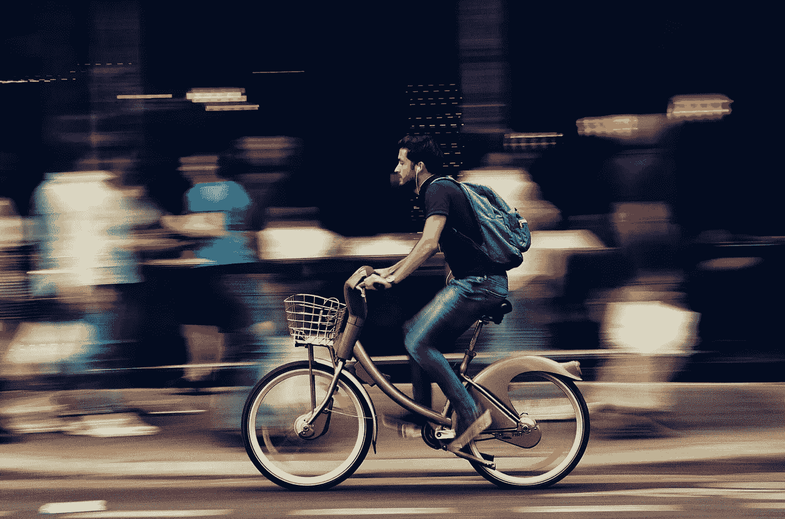

# 2021 年特辑:如何将 24 小时变成 48 小时，并完成两次

> 原文：<https://medium.datadriveninvestor.com/2021-special-how-to-turn-24-hours-to-48-hours-and-get-twice-done-49f2fe41278e?source=collection_archive---------26----------------------->

## 5 招成就更多，摇滚你的 2021

"I'm gonna double my time and achieve more in half the time." | Image from [Pexels](https://www.pexels.com/)

我可以保证 2021 年的前六个月会是怎样。

怎么会？2020 年已经过了 2021 年的 6 个月。

2020 年年中，我评估了自己目前的状况，没有任何改善。封锁也给了我们一张免费券，让我们把时间浪费在不必要的事情上，而不是高效地实现我们的目标。

我评估了我的大部分时间是如何被浪费的，对此我并不感到惊讶。与其说是实现目标的动力，不如说是我最大的消耗。

通过在互联网上做一些研究，与一些人交谈，并在应用它们的同时慢慢分析，我找到了五种方法，它们总能在一半的时间内实现翻倍，并将这些消耗的力量转化为驱动力。这个想法是提取不必要的浪费时间来加倍我们的日常时间。

我们所有人唯一拥有的同等数量和完美状态的东西是*时间*。如何最好地利用它是我们自己的事情。如果我们能充分利用它，我们就有更多的时间陪伴家人和[做我们喜欢的事情。](https://medium.com/illumination/success-is-simple-heres-the-complete-blueprint-that-works-585972d445c5)

在制定新年决心或目标之前，学习一些让你每天的时间翻倍的方法，以便用一半的时间完成更多的事情，并使用一些[心理提示](https://link.medium.com/Vd4rbsxsAcb)来坚持它们，让 2021 年成为你生命中最美好的一年。

# 以聪明的方式更新

我们观看我们最喜欢的运动来寻求刺激——因为我们沉迷于我们最喜欢的球队，我们希望看到他们赢。不幸的是，当你看比赛的时候，如果你的球队输了，你会担心一整天，这已经让你变得没有效率了。

更糟糕的是，你看了整场比赛但最后，你只记得精彩部分。两个月后，你甚至不记得精彩部分了。时间已经耗尽，因为你忘记了这些，即使你记得，你在观看比赛时获得的知识也不再有价值，除非你去参加问答比赛。

同样，你花一整天的时间阅读最新的新闻。那很好。这在当今至关重要。但是[新闻是焦虑的最大来源](https://www-medicalnewstoday-com.cdn.ampproject.org/v/s/www.medicalnewstoday.com/amp/articles/327516?amp_gsa=1&amp_js_v=a6&usqp=mq331AQHKAFQArABIA%3D%3D#amp_tf=From%20%251%24s&aoh=16091721174595&referrer=https%3A%2F%2Fwww.google.com)。每分钟看新闻，每一次都让你焦虑倍增。

## 黑客是什么？

在一天结束时消耗提取的高光。

我哥哥的朋友 Kamal 是一个板球迷，我哥哥喜欢了解板球的最新动态。卡马尔和他的父母希望他成为一名板球运动员。他得到了全天观看板球比赛的许可。一天结束时，在晚上 11 点，他与我哥哥分享了精彩内容。他的时间没有不必要的浪费，酷的是，卡马尔喜欢分享精彩。每当我哥哥想看比赛的时候，他都会在那天挤出一些时间去看。

我朋友的爸爸退休了。他喜欢被更新。甚至在他的浴室里，他也有电视。在电视休息时间，他不顾后果地与每个人分享新闻。我们找到了一个窍门:在一天的最后一条新闻之后，我们让他录下新闻的重点。凌晨 1 点，我的朋友也分享给我们，我们全家坐下来了解最新消息。

## 简而言之，黑客

不消费，提取。

## 奖金

我在朋友面前称自己为 *highlightsetic* ，他们称我为酷。

大多数时候我会编造一些很酷的名字，让自己在所有人面前看起来很酷。Highlightsetic 的意思是突出提取者和消费者。

试试这个。你会成为新的酷哥。它总是有效的。

# 如果可以消除，就不要自动化

你安装了一个应用程序，它会自动通知你你最喜欢的运动的最新集锦，你高兴得跳出来，“雅虎，我真聪明。”

一个通知和你所有的注意力。你正在做最后一年的项目，明天是最后期限，但谁会在乎呢？

每个人都想通过给你免费的[十亿美元信息的](https://www-clickz-com.cdn.ampproject.org/v/s/www.clickz.com/social-media-is-not-free-heres-why/54937/amp/?amp_gsa=1&amp_js_v=a6&usqp=mq331AQHKAFQArABIA%3D%3D#amp_ct=1609176353788&amp_tf=From%20%251%24s&aoh=16091763309355&csi=1&referrer=https%3A%2F%2Fwww.google.com&ampshare=https%3A%2F%2Fwww.clickz.com%2Fsocial-media-is-not-free-heres-why%2F54937%2F)，用一个温和的通知吸引你的注意力。因为如果他们引起了你的注意，他们可以很容易地控制你。不信任我？这很正常。让我给你举个例子:一段时间后，你在那个应用程序中收到一个广告，要求你试用一个应用程序，去购买这个产品，探索这个新商店，等等。你现在知道原因了。

类似的事情也发生在社交媒体应用上。你下载应用程序是希望减少桌面版本的使用，但最终你会用得更多。

## 黑客是什么？

减少分心采取行动。

我们唯一能控制的东西控制着我们的生产力，因此我们的成功就是我们的*注意力*。

这些通知足以带走你所有的注意力和时间，让你效率低下。

## 简而言之，黑客

能消除就不要自动化。

# 并行化:以巧妙的方式进行多任务处理

有了爸爸的车钥匙，我比其他人都早出门。我打开引擎，噩梦从沉睡中醒来:我还不会开车。我没有驾照。我未成年。

爸爸坐在车上。两分钟后我们就在主干道上了。一个永无止境的队列不知从哪里冒出来。我们只能在这里等，没办法了。

五分钟。十分钟。30 分钟。队列没有移动。卡住了。

我被困在消极的想法中。大量的负面想法。这很正常。因为发表在 BMC 公共健康杂志上的一项研究提到:[久坐不动的行为](https://en.m.wikipedia.org/wiki/Sedentary_lifestyle)会增加焦虑的风险。还有，[焦虑滋生拖延](https://www.google.com/amp/s/qz.com/work/1584023/how-to-tell-when-procrastinating-is-actually-anxiety/amp/)，拖延意味着没有生产力。

## 黑客是什么？

对不必要的等待感到兴奋。在交通堵塞中计划你的一天。或者，复习你在那段时间学到的最后一课。有一个堵塞，但时间不多了，所以你可以。

那么，你会在洗手间呆多久？五分钟？在那时计划你的下一步行动。30 分钟？完成一天的社交媒体滚动，这样你就不会在以后浪费时间。

电梯坏了。你必须爬到六楼。需要 4 分钟。当时一首歌都不唱。计划或思考你下一步要做什么。时间已经节省了。否则，你会爬上楼梯，恢复精神，放松一段时间，然后*再*考虑你的下一个计划。

去散步吗？在路上，回复所有因为关机而无法接听的未接来电。

当我们的老师咳嗽时，我有三秒钟的时间，我已经为我的媒介故事写了一行。酷的是(是的，我很缺德)，我们老师一节课咳嗽 15 次左右，意味着我已经写完了一篇一分钟阅读的文章。

## 简而言之，黑客

享受每一秒，智能地进行多任务处理。

 [## 在家工作如何提高我的工作效率|数据驱动型投资者

### 在家工作确实激发了我最大的潜能，让我更有效率。因为在家工作给了我…

www.datadriveninvestor.com](https://www.datadriveninvestor.com/2020/07/29/how-working-from-home-increased-my-productivity/) 

# 只是决定或委派，不要拿着它

你正在做你这学期最重要的项目，妈妈打电话来:“儿子，你表哥星期五要结婚了。安排车，安排谁和我们一起去。”

五天后是星期五。接下来的五天，你的注意力和专注力都在他们身上:怎么安排车，要不要带女朋友来参加婚礼，她坐哪辆车什么的。

或者，你去一家餐馆，两个小时内你都无法决定点什么菜。服务员每五分钟来找你一次。他怒不可遏。经理手里已经拿了一根棍子。

## 黑客是什么？

如果事情不是很重要，在一分钟内做出决定或者委托给其他人:“你选什么我就吃什么”，“你觉得对我好就买什么。”嘣，你的时间省了。最后，你也不用为错误的决定负责，这消除了潜在的焦虑，因此没有生产力。

## 简而言之，黑客

把决定权交给别人，避免不必要的紧张。

# 5 天后我可以发邮件吗？当然！

电子邮件很酷。它增加了我们的沟通技巧。然而，电子邮件是最好的生产力杀手。不同意我？根据调查显示，普通人每天花大约 2.5 小时在电子邮件上。

“沙耶杜尔，那又怎么样？”2.5 小时没问题，但当邮件中出现以下三种情况时，情况会变得更糟:

1.  我们被某人/某处拒绝
2.  我们收到一些不好的投诉
3.  我们在那些邮件中犯了一些错误

## 黑客是什么？

对于私人邮件，五天后打开邮件，当天回复。对于个人交流，我们通常不使用电子邮件，所以你不会错过任何重要的东西。

这很酷的原因是因为我不用担心在今天发完邮件后明天会有不好的事情发生。没有焦虑。生产力十足。

## 简而言之，黑客

5 天后发邮件，避免沮丧。

# 我将和你一起回顾

提取不必要的浪费时间，让你的时间翻倍，达到事半功倍的效果。

1.  不要消耗任何东西。消费提取的高光。
2.  如果可以消除，就不要自动化任何东西。
3.  不要浪费你得到的三秒钟。分秒必争。
4.  不要抱着决定不放。决定或者委托就行了。
5.  不要每天发邮件或者每天发两次。每 5 天发一次邮件。

现在摇摆你的 2021。我们会一起做的。

**访问专家视图—** [**订阅 DDI 英特尔**](https://datadriveninvestor.com/ddi-intel)