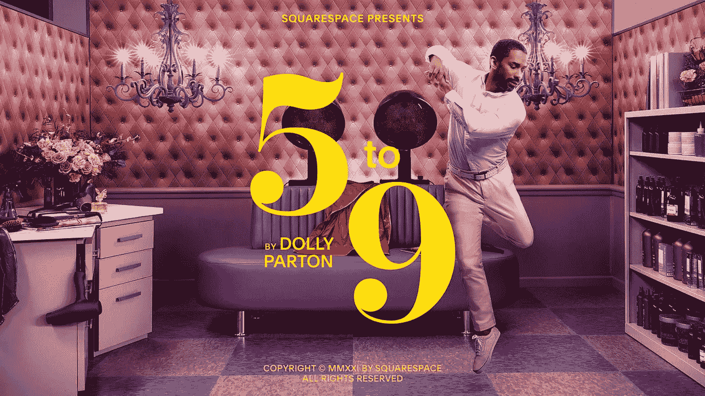

# 2021 年超级碗广告奖

> 原文：<https://medium.datadriveninvestor.com/2021-super-bowl-ad-awards-328ea8240cae?source=collection_archive---------46----------------------->

大赛的哪个广告是对人类尊严最大的侮辱？

反乌托邦概念柔术奖颁给了…Squarespace！

他们的超级碗广告中，多莉·帕顿演唱了她热门歌曲《朝九晚五》(在这个例子中是《朝五晚九》)的闪亮反转，这是一项利用社会经济悲剧的势头对抗观众的研究，将其转化为时髦的销售宣传。当帕顿女士唱道，我们看到人们从灰色的，吸人灵魂的，工资奴隶的工作中跳着舞向远方，不知何故庆祝他们现在必须回家继续工作。)而不是从“朝五晚九”放松下来。

大概是因为目前的经济形势对他们不利，没有家这样的东西，没有为快乐而快乐这样的东西，只有不同的全职和兼职轮班。如果中产阶级不得不窒息在停滞不前的工资和休闲死亡的泥沼中，至少我们可以让大公司试着把它作为一种渴望的购买卖给我们。

另外，在他们看来，如果你失败了，那也是你自己的错。你有没有关掉电源，或者为了让你的孩子吃饭而不去吃饭？那么，你为什么没有一个网站来制作和销售纱线小猫，你这个懒惰的笨蛋？你从 5 点到 9 点在做什么？