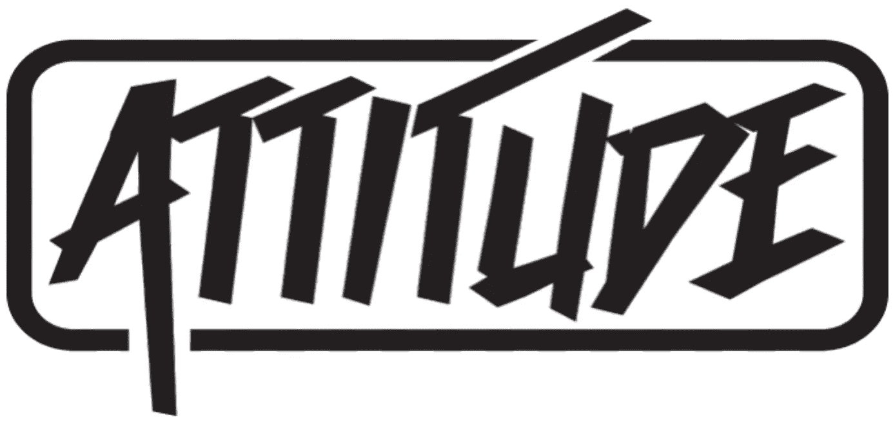
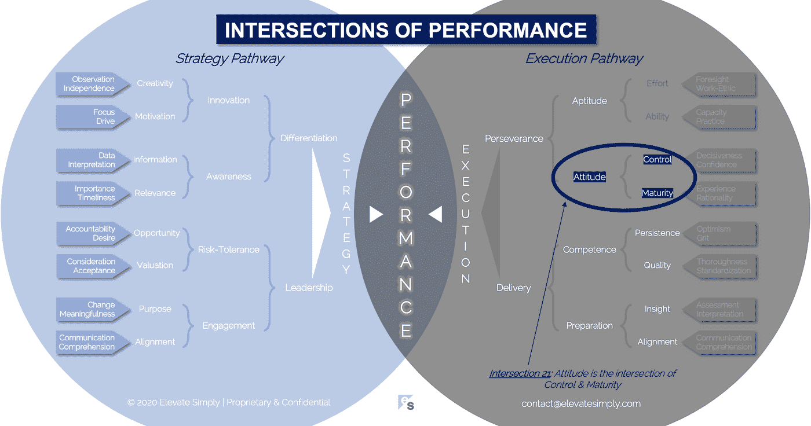

# 21.态度:控制和成熟的交叉点

> 原文：<https://medium.datadriveninvestor.com/21-attitude-the-intersection-of-control-maturity-b642fe7801ed?source=collection_archive---------15----------------------->

From 123rf.com

“不管你认为你能，还是你认为你不能——你都是对的。”—亨利·福特

我是一个“半杯满”型的人，对可能发生的事情和将要拥有的机会保持乐观。也就是说，我期望努力工作来达到我的目标，并且不可避免地，通往成功的道路会比计划的更艰难，需要更长的时间。在我的职业生涯中，我经常能够选择我关注的方向，投入我的时间和精力。有时是在我兴奋的事情上，有时不是。不过有一点是不变的，那就是我对它的态度将决定我的努力程度、奉献精神和结果。

根据我的经验，人们对待工作和互动的方式会影响他们的努力和关系的成功。我所在的团队拥有世界上所有的天赋和能力，但却因为团队成员的态度而失败。另一方面，我曾在没有理想技能和经验的团队中工作过，但一种“我能行”的态度让他们找到了成就感。仅仅基于态度并不能保证成功或失败，但这是一个区别。

“如果你想在大事上取得卓越，就要在小事上养成习惯。优秀不是例外，而是一种普遍的态度。”—科林·鲍威尔

**什么是态度交集？**

态度是控制和成熟的交叉点*(见下图交叉点 21)*。没有成熟的控制是无益的影响。没有控制的成熟是经历混乱。

"态度上的弱点会变成性格上的弱点。"——阿尔伯特·爱因斯坦

每个人、团队和组织都有积极或消极的态度。它们影响进步的速度和方向，可以变得更好或更坏，或快或慢。大多数时候，态度被分为积极或消极两类，但它们比这两类更复杂。态度可以创造成功，也可以扼杀成功。

*控制*

韦伯斯特将态度定义为“A:关于事实或状态的心理状态，B:对事实或状态的感觉或情绪”。

我们控制自己的态度。诚然，我们不断受到无数外部和内部因素的影响，但正是我们的控制能力决定了我们的态度。

态度会传染。不利的一面是，一个不好的态度会影响团队的所有成员。消极态度的最大影响之一可以在团队的表现效率中看到，或者缺乏表现效率，其结果是前进的速度变慢并且更加复杂。从积极的一面来看，一群坏态度中的一个积极态度可以带来希望，让你看到什么是可能的。如果这种态度能够渗透到团队中，它可以改变整个动态。

控制意味着态度的改变是可行的，这是强大的。在商业中，态度作为成功的杠杆并没有被充分讨论，可能是因为它的不稳定性。

交集 21:态度=控制+成熟

Image by [Brett Simpson](https://medium.com/u/191cf90a65d7?source=post_page-----b642fe7801ed--------------------------------)

*到期日*

说到态度，成熟似乎更像是经历的因素，而不是年龄。而且从体验上来说，更多的是类型而不是寿命。无论你是 19 岁、39 岁还是 79 岁，你都有过经验，这些经验与你的逻辑、感觉和情绪相结合，为你在各种环境下决定自己的态度提供了基础。

关于我们的态度的一个关键见解是，我们的成熟引导我们对它们的控制。它驱动我们在某些情况下的积极态度和在其他情况下的消极态度。

积极并不总是等同于更成熟，消极并不等同于更不成熟。此外，积极的态度并不总是对的，消极的态度也不总是错的。我们作为个人、团队和组织管理态度的能力是成熟水平的标志。

**领导者能做什么？**

不管他们愿不愿意，领导者在态度上树立了榜样。态度是通过语言和非语言的暗示来识别的。它们可以激发信心，可以在瞬间耗尽房间的能量。优秀的领导者知道自己的态度对团队和组织的影响。

领导者不能控制团队中每个人的态度，但是他们可以尝试去影响他们。他们需要理解并能够阐明态度的价值。

**总结&下一个**

态度有助于成功，但不能保证成功。态度激发动力。

下一次，我们将考察表现的第 22 个交叉点，即**能力交叉点**。

在这一系列文章中，我们探索了性能的交集，共有 30 个。绩效的交叉点*框架基于*[*Brett Simpson*](https://www.linkedin.com/in/brettjsimpson/)*[*董事总经理【简称为*](https://www.linkedin.com/company/elevatesimply/)*】20 多年来作为企业家、顾问和投资者在大大小小组织中的领导经验和见解。**

***绩效-文章链接的交集***

*1.[绩效:策略的交集&执行](/the-innovation/1-performance-the-intersection-of-strategy-execution-2bf06329f8d4)*

*2.[战略:领导力的交叉点&差异化](/the-innovation/2-strategy-the-intersection-of-leadership-differentiation-a568b17731ab)*

*3.[领导力:参与度的交集&风险承受度](/the-innovation/3-leadership-the-intersection-of-engagement-risk-tolerance-f8c887e6c1d3)*

*4.[差异化:创新的交叉点&意识](/@brettjsimpson/4-differentiation-the-intersection-of-innovation-awareness-a21d053ecf12)*

*5.[啮合:目的的交集&对准](/@brettjsimpson/5-engagement-the-intersection-of-purpose-alignment-953747437c26)*

*6.[风险承受能力:机会的交集&估值](/@brettjsimpson/6-risk-tolerance-the-intersection-of-opportunity-valuation-29cf4d9a0ac)*

*7.[认知:信息的交集&关联性](/@brettjsimpson/7-awareness-the-intersection-of-information-relevance-f0fd5322bcb7)*

*8.[创新:创造力的交汇点&动机](/@brettjsimpson/8-innovation-the-intersection-of-creativity-motivation-7c1a12e0d5e2)*

*9.[目的:变化的交集&意义](/@brettjsimpson/9-purpose-the-intersection-of-change-meaningfulness-9f12b0153e1)*

*10.[估价:对价的交集&验收](/@brettjsimpson/valuation-the-intersection-of-consideration-acceptance-eebe7b15e763)*

*11.[机会:欲望的交汇&责任](/the-innovation/opportunity-the-intersection-of-desire-accountability-7e81adb1e195)*

*12.相关性:重要性的交集&及时性*

*13.[信息:数据的交集&解读](/@brettjsimpson/information-the-intersection-of-data-interpretation-62acc94ba8bf)*

*14.[动机:焦点的交集&驱动](/@brettjsimpson/14-motivation-the-intersection-of-focus-drive-d9ebd3ca9951)*

*15.[创造力:观察的交叉点&独立性](/@brettjsimpson/15-creativity-the-intersection-of-observation-independence-57f7294acb2b)*

*16.[执行力:毅力的交汇&交付](/the-innovation/16-execution-the-intersection-of-perseverance-delivery-73bdd004fd0)*

*17.[交付:准备&能力](/@brettjsimpson/17-delivery-the-intersection-of-preparation-competence-556a06d33238)的交集*

*18.[毅力:资质&态度](/@brettjsimpson/18-perseverance-the-intersection-of-aptitude-attitude-f7f9d96f01dd)的交集*

*19.[准备:视野交汇&对准](/@brettjsimpson/19-preparation-the-intersection-of-insight-alignment-752fd11af553)*

*20.能力:坚持与质量的交汇点*

*21.态度:控制和成熟的交叉点*

*22.资质:努力与能力的交集*(即将推出！)**

*23.洞察力:评估与解释的交集*(即将推出！)**

*24.质量:彻底性和标准化的交汇点*(即将推出！)**

*25.坚持:乐观与勇气的交汇*(即将推出！)**

*26.成熟:经验与理性的交汇*(即将推出！)**

*27.控制:果断与自信的交集*(即将推出！)**

*28.能力:能力与实践的交集*(即将推出！)**

*29.努力:远见和职业道德的交集*(即将推出！)**

*30.对齐:传播与综合的交汇点*(即将推出！)**

*在 [**管理和企业咨询**](https://app.ddichat.com/category/management-and-corporate-consulting) **:** 中安排一次对话*

* [## 专家-管理和企业咨询- DDIChat

### DDIChat 允许个人和企业直接与主题专家交流。它使咨询变得快速…

app.ddichat.com](https://app.ddichat.com/category/management-and-corporate-consulting) 

在此申请成为 DDIChat 专家[。
与 DDI 合作:](https://app.ddichat.com/expertsignup)[https://datadriveninvestor.com/collaborate](https://datadriveninvestor.com/collaborate)
在此订阅 DDIntel [。](https://ddintel.datadriveninvestor.com/)*