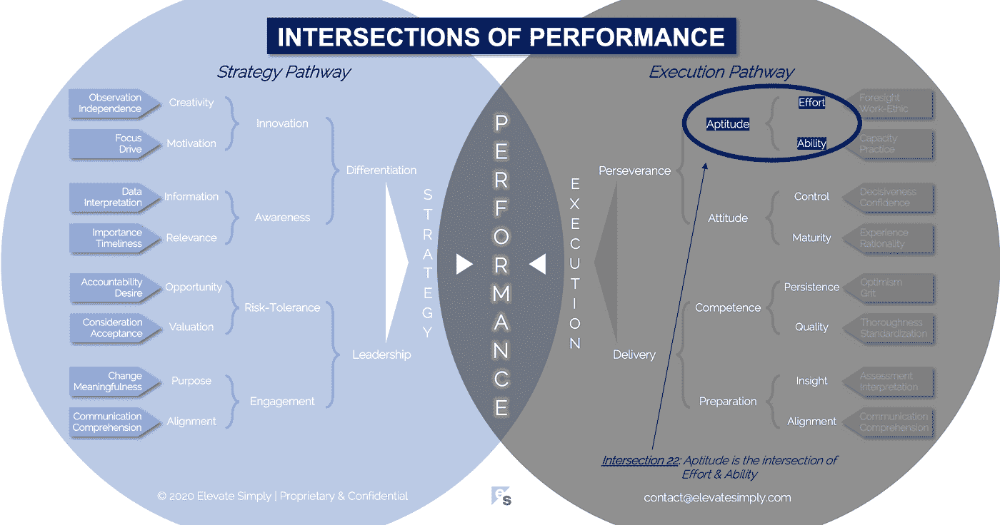

# 22.天资:努力和能力的交集

> 原文：<https://medium.datadriveninvestor.com/22-aptitude-the-intersection-of-effort-ability-e9c03566ba40?source=collection_archive---------41----------------------->

Image from 123rf.com

我听说有人把生意比作拼图，通过把一堆不同的碎片组织成一个可识别的和/或有用的成品，就能获得成功。虽然这种比较在高层次上是有意义的，但对我来说，现实中的真相是不同的。

我喜欢拼图游戏，因为只有一个最终的解决方案和明确的终点，当所有的碎片放在一起，创造出预先确定的画面时就实现了。做拼图的界限给我一种舒适的感觉，并允许我开发自己的拼图完成过程。

1.  确保所有的部分都正面朝上
2.  将边饰与其他边饰分开
3.  将边框拼在一起(并抑制住将我随机发现的其他块拼在一起的冲动)
4.  当一个或两个边界部分“丢失”时，我会非常痛苦，我不得不再次在人群中挑选，直到我在继续前进之前找到它们
5.  完成边界
6.  审视无边框碎片的混乱，就像你应该盯着(或透过)的那种 20 世纪 90 年代的隐藏三维图像海报，直到图像跃入你的眼帘，希望我能“看到”拼在一起的拼图碎片/部分
7.  查看盒子上的拼图图片，了解有助于我识别吸引我的连续区域的细节或颜色(在处理不吸引我的区域之前，我先处理我“喜欢”的区域)
8.  根据颜色/图案将拼图块分组，然后开始组装
9.  根据拼图块的形状而不是颜色/图案来查看差距，然后继续组装
10.  重复步骤 6-9，直到拼图完成

以上听起来可能很简单，但是有一个复杂的问题。每当我做拼图时，我的妻子都会加入…或者也许我是加入她的那个人。不管怎样，她不欣赏也不跟随我的“完美拼图过程”。事实上，她觉得这很令人恼火，讽刺的是，我发现她似乎完全无视任何在边界完成后完成拼图的过程。我们达成的心照不宣的解决方案是一起解决难题，但是在不同的时间……这意味着我们可以各自按自己的方式解决，而只有我们一个人在桌边解决。

与拼图不同，企业一开始并不是一个完美的解决方案，然后被切割成小块，可以相对容易地重新组装，以重新创建原始的完整画面。我喜欢商业的原因与我喜欢拼图相反。商业引起了我的兴趣，因为没有最终的解决方案，终点也不确定。成功不像拼图那样一目了然。如果有一种商业成功的解决方案，那将是乏味的，而且可能缺乏创新。更不用说谁先解决谁就“赢”然后就结束了。确定的终点也遵循类似的逻辑。商业之所以引人注目，是因为它的活力和不断进化，或者说它有消亡的可能。

就像拼图一样，我们可以在业务中设置流程。虽然有效，但不保证成功，不像我的“完美拼图过程”。商业的美妙和挑战在于它的混乱和不可预测性，以及如何驾驭这两者，成功还是失败。

这种导航是由企业领导人和团队的能力驱动的。

**什么是资质交集？**

天资是努力和能力的交叉点*(见下图交叉点 22)*。没有能力的努力是徒劳的。没有努力的能力是浪费的才能。

以我的经验来看，天资是用从“完全没有”到“非常高”的滑动标尺来衡量的。除非有一种专门设计的测试来客观地衡量才能，否则我们就会陷入对它的主观评估。这就是努力和能力投入发挥作用的地方。

*努力*

努力似乎是一个基本的概念，有时的确如此。对努力的判断通常听起来像，“你已经竭尽全力了”，或者“他/她很努力了”，或者“非常努力！”客观地说，我们希望能够用恰如其名的 LOE(努力水平)这样的度量标准来评估和度量努力。

"你的项目有什么价值？"这句话被说了多少次了？从概念上讲，这很简单…只需估计交付项目所需的小时数，除以一天中的小时数，就会神奇地得到一个时间框架。我为你鼓掌，如果你能像那样逃避责任。通常，你必须考虑谁有技术和能力来做这项工作，他们的时间表是什么样的，如何与资金、假期、休假、工具、技术或供应商的准备情况等相匹配。

发展某项任务、项目或角色的能力需要一定程度的努力。绝大多数高级商业领袖在他们的一生和职业生涯中，如果没有付出近乎非人的努力来获得他们所处的位置，他们就不会升到他们的级别。也就是说，头衔仅仅是努力的结果之一，并不总是对人们很重要。在你的角色、领域或学科中发展专业技能需要付出巨大的努力，通常需要持续一段时间。发展才能需要努力。

交叉点 22:资质=努力+能力

Image by [Brett Simpson](https://medium.com/u/191cf90a65d7?source=post_page-----e9c03566ba40--------------------------------)

*能力*

能力和才能可以互换使用。然而，我认为能力是独立的技能或天赋，当它们结合在一起时，会产生更全面的能力倾向。此外，能力可以指学习和发展某方面才能的倾向。

换句话说，能力可以被视为你擅长的事情。能力可以被看作是你如何将你擅长的事情应用到你的任务和角色中，以获得一个结果。就像努力一样，能力也是以滑动的尺度来衡量的。你可以没有能力，有一些能力，或者有很多能力。

很容易确定什么时候有我们不具备或不想进一步发展的独立技能(即能力)，我们通过培训、实践、观察或在职经验来实现。这些能力的发展有助于我们在许多领域的整体能力。

**领导者能做什么？**

领导者最大的责任之一就是把合适的人放在合适的位置上。当领导者所扮演的角色没有人(据他们所知)具备目前所需要的资质来完成时，复杂性就产生了。在这种情况下，领导者必须寻找人们成长为该角色所需的才能，这可能需要做出判断。

领导者有责任确保他们的团队成员在对团队和组织最有利的方面不断发展或有机会发展才能。

**总结&下一个**

如果被忽视，天资会随着时间的推移而停滞不前。它需要不断的努力建设和能力的提高。

下一次我们将考察第 23 个表现交叉点，也就是**洞察力交叉点**。

在这一系列文章中，我们探索了性能的交叉点，共有 30 个。绩效的交叉点*框架基于*[*Brett Simpson*](https://www.linkedin.com/in/brettjsimpson/)*[*董事总经理*](https://www.linkedin.com/company/elevatesimply/) *的经验和见解，以及他作为企业家、顾问和投资者在大大小小的组织中 20 多年的领导经验。**

***绩效-文章链接的交集***

*1.[绩效:策略的交集&执行](/the-innovation/1-performance-the-intersection-of-strategy-execution-2bf06329f8d4)*

*2.[战略:领导力的交叉点&分化](/the-innovation/2-strategy-the-intersection-of-leadership-differentiation-a568b17731ab)*

*3.[领导:参与的交集&风险承受能力](/the-innovation/3-leadership-the-intersection-of-engagement-risk-tolerance-f8c887e6c1d3)*

*4.[差异化:创新的交叉点&意识](/@brettjsimpson/4-differentiation-the-intersection-of-innovation-awareness-a21d053ecf12)*

*5.[订婚:目的的交集&对齐](/@brettjsimpson/5-engagement-the-intersection-of-purpose-alignment-953747437c26)*

*6.[风险承受能力:机会的交叉点&估值](/@brettjsimpson/6-risk-tolerance-the-intersection-of-opportunity-valuation-29cf4d9a0ac)*

*7.[认知:信息的交集&关联性](/@brettjsimpson/7-awareness-the-intersection-of-information-relevance-f0fd5322bcb7)*

*8.[创新:创造力的交汇点&动机](/@brettjsimpson/8-innovation-the-intersection-of-creativity-motivation-7c1a12e0d5e2)*

*9.[目的:变化的交叉点&意义](/@brettjsimpson/9-purpose-the-intersection-of-change-meaningfulness-9f12b0153e1)*

*10.[估价:对价的交集&验收](/@brettjsimpson/valuation-the-intersection-of-consideration-acceptance-eebe7b15e763)*

*11.[机会:欲望的交汇&责任](/the-innovation/opportunity-the-intersection-of-desire-accountability-7e81adb1e195)*

*12.[相关性:重要性的交集&及时性](/@brettjsimpson/relevance-the-intersection-of-importance-timeliness-56cc748eb066)*

*13.[信息:数据的交集&解读](/@brettjsimpson/information-the-intersection-of-data-interpretation-62acc94ba8bf)*

*14.[动力:十字路口的焦点&驱动](/@brettjsimpson/14-motivation-the-intersection-of-focus-drive-d9ebd3ca9951)*

*15.[创造力:观察的交集&独立性](/@brettjsimpson/15-creativity-the-intersection-of-observation-independence-57f7294acb2b)*

*16.[执行:毅力的交汇&交付](/the-innovation/16-execution-the-intersection-of-perseverance-delivery-73bdd004fd0)*

*17.[交付:准备&能力](/@brettjsimpson/17-delivery-the-intersection-of-preparation-competence-556a06d33238)的交集*

*18.[毅力:天资的交汇&态度](/@brettjsimpson/18-perseverance-the-intersection-of-aptitude-attitude-f7f9d96f01dd)*

*19.[准备:有识之士的交汇&对准](/@brettjsimpson/19-preparation-the-intersection-of-insight-alignment-752fd11af553)*

*20.能力:坚持与质量的交汇点*

*21.态度:控制和成熟的交叉点*

*22.天资:努力和能力的交集*

*23.洞察力:评估与解释的交集*(即将推出！)**

*24.质量:彻底性和标准化的交汇点*(即将推出！)**

*25.坚持:乐观与勇气的交汇*(即将推出！)**

*26.成熟:经验与理性的交汇*(即将推出！)**

*27.控制:果断与自信的交集*(即将推出！)**

*28.能力:能力与实践的交集*(即将推出！)**

*29.努力:远见和职业道德的交集*(即将推出！)**

*30.对齐:传播与综合的交汇点*(即将推出！)**

*在 [**管理和企业咨询**](https://app.ddichat.com/category/management-and-corporate-consulting) **:** 中安排一次对话*

* [## 专家-管理和企业咨询- DDIChat

### DDIChat 允许个人和企业直接与主题专家交流。它使咨询变得快速…

app.ddichat.com](https://app.ddichat.com/category/management-and-corporate-consulting) 

在这里申请成为聊天专家。
与 DDI 合作:[https://datadriveninvestor.com/collaborate](https://datadriveninvestor.com/collaborate)
点击此处订阅 DDIntel [。](https://ddintel.datadriveninvestor.com/)*