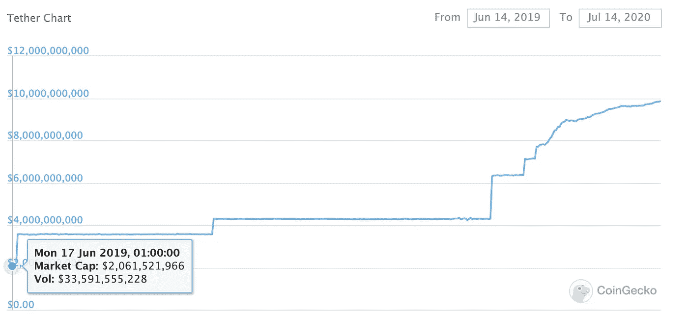
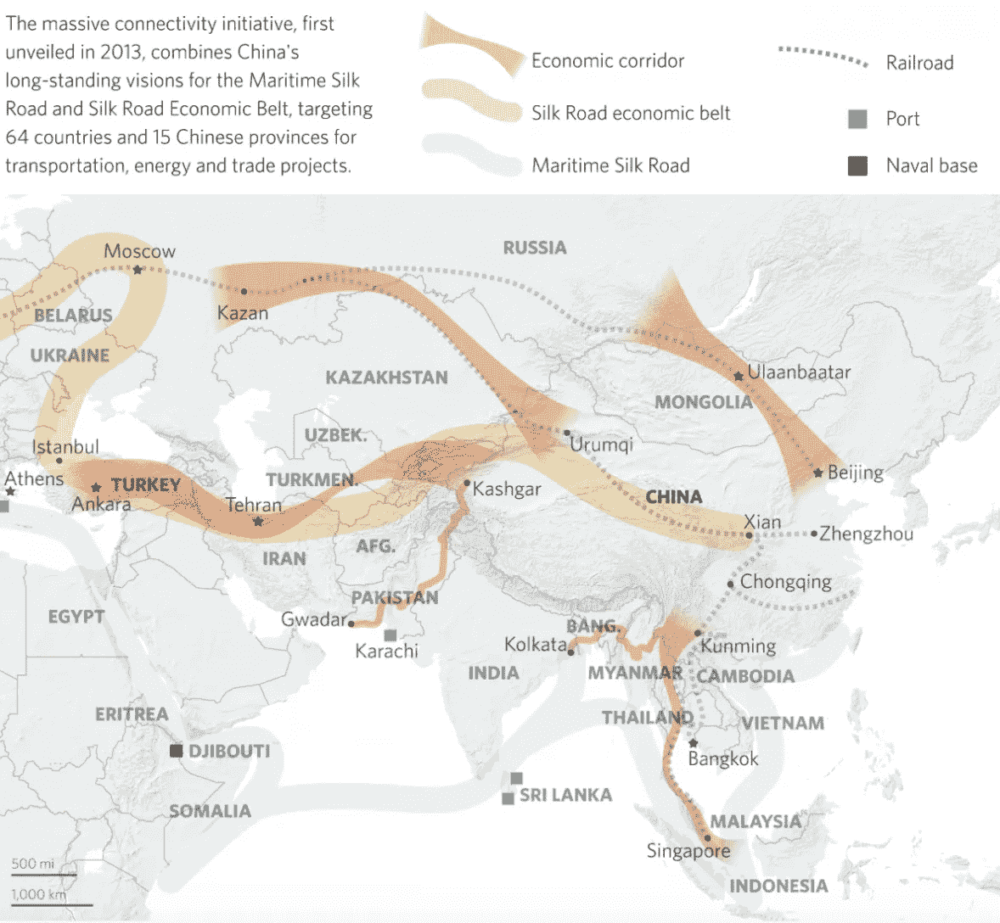

# 7 月 22 日数字字节

> 原文：<https://medium.datadriveninvestor.com/22nd-july-digital-bytes-20840a167944?source=collection_archive---------21----------------------->

对区块链和数字资产领域的一些发展进行分析，并通过案例研究说明这项技术和这些资产的使用方式、位置和原因

**视频字节 1:**

一个 [2 分钟的视频](https://www.linkedin.com/posts/jonnyfry_covid-19-is-driving-change-in-business-activity-6688360060378222592-HIe6)，讲述**新冠肺炎如何推动商业活动的变革**

对于在标准普尔 500 指数上市的公司来说，平均寿命大约是 22 年，低于 1958 年的 61 年。因此，对于股票市场来说，变化的步伐似乎越来越快。甚至在新冠肺炎之前，由于数字化的变革性影响， [92%的公司](https://www.mckinsey.com/business-functions/mckinsey-digital/our-insights/why-digital-strategies-fail)认为他们的商业模式需要改变，以保持经济上的可行性。在美国国内方面，根据与全球 50 家最大银行合作的富达国家信息服务(FIS)的数据，4 月初，新的移动银行注册量[增长了 200%](https://www.cnbc.com/2020/05/27/coronavirus-crisis-mobile-banking-surge-is-a-shift-likely-to-stick.html),移动银行流量增长了 85%。例如，在英国，自疫情开始以来，桑坦德银行已经有超过 2 . 5 亿人登录网上银行和移动银行，五分之三(59%)的英国人使用的数字服务比疫情之前更多。

非接触式交易现在是全世界日常生活的一部分。有趣的是，2018 年，[在美国使用的卡中只有 3%是非接触式的](https://www.forbes.com/advisor/banking/banking-after-covid-19-the-rise-of-contactless-payments-in-the-u-s/)，而英国约为 64%，韩国高达 96%。然而，今年 3 月，3100 万美国人使用了 Visa 非接触式卡或数字钱包-而 2019 年 11 月为 2500 万。自 2019 年 3 月以来，美国的整体非接触式使用量增长了 150%，目前实际非接触式卡有 1.75 亿张，是全球最多的市场。

此外，万事达卡报告称，由于商店在新冠肺炎疫情期间禁止现金交易，其非接触式支付增长了 40%。

在拉丁美洲大约 6 . 5 亿人口中，只有 1 . 13 亿人拥有信用卡。据 Visa 的首席产品官 Jack Forestell 称，“*我们正看到电子商务的大规模加速”*，今年在 Q1，整个欧洲大陆有 1300 万持卡人仅通过 Visa 就完成了他们的第一笔在线交易。

伦敦牛津街被封锁

来源:每日邮报

来自新冠肺炎的一个重大影响是，全世界数百万公民现在在家工作。在与欧洲复兴开发银行的员工交谈时，他们告诉员工准备在家工作，直到 2021 年 8 月。全球工作场所分析认为，到 2021 年底，多达 30%的员工仍将在家工作。这将对依赖上班族的城市和企业产生深远的影响，比如 Pret a Manger 已经宣布关闭 30 家门店，将有 1000 个工作岗位“岌岌可危”。在德勤和国际金融研究所关于新冠肺炎影响的报告中，重点包括:

企业上网的需求——全球 B2C 电子商务销售额预计到 2021 年将达到 4.5 万亿美元。

办公室的消失——尽管员工远程办公，但 77%的人表示生产力有所提高；

数字支付的拐点——例如，脸书的 Libra 利用经验丰富的银行和监管机构加强其董事会，以及中国央行的数字货币:我们会看到其他企业数字货币的推出吗？

传统商业模式的改变 **—** 新金融技术和全球性公司，如亚马逊、谷歌、腾讯，挑战华尔街公司在金融服务领域的地位。

据咨询公司麦肯锡(Mckinsy)称，“(T2)2008 年危机的一个重要教训是，在危机中尽早果断行动的公司表现最好”。毫无疑问，当前的疫情正在改变未来商业和投资的方式。随着社会采用人工智能、物联网和区块链技术来提高效率，跟踪和追踪供应链中的食品和药品，当然还有数字支付，我们正在目睹这些变革的曙光。这是激动人心的时刻，尤其是对于那些愿意倾听和适应这一具有挑战性的经济衰退背景的人来说…..

**视频字节 2:**

**我们已经不爱现金了吗？**

一个 2- [分钟的视频](https://youtu.be/V1v7BJU4sZI)探讨为什么我们越来越多地不再使用现金…

担心从可能经手过现金的人那里感染新冠肺炎病毒导致 20%的英国人“清洗”他们的钱，中国人也销毁了 850 多亿美元的中国钞票。与此同时，在美国，由于美国政府无法铸造足够的镍币和一角硬币，工人被迫呆在家里，商店里的硬币快用完了——由于人们使用信用卡/借记卡，并且由于封锁措施而被迫呆在家里，使用的现金减少了。这意味着流通中的现金减少，一些零售商因此完全停止接受现金。

 [## 金钱:冠状病毒疫情期间的投资|数据驱动的投资者

### 在我将近 20 年的金融服务生涯中，我曾经负责监督整个…

www.datadriveninvestor.com](https://www.datadriveninvestor.com/2020/07/29/money-investing-during-the-coronavirus-pandemic/) 

随着越来越多的政府寻求引入央行数字货币(CBDC)，现金的作用继续受到质疑。就连 Threadneedle Street 的保守派“老太太”(也称为英格兰银行)的新任行长安德鲁·贝利(Andrew Bailey)也公开谈论 CBDCs，事实上，荷兰、意大利和德国都在呼吁建立数字欧元。法国已经测试了发行数字欧元的可能性，现在宣布他们已经选择了[八家合作伙伴](https://www.financemagnates.com/cryptocurrency/news/french-central-bank-names-8-partners-for-digital-euro-testing/)来测试其在银行间结算中的使用。

Tether 的市值—2019 年 6 月 19 日至 2020 年 7 月 22 日

来源:CoinGecko

新冠肺炎疫情似乎鼓励许多央行认真考虑数字货币。这种对数字货币日益增长的兴趣已经反映在加密市场上，现在有 200 多种稳定的硬币，最大的是系绳，在短短一年多的时间里，其规模从 20 亿美元增加到 100 多亿美元。

传统现金(或者有人称之为“折叠现金”)的使用继续下降，研究全球消费习惯的报告发现 [80%的人更喜欢信用卡而不是现金](https://spendmenot.com/cash-vs-credit-card-spending-statistics/)。人们似乎已经不愿意使用现金，或者说已经不喜欢使用现金了。随着新的更便宜、更快捷、更高效的数字解决方案被采用，传统的银行支付方式越来越受到质疑。

**央行数字货币**

世界储备货币——美元的日子屈指可数了吗？

[*“每只狗都有它的好日子*](https://www.bing.com/search?FORM=INCOH2&PC=IC03&PTAG=ICO-a950b27a7d1ddeeb&q=every%20dog%20has%20its%20day%20meaning#01EBNK30ZQ101TBS8RK7Y6DHJ0)*”*这个表达被认为来自公元前 405 年左右，当时一位希腊剧作家欧里庇得斯被一群狗咬伤并杀死。与这个故事相似的是美元。末日临近了吗——强势美元已经“风光不再”了吗？

四十多年来，我一直是一些私人和上市公司的董事会成员，并参与管理资金和研究全球金融市场，我认识到，成功企业所需的关键属性之一是信任。如果投资者信任你，他们就会把钱给你，不管是投资你管理的养老金/ISA，购买股票，还是借钱给你担任董事的公司。出于同样的原因，有趣的是，在两年多每周撰写数字字节(分析区块链和数字资产领域的一些发展)后，区块链技术被利用的反复出现的原因是*信托*。当试图“只见树木，不见森林”时，理解海量信息、筛选公关和营销信息以及太常见的假新闻有时是一个真正的挑战。毫不奇怪，理性地看待我们所处的位置、旅行的方向以及对我们的生活和业务可能产生的影响是明智的，这正是 Digital Bytes 的目标。

可以理解的是，许多人的注意力都集中在新冠肺炎和席卷全球的疫情造成的可怕的生命损失上。甚至在此之前，全球经济就已经在公司、政府和个人堆积如山的债务下蹒跚前行。这种借款“狂潮”在很大程度上是由疲弱的经济增长推动的，政府迫使利率下降，通过从事“货币融资”，可能违反了自己的法律。这种做法在许多国家是非法的，当中央银行发行货币购买政府债券，从而使这些政府实际上可以无限制地支出时，就会出现这种情况。在 2014 年，欧洲中央银行(ECB)被禁止这样做。事实上，其量化宽松计划已经受到德国宪法法院的质疑，该法院威胁不再向欧洲央行提供进一步的金融支持。德国宪法法院于 2020 年 5 月做出裁决，欧洲央行购买 [€2 万亿](https://uk.reuters.com/article/uk-germany-court-ecb/bundesbank-must-decide-on-ecb-bond-purchases-top-court-judge-says-idUKKBN23Z0U9?il=0)政府债券的行为可能违法。法院命令德国央行退出该计划，除非欧洲央行能够在三个月内证明其行动的合理性。尽管欧洲央行已同意向德国人公布文件，但德国法官表示，是否退出欧洲央行债券购买计划的决定应由德国央行做出。如果德国退出，这可能意味着欧元末日的开始！令人担忧的事实是，人为压低利率弊大于利，这有助于财政上不负责任的政府，并在这一过程中让国家沉迷于廉价信贷，并剥夺了储户可观的储蓄回报。

与此同时，自 2020 年 4 月初以来，美国债务增加了 2.6 万亿美元，到 2020 年 6 月达到 26.6 万亿美元。然而，根据收益递减定律，注入经济的资金越多，似乎影响就越小。在此期间，经济变得负债越来越多，政府支出增加，公司股票回购继续，这导致标准普尔 500 指数中目前只有 14 家公司的净现金为正。投资者追逐更高的债券和股票价格，养老基金和保险公司变得越来越不稳定，银行系统变弱，银行贷款减少，效率低下的“僵尸”公司通过低借贷成本生存。从长远来看，大西洋彼岸的这些债务水平削弱了美元的价值，影响了 T2 对美元持久价值的信心和信任。

美元本身作为储备货币已经有 94 年了。接下来，从跨越 500 年的历史角度来看，是时候被取代了吗？毕竟，美国的货币取代了英国的货币，英国的货币取代了法国的货币，法国的货币取代了荷兰的货币，荷兰的货币取代了西班牙的货币，而西班牙的货币早在 15 世纪就取代了葡萄牙的货币！

**历史上的世界储备货币**

资料来源:JPM /香港金融管理局，2011 年

毫无疑问，不断增长的债务负担成为每个人的一个大问题。根据世界银行的说法，当一个国家的债务占 GDP 的比例接近/超过 77%时，就达到了“临界点”。2019 年第四季度，美国债务与国内生产总值的比率为 107%，即使现在仍然处于过高的 [84%](https://www.usdebtclock.org/world-debt-clock.html) ！

7 月 21 日，美国报告了 57777 例新的新冠肺炎病例。根据美国疾病控制和预防中心的统计，超过 140，600 人已经死亡。新冠肺炎是否会削弱美国经济，以至于美元的实力受到质疑？事实上，“美联储”刚刚宣布，银行必须取消任何拟议的股票回购或股息支付。随着失业率达到 19.5%，美联储担心银行资产负债表和资本储备的违约，以防潜在的[7000 亿美元的贷款违约](https://www.cnbc.com/2020/06/25/fed-puts-restrictions-on-bank-dividends-after-test-finds-some-banks-could-be-stressed-in-pandemic.html)。随着我们看到超全球化时代的结束，国有化的增加(要知道美国仍处于与中国的贸易战中)，以及对社会更加平等的呼吁，美国自由放任的资本主义“风格”真的是世界渴望前进的吗？

那么，什么能取代美元成为世界储备货币呢？下意识的答案可能是中国的数字货币，这是世界第二大经济体最近推出的货币。因此，为了获得国际使用，中国人会坚持让其数字货币成为中国在 60 多个国家建设的机场、铁路、公路、桥梁和港口的支付方式吗？作为“一带一路”计划的一部分。事实上，[国际货币基金组织](https://www.imf.org/en/Publications/WP/Issues/2019/11/18/Designing-Central-Bank-Digital-Currencies-48739)和[国际清算银行](https://www.stocksnewsdaily.com/bank-for-international-settlements-calls-cbdcs-a-potential-sea-change/)都提倡数字货币已经有一段时间了，值得注意的是，目前有许多国家正在为自己的国家研究数字货币。

**中国一带一路倡议的全球影响力**

资料来源:墨卡托中国研究所

然而，还有另外两种选择。首先，由一篮子全球股票、债券、大宗商品、房地产和外汇支持的全球数字货币会怎么样？这肯定会消除任何一个国家或一群政治家之间的相互依赖。第二种选择将是看到一种复杂得多的情景:厌倦了使用当前复杂、昂贵且相对低效的模拟支付系统的全球企业发行多种企业数字货币。领跑者(至今仍被抵制)是脸书的 Libra，由它的[26 亿月用户](https://www.statista.com/statistics/264810/number-of-monthly-active-facebook-users-worldwide/)驱动。亚马逊、谷歌、中国的腾讯和阿里巴巴等其他公司已经在中国的支付领域占据主导地位，但随着中国央行推出自己的数字货币，它们可能被迫将目光投向海外。无论如何，数字货币的使用将会扩大，许多数字货币可能会使用区块链驱动的平台来建立，这些平台提供了更高的透明度，因此有望获得使用它们的人的信任。毕竟，数字货币留下了数字足迹，因此非常适合帮助政府打击洗钱、毒枭和恐怖主义资助活动的影子经济。

**客字节**

Leaseum 服务公司首席执行官史蒂夫·西拉姆—[https://www.linkedin.com/in/stevesillam/](https://www.linkedin.com/in/stevesillam/)

**商业地产经理越来越关注投资者的 5 个关键驱动因素**

商业房地产行业发展迅速。这在一定程度上可以归因于投资者不断增长的需求。这种转变保证了更高水平的参与、精确的沟通和更好的数据访问。现代投资者寻找并要求与商业房地产(CRE)赞助商建立关系，从而增强他们对合作关系的信心。为了满足投资者日益增长的要求，保荐人应该知识渊博、经验丰富、技术娴熟，还应该拥有正确的工具，以信任而有效的方式处理投资组合。在快速变化的环境中取得成功并满足投资者期望的秘诀是提前做出反应，并更好地了解当今房地产投资者在寻找什么。

**伦敦金融城的天际线**

来源:TeamBlockchain Ltd

生态系统

网络和关系是任何行业成功的重要因素。根据哈佛大学的一项研究，在专业环境中，85%的成功归因于新关系和成功网络的发展。在房地产行业，客户进行重大的长期投资，有时会对他们的生活产生重大影响。因此，关系仍将是房地产行业不可或缺的一部分。有意义的关系的发展和维护确保了客户的保留和通过推荐产生新的业务。确保客户持续业务的最成功方式是迎合他们的期望，如果可能的话，超越他们的期望。随着时间的推移，这些客户很可能会推荐新的业务，并在进行最大投资的同时引起最少的麻烦。然而，目前大多数 CRE 公司利用至少一种人工方法来处理与客户的关系。人工方法往往会限制生产率，降低企业效率，并给投资者带来负面体验。

技术

来自[的一份报告指出了影响房地产的六项技术。技术彻底改变了房地产赞助商和投资者互动、沟通和处理不同业务的方式。许多投资者已经意识到利用技术进行管理和监控的潜力，这是他们的投资组合取得成功的关键原因之一。技术的最新发展使得保荐人能够迎合投资者不断增长的需求。正确利用技术的力量可以让公司减轻潜在的未来问题，将注意力集中在发展业务上，同时提高效率，最终为投资者带来全面的体验。](https://www.forbes.com/sites/bernardmarr/2020/02/03/the-top-proptech-trends-6-technologies-disrupting-the-property-and-real-estate-industry/#39e2b7e5dc16)

资源分配

许多组织缺乏剩余资源。每当投资者要求额外的项目信息时，他们的注意力就会从发起人那里转移到这个特定的目的上。这是浪费的宝贵时间，否则这些时间本可以用于提高投资价值和购买市场上最好的房地产。根据[毕马威](https://home.kpmg/ie/en/home/insights/2019/11/is-your-digital-future-in-the-right-hands-real-estate.html)，“ *95%的房地产公司都有专人负责领导数字化转型和创新。在 62%的情况下，这是一名高级员工，然而，在 65%的情况下，这不是一个数字或技术专家。*技术有助于改善客户体验，同时提高流程效率。随着这些效率的实现，投资者有更好的机会看到他们的投资回报。

泰勒制造的通信

在当今时代，个性化在确保投资者忠诚度方面发挥着重要作用。向所有人提供同样东西的策略不再可行。消费者希望从公司那里获得更好的理解，任何拥有向消费者提供个性化服务的技术的公司肯定会比竞争对手获得更高水平的投资者参与。编辑定制的电子邮件通信允许保荐人向投资者提供专门的信息。

数据

该行业已经采用数据驱动的方法来做出决策，更加重视与技术相关的流程。CRE [投资者可以利用数据](https://www.datadriveninvestor.com/2020/07/02/how-data-analytics-can-inform-real-estate-finance/?ck_subscriber_id=612268337)分析和人工智能(AI)来有效降低风险，因为这些可以识别复杂的模式和潜在的未来机会。简化的数据可用于通过高效决策、最小化交易和运营成本以及综合投资组合优化来克服风险。数据越来越被视为我们经济中新的“石油”。然而，这些数据需要结构化，不仅人类可以访问，机器也可以访问。将数据放在桌上的文件中，或者可能埋藏在笔记本电脑的 pdf 和电子邮件中，意味着很难对这些数据进行分类、管理和优化使用。人工智能、区块链和机器学习等技术通过能够访问和使用结构化数据而更有效地运行。

如今投资者的期望是现代 CRE 赞助商以前从未想过要满足的。体验快速、智能的交易，以经济高效的方式完成交易，提高了房地产行业投资者的需求。技术已经改变了景观，永远改变了 CRE 赞助商与投资者互动和开展业务的方式。行业内更多变化的整合将迫使保荐人改进，因为他们不能在评估、识别和超越现代投资者的期望方面落后于竞争对手。依靠模拟纸质系统，CRE 经理很难满足上述五个驱动因素。因此，我们很可能会看到更大程度的数字化和使用不同技术的趋势，这不仅是为了满足投资者，也是为了降低各方的商业风险。一项可以提供帮助的关键技术是使用区块链驱动的平台，因为它们提供了更高的数据透明度和安全性(随着数据在各方之间共享，这种需求越来越大)，同时提高了对实际数据的信任度。

如果您对数字字节中的任何内容有任何评论，或者有您想要涵盖的主题，或者如果出于某种原因，以上任何链接都不起作用，请通过以下方式联系我:[Jonny.Fry@TeamBlockchain.net](mailto:Jonny.Fry@TeamBlockchain.net)。

Digital Bytes 经过精心撰写，旨在引起人们对区块链和数字资产领域发展的关注，但建议读者在根据上述任何链接和信息采取任何行动之前，先听取专业建议。TeamBlockchain Ltd 对任何可能采取或可能不采取的行动、收到此版本数字字节的损失或收益不承担任何责任。

如果同事或朋友希望收到数字字节，请他们发电子邮件给 Jonny.Fry@TeamBlockchain.net

**访问专家视图—** [**订阅 DDI 英特尔**](https://datadriveninvestor.com/ddi-intel)