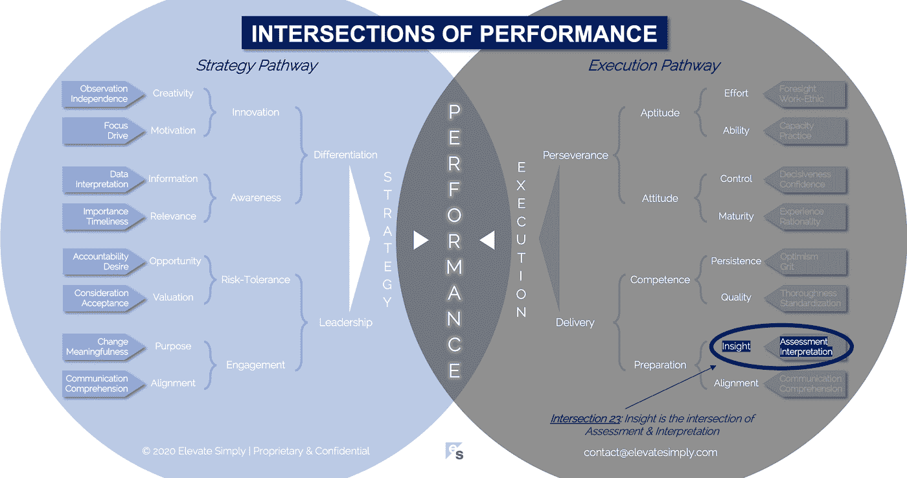

# 23.洞察力:评估和解释的交叉点

> 原文：<https://medium.datadriveninvestor.com/23-insight-the-intersection-of-assessment-interpretation-a749df1d0f93?source=collection_archive---------27----------------------->

Image from 123rf.com

深刻洞察力的本质是简单 —吉姆·科林斯

作为一名年轻的顾问，我被告知，当项目进展不顺利时，顾问会受到指责，这并不奇怪；当项目进展顺利时，顾问不会得到认可，这是我以前没有考虑过的。据说顾问在公开场合受到诋毁，而在私下受到赞扬。后来的经验告诉我，反过来也是对的。作为顾问，我们的意图并不是要为自己感到难过，而是如果我觉得自己无法应对这一现实，我可能会选择另一份工作。

我发现这非但没有阻止我从事咨询行业，反而成了我拼命工作的动力。我周围的许多人都有同感。当然，失败是会发生的，我们并不是在每个项目上都完全成功，但是我们成功的要比失败的多得多。这种压力和环境创造了一种有意义的友情，甚至在其他项目或其他公司的顾问之间也是如此。

顾问期望提供的一个核心好处是洞察力。有一个笑话说，顾问只是用你自己的手表告诉你现在是什么时间。有趣的是(有点讽刺的是)，这有很多事实。以我的经验来看，有时候最好的“咨询”是最简单的，包括提醒你基础知识的价值。这并不是说客户不知道基本原理，而是说他们的注意力理所当然地集中在许多其他事情上，以至于重新关注他们已经知道的东西的建议和推荐可能会令人耳目一新。

这并不是说咨询行业没有创新，或者只是简单地完全专注于基础，而是说有时候最好的见解是我们事后可能会说是最明显的。

**什么是顿悟交集？**

洞察力是评估和解释的交叉点*(见下图交叉点 23)*。没有解释的评估就是参加考试，永远不知道结果。没有评估的解释是一种欺骗(愚蠢的胡乱猜测)。

洞察力是通过努力学习或完成某事而获得的价值。洞察力经常被描绘成啊哈时刻，其形式可以是:

*   假设的验证
*   从成功中吸取的教训
*   从失败中吸取的教训
*   意外或未计划的结果

洞察力为决策提供信息，引领创新，激励行动并改变范式。

*评估*

大多数时候,“评估”这个词与一种正式的类似测试的工具联系在一起，这种工具用于判断某项技能的熟练程度或在一系列测试中的相对位置。然而，在我们生命的各个阶段，从出生(我们能呼吸、看东西、吃东西、制造噪音、存在)到老年(同样，我们能呼吸、看东西、吃东西、制造噪音、存在)，以及其间的一切，我们都要接受各种各样的评估。

组织也处于持续评估的状态。在内部，领导者应该评估业务的各个方面，以确保向前发展。对外，客户、投资者和利益相关者正在评估公司是否值得他们的赞助、投资和关注。总的来说，评估可以提供洞察力，如果采取适当的行动，可以促进组织的持续关注。

评估对人和组织来说都很有趣，因为我们希望从结果中学到一些东西。然而，就洞察力而言，仅仅为了检查一个方框而进行评估，而没有适当的解释或后续行动，可能会适得其反，也是对资源和善意的滥用。

交叉点 23:洞察力=评估+解释

Image by [Brett Simpson](https://medium.com/u/191cf90a65d7?source=post_page-----a749df1d0f93--------------------------------)

*解读*

评估是有帮助的，因为它们提供信息。没有解释，这些信息是没有用的。解读有多种形式，从简单的测试分数，到复杂的评估结果对被评估的个人或公司意味着什么。所有这些都导致了洞察力。

他们可以是客观的或主观的，买方必须小心。不正确的解释会产生负面影响(想想假阳性)。可信度是解释的关键要素。相同的评估结果对不同的人或组织可能意味着不同的事情。做口译的人有责任把它做好(很多时候这是顾问被要求做的)。

见解的好坏取决于对它们的解释。

**领导者能做什么？**

当谈到作为评估和解释功能的洞察力时，领导者有三个关键责任。

1.  *不要过度评估:*如果评估过度，评估会失去效力，领导者也会失去团队的信心
2.  分享见解:如果见解存在，但从未被分享，个人和团队将会认为评估练习是徒劳无益的
3.  *使用洞察力:*被分享但从未付诸行动的洞察力，或没有有效行动的洞察力，表明资源浪费和有问题的领导

**总结&下一步**

每个组织都需要来自外部或内部的洞察力。并不是所有的见解都有帮助，但是这些见解为从战略规划到产品路线图再到领导团队的调整提供了有价值的输入。

正确使用从评估和解释中获得的洞察力，可以将优秀的员工与平庸的员工区分开来。

下次我们将检查性能的第 24 个交叉点，即**质量交叉点**。

*在这一系列文章中，我们探索*性能*的交叉点，共有 30 个。*绩效的交叉点*框架是基于*[*Brett Simpson*](https://www.linkedin.com/in/brettjsimpson/)*[*董事总经理(简称为*](https://www.linkedin.com/company/elevatesimply/)*)20 多年来作为企业家、顾问和投资者在大大小小的组织中的领导经验和见解。**

***绩效-文章链接的交叉点***

*1.[绩效:策略的交集&执行](/the-innovation/1-performance-the-intersection-of-strategy-execution-2bf06329f8d4)*

*2.[战略:领导力的交叉点&分化](/the-innovation/2-strategy-the-intersection-of-leadership-differentiation-a568b17731ab)*

*3.[领导:约定的交集&风险承受能力](/the-innovation/3-leadership-the-intersection-of-engagement-risk-tolerance-f8c887e6c1d3)*

*4.[差异化:创新的交叉点&意识](/@brettjsimpson/4-differentiation-the-intersection-of-innovation-awareness-a21d053ecf12)*

*5.[订婚:目的的交集&对齐](/@brettjsimpson/5-engagement-the-intersection-of-purpose-alignment-953747437c26)*

*6.[风险承受能力:机会的交集&估值](/@brettjsimpson/6-risk-tolerance-the-intersection-of-opportunity-valuation-29cf4d9a0ac)*

*7.[认知:信息的交集&关联性](/@brettjsimpson/7-awareness-the-intersection-of-information-relevance-f0fd5322bcb7)*

*8.[创新:创造力的交汇点&动机](/@brettjsimpson/8-innovation-the-intersection-of-creativity-motivation-7c1a12e0d5e2)*

*9.[目的:变化的交叉点&意义](/@brettjsimpson/9-purpose-the-intersection-of-change-meaningfulness-9f12b0153e1)*

*10.[估值:对价的交集&验收](/@brettjsimpson/valuation-the-intersection-of-consideration-acceptance-eebe7b15e763)*

*11.[机遇:欲望的交汇&问责](/the-innovation/opportunity-the-intersection-of-desire-accountability-7e81adb1e195)*

*12.[相关性:重要性的交集&及时性](/@brettjsimpson/relevance-the-intersection-of-importance-timeliness-56cc748eb066)*

*13.[信息:数据的交集&解读](/@brettjsimpson/information-the-intersection-of-data-interpretation-62acc94ba8bf)*

*14.[动机:焦点的交集&驱动](/@brettjsimpson/14-motivation-the-intersection-of-focus-drive-d9ebd3ca9951)*

*15.[创造力:观察的交集&独立性](/@brettjsimpson/15-creativity-the-intersection-of-observation-independence-57f7294acb2b)*

*16.[执行:毅力的交汇&交付](/the-innovation/16-execution-the-intersection-of-perseverance-delivery-73bdd004fd0)*

*17.[交付:准备&能力](/@brettjsimpson/17-delivery-the-intersection-of-preparation-competence-556a06d33238)的交集*

*18.[毅力:天资的交汇&态度](/@brettjsimpson/18-perseverance-the-intersection-of-aptitude-attitude-f7f9d96f01dd)*

*19.[准备:有识之士的交集&对齐](/@brettjsimpson/19-preparation-the-intersection-of-insight-alignment-752fd11af553)*

*20.能力:坚持与质量的交汇点*

*21.态度:控制和成熟的交叉点*

*22.天资:努力和能力的交集*

*23.洞察力:评估和解释的交叉点*

*24.质量:彻底性和标准化的交汇点*(即将推出！)**

*25.坚持:乐观与勇气的交汇*(即将推出！)**

*26.成熟:经验与理性的交集*(即将推出！)**

*27.控制:果断与自信的交集*(即将推出！)**

*28.能力:能力与实践的交集*(即将推出！)**

*29.努力:远见和职业道德的交集*(即将推出！)**

*30.走向:传播与综合的交汇点*(即将推出！)**

*点击订阅 DIntel [。](https://ddintel.datadriveninvestor.com/)*

*在这里加入我们的网络:[https://datadriveninvestor.com/collaborate](https://datadriveninvestor.com/collaborate)*