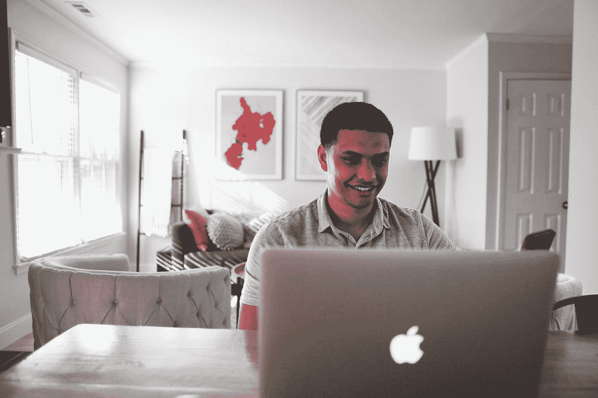

# 24 个月后，这项 3K/Year“过度消费的千禧一代”调查仍然令人觉得荒谬

> 原文：<https://medium.datadriveninvestor.com/24-months-later-this-3k-year-overspending-millennials-survey-still-feels-absurd-f1c50ef4b917?source=collection_archive---------6----------------------->

## 个人理财

## 用意志力去创造现金，而不是囤积现金。

Photo by [MayoFi](https://unsplash.com/@mayofi?utm_source=medium&utm_medium=referral) on [Unsplash](https://unsplash.com?utm_source=medium&utm_medium=referral)

两年前的这个月，我想起了在网上做自己的事(可能是在 YouTube 上看变装皇后蒙太奇)，当时我看到了下面的标题:

***“研究发现，千禧一代每年在咖啡、社交、食物和衣服上的花费超过 3000 英镑”***

这篇文章概述了巴克莱银行在 2019 年对 20 至 37 岁的人进行的[调查](https://mashable.com/article/millennial-coffee-spending-reaction/)。对 2000 份回复的总结发现，年轻的英国人平均每年在外出就餐、社交、咖啡和零食以及服装上花费 3312.74 英镑。

每月支出的逐项细目分类如下:

*   **75.35/月**关于社交，
*   **61.58/月**在新衣服、鞋子或配饰上，
*   **58.83/月**外出就餐，
*   **43.58/月**外卖，以及
*   **36.75 英镑/月**咖啡等日常美食。

你可以说我轻浮，但是这些每月的支出看起来……我不知道……是不是很合理？

我在谷歌上搜索了服装类的典型个人理财建议。根据来自商业内幕*的[综合报道](https://www.businessinsider.com/how-much-do-i-spend-on-clothes-how-to-clothes-budget-2018-7)，个人理财专家称，服装支出应该占到你税后工资的 5%左右。*

从上面的数字中快速算出，60 英镑/月的服装费对…**在算盘上敲珠子** … 14，600 英镑/年的实得工资是合适的，这显然远低于工人工资的中位数。

我们只能说这项研究在发表后反响很差:

标题并没有让我太难堪。但随后，新闻稿继续分享了巴克莱财务总监的最佳理财建议，这些建议并不令人震惊:

*   *“设定一个目标并朝着它努力…”*
*   *“确定是什么让你花钱…”*
*   “不要把你喜欢的东西都剪掉……只剪一部分。”

我倾向于不同意。预算意识很可爱，不要误会。我经营着一家公司，努力让我们的开支保持不变。

但对我来说，在个人理财中最重要的事情甚至从未在新闻稿中提及——它与疫情的经济*尤其*相关。

*(* ***相关:*** *在此下载作者的免费工具包 9 篇文章模板* [***。*T12**](https://www.nickwolny.com/free-toolkit-mp)T14)

# 大多数千禧一代实际上想存更多钱

也许当有人来找我和我的冷饮时，我会觉得受到了人身攻击。根据曼彻斯特晚报最初的报道，千禧一代确实想存更多的钱:

> ”在接受调查的 2000 人中，有三分之二(67%)的人觉得自己存得不够多，或者根本没有存过钱。在那些定期储蓄的人当中，平均金额是每月 159.89 英镑。
> 
> 四分之三(75%)的受访者愿意在支出上做出短期妥协，为长期生活目标提供资金，如买房、豪华度假或买车。”——*曼彻斯特晚报*

千禧一代的消费倾向也与前几代人没有太大不同；只是风景变了。

美联储的美国经济学家的研究发现，“千禧一代的消费偏好似乎与前几代人没有明显不同”。

这是我的抱怨:不管你怎么划分，如果你每年挣 5 万美元，没有什么忍者技巧预算会比你出去把最高收入再提高一点更能带来更多的财富。

削减你的预算当然很重要，但是在商业和个人生活中控制你的银行账户的最快方法就是出去赚更多的钱。

那我们为什么不呢？

# 金钱和意志力

在《意志力》一书中，作家兼心理学家罗伊·鲍梅斯特提到了他 1998 年著名的“巧克力和萝卜”研究。

在这个实验中，参与者被带到一个有强烈巧克力饼干味道的房间。为了最大化诱惑，他们甚至被展示了一批新鲜出炉的蛋糕。

*   控制组吃饼干，但可变组却吃萝卜。
*   这两组人后来被要求完成持续性很强的谜题。他们随时都可能放弃。
*   结果是，在放弃之前，饼干组坚持的时间是萝卜组的两倍多(T2)。

如果你想拥有更多的钱，存更多的钱……拿出你的意志力，从你的预算中到处削减一块钱，把它用在坚持不懈的难题上，比如创造新的收入来源。个人理财专家 Ramit Sethi 在最近一次 [*【人物】*](https://people.com/human-interest/gain-financial-independence-and-retire-early/) 杂志采访中提出了一个很好的观点:*“你能削减多少是有限度的，但你能赚多少是没有限度的。”*

> “你能削减多少是有限度的，但你能赚多少是没有限度的。”—拉米特·塞西，《人物》杂志

随着数百万人在快速变化的疫情经济中导航，成功的公式似乎是平衡谨慎的支出和用你需要的任何东西来为自己加油，以出去招徕更多的现金。

**翻译:当该死的咖啡能让你精力充沛地去做有成效的、可怕的事情时，就去买它吧。**

# 向你的银行账户增加更多钱的最可靠的方法

我知道，我知道— *“多赚点钱就行！”*说起来容易做起来难。但是如果你想就此进行头脑风暴，拿起纸和笔，尝试下面的一个想法，给自己一个好的开始。

## **协商加薪**

*“我想加薪，求你了”*通常是人事部门的死亡之吻。相反，向你的雇主推销一个特殊的项目和成功基准，如果实现了，会给你奖金。这是双赢。

相信我，如果一个员工带着十个如何让公司赚更多钱的想法来找我，然后出去成功地实施了其中的一些，我会很乐意分享这些财富。

## 开始自由职业

在线自由职业继续蓬勃发展。去学习一项技能，然后在像 Upwork 或 Fiverr 这样每天都有人招聘的就业市场上提供这项技能。

## **创造内容**

无论是在这个平台上还是在另一个不同的平台上，内容创作都可以通过展示广告或合作伙伴支出带来现金。内容创作需要实践，但一旦你写了或制作了对他人有价值的东西，它会持续数月甚至数年。

个人理财是一生中需要培养的一项重要教育……当你真的在银行里有了钱的时候，会有趣得多。寻找能赚更多钱的方法，在这个过程中购买让你满意的东西，这样你就能获得两个世界的好处。

🎉想知道我如何为像*企业家*和*快公司*这样的网站每周写 5 篇以上的文章吗？一个词:模板。我已经将其中的 9 条和我的顶级技巧汇编成一个免费的三资源文章模板工具包:

➡️在这里获取你的免费工具包。