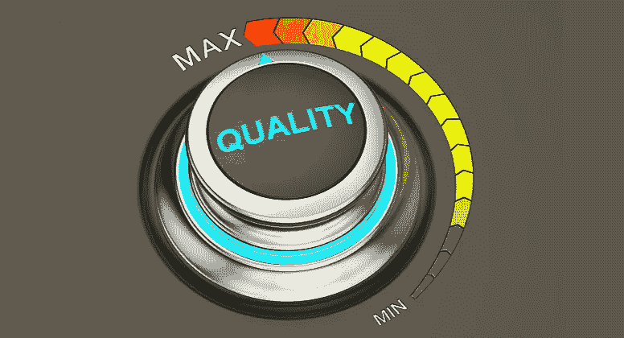
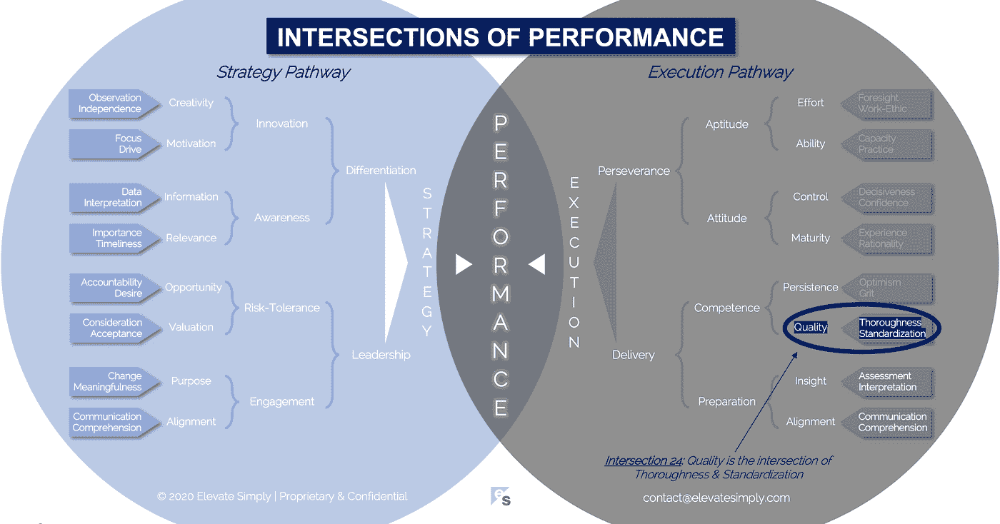

# 24.质量:彻底性和标准化的交叉点

> 原文：<https://medium.datadriveninvestor.com/24-quality-the-intersection-of-thoroughness-standardization-d0bf0673eb8e?source=collection_archive---------12----------------------->

Image from 123rf.com

在之前的工作中，我在一家软件公司负责质量。如果这听起来像是测试，那你就是对的。这是一个简单的词，测试，但是如果你测试过软件，简单可能不是第一个出现在你脑海中的描述符。

我喜欢这个角色，首先是因为团队里的人。热情、能干、高度敬业的个人。我也喜欢我们目标的复杂性…评估产品的质量，不让缺陷漏过生产。我们做了功能测试，包括系统、集成、回归、测试等。我们还进行了非功能性测试，包括性能、负载、压力、安全性、可用性、本地化等。我们的一些测试是手工的，一些是自动化的。随着时间的推移，我们的测试库呈指数增长。我们既有在岸测试人员，也有离岸测试人员，所以我们的努力跟随着太阳，很少停止。

尽管我们的团队是唯一一个名称中有“质量”这个词的团队，但我们确实是软件质量工作的最后一道防线。如果做得好，质量是一个过程，而不仅仅是一个结果。从构思和需求，到优先化和设计，到开发和集成，到测试(以及中间的一切)，质量贯穿于整个过程或生命周期。

所有优秀的软件人都知道，在过程中发现缺陷越晚，修复的代价就越大。任何业务流程都是如此。

**什么是品质交集？**

质量是彻底性和标准化的交叉点*(见下图 24 号交叉点)*。没有标准化的彻底是对一项任务的勤奋，而不是每次都采取相同的步骤。没有彻底性的标准化是一个明确但不完整的过程。

在软件公司，我们不断测试新特性和回归，以确保新代码不会破坏现有功能。我们定期添加测试案例和脚本来提高彻底性。与此同时，我们已经为如何编写测试用例以及脚本，如何以及何时执行它们，以及由谁来执行制定了标准。如果没有这种标准化，我们的测试将会是一场无组织的混战，缺乏计划测试特定窗口和结果报告的能力。

人才获取是商业的另一个常见方面，需要彻底性和标准化来确保质量。采购流程的彻底性旨在确保识别、评估和决定合适的候选人。标准化的目的是确保过程的公平性和对候选人进行现实有效的比较的能力。

根据我的经验，质量属于商业的每一个方面。做得好，它表现为功效和效率，兼而有之。

*彻底性*

质量的彻底性的目的是提醒我们，它不仅仅适用于最终结果，而是整个过程的一部分。不管一个组织所遵循的各种过程方法，在整个过程中灌输质量检查和度量提供了一个更好的机会来尽早发现问题，并最小化解决问题的成本。彻底就是撒下一张大网，以达到最大的、合乎逻辑的覆盖面。

交叉点 24:质量=彻底性+标准化

Image by [Brett Simpson](https://medium.com/u/191cf90a65d7?source=post_page-----d0bf0673eb8e--------------------------------)

*标准化*

标准化涵盖了质量测量的可重复性方面。作为一个公司或团队，我们是否有足够的纪律性来 1)创建可重用的过程和 2)一致地使用这些过程？据说精神错乱的定义是一遍又一遍地做同样的事情，却期待不同的结果。标准化则相反…我们一遍又一遍地做同样的事情，因为我们想要同样的结果，如果我们得到不同的结果，那就有质量问题。标准化是通过过程创造熟练和熟练。

**领导者能做什么？**

对于领导者来说，质量就是对细节的关注。我们是否始终如一地在正确的时间以正确的方式专注于正确的事情？优秀的领导者将质量作为对团队成员的期望。此外，它们内置了要跟踪、报告和测量的质量度量。

质量的目标是给我们最好的机会第一次就把事情做好。

**总结&下一个**

质量是永无止境的追求。像六适马和 CMMI 这样的项目是他们特定目标过程的彻底性和标准化的缩影。

大多数公司都有自己内部开发的质量管理流程。关键是要不断地评估它们，并确保它们是相关的和被遵守的。

下次我们将检查性能的第 25 个交叉点，也就是**持久性交叉点**。

在这一系列文章中，我们探索了性能的交集，共有 30 个。绩效的交叉点*框架基于*[*Brett Simpson*](https://www.linkedin.com/in/brettjsimpson/)*[*董事总经理【简称为*](https://www.linkedin.com/company/elevatesimply/)*】20 多年来作为企业家、顾问和投资者在大大小小组织中的领导经验和见解。**

***绩效-文章链接的交集***

*1.[绩效:战略的交集&执行](/the-innovation/1-performance-the-intersection-of-strategy-execution-2bf06329f8d4)*

*2.[战略:领导层的交集&分化](/the-innovation/2-strategy-the-intersection-of-leadership-differentiation-a568b17731ab)*

*3.[领导力:参与的交集&风险承受能力](/the-innovation/3-leadership-the-intersection-of-engagement-risk-tolerance-f8c887e6c1d3)*

*4.[差异化:创新的交叉点&意识](/@brettjsimpson/4-differentiation-the-intersection-of-innovation-awareness-a21d053ecf12)*

*5.[啮合:目的的交集&对准](/@brettjsimpson/5-engagement-the-intersection-of-purpose-alignment-953747437c26)*

*6.[风险承受能力:机会的交叉点&估值](/@brettjsimpson/6-risk-tolerance-the-intersection-of-opportunity-valuation-29cf4d9a0ac)*

*7.[认知:信息的交集&关联性](/@brettjsimpson/7-awareness-the-intersection-of-information-relevance-f0fd5322bcb7)*

*8.[创新:创造力的交汇点&动机](/@brettjsimpson/8-innovation-the-intersection-of-creativity-motivation-7c1a12e0d5e2)*

*9.[目的:变化的交叉点&意义](/@brettjsimpson/9-purpose-the-intersection-of-change-meaningfulness-9f12b0153e1)*

*10.[估价:对价的交集&验收](/@brettjsimpson/valuation-the-intersection-of-consideration-acceptance-eebe7b15e763)*

*11.[机遇:欲望的交汇&问责](/the-innovation/opportunity-the-intersection-of-desire-accountability-7e81adb1e195)*

*12.[相关性:重要性的交集&及时性](/@brettjsimpson/relevance-the-intersection-of-importance-timeliness-56cc748eb066)*

*13.[信息:数据的交集&解读](/@brettjsimpson/information-the-intersection-of-data-interpretation-62acc94ba8bf)*

*14.[动机:焦点的交集&驱动](/@brettjsimpson/14-motivation-the-intersection-of-focus-drive-d9ebd3ca9951)*

*15.[创造力:观察的交叉点&独立性](/@brettjsimpson/15-creativity-the-intersection-of-observation-independence-57f7294acb2b)*

*16.[执行力:毅力的交汇&交付](/the-innovation/16-execution-the-intersection-of-perseverance-delivery-73bdd004fd0)*

*17.[交付:准备&能力](/@brettjsimpson/17-delivery-the-intersection-of-preparation-competence-556a06d33238)的交集*

*18.[毅力:天资的交汇&态度](/@brettjsimpson/18-perseverance-the-intersection-of-aptitude-attitude-f7f9d96f01dd)*

*19.[准备:视野交汇&对准](/@brettjsimpson/19-preparation-the-intersection-of-insight-alignment-752fd11af553)*

*20.能力:坚持与质量的交汇点*

*21.态度:控制和成熟的交叉点*

*22.天资:努力和能力的交集*

*23.洞察力:评估和解释的交叉点*

*24.质量:彻底性和标准化的交叉点*

*25.坚持:乐观与勇气的交汇*(即将推出！)**

*26.成熟:经验与理性的交汇*(即将推出！)**

*27.控制:果断与自信的交集*(即将推出！)**

*28.能力:能力与实践的交集*(即将推出！)**

*29.努力:远见和职业道德的交集*(即将推出！)**

*30.对齐:传播与综合的交汇点*(即将推出！)**

*点击订阅 DIntel [。](https://ddintel.datadriveninvestor.com/)*

*在这里加入我们的网络:[https://datadriveninvestor.com/collaborate](https://datadriveninvestor.com/collaborate)*