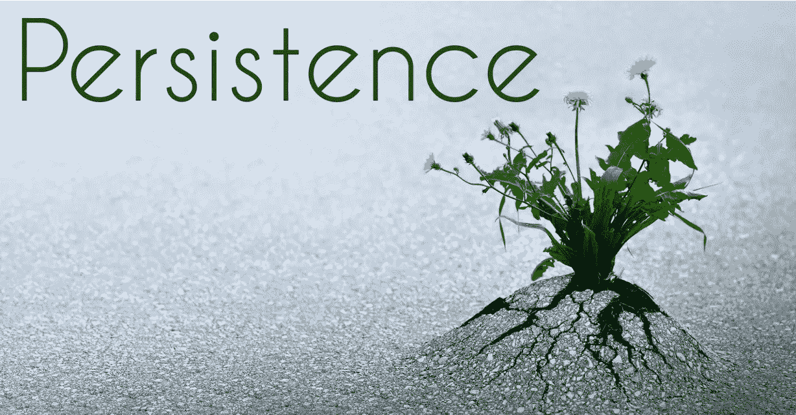
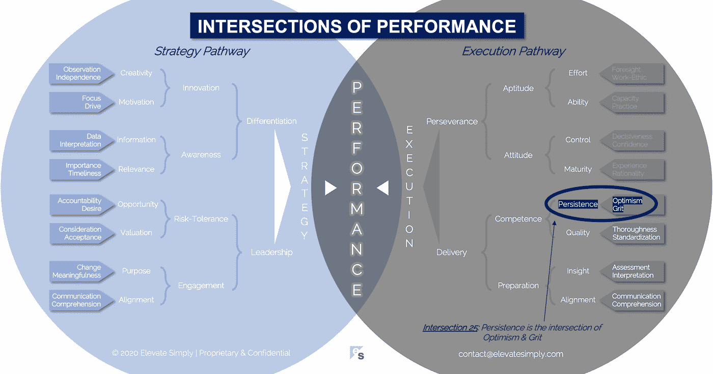

# 25.坚持:乐观和勇气的交集

> 原文：<https://medium.datadriveninvestor.com/25-persistence-the-intersection-of-optimism-grit-e6e22b0a923?source=collection_archive---------28----------------------->

Image from 123rf.com

我是一个连续创业者。我创办过公司，也退出过公司。有些优雅，有些不那么优雅。我也是许多公司的联合创始人、员工、顾问或投资者。商业让我着迷，我一直在学习、阅读和创造。我看到机会几乎无处不在，想要追求更多，但一天中似乎没有足够的时间。

我的(自我评估)优势之一是我有能力找出方法来改善我看到的几乎任何事情。这也是我的弱点之一，我老婆给我解释过很多次了。我无法不分析和评论某件事(公司、战略、产品、流程、运动、游戏、电影、问题)或某人。幸运的是，大多数时候我能够把我的想法藏在心里，除非明确要求我提供。

我相信这是我创业精神和动力的源泉。我总是看到可能性和潜力。当这种可能性与我感兴趣的领域发生冲突时，我可以集中精力抓住这个机会，走向成功或失败。在这方面，我非常坚持。

我对坚持不懈的人的观察是，如果他们觉得周围的人无法与他们的精力和速度相匹配，他们要么很快失去兴趣，要么试图控制他人对前进的负面影响最小化。

**什么是执着交集？**

坚持是乐观和勇气的交汇*(见下图 25 路口)*。没有勇气的乐观是一座参与的奖杯。没有乐观的勇气是没有希望的苦差事。

坚持有时会和固执混淆。固执表现为不愿意妥协，即使这会使成功面临风险，而坚持则表现为愿意为了进步而改变或适应。

*乐观*

乐观是对可能性的信念。有时被描述为“半杯水”的心态，它提供了为了达到目标而付出努力的动力。乐观也是穿透甚至忽略悲观的能力。企业家是最乐观的人。如果不乐观，他们就不会冒险去创新和建立新产品、服务和公司。

乐观是一种可以培养的心态。乐观主义者寻找值得庆祝的成功，不管它有多小。将积极性保持在最前沿可以成为人们、团队和组织的重要动力。

交叉点 25:坚持=乐观+勇气

Image by [Brett Simpson](https://medium.com/u/191cf90a65d7?source=post_page-----e6e22b0a923--------------------------------)

*砂砾*

勇气是在困难的时候坚持下去的必要条件，成功的可能性似乎很小。尽管有困难和挑战，坚持下去的意愿和能力是坚持的另一个关键因素。当我想到 grit 时，我想到了我祖父告诉我的关于他在第二次世界大战期间在海外的故事。他和其他老兵所经历的奇迹显然是他们坚强毅力的结果。

在企业界，有许多关于勇气的故事。大多数都是从人们一次又一次地尝试解决问题或创新开始的。例如，发明家要经历数百次甚至数千次的迭代才能让某样东西发挥作用。无数次这种追求都以一无所获而告终，除了尝试的经历，这本身就很有价值。

**领导者能做什么？**

领导者应该在他们的团队和组织中建立一种坚持不懈的心态。他们认识到坚持和固执之间的区别，并且能够克服固执。

领导者是乐观主义者，但不是天真的。他们以身作则，促进对机会和可能性的信念。

**总结&下一个**

坚持是任何组织生存的关键。没有一家公司没有成功。

下一次我们将考察绩效的第 26 个交叉点，也就是**成熟度交叉点**。

在这一系列文章中，我们探索了性能的交叉点，共有 30 个。绩效的交叉点*框架基于*[*Brett Simpson*](https://www.linkedin.com/in/brettjsimpson/)*[*董事总经理*](https://www.linkedin.com/company/elevatesimply/) *的经验和见解，以及他作为企业家、顾问和投资者在大大小小的组织中 20 多年的领导经验。**

***绩效-文章链接的交集***

*1.[绩效:策略的交集&执行](/the-innovation/1-performance-the-intersection-of-strategy-execution-2bf06329f8d4)*

*2.[战略:领导力的交叉点&分化](/the-innovation/2-strategy-the-intersection-of-leadership-differentiation-a568b17731ab)*

*3.[领导:参与的交集&风险承受能力](/the-innovation/3-leadership-the-intersection-of-engagement-risk-tolerance-f8c887e6c1d3)*

*4.[差异化:创新的交叉点&意识](/@brettjsimpson/4-differentiation-the-intersection-of-innovation-awareness-a21d053ecf12)*

*5.[订婚:目的的交集&对齐](/@brettjsimpson/5-engagement-the-intersection-of-purpose-alignment-953747437c26)*

*6.[风险承受能力:机会的交叉点&估值](/@brettjsimpson/6-risk-tolerance-the-intersection-of-opportunity-valuation-29cf4d9a0ac)*

*7.[认知:信息的交集&关联性](/@brettjsimpson/7-awareness-the-intersection-of-information-relevance-f0fd5322bcb7)*

*8.[创新:创造力的交汇点&动机](/@brettjsimpson/8-innovation-the-intersection-of-creativity-motivation-7c1a12e0d5e2)*

*9.[目的:变化的交叉点&意义](/@brettjsimpson/9-purpose-the-intersection-of-change-meaningfulness-9f12b0153e1)*

*10.[估价:对价的交集&验收](/@brettjsimpson/valuation-the-intersection-of-consideration-acceptance-eebe7b15e763)*

*11.[机会:欲望的交汇&责任](/the-innovation/opportunity-the-intersection-of-desire-accountability-7e81adb1e195)*

*12.[相关性:重要性的交集&及时性](/@brettjsimpson/relevance-the-intersection-of-importance-timeliness-56cc748eb066)*

*13.[信息:数据的交集&解读](/@brettjsimpson/information-the-intersection-of-data-interpretation-62acc94ba8bf)*

*14.[动力:十字路口的焦点&驱动](/@brettjsimpson/14-motivation-the-intersection-of-focus-drive-d9ebd3ca9951)*

*15.[创造力:观察的交集&独立性](/@brettjsimpson/15-creativity-the-intersection-of-observation-independence-57f7294acb2b)*

*16.[执行:毅力的交汇&交付](/the-innovation/16-execution-the-intersection-of-perseverance-delivery-73bdd004fd0)*

*17.[交付:准备&能力](/@brettjsimpson/17-delivery-the-intersection-of-preparation-competence-556a06d33238)的交集*

*18.[毅力:天资的交汇&态度](/@brettjsimpson/18-perseverance-the-intersection-of-aptitude-attitude-f7f9d96f01dd)*

*19.[准备:有识之士的交汇&对准](/@brettjsimpson/19-preparation-the-intersection-of-insight-alignment-752fd11af553)*

*20.能力:坚持与质量的交汇点*

*21.态度:控制和成熟的交叉点*

*22.天资:努力和能力的交集*

*23.洞察力:评估和解释的交叉点*

*24.质量:彻底性和标准化的交叉点*

*25.坚持:乐观和勇气的交集*

*26.成熟:经验与理性的交集*(即将推出！)**

*27.控制:果断与自信的交集*(即将推出！)**

*28.能力:能力与实践的交集*(即将推出！)**

*29.努力:远见和职业道德的交集*(即将推出！)**

*30.对齐:传播与综合的交汇点*(即将推出！)**

*点击订阅 DIntel [。](https://ddintel.datadriveninvestor.com/)*

*在这里加入我们的网络:[https://datadriveninvestor.com/collaborate](https://datadriveninvestor.com/collaborate)*