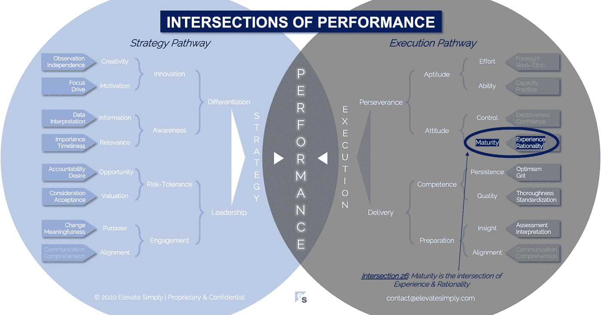

# 26.成熟:经验与理性的交汇点

> 原文：<https://medium.datadriveninvestor.com/26-maturity-the-intersection-of-experience-rationality-7c362d61bf38?source=collection_archive---------20----------------------->

Image from 123rf.com

"成熟是忍受不确定性的能力."—约翰·芬利

我记得在研究生院时，唯一的课程名称之一，或者可能是课程的口号是“不确定性下的决策”。我不记得关于课程本身的任何事情，但我仍然经常想起那个名字/标语，因为我每天都需要在没有、很少或不完善信息的情况下做出决定。

在我职业生涯的早期，我寻求确定性，并通过在确定性领域工作，很好地识别和利用了成功的方法。随着我获得更多的经验，我注意到两件事与我的确定性亲和力有关:

1.  随着你在公司职位的上升，确定性与不确定性的平衡会更加倾向于不确定性
2.  最有价值的人是那些在不确定空间中有效工作、交付和领导的人

这些认识改变了我的一切。我开始在我参与的项目、与我共事的客户以及我所做的工作中寻找不确定性。通过这种方法的改变，我对自己和自己的工作偏好有了三点了解:

1.  我更喜欢在别人搞砸的领域和项目中工作，或者在有重大不确定性的地方工作，因为有更大的机会产生积极的影响；(在我少年时设计汽车的经历中，清洁一辆脏兮兮的汽车比清洁一辆勉强脏兮兮的汽车更令人满意，因为之前和之后的差异)
2.  当你在不确定的情况下工作时，其他人通常会意识到这一点，如果事情不尽如人意，他们更容易原谅你，而不是你搞砸了预期的确定性；(在某种程度上，与多年来一直做同一份工作的人相比，企业家有目的地介入不确定性，因此通常能获得更多的回旋余地和宽恕)
3.  在工作环境中，我发现确定性有点无聊，而不确定性提供了挑战、风险和机会的可能性……创造力+创新；(确定性意味着已知的界限和刚性，这在类似流水线的场景中对质量是必要的，但我知道这些不是我最开心或最能利用的情况)

这些众所周知的灯泡为我的职业成熟创造了一个转折点。我明白了，成熟不是一个永久的目的地，而是一个不断发展的旅程，与其说它存在，不如说它不存在。

**什么是成熟的交集？**

成熟是经验与理性的交集*(见下图 26 路口)*。没有理性的经验，简直就是长寿。没有经验的理性是没有用的书本知识。

以我的经验来看，职业成熟不会发生在特定的年龄或任期，而是对影响和控制的现实的认可和接受。我们影响和/或控制决策、人员、策略、行为、结果等的能力是有限的。有些人比其他人更快意识到这一点，而有些人从来没有。这花了我一段时间(也许比应该花的时间更长)，但自从它发生以来，它给我提供了一种自由感和工作的目的。

重要的是，没有一个成熟阶段是“正确的”。对人 A 有效的对人 b 无效。我的观察是，为了成功，我们需要成熟的多样性，就像我们在商业的所有其他方面一样。

*经历*

经验通常是指时间或持续时间。虽然以此作为衡量标准有些道理，但我发现最好还是关注体验的质量。我有过多次短暂但强度惊人的工作经历，我觉得自己在几周或几个月的时间里变老了。另一方面，我也有过持续时间很长的经历，但这种经历的“价值”并不符合我对时间投入应该产生的结果的理解。

经验也是我们个人风险容忍度的函数。一个人愿意在职业上尝试的，对其他人来说不都一样吗？那些敢于冒险的人似乎比不冒险的人更有可能在一段时间内经历更多(成功和失败)。此外，即使是在同一个团队做同一个项目的人也会带走不同的“经验”，所以很难概括经验。

交集 26:成熟=经验+理性

Image by [Brett Simpson](https://medium.com/u/191cf90a65d7?source=post_page-----7c362d61bf38--------------------------------)

*合理性*

理性是将逻辑和学习应用于决策的能力。理性要避免的陷阱是假设同意一个决定的人通过同样的途径得出结论。我们每个人都有自己的偏见和看法，影响我们的理性。

理性塑造成熟。如果经验是成熟中的“是什么”,理性就是“为什么”。为了决策和进步而将理性应用于经验的能力不会在人生的某一时刻神奇地出现。不管它何时发生或发生的程度如何，理性在成熟度等式中起着关键作用。

**领导者能做什么？**

职业成熟度是动态的，甚至可能在不同阶段之间多次振荡。领导者需要了解团队成员的优势和劣势。他们需要知道每个人对什么感到舒服，对什么感到不舒服。所有这些因素都是职业成熟度的驱动因素。

当然，成熟度很难确定，领导者也不能强迫它或它的发展。但是当他们看到它时，他们可以把它作为他人的榜样和达到目的的手段。

**总结&下一个**

我知道自己喜欢做什么，不喜欢做什么。我喜欢不自在和在不确定的情况下工作。这是我职业成熟旅程的当前阶段，我相信它会继续发展。

下次我们将检查性能的第 27 个交叉点，也就是**控制交叉点**。

*在这一系列文章中，我们探索了*性能*的交叉点，共有 30 个。*绩效的交叉点*框架是基于*[*Brett Simpson*](https://www.linkedin.com/in/brettjsimpson/)*[*董事总经理(简称为*](https://www.linkedin.com/company/elevatesimply/)*)20 多年来作为企业家、顾问和投资者在大大小小的组织中的领导经验和见解。**

***绩效-文章链接的交集***

*1.[绩效:策略的交集&执行](/the-innovation/1-performance-the-intersection-of-strategy-execution-2bf06329f8d4)*

*2.[战略:领导层的交集&分化](/the-innovation/2-strategy-the-intersection-of-leadership-differentiation-a568b17731ab)*

*3.[领导:约定的交集&风险承受能力](/the-innovation/3-leadership-the-intersection-of-engagement-risk-tolerance-f8c887e6c1d3)*

*4.[差异化:创新的交叉点&意识](/@brettjsimpson/4-differentiation-the-intersection-of-innovation-awareness-a21d053ecf12)*

*5.[啮合:目的交点&对准](/@brettjsimpson/5-engagement-the-intersection-of-purpose-alignment-953747437c26)*

*6.[风险承受能力:机会的交集&估值](/@brettjsimpson/6-risk-tolerance-the-intersection-of-opportunity-valuation-29cf4d9a0ac)*

*7.[认知:信息的交集&关联性](/@brettjsimpson/7-awareness-the-intersection-of-information-relevance-f0fd5322bcb7)*

*8.[创新:创造力的交汇点&动机](/@brettjsimpson/8-innovation-the-intersection-of-creativity-motivation-7c1a12e0d5e2)*

*9.[目的:变化的交叉点&意义](/@brettjsimpson/9-purpose-the-intersection-of-change-meaningfulness-9f12b0153e1)*

*10.[估值:对价的交集&验收](/@brettjsimpson/valuation-the-intersection-of-consideration-acceptance-eebe7b15e763)*

*11.[机遇:欲望的交汇&责任](/the-innovation/opportunity-the-intersection-of-desire-accountability-7e81adb1e195)*

*12.[相关性:重要性的交集&及时性](/@brettjsimpson/relevance-the-intersection-of-importance-timeliness-56cc748eb066)*

*13.[信息:数据的交集&解读](/@brettjsimpson/information-the-intersection-of-data-interpretation-62acc94ba8bf)*

*14.[动机:焦点的交集&驱动](/@brettjsimpson/14-motivation-the-intersection-of-focus-drive-d9ebd3ca9951)*

*15.[创造力:观察的交集&独立性](/@brettjsimpson/15-creativity-the-intersection-of-observation-independence-57f7294acb2b)*

*16.[执行:毅力的交汇&交付](/the-innovation/16-execution-the-intersection-of-perseverance-delivery-73bdd004fd0)*

*17.[交付:准备&能力](/@brettjsimpson/17-delivery-the-intersection-of-preparation-competence-556a06d33238)的交集*

*18.[毅力:天资的交汇&态度](/@brettjsimpson/18-perseverance-the-intersection-of-aptitude-attitude-f7f9d96f01dd)*

*19.[准备:有识之士的交集&对齐](/@brettjsimpson/19-preparation-the-intersection-of-insight-alignment-752fd11af553)*

*20.能力:坚持与质量的交汇点*

*21.态度:控制和成熟的交叉点*

*22.天资:努力和能力的交集*

*23.洞察力:评估和解释的交叉点*

*24.质量:彻底性和标准化的交叉点*

*25.坚持:乐观和勇气的交集*

*26.成熟:经验与理性的交汇点*

*27.控制:果断与自信的交集*(即将推出！)**

*28.能力:能力与实践的交集*(即将推出！)**

*29.努力:远见和职业道德的交集*(即将推出！)**

*30.走向:传播与综合的交汇点*(即将推出！)**

*点击这里订阅英特尔[。](https://ddintel.datadriveninvestor.com/)*

*在这里加入我们的网络:[https://datadriveninvestor.com/collaborate](https://datadriveninvestor.com/collaborate)*