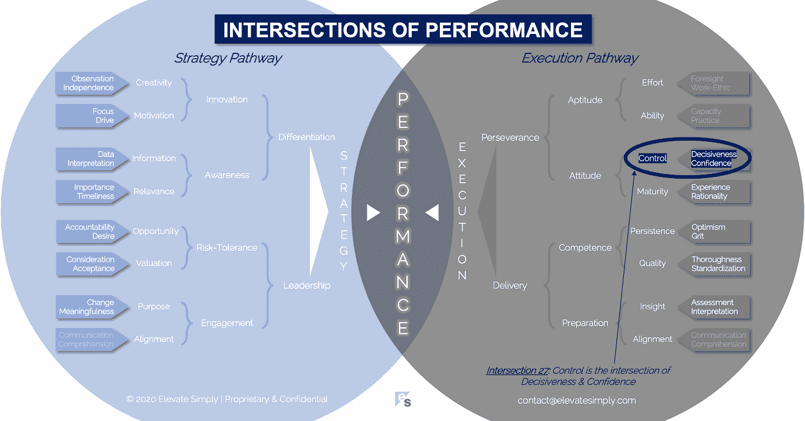

# 27.控制:果断和自信的交集

> 原文：<https://medium.datadriveninvestor.com/27-control-the-intersection-of-decisiveness-confidence-34b909c2b98e?source=collection_archive---------36----------------------->

Image from 123rf.com

我喜欢有选择。我早餐吃鸡蛋还是麦片？我要穿绿色衬衫还是白色衬衫？我到底要不要运动？我要看《网飞》或《黄金档》吗？

大多数时候，人们不会花太多精力在这些问题上(也许最后一个问题除外)。决策来得很快，因为权衡是明确的，而且后果不太可能是灾难性的。此外，我很可能每天都会面临这些选择，所以它们会成为例行公事。

选择可以提供表面上的控制，如果不是实际控制的话。我觉得如果我能做出选择，我就能掌控一切，不管这些选择有多么有限。我看到人们试图控制他们的孩子做的每一件事或他们职业生活中发生的每一件事，底线是这两件事都不可能做到。简单地说，有太多的因素他们永远无法控制。

从专业角度来说，我们通过寻找减轻风险或不确定性的方法来实施控制。有时这是可能的，有时则不可能。根据我的经验，自信是承认控制是一种我们并不总是拥有的奢侈品，而傲慢是相信控制是我们应得的。

**什么是控制交叉口？**

控制是果断和自信的交集*(见下图 27 路口)*。没有信心的果断是没有灵感的领导。没有果断的信心只是空谈，没有行动。

控制是关于阅读情况和理解可能性。这样做应该会给你提供信息，让你知道你有多少控制权，如果有的话。同样重要的是，你有能力决定在特定情况下是否要行使控制权。这让我想起一句谚语，“选择你的战斗…”。如果你现在施加控制，对未来会有什么影响？

有时候，我会对自己的控制力和行使控制力的方式做出正确的判断。有些时候情况正好相反。控制的动态本质，或者说缺乏控制，是不断发展的，并且经常是难以捉摸的目标。

*果断*

控制需要果断。甚至什么都不做的决定也是一种控制。什么都不做和没有能力做决定是有区别的，尽管有时候在外部利益相关者看来结果是一样的。缺乏决断力，尤其是当领导者表现出这种情况时，会变得很明显，并导致混乱、缺乏信心和失控。

也就是说，果断并不自动意味着一个领导者是好的或强大的。在做出决定之前，必须考虑决策的质量。果断只是控制等式的一部分。

路口 27:控制=果断+自信

Image by [Brett Simpson](https://medium.com/u/191cf90a65d7?source=post_page-----34b909c2b98e--------------------------------)

*信心*

虽然决策的结果通常是可见的，但信心却不可见。自信和傲慢之间的界限很窄，但很重要。一个人跌倒的线的一边可能会对期望的控制水平和实现的控制水平产生非常不同的影响。傲慢的决策者通常不考虑他人的意见就做出决定，而自信的决策者则相反。此外，我发现傲慢的决策者在决策时考虑的因素、时间框架和影响都比较狭隘。

这并不是说傲慢总是错误的或不成功的，而是说它不同于自信的决策。我对自信的决策者的观察是，他们激励而不是疏远周围的人，他们的自信是可以传染的。

**领导者能做什么？**

对于领导者来说，这是一种平衡行为。他们什么时候保持控制，什么时候委派控制？这需要意识到何时放弃控制权不会产生负面影响和/或会带来成长和学习。时刻掌控一切的需求会让人筋疲力尽，适得其反。

微观管理是控制过度的常见例子。虽然在某些情况下微观管理在某种程度上是合理的，但很少被认为是积极的。控制与权力相关联。领导者分享或给予他人的能力同样强大。

**总结&下一个**

决定何时保持控制，何时放弃控制的信心和意愿是一个真正领导者的标志。

下次我们将考察性能的第 28 个交叉点，也就是**能力交叉点**。

在这一系列文章中，我们探索了性能的交叉点，共有 30 个。绩效的交叉点*框架基于*[*Brett Simpson*](https://www.linkedin.com/in/brettjsimpson/)*[*董事总经理*](https://www.linkedin.com/company/elevatesimply/) *的经验和见解，以及他作为企业家、顾问和投资者在大大小小的组织中 20 多年的领导经验。**

***绩效-文章链接的交集***

*1.[绩效:策略的交集&执行](/the-innovation/1-performance-the-intersection-of-strategy-execution-2bf06329f8d4)*

*2.[战略:领导力的交叉点&分化](/the-innovation/2-strategy-the-intersection-of-leadership-differentiation-a568b17731ab)*

*3.[领导:参与的交叉点&风险承受能力](/the-innovation/3-leadership-the-intersection-of-engagement-risk-tolerance-f8c887e6c1d3)*

*4.[差异化:创新的交叉点&意识](/@brettjsimpson/4-differentiation-the-intersection-of-innovation-awareness-a21d053ecf12)*

*5.[订婚:目的的交集&对齐](/@brettjsimpson/5-engagement-the-intersection-of-purpose-alignment-953747437c26)*

*6.[风险承受能力:机会的交叉点&估值](/@brettjsimpson/6-risk-tolerance-the-intersection-of-opportunity-valuation-29cf4d9a0ac)*

*7.[认知:信息的交集&关联性](/@brettjsimpson/7-awareness-the-intersection-of-information-relevance-f0fd5322bcb7)*

*8.[创新:创造力的交汇点&动机](/@brettjsimpson/8-innovation-the-intersection-of-creativity-motivation-7c1a12e0d5e2)*

*9.[目的:变化的交集&意义](/@brettjsimpson/9-purpose-the-intersection-of-change-meaningfulness-9f12b0153e1)*

*10.[估价:对价的交集&验收](/@brettjsimpson/valuation-the-intersection-of-consideration-acceptance-eebe7b15e763)*

*11.[机会:欲望的交汇&责任](/the-innovation/opportunity-the-intersection-of-desire-accountability-7e81adb1e195)*

*12.[相关性:重要性的交集&及时性](/@brettjsimpson/relevance-the-intersection-of-importance-timeliness-56cc748eb066)*

*13.[信息:数据的交集&解读](/@brettjsimpson/information-the-intersection-of-data-interpretation-62acc94ba8bf)*

*14.[动机:焦点的交集&驱动](/@brettjsimpson/14-motivation-the-intersection-of-focus-drive-d9ebd3ca9951)*

*15.[创造力:观察的交集&独立性](/@brettjsimpson/15-creativity-the-intersection-of-observation-independence-57f7294acb2b)*

*16.[执行:毅力的交汇&交付](/the-innovation/16-execution-the-intersection-of-perseverance-delivery-73bdd004fd0)*

*17.[交付:准备&能力](/@brettjsimpson/17-delivery-the-intersection-of-preparation-competence-556a06d33238)的交集*

*18.[毅力:天资的交汇&态度](/@brettjsimpson/18-perseverance-the-intersection-of-aptitude-attitude-f7f9d96f01dd)*

*19.[准备:有识之士的交集&对齐](/@brettjsimpson/19-preparation-the-intersection-of-insight-alignment-752fd11af553)*

*20.能力:坚持与质量的交汇点*

*21.态度:控制和成熟的交叉点*

*22.天资:努力和能力的交集*

*23.洞察力:评估和解释的交叉点*

*24.质量:彻底性和标准化的交叉点*

*25.坚持:乐观和勇气的交集*

*26.成熟:经验与理性的交汇点*

*27.控制:果断和自信的交集*

*28.能力:能力与实践的交集*(即将推出！)**

*29.努力:远见和职业道德的交集*(即将推出！)**

*30.对齐:传播与综合的交汇点*(即将推出！)**

*点击订阅 DIntel [。](https://ddintel.datadriveninvestor.com/)*

*在这里加入我们的网络:[https://datadriveninvestor.com/collaborate](https://datadriveninvestor.com/collaborate)*