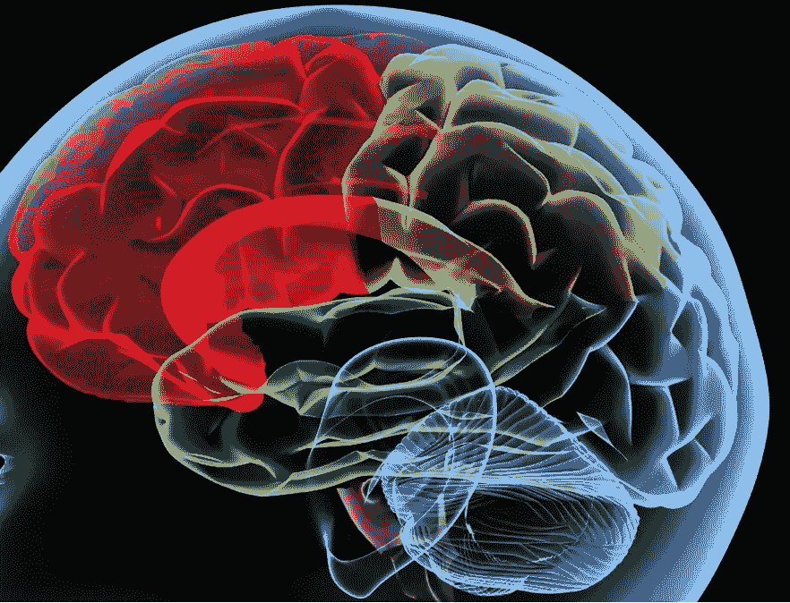
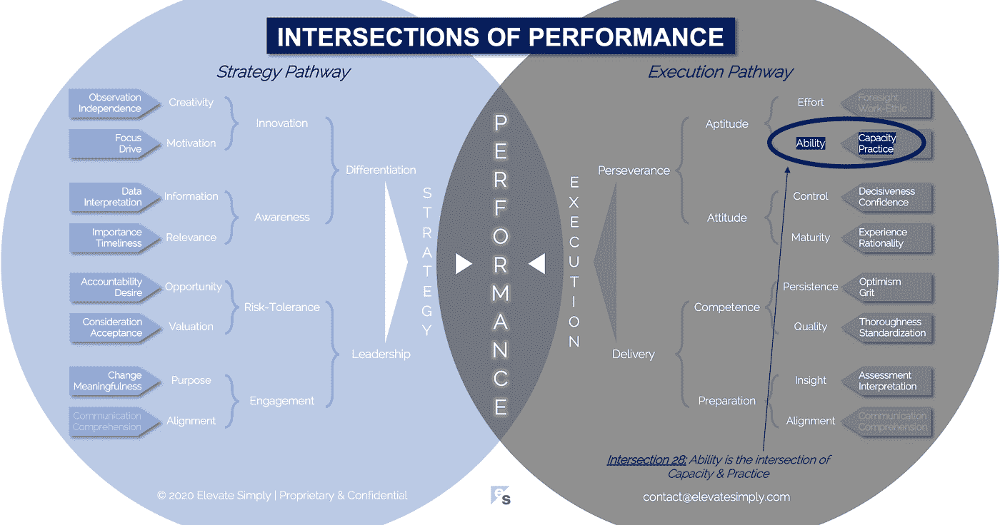

# 28.能力:能力与实践的交汇点

> 原文：<https://medium.datadriveninvestor.com/28-ability-the-intersection-of-capacity-practice-859d5a757694?source=collection_archive---------16----------------------->

## 关键是要做好利用机会的准备

Image from 123rf.com

我是一个业余足球迷。我从小到大从未踢过美式足球，也不玩梦幻足球，但我理解、欣赏并尊重这项运动以及在 NFL 水平上踢球所需的天赋。我有幸生活在两个不同时代的城市里，那时拥有罕见能力的球员正在比赛。

巴里·桑德斯为狮子队效力时，我住在底特律，如今我住在堪萨斯城，看帕特里克·马霍斯比赛时，我能感受到家乡的骄傲。不像酋长队，在我住在他们的城市期间，狮子队从未赢得超级碗。不幸的是，桑德斯从来没有像马霍斯那样拥有完整的包裹，这可能是导致他“在我看来太早”退出比赛的原因。

对于那些喜欢看人们在特定学科的最高水平上出类拔萃的人来说，不可否认巴里·桑德斯做到了这一点，帕特里克·马霍斯目前正在这样做。看着挺好玩的。没有一个运动员是完美的，但这正是他们人性化的一面，也让他们多少有些相似之处。

身体天赋、智力和动力是这两位运动员的标志。他们在各自岗位上的能力使他们与众不同。这包括作为球员、职业球员、领袖和竞争者的能力。能力是公认的，但也可能是难以捉摸的。

## **什么是能力交集？**

能力是能力和实践的交集*(见下图交集 28)*。没有实践的能力是浪费的才能。没有能力的练习是徒劳的。无论是体育还是商业，我们都有能力去表现。我们每个人的能力水平是不同的。

我们付诸实践的努力塑造了我们意识到的能力实现，这创造了能力。换句话说，能力是利用实践将能力最大化的结果。我们根据任务及其应用从主观和客观两个方面来衡量能力。

## *产能*

能力是我们能够达到某一能力水平的程度，不管我们是否已经达到。有时能力是与生俱来的，而其他时候则是可以培养的(甚至是被破坏的)。另一个与容量互换使用的词是潜力。就能力而言，能力是一个更恰当的术语，因为它比“潜力”的模糊性留给机会更少。

我对企业环境中的能力的观察是，它包含了平衡的元素。人们有学习的能力和交付的能力。为了组织的利益，必须找到一种适当的平衡，从这个人身上获得最大的价值。每个个体自身的发展也是如此。问题变成了，我们如何最好地培养和利用每个人的能力？

交集 28:能力=能力+实践

Image by [Brett Simpson](https://medium.com/u/191cf90a65d7?source=post_page-----859d5a757694--------------------------------)

## *练习*

在能力等式中，实践就像听起来一样简单。多次做某事，在必要的时间和地点进行调整，以便做得更好。实践创造能力。从理论上讲，一个人对某件事练习得越多，就会做得越好。虽然这听起来很理想，但它基本上消除了对能力和天赋的需求，因为简单的重复会导致精通(或对它的感知)。为练习而练习，没有目标或能力，是不理想的。

实践不仅是能力的关键组成部分；本身就是一种能力。它需要知识，纪律，计划，勤奋和意图。无论是公开演讲、计算机编程、项目管理还是领导团队，实践都是成功的必要条件。在我们的职业生活中，实践大部分是在工作中完成的，很多时候没有一个错误没有后果的环境。这就是为什么练习既是达到目的的手段，也是目的本身。

## **领导者能做什么？**

作为领导者，我们经常谈论能力。我们需要根据人们的“能力”来评价或判断他们，这包括一系列有助于他们表现的属性。

最优秀的领导者了解能力要求的平衡，并在团队中寻找优化能力的方法。此外，他们还探索创造环境的方法，在这种环境中，练习可能会产生最小的负面影响。即使不可能，优秀的领导者也会为他们的团队成员创造实践和培养能力的机会，给予他们学习和成长所需的支持，即使失败已经发生。

## **总结&下一个**

有时，我们的角色会阻碍我们充分发挥自己的能力。关键是要做好准备，在机会出现时，利用机会做好这两件事。

下次我们将考察绩效的第 29 个交叉点，也就是**努力交叉点**。

在这一系列文章中，我们探索了性能的交叉点，共有 30 个。绩效的交叉点*框架基于*[*Brett Simpson*](https://www.linkedin.com/in/brettjsimpson/)*[*董事总经理*](https://www.linkedin.com/company/elevatesimply/) *的经验和见解，以及他作为企业家、顾问和投资者在大大小小的组织中 20 多年的领导经验。**

*点击订阅 DIntel [。](https://ddintel.datadriveninvestor.com/)*

*在这里加入我们的网络:[https://datadriveninvestor.com/collaborate](https://datadriveninvestor.com/collaborate)*