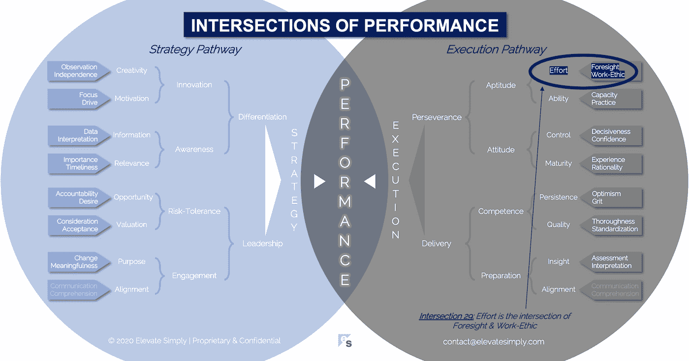

# 29.努力:远见和职业道德的交汇点

> 原文：<https://medium.datadriveninvestor.com/29-effort-the-intersection-of-foresight-work-ethic-9b0bfc1aaf0?source=collection_archive---------32----------------------->

## 这种努力是远见和职业道德的结合

Image from 123rf.com

我喜欢看人们做他们热爱和擅长的事情。我想到了两个例子，特别是因为我缺乏做这两个例子的激情和天赋。

首先是夏威夷科纳的铁人三项世界锦标赛。虽然我喜欢游泳、骑自行车和跑步，但我不想把它们结合成一项单独的活动。这可能就是为什么我对那些到达科纳的人如此感兴趣。为了参加世界锦标赛，这些运动员必须非常专注，目标明确。你不能一出现就自动得到科纳的一个名额。参赛者必须通过与其他具有相似才能和激情水平的人的激烈竞争来获得参赛资格。

第二个例子是百老汇的音乐剧《汉密尔顿》。我亲自看过，在家看了视频，还听了原声带。林·曼努埃尔·米兰达的编剧是天才，舞蹈编排是梦幻般的，演员们都是为他们的角色而完美选择的。把这一切放在一起，表演是强大的，我希望每个人都能看到。我既没有信心也没有能力在汉密尔顿(或任何其他节目)表演，但我感谢那些能够在如此高的水平上这样做的人。

精英运动员和百老汇表演者很容易被挑选出来，被认为具有高于平均水平的能力。然而，我有幸与商界的顶尖人士一起工作。他们每个人至少有一个共同点。他们认识到并欣然接受成为高绩效者所需的努力。

**什么是努力交集？**

努力是远见和职业道德的交集*(见下图第 29 个交集)*。没有职业道德的远见是扶手椅型四分卫。没有远见的职业道德是泥沼中的车轮。

从概念上来说，努力似乎很容易定义…只要努力。通过努力来获得结果不仅仅是努力。也是故意的。根据我的经验，当在付出努力的过程中考虑到为什么、什么时候、如何、在哪里和做什么的问题时，努力的结果是最好的。

*深谋远虑*

远见解决了“为什么”…为什么要花费精力？虽然它会导致其他一些问题，但它主要是工作的基本驱动力。我们看到潜在的或可能的目标，但需要努力，我们做出审慎的选择，要么努力实现目标，要么努力实现不同的目标。

远见并不意味着预测未来的能力，而是对可能性的开放态度。这也表明了对后果的理解。如果努力投入到任务 A 中，结果与努力投入到任务 b 中的结果是不同的。

交叉点 29:努力=远见+职业道德

Image by [Brett Simpson](https://medium.com/u/191cf90a65d7?source=post_page-----9b0bfc1aaf0--------------------------------)

*职业道德*

职业道德是为了达到某种目的而将努力付诸行动的意愿和能力。这包括在成就的整个生命周期中投资的动机。想想上面提到的运动员或表演者。他们投入了无数的时间，很多年，去实践、失败、反复、探索、成长、克服和完成，为了达到一些个人和/或职业目标。

职业道德是我们选择如何分配我们固有的资源。我们的时间、努力、智慧和情感。我们知道，仅仅做某件事并不能保证成功。但我们也知道，不努力就很少能取得成功。

**领导者能做什么？**

领导者了解团队中的每个人，以及他们期望每个人付出的努力程度。他们也知道团队本身就是一个付出努力的实体。因此，有些团队成员的优势在于远见，有些团队成员的优势在于职业道德，有些团队成员在不同程度上同时具备这两种优势。领导者面临的挑战和机遇是建立和利用他们的团队来最大化每个人和整个团队的努力效果。

说到努力，成功的反面就是浪费。效率低下总是一种风险。有时候在个人或团队学习成长的过程中是无法避免的。理想情况下，领导者认识到这一点，并做出必要的调整，以优化团队中每个人的天赋、激情和效用。

**总结&下一个**

努力，如果定义为简单的尝试，是很容易的。如果把努力定义为远见和职业道德的结合，那就更复杂了，但从长远来看有更大的潜在影响。

下次我们将检查性能的第 30 个交叉点，即**校准交叉点**。

在这一系列文章中，我们探索了性能的交集，共有 30 个。绩效的交叉点*框架基于*[*Brett Simpson*](https://www.linkedin.com/in/brettjsimpson/)*[*董事总经理【简称为*](https://www.linkedin.com/company/elevatesimply/)*】20 多年来作为企业家、顾问和投资者在大大小小组织中的领导经验和见解。**

*点击订阅 DIntel [。](https://ddintel.datadriveninvestor.com/)*

*在这里加入我们的网络:[https://datadriveninvestor.com/collaborate](https://datadriveninvestor.com/collaborate)*