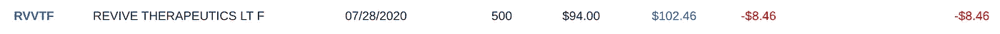

# 3000 美元一股的股票会让你变得富有

> 原文：<https://medium.datadriveninvestor.com/3-000-for-one-share-of-stock-could-make-you-rich-6232b88d9d1f?source=collection_archive---------0----------------------->

## 越过投资者的一个主要心理障碍

Photo by [LexScope](https://unsplash.com/@lexscope?utm_source=medium&utm_medium=referral) on [Unsplash](https://unsplash.com?utm_source=medium&utm_medium=referral)

我不太喜欢声称做一件事可以让你变得富有的文章标题。更多的时候，他们是扯淡。然而，在个人理财领域，我们不时需要情节剧。就像给我们集体脸上泼了一盆冷水。有时候，这是克服投资者面临的一些最大心理障碍的唯一方法。

最近，[问](https://www.fool.com/amp/investing/2020/12/03/if-you-have-3000-should-you-buy-1-share-of-amazon/)你是否应该花 3000 美元购买一股 Amazon.com 股票。我对这篇文章不满意，所以我决定自己写。

我对上述文章的主要问题是，它忽略了投资的心理因素。问这个问题时，它们尤其重要。此外，这篇文章依赖于会让大多数读者厌烦的标准答案，要么是因为他们已经听过几十遍了，要么是这些答案根本不会让他们在意。

在这篇文章里，我希望能打动你足够的关心。

我写这篇文章的时候，Amazon.com 的交易价格是 3166 美元或更高。所以你的 3000 美元实际上只能得到不到一份。这样更好。当我们“花费”这么多而得到的却这么“少”时，我们不会觉得我们得到了什么。这也是为什么许多投资者认为低价股有吸引力的原因之一:

> 你有 100 美元。
> 
> 如果你买了 100 美元的股票，你就拥有了一股。这看起来或感觉起来都不太好。
> 
> 同样的 100 美元可以买 1000 股 0.10 美元的股票。在低价股中持有大量头寸不仅对你大脑的某些部分来说更好，它还闪现出一种诱人的风险回报情景，尽管这种情景不太可能实现。
> 
> 在你被卷入之前，细价股可以带你走的思维轨迹背后的逻辑似乎是荒谬的。它会毁掉原本理智和有逻辑的个体。
> 
> 你看着 100 美元的股票，想象你的细价股票也在那里。如果是这样的话，你的 1000 股价值 10 万美元。
> 
> 你让自己相信这可能发生。它会发生。

只是这可能不会发生。

用 3000 美元而不是 100 美元来做这个练习，它会变得更加有趣。3000 美元能让你买到 30000 股 0.10 美元的股票，还不到一股 3166 美元的股票。

需要明确的是，这与亚马逊无关。你将自己决定购买哪些公司。这是一个首要问题，即持有知名公司的部分或相对少量股份，还是以未经证实的投机名义持有大量股份。

你可以运气好，用一支细价股票打一个本垒打。但是，这是一个危险的领域。购买细价股只不过是我们对自己开的一个心理玩笑。这类似于入不敷出。

> 嘿，看看这辆我买不起的奥迪！

或者—

> 嘿，看看这个，伙计。我拥有 10，000 股这支即将爆炸的股票！

无聊吧。[开丰田凯美瑞](https://medium.com/the-ascent/get-rich-and-drive-a-toyota-camry-3acb4288a5b6)。这样你更有机会变得富有。性感不是一万股。性感是一家公司的股票，不管你吹嘘自己拥有多少股票，它都将上涨——似乎永远上涨。拥有他们 10 年前购买的亚马逊 2.78 股股份的安静的人**(成本基础:492 美元；现值:8801 美元)**。这是我们都应该努力成为的投资者类型。

去年，亚马逊翻了一番。如果你一年前在一只股票上损失了 1750 美元，你的钱已经翻倍了。如果一年前你投资 1300 美元购买一股谷歌股票，你现在大约有 500 美元的利润。仅仅从股价上涨的角度来看，这比用 3000 美元购买 100 股 30 美元的无所作为或下跌的股票要好。

例如，一年前，购买 100 股美国电话电报公司股票大约需要 3750 美元。今天，你的 100 股股票价值不到 3000 美元。这还没有考虑到美国电话电报公司的股息，但你在美国电话电报公司的回报与一股亚马逊或谷歌股票为你带来的回报相比仍然相形见绌。我喜欢股息投资，但是，出于这个原因，我不愿意把它当作福音来宣扬(尽管[我也差不多](https://medium.com/the-innovation/i-only-invest-in-one-type-of-stock-d3acb0d7ec0b))。

在气候变暖的情况下，亚马逊继续攀升的可能性远远超过雪球。如果股价达到 10，000 美元，你 3，000 美元的投资就增加了 7，000 美元。这是在股票市场发财的材料。比起把你的积蓄(或任何相关的钱)投入一只低价股，或者等着有足够的钱去买一只四位数的股票，你可能更好的办法是每赚一点钱就买 0.00424 股亚马逊股票。

 [## 我与理财顾问的“丰富”之旅——你应该避免的错误|数据驱动型投资者

### 20 多岁的时候，我从来没有想过退休或者养老。不知不觉中，我相信了每个国家的养老金制度

www.datadriveninvestor.com](https://www.datadriveninvestor.com/2020/12/03/my-rich-journey-with-a-financial-advisor-mistakes-you-should-avoid/) 

我不拥有亚马逊，主要是因为我几乎只投资于支付股息的股票。但只要瞥一眼我持有的一只“昂贵”的股票，就会发现你可以在数量相对较少的股票上做得很好:

**Source: Author’s Charles Schwab Account**

我到处投 50 美元或 100 美元给埃塞克斯房地产信托公司(Essex Property Trust)，这是一家房地产投资信托公司(REIT)，在南加州、北加州和西雅图拥有并经营高端公寓大楼。我在那个仓位上涨了将近 18%。

相比之下，我只拿了一张研究用的传单(说真的，我经常在自己身上做个人理财和投资实验！):

**Source: Author’s Charles Schwab Account**

因此，我在一家加拿大公司身上损失了 8 美元，如果我没记错的话，这家公司当时(可能现在仍在)用蘑菇来帮助制造一种对付疫情病毒的药物。如果我持有，我会上涨 0.03 美元，或 115 美元，或 15%。

但事实是，日内交易者和投机者控制着股票。在反弹到 0.20 美元之前，它通常会跌至 10 多点。这种模式重复出现，*重复出现*。一个非常确定的迹象表明这是一个股票交易。作为公司，肯定是投机的。

就利润而言，亚马逊再次翻番或埃塞克斯达到 1000 美元的可能性，比 Revive 返回任何接近同等水平的东西的可能性都大。这一切都与公司有关，而不是股票价格。

因为虽然一只股票的价格标签可能很贵，但这并不意味着该公司的数字所反映的股票是贵的。你可能会说，亚马逊、谷歌和埃塞克斯——都是创收和盈利的公司——比 Revive 便宜，Revive 是一家不盈利的公司，收入相对微薄。如果你争论这个，你是正确的。如果你买了一只已确立的高标价股票，你会得到一笔更好的交易，有更多的潜在上涨空间，而不是买一只实际上是在卖白日梦的低价股。

挑选今天正在做大事的伟大公司——像*积极地做这些事情*——在他们已经成功的基础上制定可行的增长和扩张计划。你最好拥有一个 3000 美元的投资组合，其中只包括亚马逊，而不是一个“多元化”的投资组合，其中包括一些糟糕的公司，或者更糟糕的是，低价股。

选择那些已经让人们变得富有的公司(亚马逊和谷歌就是两个最好的例子),继续经营你每天都能看到、感受到和体验到的业务。他们到处都是。就在你眼前。它们是你日常生活的一部分。从长远来看，这些股票会让你变得富有。或者，至少，他们可能不会把你扫地出门。

因此，如果我今天投资 3000 美元，我可能不会购买大约一股亚马逊股票。抛开我对股息股的偏好(因为我已经把这 3000 美元分散到我目前以股息为重点的投资组合中)，我很乐意持有四分之一的亚马逊股票、一半的谷歌股票和一些埃塞克斯股票。随着时间的推移，这种类型的投资组合会产生结果，很有可能会带来财富。

## 访问专家视图— [订阅 DDI 英特尔](https://datadriveninvestor.com/ddi-intel)