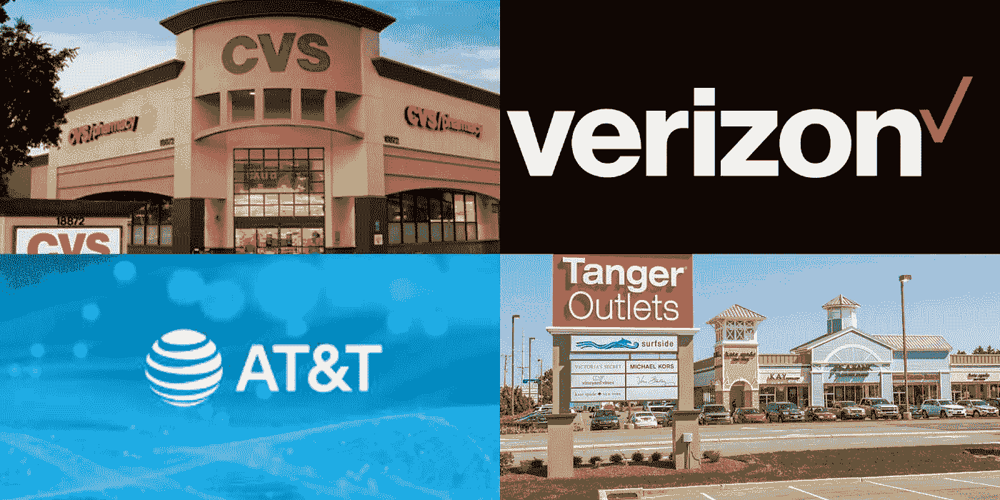

# 3 + 1 大红利股票在这个疫情期间购买。

> 原文：<https://medium.datadriveninvestor.com/3-1-great-dividend-stocks-to-buy-during-this-pandemic-194a1a81e2cd?source=collection_archive---------10----------------------->

***是时候开始关注一些分红股票，为你的退休生活做准备了***

****

**CVS, VZ, T, SKT**

***【DDI 免责声明:本文仅反映作者观点，不作为任何形式的咨询。建议读者通过多个独立来源自行核实事实。]***

**这是前所未有的时代，一些股票在短短几周内损失高达 60%的价值。这是丑陋、可怕的，坦率地说，对于散户投资者来说，这是一个非常痛苦的时期，但情况正在好转。历史也告诉我们，这些恐慌时期可能最终成为买入的最佳时机。我认为这次也是如此，尽管我确实相信疫情冠状病毒可能会导致消费者行为的改变。从长远来看，这些行为变化可能会影响许多企业和行业，比如服装行业，尤其是百货商店，以及旅游业，这些都是我作为投资者应该避免涉足的领域。**

**在这次市场崩溃期间，积累现金并暂停任何非理性的行为无疑是一个好主意。然而，如果你有足够的钱，并且你正在考虑与一些优秀的分红公司一起建立你的投资组合，那么我已经为你挑选了三只优秀的股票和一只额外的股票。**

** [## 投资区块链前要问的三个简单问题(也是一个困难的问题)|数据…

### 现在是了解区块链的最佳时机。不同货币之间的增长率，比如…

www.datadriveninvestor.com](https://www.datadriveninvestor.com/2020/03/12/three-simple-questions-and-one-difficult-one-to-ask-before-investing-in-a-blockchain/) 

我一直在寻找高质量的股票放在我的购物清单上，这些股票的基本面强劲，随着时间的推移，它们的股息一直在增加。此外，了解股票所处的行业以及可能对股票的长期前景产生积极或消极影响的长期趋势也很重要。正如我在[另一篇文章](https://link.medium.com/ulqbxVmUx5)中提到的，你需要小心购买股票并永远持有的策略。西尔斯就是一个很好的例子，说明遵循这样的策略可能会很危险。然而，我做了一些研究，发现 CVS Health、AT & T 和威瑞森都是股息收益率高于平均水平的优秀股票。我还加了投机红利买入，堂儿厂家直销。所以让我们简单看一下这些股票。

**CVS 健康**

**股息率(每年 2.00 美元)。**

**收益率(3.52%)。**

通过过去几年的一系列收购，这显然是一家以医疗保健为使命的公司。该公司现在包括一家连锁药店(接近 10，000 个地点)、专业药房、名为“分钟诊所”的临床服务、一家药房福利管理公司(PBM)和一家健康保险公司(Aetna)。尽管该公司继续通过大量的小规模收购来构筑自己的护城河，但它不再仅仅是一家制药公司，而是一家高度整合的医疗保健公司，因人口老龄化而蓄势待发。

从长期来看，这似乎是一个很好的投资分红公司，然而，也有一些不利因素。如药店报销率，“全民医保”，以及 CVS 在 2018 年停止了连续的股息上涨。但这也不全是坏事，因为冻结股息是为了偿还 CVS 在收购 Aetna 后的 760 亿美元债务。好消息是 CVS Health 自 Aetna 交易结束以来已经支付了 80 亿美元，并计划在 2020 年支付约 40 亿美元的债务。全民医保很可能不会实现，到某个时候，药房报销率将会稳定下来。

**在& T**

**股息率(每年 2.08 美元)。**

**收益率(6.91%)。**

像 CVS 一样，美国电话电报公司显然是在执行一项任务。就美国电话电报公司而言，他们希望发展成为一家真正的媒体集团，而不是一家纯粹的电信公司。他们已经完成了一些高调的收购，如 DirectTV 和时代华纳，时代华纳拥有许多新闻和体育媒体资产以及他们的优质 HBO 频道。如今，美国电话电报公司通过无线、互联网和视频以及规模可观的广告业务与超过 3.75 亿消费者建立了直接关系，以帮助接触这些客户。

从长期来看，这似乎是一家值得投资的分红公司。这是因为尽管美国电话电报公司在过去几年发生了巨大的变化，但它仍然是一个股息贵族。它已经连续 35 年支付了较高的股息，在这个时间点上，它的股息看起来仍然安全。

虽然股息看起来不错，但美国电话电报公司存在一些主要是债务的问题，事实上，截至 2019 年 12 月 31 日，该公司报告的长期债务为 1517 亿美元。然而，自被收购以来，该公司的净债务减少了 203 亿英镑。削减债务似乎是美国电话电报公司的当务之急，让我们希望他们能继续削减债务。我相信股息增长的速度将是温和的，而债务仍然是一个焦点，但是，目前的收益率仍然很高，给你一个不错的投资回报。作为奖励，我们有一些额外的积极因素，如他们的 5G 和 HBO 的推出，合并协同效应和非核心资产的出售。

**威瑞森**

股息率(每年 2.46 美元)。

**收益率(4.32%)。**

从某种意义上说，威瑞森与竞争对手美国电话电报公司类似，都是一家电信公司，但威瑞森没有成为一家媒体集团，而是继续专注于其核心业务，即无线业务。虽然威瑞森进行了一些收购，最著名的是雅虎、美国在线和直径通信，但它们都没有达到 AT&T 的规模。这导致威瑞森成为一个更精简的组织，专注于建设 5G 网络，同时不会背负高额债务。

与美国电话电报公司类似，这看起来是一只值得投资的高股息股票。威瑞森已连续 30 多年支付股息，并连续 12 年提高股息。与美国电话电报公司不同，威瑞森拥有合理的债务负担，并计划继续推出 5G 服务，这使其成为具有良好长期前景的优质股息股。尽管威瑞森的收益率没有美国电话电报公司高，但看起来仍要稳定得多。

**唐格尔厂家直销中心**

**股息率(每年 1.43 美元)。**

**产量(21.85%)。**

**T**anger Factory Outlet Centers 是一家房地产投资信托公司(REIT ),拥有 32 家购物中心，总面积达 1200 万平方英尺，在美国和加拿大拥有 2400 多家商店。与其他三只精选基金不同，这家投资信托基金在过去几年里通过出售大量非核心网点中心，实际上是资产的净卖家。所得用于减少债务和回购股票。

诚然，丹吉尔是我名单上的一个有争议的选择，但我会提供更多关于这只股票的细节。首先，KeyBanc Capital 最近将目标价从 12 美元下调至 3 美元。但低价格目标和高股息收益率有一个很好的理由，没有人知道疫情冠状病毒会对零售业产生什么影响。由于丹吉尔依靠零售店来支付租金，当零售店关门时，他们很难做到这一点。

即使商店预期关闭，没有一个租户占其收入的 10%以上，这是令人放心的，而且它仍然有 BBB-的投资级评级。但我想强调的一点是，不像有些人分析丹吉尔并提供负面评论，我实际上去过一些丹吉尔的分店。所以我想消除反对者的两个论点:首先，不是所有的购物中心都在偏僻的地方，其次，它们非常干净，运营良好。例如，丹吉尔渥太华的奥特莱斯就坐落在一个高速发展的商业和住宅区，在未来的许多年里都将为社区提供良好的服务。

说得委婉一点，这只股票已经被打压，被严重做空，但最近有所回升。它目前的股息收益率也超过了 20%，对我来说这是一个很大的危险信号，但现在已经被覆盖了。我仍然相信，由于 Tanger 的格式和低成本结构，它将继续存在。然而，我需要记住，网上购物和可能的行为变化可能会长期影响丹吉尔模型。因此，我认为这更像是一次投机性购买。但作为一个脚注，我应该提到我已经在丹吉尔获得了一个职位，并计划持有一段时间。

巨大的购买机会？

我挑选的三只股票 CVS、美国电话电报公司和威瑞森都是很好的长期投资，对我来说，在这个价位，即使投机性更强的丹吉尔股票也值得持有。重要的是要知道，市场关心的是未来，而不是过去，所以即使一家公司在过去表现出色，也不意味着它在未来也会如此，所以在购买之前要做足功课。冠状病毒疫情导致了巨大的抛售、衰退和可能的消费者行为变化，但市场抛售也带来了开始购买稳定股息股票的机会。

**这是艾伦·柯比写的******博客，他撰写并制作个人财务和资金管理的文章和视频以及** [**我的成功杂志**](https://www.amazon.com/dp/B084M6P8DW) **。******