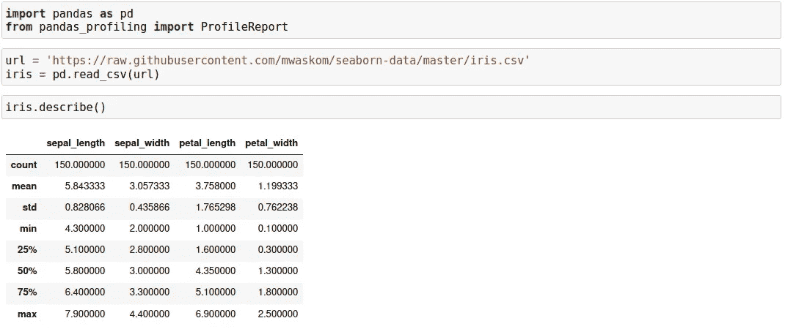

# 你可能不知道的 3 个惊人的 Python 包

> 原文：<https://medium.datadriveninvestor.com/3-amazing-python-packages-you-probably-dont-know-about-d91158d134a5?source=collection_archive---------20----------------------->

## 强大的 Python 包可提升您的数据分析工作流程


Photo by [David Clode](https://unsplash.com/@davidclode?utm_source=medium&utm_medium=referral) on [Unsplash](https://unsplash.com?utm_source=medium&utm_medium=referral)

有时，您会发现功能强大的 python 包，这些包提升了您的数据分析或数据科学工作流，这是您希望以前就知道的。在这个故事中，我分享了三个我最喜欢的故事。

# 1.熊猫简介

虽然 pandas `df.describe()`方法非常适合探索性数据分析，但您很可能更喜欢对数据进行更深入的理解。这里[熊猫剖析](https://pandas-profiling.github.io/pandas-profiling/docs/master/index.html)包派上用场了！您可以通过运行以下命令，使用 pip 软件包管理器进行安装:

```
pip install pandas-profiling[notebook]
```

对于我们的示例，我们将使用 [Iris](https://github.com/mwaskom/seaborn-data/blob/master/iris.csv) 数据集，并从使用 pandas `df.describe()`方法描述数据开始。



Image by Author

这里是使用`df.profile_report()`方法的概要报告。它在短短的一句话中提供了大量的信息！


Image by Author

需要时，可以将配置文件报告保存为 HTML 文件。因此，您可以将它发送给同事，而不必共享整个笔记本:

```
ProfileReport(iris, title='My Report').to_file('my_report.html')
```

# 2.模糊的

Fuzzy Wuzzy 是字符串匹配的一个很棒的[包](https://pypi.org/project/fuzzywuzzy)！您可以通过运行以下命令，使用 pip 软件包管理器进行安装:

`pip install fuzzywuzzy[speedup]`

这里有一些模糊的字符串匹配的例子。


Image by Author

例如，当匹配来自不同来源的名称(如脸书事件的响应和实际注册)时，这个包可以提高性能。只需选择适合您情况的比率类型，并基于 0 到 100 之间的阈值过滤结果。

# 3.TQDM

Tqdm 在阿拉伯语(塔卡杜姆，تقدّم)中是“进步”的意思，在西班牙语中是“我如此爱你”的缩写(te quiero demasiado)。

立即让你的循环显示一个智能进度条——只要用`tqdm(iterable)`包裹任何可重复项，你就完成了！


Image by Author

上面的例子主要供终端使用。对于 Jupyter 笔记本，请使用:


Image by Author

进度条中会添加一个描述。有关所有选项，请参见在线 [tqdm](https://tqdm.github.io) 文档。我发现这个包对于可视化进程非常有用——例如，当读取大量文件时。

# 最后的想法

这些软件包——pandas profiler、fuzzy wuzzy 和 tqdm——是我经常使用的，因为它们对我的工作流程很有帮助。

你最喜欢的提高生产力的软件包是什么？让我知道你的想法。

[](https://towardsdatascience.com/5-amazing-pandas-features-you-probably-dont-know-about-5533498aac88) [## 你可能不知道的 5 个令人惊奇的熊猫特征

### 解释强大的熊猫功能，以提高您的数据分析工作流程。

towardsdatascience.com](https://towardsdatascience.com/5-amazing-pandas-features-you-probably-dont-know-about-5533498aac88) [](https://brinkhuis.medium.com/find-the-topics-your-medium-story-was-curated-into-automagically-f9dbf297d029) [## 找到你的媒体故事自动策划的主题

### 在一个简单易用的 Python 脚本的帮助下…

brinkhuis.medium.com](https://brinkhuis.medium.com/find-the-topics-your-medium-story-was-curated-into-automagically-f9dbf297d029)