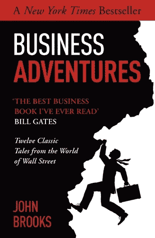
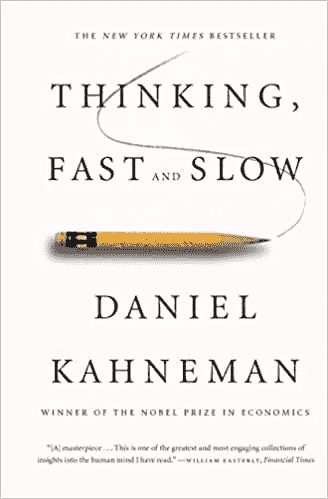
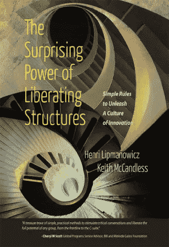

# 我的隔离阅读清单中的 3 本书

> 原文：<https://medium.datadriveninvestor.com/3-books-from-my-quarantine-reading-list-6f6090f0d517?source=collection_archive---------11----------------------->

## 以下是我最近读的几本书。

Photo by [Christin Hume](https://unsplash.com/@christinhumephoto?utm_source=unsplash&utm_medium=referral&utm_content=creditCopyText) on [Unsplash](https://unsplash.com/s/photos/reading?utm_source=unsplash&utm_medium=referral&utm_content=creditCopyText)

所有这些在家的空闲时间是一个黄金机会，可以读完我最近读的一些书，也可以买几本新书。在某种程度上，这些书都对我目前正在做的工作有直接的影响，并且是我可能尝试的事情的一个很好的想法来源。至少，它们是非常有趣的读物。

以下是我最近读的几本书，以及迄今为止我从书中学到的一些有趣的东西。

# 约翰·布鲁克斯的《商业冒险》

自从比尔·盖茨提到这本书是他最喜欢的商业书籍后，它在出版一段时间后，最近又重新出版了。称我为“乐队歌手”，但这无疑激起了我足够的兴趣拿起一本。略显陈旧的语言和参考资料(*旁注:语言在短短几十年内的演变总是让我感到惊讶*)让通读起来更具挑战性。但是一旦你全神贯注于故事，就很难放下这本书。

“商业冒险”包括关于股票市场的故事(关于“角落”、“内幕交易”和英雄救美)，大公司的成功(施乐如何在 70 年代倡导创新文化)，大公司的失败(如福特的 Edsel make 的倒闭)，以及关于整个经济的故事(英镑如何对抗贬值)。约翰·布鲁克斯是一个不可思议的讲故事的人，甚至让看似平凡的细节变得生动。

# 我学到了什么

总的来说，这本书提供了很多视角，让人们了解经济学和商业是如何以不那么明显也不会被媒体报道的方式真正运作的。令人惊讶的是，尽管这些故事大多发生在 20 世纪中叶，但其中许多听起来就像发生在昨天——这证明了这本书实际上是多么永恒。作为一名投资者，在市场竞争究竟有多激烈以及其他人是如何生存下来的方面，有很多东西需要学习。

 [## 领导力。赢得|数据驱动型投资者需要更广阔的视角

### 不管他们愿不愿意，领导者都是快速运转的机器中的齿轮，这就要求他们夹住自己的爪子…

www.datadriveninvestor.com](https://www.datadriveninvestor.com/2020/02/07/leadership-it-takes-a-wider-perspective-to-win/) 

在更实际的层面上，我学到了很多关于组织文化以及商业和工作心理学的知识。对我来说，一个特别有趣的案例是关于一个眨眼(当时在社会上很普遍)如何最终导致一些大公司被调查价格操纵，以及他们的高管如何最终从整个惨败中解脱出来。虽然这些故事可能不完全符合你的背景，但不难想象其中描述的行为如何能够很容易地反映在你自己的工作环境中。

# 丹尼尔·卡内曼的《思考，快与慢》

丹尼尔·卡内曼的这本书在过去几年里相当畅销，不难看出为什么。当我拿到这本书的时候，至少可以说感觉很吓人。除了比通常的要长之外，当你浏览页面时，会弹出许多技术描述和图表。然而仔细观察，卡尼曼写决策、偏见和启发的方式实际上与我们的日常生活息息相关。

简而言之，这本书讲的是**系统 1** (直觉)和**系统 2** (计算)思维。这里有很多内容要讲，但是我到目前为止学到的一个引人注目的方面(*我还在*的中途)是关于风险评估的见解。正如这本书所详述的，风险往往比我们最初认为的要高得多。这主要是由于我们的直觉思维持有不同的偏见，这是它所知道的(“可用性”)和看起来有意义的(“认知便利”)的结果。我们经常忽略的是“基本比率”,它代表了统计上的结果，而不考虑我们自己的经历。

# 我所学到的(到目前为止)

理解直觉大脑如何做出决策(主要基于偏见和“思维捷径”或启发)以及它如何经常出错，打开了许多关于我们日常决策的问题。这本书至少教会了我制定和评估决策的新方法。一个非常实际的例子与雇用人员有关。虽然我们经常希望根据我们的直觉、经验和知识来考虑一切因素，但如果使用严格的算法或标准来做出决策，我们可能会取得更好的成功。

书中另一个我很想尝试的想法是*预死亡*，它解决了一个简单的问题，“如果这个项目失败了，它的故事会是什么？”由于我们偏向于积极的确认，风险往往难以想象。预死亡似乎是一种创造性的风险评估方法，组织中的任何人都可能很容易掌握。

# 《解放结构的惊人力量》，作者:Lipmanowicz 和 McCandless

我在做一些关于如何在更大范围内进行回顾的研究时拿起了这本书，这是我目前在工作中面临的一个真正的挑战。我的研究不知何故都指向[解放结构](http://liberatingstructures.com)。虽然这本书显然是为了“推销”这个想法而写的，但它无疑让我看到了如何更好地举办引人入胜的会议的几种可能性。

解放结构的目标是让组织中的每个人都参与进来，打破等级壁垒，并发挥每个人的潜力。“将决策者和实干家分开”是我们组织中经常发生的事情。解放结构旨在防止这种情况发生。

# 我所学到的(到目前为止)

我学会了一些新的、创造性的方法来主持会议，并让我的团队和组织中的其他人参与决策。此外，我还了解了“微观结构”在我们工作方式中的作用。对于上下文，人和过程通常是我们“宏观结构”的一部分。虽然它们肯定会对结果产生影响，但它们通常需要更多的努力和时间才能朝着好的方向转变。正如这本书所描述的，改变“微观结构”——例如，重新安排我们会议室的布置方式和你可能在会议上提出的问题——是一种更实用(但被低估)的方式，可以积极影响决策流程的发生。

我个人没有亲自尝试过任何解放结构，但我可以看到它如何直接应用到我的工作中——无论是在回顾会、设计研讨会还是团队组建活动中。我很高兴与大家分享这些方法是如何帮助解决现实生活中的挑战的。

你读过这些书吗？我可能漏掉了什么要点吗？还有其他书籍推荐吗？我很想在评论中听到你的意见！

*如果你喜欢这个内容，* [*订阅我的邮件列表*](http://eepurl.com/gAfd7D) *直接在你的收件箱里获得更新。最初发布于 2020 年 4 月 27 日*[*https://tech management . life*](https://techmanagement.life/2020/04/27/3-books-from-my-quarantine-reading-list/)*。*