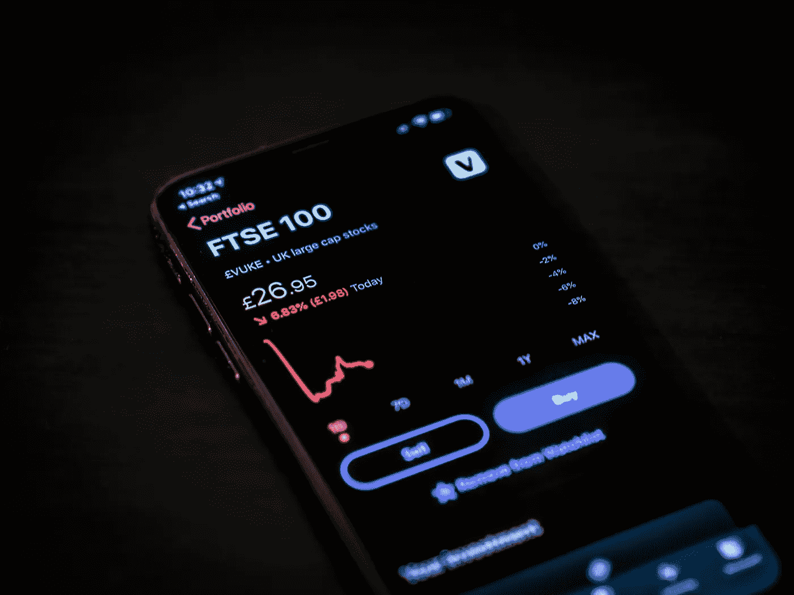

# 买入或卖出本次股市下跌前的 3 点考虑

> 原文：<https://medium.datadriveninvestor.com/3-considerations-before-buying-or-selling-this-stock-market-dip-b09ce7d6f836?source=collection_archive---------25----------------------->

## 你如何能比病毒存活得更久

在围绕冠状病毒疫情的不确定性中，自 2020 年 1 月以来，全球股市从创纪录高位暴跌。正如许多分析师和新闻报道所称，自上次全球金融危机以来，我们还没有见过这样的情绪。对这种情况有两种相反的观点。

Photo by [Jamie Street](https://unsplash.com/@jamie452?utm_source=unsplash&utm_medium=referral&utm_content=creditCopyText), Unsplash.

一方面，你有乐观主义者和满怀希望的人，他们相信市场将很快开始好转。航空业、旅游业和酒店业是受影响最严重的行业，一些投资者相信[政府最终会介入](https://edition.cnn.com/2020/03/16/business/airlines-bailouts/index.html)，就像他们在次贷危机期间对[银行所做的那样。此外，当疫情最终得到控制时，生活就会恢复，而中国、韩国和新加坡等国家已经证明疫情可以得到控制。](https://mitsloan.mit.edu/ideas-made-to-matter/heres-how-much-2008-bailouts-really-cost)

另一方面，悲观主义者或现实主义者认为我们还没有经历疫情的全面冲击。衰退的迹象无处不在，裁员升级和企业倒闭只是时间问题。尽你所能卖出，保存现金熬过冬天；总的来说，我们不知道这种情况会持续多久。

 [## 利用股市相关性的最佳方式|数据驱动的投资者

### 当阿尔弗雷德·温斯洛·琼斯开创了世界上第一个“对冲”基金(后来“d”被去掉了)时，他让其他投资者大吃一惊…

www.datadriveninvestor.com](https://www.datadriveninvestor.com/2020/02/02/the-best-way-to-use-stock-market-correlations/) 

事实上，股票市场之所以“打折”,是因为当我们试图应对一种新的病毒时，它们已经将所有的风险和不确定性计入了价格，没有人能确定它将如何结束。不管你的信仰是什么，在股票市场采取任何行动之前，这里有 3 个重要的问题要问你自己。

# #1 你有足够的钱度过经济衰退吗？

你需要有足够的资源来度过困难时期，因此第一步是检查你的库存。不，我指的不是罐头食品和卫生纸，而是你的货币资源，以度过一个不确定的时期。

在正常情况下，你会问自己是否有一份稳定且有固定收入的工作？如果你这样做了，你还能剩下多少剩余来投资？现在，随着几乎每个行业都暂时关闭或缩减业务，你需要考虑你的月薪是否是确定的。

接下来要问的问题是，如果你被裁员或减薪，你有足够的储备资金来支持自己和你的承诺吗？考虑到市场在找到低点后最终会复苏，无论多低，现在肯定是买入股票的好时机，而不是在高点买入。

然而，最重要的是确保你有足够的资源来维持生计。你最不希望的事情就是为了生存而不得不卖掉你的投资。

# #2 所有不确定因素都考虑到当前价格了吗？

我周围的许多人现在都有兴趣在全球股市建仓，尤其是美国股市。虽然这是一个令人鼓舞的迹象，但我也有点担心，因为他们中的许多人并不是积极的投资者，他们目前的兴趣可能是因为媒体对市场的报道(直接或间接)增加了。

他们中的一些人已经买进了下跌的股票，并承受着账面损失，他们相信平均价格会下跌，因为从长远来看价格会上涨。其他人认为病毒爆发将继续恶化，价格将继续进一步下跌，因此他们保留一些资本，并计划最终进行购买。此外，还有少数更极端的观点，他们认为一切都将崩溃，因此最好是在它们有价值时全部卖掉，并保留现金头寸。

虽然我不能肯定地说他们中的哪一个是正确的，但他们都是理性的，似乎是合理的事实上，你应该问自己的问题是，如果当前的价格已经考虑了所有的风险和不确定性。

随着形势恶化，全球经济受到长期消费减少和负资产负债表的打击，市场有可能进一步下跌。然而，也有可能今天的市场已经超卖，目前的价格已经考虑了小型全球衰退的所有风险和不确定性。

或许，正确的投资方式是坚持你所遵循的投资原则。回到最基本的，包括第一点，你应该做得很好以度过衰退。

# #3 你认为它会持续多久？

事实:新冠肺炎是一个全球性的疫情，至少在未来几个月内会如此。

事实:每个人都容易受到影响，只是有些人比其他人更容易受到影响。

事实:所有的市场和行业都是相互关联的，它们都会受到影响。

各国的情况不同，因为他们有各自应对病毒的方式。此外，不同国家的人口统计、气候、资源和文化意味着它们都受到不同程度的影响。

虽然这可能意味着一些国家可能能够更好地应对疫情，或者疫情可能不会持续太久，但我们当今世界的相互联系表明，我们都是相互依存的。中国(T1)和 T2(T3)以及其他亚洲国家似乎已经控制住了疫情的早期发作，现在 T4 面临着比当地社区更多的外来病例。

同样，世界各地的每个国家都将面临类似的情况，即使它们成功遏制了第一波疫情。即使一个国家像比尔·阿克曼建议的那样进入全国范围的 30 天封锁，影响也可能是有限的，除非世界各地的每个人都能以某种方式齐心协力阻止冠状病毒的传播。

即便如此，只需要一个无赖或不合作的国家，甚至只是少数不负责任或漠不关心的人，就可以挫败这一努力。这种情况持续的时间越长，全球经济受到的打击就越严重，全球股市将进一步走低。

Photo by [Tim Marshall](https://unsplash.com/@timmarshall?utm_source=unsplash&utm_medium=referral&utm_content=creditCopyText), Unsplash.

# 一起工作，互相帮助

我相信这也会过去，但我不能肯定这一事件会持续多久。没人能。

如果你计划买卖股票市场，最重要的考虑是**确保你有足够的资源来抵御病毒**。其余的只是最好的猜测。

最后，提醒彼此做好自己的本分。我们越早共同努力履行我们的社会责任，我们就能越早从新冠肺炎的影响中恢复过来。