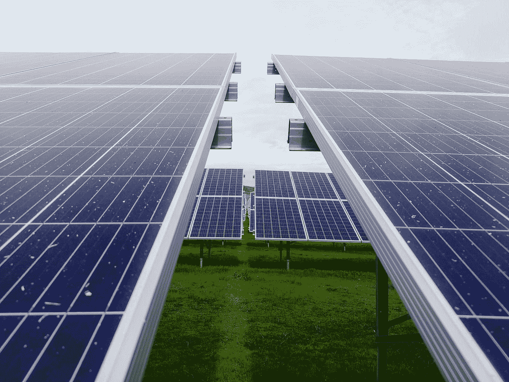

# 2021 年值得关注的 3 只能源 ETF

> 原文：<https://medium.datadriveninvestor.com/3-energy-etfs-to-watch-for-2021-8937a4879ce6?source=collection_archive---------7----------------------->

## 你应该加入观察名单的 ETF

Photo by [Mariana Proença](https://unsplash.com/@marianaproenca?utm_source=medium&utm_medium=referral) on [Unsplash](https://unsplash.com?utm_source=medium&utm_medium=referral)

能源行业是一个目前正在我们面前发展的行业。在很大程度上，该领域最大的公司仍然是历史悠久的石油公司，如雪佛龙、埃克森美孚和康菲石油公司。 [XLE](https://finance.yahoo.com/quote/XLE?p=XLE&.tsrc=fin-srch) ，能源精选 SPDR ETF，截至 2020 年 12 月 16 日，2020 年下跌约-29%。

幸运的是，在能源领域有一个快速增长的部分。这部分是清洁和可再生能源。随着全球清洁和可再生能源计划的增多，以下 3 只 ETF 是你在 2021 年应该关注的:

1.第一信托纳斯达克清洁优势绿色能源指数基金( [QCLN](https://finance.yahoo.com/quote/QCLN?p=QCLN&.tsrc=fin-srch)

2.景顺太阳能 ETF ( [谭](https://finance.yahoo.com/quote/TAN?p=TAN&.tsrc=fin-srch))

3.景顺威尔清洁能源 ETF ( [PBW](https://finance.yahoo.com/quote/PBW?p=PBW&.tsrc=fin-srch) )

**1。第一信托纳斯达克清洁边缘绿色能源指数基金(**[**【QCLN】**](https://finance.yahoo.com/quote/QCLN?p=QCLN&.tsrc=fin-srch)**)**

QCLN 是一个 ETF，旨在跟踪纳斯达克清洁能源指数的投资结果，该指数旨在跟踪在美国上市的小型、中型和大型清洁能源公司的表现。QCLN 中的公司有 [NIO](https://finance.yahoo.com/quote/NIO?p=NIO) 、 [SolarEdge Technologies](https://finance.yahoo.com/quote/SEDG?p=SEDG) 、 [Enphase Energy](https://finance.yahoo.com/quote/ENPH?p=ENPH) 和 [Tesla](https://finance.yahoo.com/quote/TSLA?p=TSLA) 。

截至 2020 年 12 月 16 日，QCLN 的价格为 64.80 美元，费用率为 0.60%。QCLN 今年迄今的回报率约为 163%。

 [## 如何在不牺牲孩子或财务的情况下安全理智地离婚|数据驱动…

### 在美国，七月是以孩子为中心的离婚月。作为 cdfaⓡ的专业人士，我可以向你保证，从长远来看…

www.datadriveninvestor.com](https://www.datadriveninvestor.com/2020/07/28/how-to-divorce-safely-and-sanely-without-sacrificing-your-children-or-your-finances/) 

**2。景顺太阳能 ETF (** [**【谭】**](https://finance.yahoo.com/quote/TAN?p=TAN&.tsrc=fin-srch) **)**

TAN 是一只 ETF，旨在跟踪 [MAC 全球能源指数](https://macsolarindex.com/)的投资结果，该指数旨在为在发达市场交易所上市的公司提供投资机会，这些公司的很大一部分收入来自太阳能行业。在谭的公司有 [SolarEdge Technologies](https://finance.yahoo.com/quote/SEDG?p=SEDG) 、 [Enphase Energy](https://finance.yahoo.com/quote/ENPH?p=ENPH) 、[信义太阳能控股](https://finance.yahoo.com/quote/0968.HK/)、 [First Solar](https://finance.yahoo.com/quote/FSLR?p=FSLR) 。

截至 2020 年 12 月 16 日，TAN 的价格为 92.12 美元，费用率为 0.71%。今年以来，谭的回报率约为 202%。

**3。景顺威尔清洁能源 ETF(******)****

**PBW 是一只 ETF，旨在跟踪 [WilderHill 清洁能源指数](https://wildershares.com/)的投资结果，该指数由美国从事清洁能源发展和保护业务的上市公司股票组成。PBW 的公司有[燃料电池能源](https://finance.yahoo.com/quote/FCEL?p=FCEL)、 [NIO](https://finance.yahoo.com/quote/NIO?p=NIO) 、[闪充](https://finance.yahoo.com/quote/BLNK?p=BLNK)、[插电](https://finance.yahoo.com/quote/PLUG?p=PLUG)。**

**截至 2020 年 12 月 16 日，PBW 的价格为 94.48 美元，费用率为 0.70%。PBW 今年迄今的回报率约为 177%。**

**如你所见，QCLN、谭和在 2020 年远远超过了。在未来十年，看到更多清洁和可再生能源公司在能源领域占据更大的市场份额并不奇怪。**

**当谈到投资 QCLN，谭，或，你应该做你的研究和尽职调查。是的，我相信这三者都将在 2021 年产生异常强劲的回报，但这并不意味着你不应该尽自己的一份力量。即使你不打算投资这些交易所交易基金，你现在也可以快速参考你应该关注的能源行业。**

**[查看 Tunji 信，保持联系](https://tunji.substack.com/)。**

## **获得专家视图— [订阅 DDI 英特尔](https://datadriveninvestor.com/ddi-intel)**