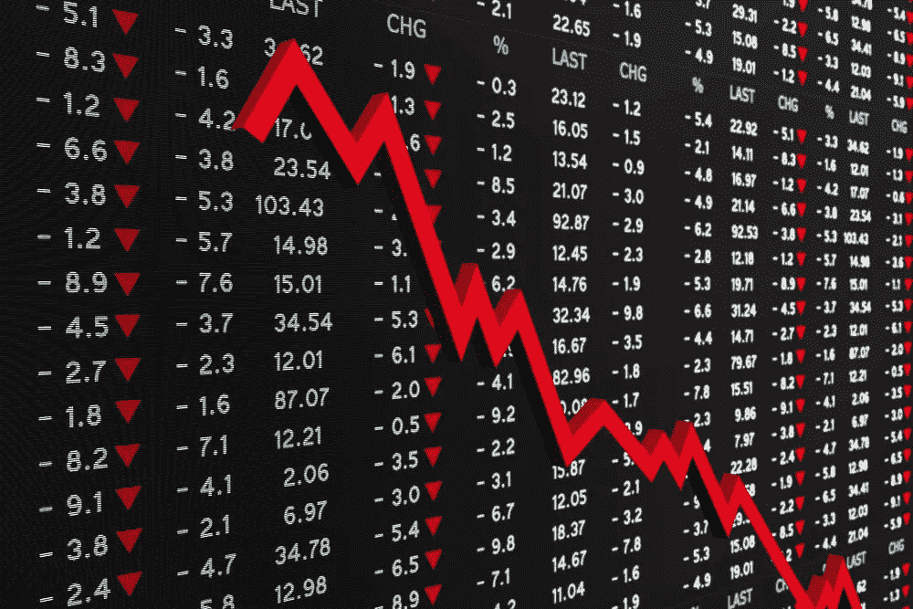
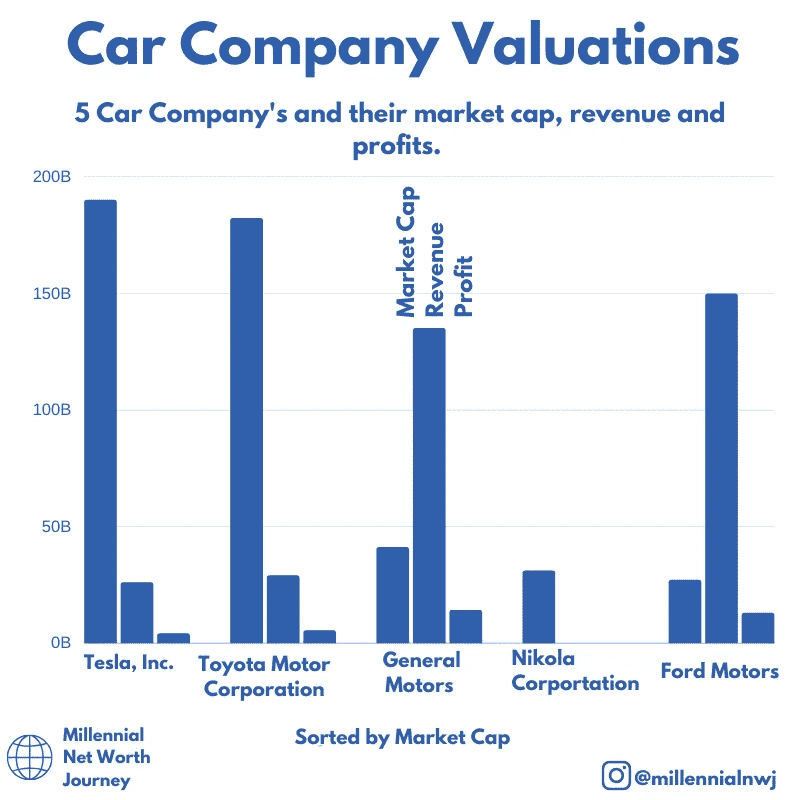

# 推动股市疯狂估值的 3 个因素

> 原文：<https://medium.datadriveninvestor.com/3-factors-driving-the-crazy-valuations-in-the-stock-market-25203c6fb061?source=collection_archive---------7----------------------->

Stock Market Crash Copyright [Stockinvestor.com](https://www.google.com/url?sa=i&url=https%3A%2F%2Fwww.stockinvestor.com%2F46447%2Fa-stock-market-crash-could-be-caused-by-a-black-swan-event%2F&psig=AOvVaw3HVdB-oWkBlxhCcc5Xqc-M&ust=1592337808060000&source=images&cd=vfe&ved=0CAMQjB1qFwoTCOimjeXOhOoCFQAAAAAdAAAAABAD)

目前股票市场有点疯狂。

混乱笼罩着一个群龙无首的美国。世界经济处于停滞状态。

股票市场怎么样了？你会往下想，对吗？不对。起来了。一些股票的涨幅远远超过其他股票。

股票市场的波动性明显增加，公司价格在盘中来回波动。这是有原因的。

值得一提的是，股市不是经济。这两者是相关的。但是股票市场更能反映美国顶尖企业的健康状况。如果这些都做得很好，那么经济也应该随之发展。

 [## 如果资本主义失败了，那么还有什么选择呢？数据驱动的投资者

### 在当前政治领域的修辞之旅中，我们都可以面对面地接触到流行词汇，如…

www.datadriveninvestor.com](https://www.datadriveninvestor.com/2020/03/16/if-capitalism-is-a-failure-then-what-is-the-alternative/) 

尽管目前经济客观上很糟糕。美国有 2200 万失业人口。今年一个季度，英国经济收缩了 20%,创历史之最。不过，令人奇怪的是，股市表现良好。

许多人在这段时间里保住了工作，他们中的许多人仍然有机会像以前一样继续投资。许多人都是第一次进入这个市场。

加入脸书日内交易团体的人数明显上升。人们在那里张贴刚刚进入游戏的股票提示。在互联网上，有大量新手遵循其他新手的建议，大多是没有经验的交易者。

这是导致一些股票估值与现实如此脱节的部分原因。

我所指的股票是天才品牌，尼古拉和赫兹。日交易者将这些几乎毫无价值的股票推高到超高的估值，除了大量的人将股票推高之外，很少或没有任何理由解释为什么。

以下是推动这些估值的三个因素:

## 1.呆在家里的规则

随着疫情冠状病毒迫使政府敦促人们呆在家里以阻止其传播，人们有了更多的空闲时间。

有些人一直在做香蕉面包。一些人一直在学习新技能。许多人一直在尝试投资。我通常会告诉任何人开始学习，因为知道它是一件有用且有利可图的事情。

但是很多现在交易的人是在没有消息的情况下交易的，完全无视公司的任何基本面。

这种新资本的突然涌入导致濒临破产的公司股价飙升。

有些公司没有产品可卖，销售额也没有比收入数十亿美元的竞争对手更高的价值。

## 2.互联网的力量

在过去的日子里，你不得不在报纸上获取你所拥有的股票的信息。然后，它转向了投资者可以查看价格的电脑，但你仍然需要打电话购买你的股票，并为此收取高额费用。

现在，每个人口袋里都有一个交易平台，手续费为零。实际上，这让每个人的投资都民主化了，对此我只能鼓掌。与此同时，它开始导致市场的不规范，特别是当与那些在家寻找事情做的人结合在一起时。

> 根据社交媒体上迅速传播的谣言和信息，一支散户大军现在有能力将一支股票推至估值严重过高的区域。

Reddit、脸书和 Twitter 上的留言板充斥着股票提示，人们将这只新股吹捧为下一个最佳选择。

赫兹就是一个很好的例子。罗宾汉交易者似乎已经找到了快速获利的绝佳策略。如果一家公司破产，它将被出售，直到最终变得一文不值。但罗宾汉交易者在这些低价位买入，将实际上毫无价值的股票价格推高至过高水平，在此过程中获得巨额回报。

> 我甚至不能说这是愚蠢的，如果那些把估值提高到最高点并退出的人会赚到一些钱。

然而，对于他们中的大多数人来说，他们不会在顶部退出，只会购买更多，希望它会上涨，当股票不可避免地回到公允价值时，他们会留下一个红色账户——即一文不值。

## 3.体育博彩的缺失

> 股票只会上涨。
> 
> 自 3 月份以来，戴夫·波特尼的投资组合缩水近 65 万英镑。

“股票”是一个取笑股票市场非理性的迷因，目前看来很贴切。在这些新选股者的厚颜无耻中，有一种“网络幽默”的味道。

有一个关于投资是否是赌博的争论。实际上有一个相似之处，你把钱押在一家公司上，你要么获利，要么亏损。

但与赌博不同，投资在很大程度上意味着无聊。你投资稳定、乏味的公司，并获得可观的回报。

体育博彩是令人兴奋的，你赌一个队赢，你急切地看着打赌的结果。日内交易可以模拟这种感觉，例如“戴维日内交易者”的实时流。他坐在那里对着一只不按他的方式运行的股票大喊大叫，就像他在足球比赛中对着一个球员大喊大叫一样。

冠状病毒导致体育博彩的缺乏，导致大量没有或几乎没有该领域经验的人尝试日间交易股票，从而导致一些特殊的估值。交易是艰难的，并且有巨大的风险。这通常是由大公司完成的，他们雇佣一些世界上最聪明的数据分析人员，从市场波动中获利。

为了在交易中获得优势，人们加入了互联网上的团体。

> 这些团体和追随像波特尼这样的人的问题是，他们制造了一个缺乏经验的回音室。

新手教新手，没有适当的风险管理，就是一颗滴答作响的定时炸弹。

有些人最终可能会被市场淘汰，比如戴夫·波特尼自己。

## 疯狂的估价

Post at [@millenialnwj](https://www.instagram.com/millennialnwj/) showing the valuations of car companies.

在过去的几天里，我加入了一些这样的团体，与志同道合的投资者建立联系，但我看到的大部分不是投资:而是赌博。

我个人见过 100%投资组合在一只股票上的人:尼古拉。希望它能涨到 80 美元，而不是跌回大约 0.5 美元的公允价值。

Nikola 在 2020 年的收入为 0 美元，预计在 2023 年之前不会有 10 亿美元的收入。

相比之下，福特的收入为 1490 亿美元，其市值低于尼古拉。

市场最终会在某个时候回归公允价值。让这些新的交易者损失惨重。

## 警示故事

尽管我可能是错的，但对许多新投资者来说，这可能是一个严酷的教训。因为其他人买入公司股票，这不是一个好的投资策略。这类股票不可避免的下跌空间是巨大的。

如果你想投资，请对你买的任何东西进行尽职调查，不要像赌博一样对待它。

如果你喜欢这个，请考虑订阅我的时事通讯，这样你就可以及时了解我的最新作品。

**访问专家视图—** [**订阅 DDI 英特尔**](https://datadriveninvestor.com/ddi-intel)