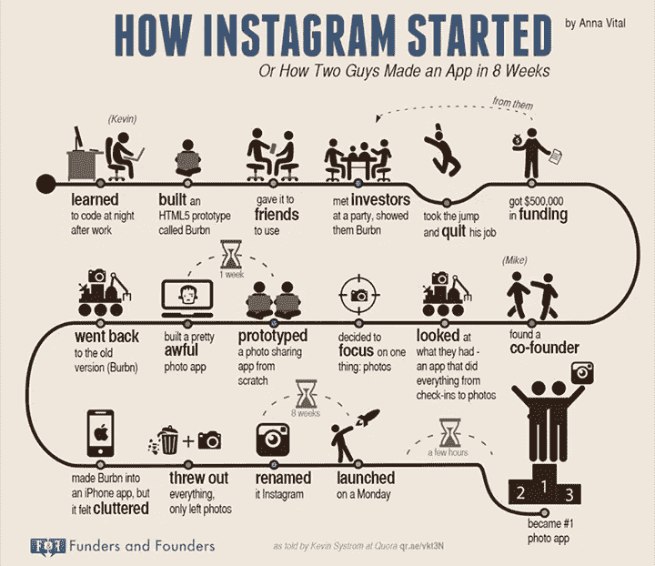

# 3 个著名的定制应用程序开发及其构建方式

> 原文：<https://medium.datadriveninvestor.com/3-famous-custom-app-developments-and-how-they-were-built-4485a7065203?source=collection_archive---------35----------------------->

# 定制应用程序开发的演变

定制应用程序开发是一种专门为组织或用户开发的软件。与[商业现成软件](https://www.thesunflowerlab.com/blog/4-advantages-to-custom-software-development/)不同，每个定制应用都是根据客户需求量身定制的。信不信由你，在 2000 年，没有多少流行和成熟的方法来创建定制软件。要么你用微软做，要么你用其他开源语言做。本质上就是“选择你的语言，并在 Windows、Mac 或 Internet Explorer 之间做出选择”——就这么简单。从那时起，我们已经走过了漫长的道路。事实上，一些世界上最流行的应用程序是定制应用程序开发。在本文中，您将了解 3 个著名的定制应用程序开发以及它们是如何构建的。我们开始吧！

 [## 哪些应用程序充分利用了地理定位服务？数据驱动的投资者

### 当你听到地理定位服务这个词时，你会想到什么？大概，谷歌地图。但是有很多方法…

www.datadriveninvestor.com](https://www.datadriveninvestor.com/2020/01/27/what-apps-make-the-best-use-of-geolocation-services/) 

# 照片墙

Instagram 其实只在 iOS 上开发了几年。直到被脸书收购，他们才转向安卓系统。同样有趣的是，最初的名字是 [Burbn](https://www.investopedia.com/articles/investing/102615/story-instagram-rise-1-photo0sharing-app.asp) ，灵感来自创作者凯文·斯特罗姆对上好威士忌和波旁威士忌的品味。虽然 Systrom 没有接受过计算机科学的正式培训，但他在旅游推荐初创公司 Nextstop 工作时，学会了在晚上和周末编写代码。一晃 10 年过去了，Instagram 是一个用 [Python](https://pinprogram.com/programming-languages/programming-languages-behind-twitter-facebook-whatsapp-instagram-and-linkedin/) 编写的复杂应用，并利用了 HTML5 支持的 Django 框架。在 [Instagram 博客](https://instagram-engineering.com/web-service-efficiency-at-instagram-with-python-4976d078e366)上了解 Instagram 如何使用 Python。

# Whatsapp

对于一般人来说，WhatsApp 就是一个简单的 App。你给某人发信息，他会收到。这能有多复杂？嗯，由于 Whatsapp 在全球拥有超过 20 亿 WhatsApp 用户，他们会发送大量信息。根据 WhatsApp 的官方博客，用户每天发送超过 650 亿条信息给 T2。也就是每分钟 2900 万条消息！所以，这是*的一件大事。为了支持这种定制的基础架构，他们需要优化消息吞吐量。用于开发 Whatsapp 的[技术栈](https://blog.hubstaff.com/technology-stack/#:~:text=A%20tech%20stack%20is%20the,everything%20else%20is%20built%20on.&text=The%20client%2Dside%20tech%20stack,HTML%2C%20CSS%2C%20and%20JavaScript.)包括 [Erlang、FreeBSD、Yaws、PHP、XMPP](https://pinprogram.com/programming-languages/programming-languages-behind-twitter-facebook-whatsapp-instagram-and-linkedin/) 。*

# 一款云视频会议软件

“总有一天，有人会在云上建立一些东西，这将杀死我。”这是 Eric Yuan 在试图为他的网络会议公司筹集资金时对一位投资者说的话。袁最初是在中国大学期间追求异地恋时受到启发而创建 Zoom 的。Zoom 是建立在 AWS 之上的，这是他们能够击败像 WebEx 这样仍然建立在古老技术之上的公司的主要原因之一。开发者还使用了 [JavaScript、PHP、Python、C#和 Java](https://medium.com/zoom-developer-blog/2020-zoom-developer-survey-results-33bc25c1fff) 来编码 Zoom。

[https://www.youtube.com/watch?v=ICgehQ1xd24&feature = emb _ title](https://www.youtube.com/watch?v=ICgehQ1xd24&feature=emb_title)

# 定制应用程序开发的未来

在过去十年中，移动应用程序的开发已经发展了十倍。最初只在微软或另一种开源语言中设计，定制应用程序现在可以通过以下方式构建:

*   [区块链](https://www.thesunflowerlab.com/blog/blockchain-industrial-iot-solutions/)
*   渐进式网络应用
*   仅限 iOS
*   仅限 Android
*   跨平台
*   云原生(AWS、Azure、谷歌云)
*   无服务器
*   像 [React Native](https://www.thesunflowerlab.com/blog/top-framework-for-small-business-app-development/) ，Elixir，Javascript，Python 等语言。
*   [人工智能和机器学习](https://www.thesunflowerlab.com/blog/top-5-emerging-technologies-you-should-invest-in/)

短期内没有减速的迹象！如果您有兴趣让您的组织更上一层楼，现在是投资定制应用程序开发的时候了。

**访问专家视图—** [**订阅 DDI 英特尔**](https://datadriveninvestor.com/ddi-intel)