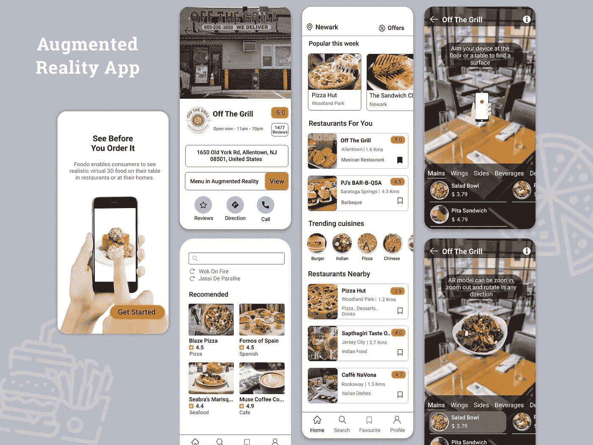

# 移动应用开发公司必须具备的 3 个特性(外加 1 个额外特性)

> 原文：<https://medium.datadriveninvestor.com/3-features-mobile-app-development-companies-must-include-plus-1-bonus-feature-ddfee9461229?source=collection_archive---------18----------------------->

回到移动应用开发公司的基本原则

如今，每个街区都有移动应用开发公司，这使得从竞争中脱颖而出成为一个巨大的障碍。提供独家功能是吸引新业务的好方法，但移动应用开发的基本原则基本上没有改变。今天，我们将带你回到让移动应用开发公司经受住时间考验的基础。请继续阅读，了解每个移动应用开发公司都应该提供的 3 个特性。为了不让你动心，我们会提供一个额外的功能，让你从竞争对手中脱颖而出。

# 移动应用功能:推送通知

[推送通知](https://www.thesunflowerlab.com/blog/how-push-notifications-matter-in-mobile-apps/)是应用程序用户手机上弹出的消息。它们可以采取体育更新、快速销售或必要更新的形式。它们是移动应用开发公司与用户保持联系的绝佳方式。它们还可以温和地提醒客户使用该应用程序。但是，他们可能很烦人。用户可以根据个人偏好选择加入或退出推送通知。虽然有一部分人会选择不接收推送通知，但是不提供推送通知会导致与用户失去联系。

# 移动应用功能:社交媒体网络功能

如今，人们更多地生活在网络上，而不是现实中。因此，让用户能够[分享他们的应用内活动](https://www.socialmediatoday.com/content/why-you-should-integrate-social-media-platforms-your-app)将会让你的移动应用更加诱人。对于娱乐应用，允许用户与他们的脸书朋友联系，比较他们的成就。对于照片编辑应用程序，允许客户直接分享到他们选择的平台的按钮将带来令人难以置信的方便体验。有新闻应用吗？允许你的用户发送有趣的标题到他们的个人资料中，为你的发展提供更丰富的可用性和更多的曝光。移动应用程序开发公司必须提供社交媒体功能，以便在日益数字化的世界中保持相关性。

# 移动应用功能:性能

这是一件大事。移动应用程序开发公司产品的整体性能决定了它是否能被市场接受。谈到应用性能，有四个主要因素:

## iOS/Android

当你最终启动你的移动应用程序开发时，希望每个智能手机用户都会下载它！现在，这不是一个可能的场景，但如果你只为一个操作系统提供你的应用，这是不可能的。让你的应用程序对 iOS 和 Android 用户都可用会增加它的受欢迎程度。

 [## 隐私指南，关于应用开发|数据驱动投资者

### 挪威隐私机构 DPA 对当地的一个现实处以 20 万欧元的罚款，原因是…

www.datadriveninvestor.com](https://www.datadriveninvestor.com/2020/04/29/privacy-guidelines-about-app-development/) 

## 速度

移动应用程序用户通常会同时处理多项任务。因此，如果一个应用程序加载或执行某个功能的时间太长，用户就会关掉它，去做别的事情。

## 安全性

这几乎是不言而喻的，但是在你的移动应用中嵌入最强大的安全性是必须的。随着身份盗窃和安全漏洞达到前所未有的高度，如果您不断与系统漏洞作斗争，您的应用程序就无法发挥其潜力。不要因为没有投资顶级的安全性而让你辛辛苦苦开发的应用程序受到损害。

# 额外功能:增强现实

[增强现实](https://www.thesunflowerlab.com/augmented-virtual-reality-application-development/) (AR)是移动 app 开发公司最火的东西。AR 应用程序基于虚拟数据和现实生活，因此用户可以在真实空间中与虚拟世界互动。[汽车行业](https://www.thesunflowerlab.com/blog/sunflower-lab-named-a-top-automotive-app-development-companies/)和[餐饮行业](https://www.thesunflowerlab.com/blog/ar-apps-for-fast-food-are-revolutionizing-the-restaurant-industry/)是 AR 应用的早期采用者，为他们的客户提供“先试后买”的体验。这可能是让你的应用从竞争中脱颖而出的“惊喜”因素。

向日葵实验室的天才设计师挑战自己，为快餐设计了一个 AR 应用程序。这款应用程序显示了美丽的食物 3D 图像，用户可以与之互动，以及成分细节。

# 移动应用开发公司需要知道什么

[app 开发生命周期](https://www.thesunflowerlab.com/blog/software-development-life-cycle-mastering-the-5-stages/)漫长而细致。但是，花费额外的精力和时间来包含某些特性对于开发公司来说是成功与失败的区别。应用程序开发的基础为在市场上提供卓越用户体验的产品奠定了基础。最重要的是，考虑增强现实，让它真正让你的客户惊叹不已。十多年来，向日葵实验室一直以顶尖的移动应用程序开发满足客户的需求。通过[联系我们的专家，将您的项目交给专业人士](https://www.thesunflowerlab.com/contact-us/)！

## 获得专家观点— [订阅 DDI 英特尔](https://datadriveninvestor.com/ddi-intel)