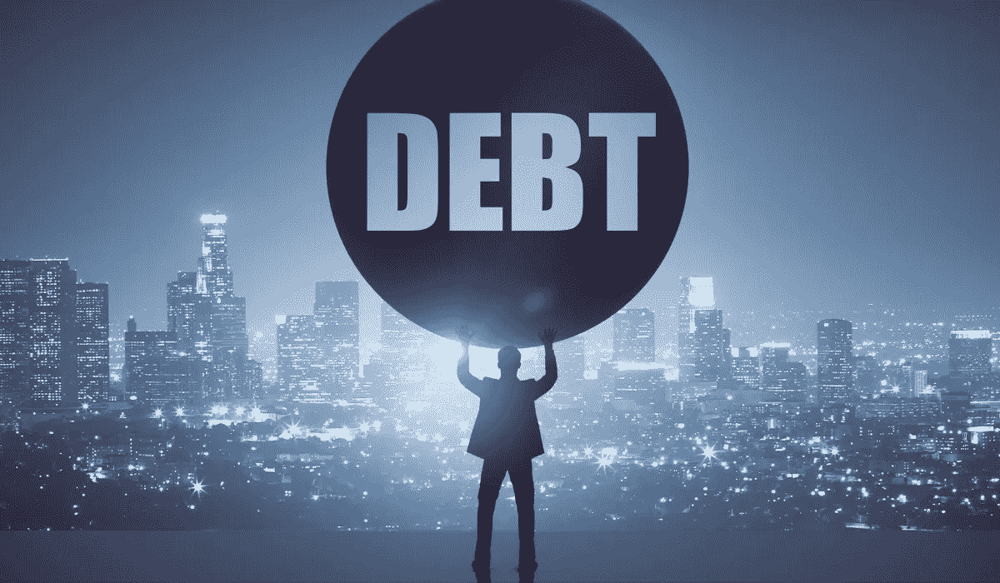

# 保持负债的 3 个财务上合理的理由

> 原文：<https://medium.datadriveninvestor.com/3-financially-sound-reasons-to-stay-in-debt-eb7c8bb5d466?source=collection_archive---------9----------------------->

## 并非所有的债务都是坏的…

债务通常被认为是一种需要不惜一切代价避免的罪恶。债务会削弱任何不小心的人，并显著降低他们的生活质量。许多追随戴夫·拉姆齐方法的金融专家主张削减债务。

尽管这种策略通常是正确的，但它忽略了一个关于债务的重要事实。并非所有的都是不好的。

有些债务是好的，因为它提高了你的生活质量，让你建立你的净资产。许多上市公司能够扩张是因为他们的债务，而不是尽管他们有债务。

如果你知道如何使用，债务是一个很好的资源，但你应该小心。在这篇文章中，我们将解决 3 个财务上合理的理由来增加你的债务和一些常见的危险来避免。

# #1:低利率

马克·扎克伯格仍然没有还清他的抵押贷款，这是一个非常聪明的决定。

扎克伯格目前的抵押贷款利率为 1.05%。在最低利率下，它实际上感觉像是免费的钱。

500 万美元的 1.05%是 7.5 万美元，这对扎克伯格这样的人来说不算什么。此外，整个抵押贷款分散在 30 年。

 [## 为什么你永远不应该付全款买房

### 马克·扎克伯格仍然有 30 年的抵押贷款

medium.com](https://medium.com/the-innovation/why-you-should-never-pay-for-a-house-in-full-deb36a3c712f) 

你可能得不到扎克伯格的利率，但你可以得到接近 3%的利率。如果你能以一种能获得高于 3%回报率的方式配置你的资金，你的债务将成为建立你净资产的有用工具。

虽然在每月固定还款的情况下，你的每月按揭还款保持不变，但你的投资每年都会复利。原本用于偿还抵押贷款的 500 美元在 30 年后变成了 5，031.33 美元，年回报率为 8%。

如果你提前还清债务，你会多损失 4531.33 美元。虽然你不应该错过抵押贷款，但从长期角度来看，支付额外收入来多花一点本金并不总是明智的做法。

# #2:投资组合扩张

现有债务的低利率并不是利用债务来增加你的净资产的唯一方式。你也可以利用杠杆来扩大你的投资组合。

房地产投资者通过深陷债务积累了几处房产。虽然数百万美元的债务会吓到一些人，但只要每月的租金超过每月的抵押贷款，具有增长思维的房地产投资者就不会受到债务的影响。

如果这种情况一直存在，一个具有增长思维的房地产投资者就会尽可能多地负债。这些资产最终会收回成本。

你也可以通过经纪账户的保证金来扩大你的投资组合，但这样会带来更多的风险。虽然股票远比房地产容易管理，但你对股票价格走势的控制力较弱，而且如果你有保证金投资，就更容易对短期走势变得敏感。

你可以从一些保证金开始，只投资你能在 6 个月内还清的金额。如果你对利润感到满意，并知道风险，你可能会想从那里扩张，但与房地产相比，这是一个风险更大的策略。

# #3:保持流动性，保护自己免受高利率的影响

不管我们如何利用我们的债务，我们必须在一段时间内还清。有些债务比其他债务伤害更大，记住这一事实将有助于你优先偿还哪些债务。

如果你有额外的 100 美元可以用于你的抵押贷款或你的信用卡债务，你应该用这 100 美元来偿还你的信用卡债务。虽然抵押贷款的利率历来很低，但信用卡的利率却是出了名的高。

我宁愿用 100 美元来摆脱 15%利率的困境，也不愿用它来偿还只有 3%利率的债务。如果你保持一些现金的流动性，而不是立即将其用于偿还债务，你就可以更灵活地决定先偿还哪些债务。

[***想学习如何投资股市赚钱？确保你订阅了我的 YouTube 频道***](http://bit.ly/2W4ag01)